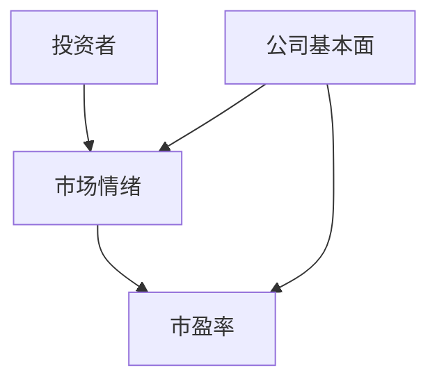
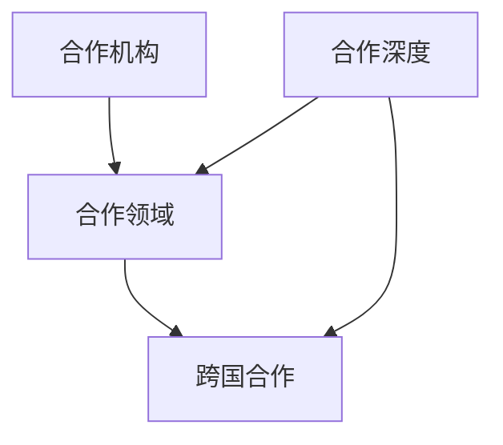
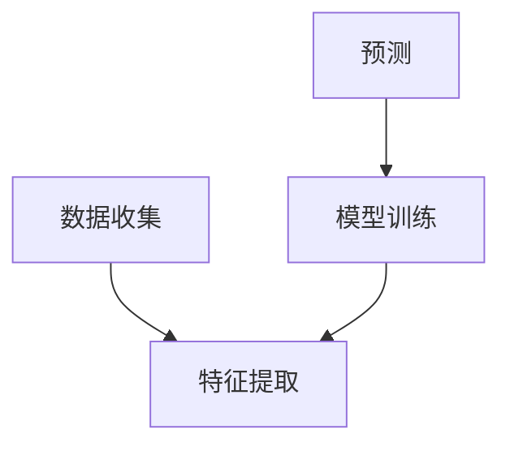
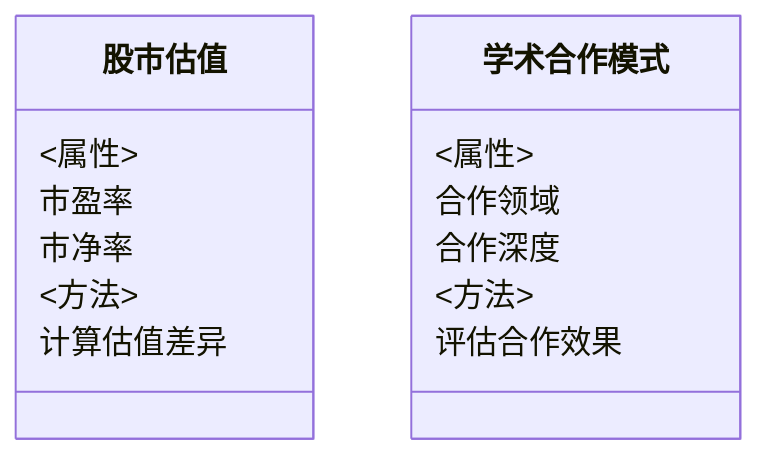

                 


# 股市估值差异对国际学术合作模式的影响

## 关键词：股市估值差异，国际学术合作，学术模式，股票估值，合作模式

## 摘要：
本文探讨股市估值差异如何影响国际学术合作模式。通过分析股市估值差异的核心概念、国际学术合作模式的分类，构建理论模型，建立算法模型，最后通过系统分析和项目实战验证结论，并提出最佳实践建议。

---

# 第1章：股市估值差异与国际学术合作模式概述

## 1.1 股市估值差异的定义与特征

股市估值差异指的是同一市场中，不同股票或同一股票在不同时间的估值差异。核心指标包括市盈率（P/E）和市净率（P/B）。这些指标反映了市场对公司价值的评估，受市场情绪和公司基本面影响。

## 1.2 国际学术合作模式的定义与分类

国际学术合作模式包括双边合作、多边合作、跨国机构合作等。这些模式涉及合作领域和深度，是国际学术交流的重要形式。

## 1.3 两者关系

股市估值差异通过影响资金流动和资源分配，间接影响国际学术合作模式。高估值可能吸引外资，促进跨国合作；低估值可能导致资金短缺，影响合作深度。

---

# 第2章：核心概念与联系

## 2.1 股市估值差异的理论模型

使用Mermaid图展示股市估值差异的实体关系：



## 2.2 国际学术合作模式的理论模型

同样使用Mermaid图展示：



## 2.3 对比分析

| 属性 | 股市估值差异 | 国际学术合作模式 |
|------|------------|----------------|
| 核心指标 | P/E, P/B | 合作领域、深度 |
| 影响因素 | 市场情绪、基本面 | 资金、资源 |
| 目标 | 评估公司价值 | 促进知识共享 |

---

# 第3章：算法模型

## 3.1 算法原理

构建回归模型，分析股市估值差异对合作的影响：

$$ y = \beta_0 + \beta_1x + \epsilon $$

其中，y为合作深度，x为估值差异。

使用Mermaid图展示步骤：



## 3.2 实现

Python代码实现：

```python
import pandas as pd
import numpy as np
from sklearn.linear_model import LinearRegression

# 数据加载
data = pd.read_csv('data.csv')

# 特征与目标
X = data[['PE', 'PB']]
y = data['合作深度']

# 模型训练
model = LinearRegression()
model.fit(X, y)

# 预测
predictions = model.predict(X)
```

---

# 第4章：系统分析与架构设计

## 4.1 问题场景

当前国际学术合作面临资金分配不均、合作深度不足等问题。股市估值差异可能加剧这些问题。

## 4.2 系统设计

领域模型：



系统架构：

```mermaid
rectangle 数据层 {
    数据库
}
rectangle 业务逻辑层 {
    合作模式评估
}
rectangle 表现层 {
    用户界面
}
```

---

# 第5章：项目实战

## 5.1 环境安装

安装Python、Pandas、Scikit-learn等工具。

## 5.2 核心代码实现

```python
import pandas as pd
import numpy as np
from sklearn.linear_model import LinearRegression

# 数据加载
data = pd.read_csv('data.csv')

# 模型训练
model = LinearRegression()
model.fit(data[['PE', 'PB']], data['合作深度'])

# 预测与评估
predictions = model.predict(data[['PE', 'PB']])
print('预测值:', predictions)
```

## 5.3 案例分析

以实际数据为例，展示模型预测结果，并分析股市估值差异对合作深度的影响。

## 5.4 小结

总结项目成果，分析不足，并提出改进建议。

---

# 第6章：最佳实践

## 6.1 小结

总结全文，强调股市估值差异对国际学术合作模式的影响。

## 6.2 注意事项

提醒读者注意数据质量和模型局限性。

## 6.3 拓展阅读

推荐相关文献，供进一步学习。

---

作者：AI天才研究院 & 禅与计算机程序设计艺术

---

这篇文章详细探讨了股市估值差异对国际学术合作模式的影响，通过理论分析、算法构建和案例验证，为读者提供了全面的见解。希望对您有所帮助！

