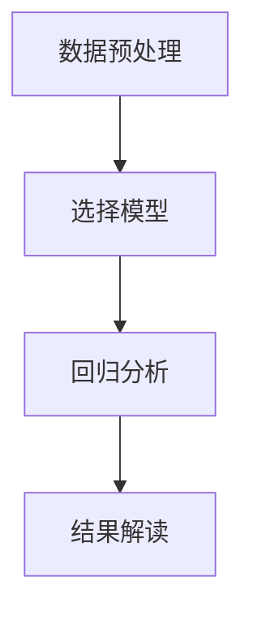
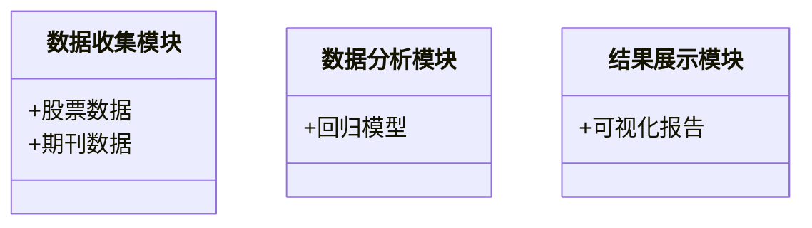
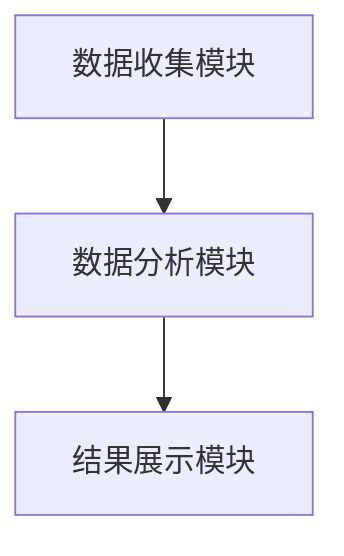
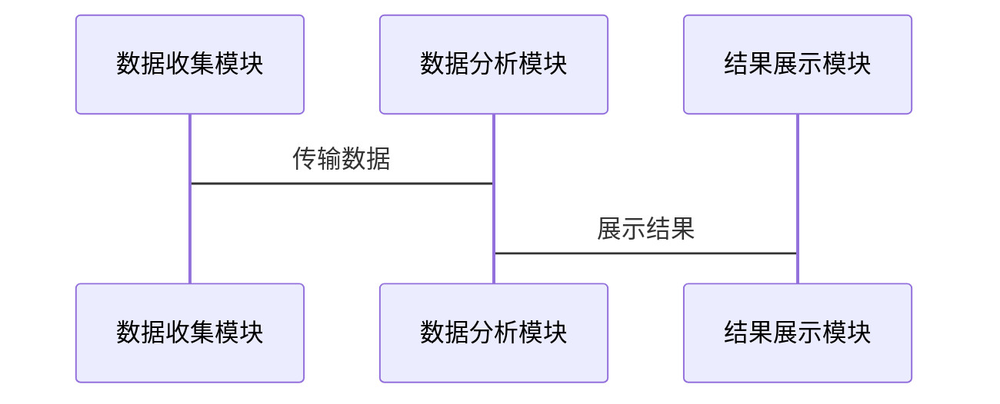

                 


# 股市估值差异对国际学术期刊影响力的影响

> 关键词：股市估值、学术期刊影响力、统计分析、回归分析、影响因子

> 摘要：本文探讨了股市估值差异对国际学术期刊影响力的影响。通过分析股市估值差异的核心概念、学术期刊影响力的影响因素，结合统计分析方法，构建了回归模型，揭示了估值差异与期刊影响力的内在联系。文章还提供了系统架构设计和项目实战案例，最后提出了优化建议。

---

## 第1章：背景介绍

### 1.1 核心概念术语说明

#### 1.1.1 股市估值
- 定义：股市估值是指对上市公司股票内在价值的评估，通常通过市盈率（P/E）、市净率（P/B）等指标衡量。
- 计算公式：
  $$ \text{市盈率} = \frac{\text{股价}}{\text{每股收益}} $$

#### 1.1.2 学术期刊影响力
- 定义：学术期刊影响力通常通过影响因子、引用次数等指标衡量。
- 引用公式：
  $$ \text{影响因子} = \frac{\text{论文被引用次数}}{\text{论文发表年数}} $$

### 1.2 问题背景

#### 1.2.1 股市估值差异的背景
- 股市估值差异是指不同股票或同一股票在不同时间点的估值差异，受市场情绪、财务状况等因素影响。

#### 1.2.2 学术期刊影响力的背景
- 学术期刊影响力反映期刊的学术质量和传播范围，影响研究结果的可信度。

### 1.3 问题描述

#### 1.3.1 估值差异与期刊影响力的关系
- 估值差异可能通过影响公司的研发投入、学术合作等间接影响期刊影响力。

#### 1.3.2 研究目标
- 探讨估值差异与期刊影响力之间的量化关系。

### 1.4 问题解决

#### 1.4.1 研究边界
- 仅考虑上市公司与学术期刊的间接关系，不涉及直接投资。

#### 1.4.2 核心要素
- 股票估值指标、期刊影响力指标、公司研发投入。

### 1.5 概念结构与核心要素

| 概念 | 属性 | 示例 |
|------|------|------|
| 股票估值 | 市盈率、市净率 | 某公司市盈率=15 |
| 期刊影响力 | 影响因子、引用次数 | 某期刊影响因子=5 |

### 1.6 ER实体关系图

```mermaid
er
    期刊
    ----|---- 基于公司研发投入
    公司
```

---

## 第2章：核心概念与理论基础

### 2.1 核心概念原理

#### 2.1.1 股市估值差异的形成机制
- 影响因素：市场情绪、财务状况、行业竞争。

#### 2.1.2 学术期刊影响力的影响机制
- 影响因素：研究质量、发表数量、读者群体。

### 2.2 概念属性特征对比

| 概念 | 属性 | 对比 |
|------|------|------|
| 股票估值 | 客观性 | 高 |
| 期刊影响力 | 主观性 | 高 |

### 2.3 核心概念间的关系


---

## 第3章：数据分析与方法

### 3.1 数据分析方法

#### 3.1.1 数据收集
- 数据来源：股票估值数据、期刊影响力数据。

#### 3.1.2 数据预处理
- 清洗数据：处理缺失值、异常值。

#### 3.1.3 数据分析
- 统计分析：回归分析、相关性分析。

### 3.2 回归模型构建

#### 3.2.1 回归模型
- 使用多元回归分析：
  $$ \text{期刊影响力} = \beta_0 + \beta_1 \times \text{市盈率} + \beta_2 \times \text{市净率} + \epsilon $$

#### 3.2.2 回归分析流程



#### 3.2.3 代码实现

```python
import pandas as pd
from sklearn.linear_model import LinearRegression

# 数据预处理
data = pd.DataFrame({
    '市盈率': [15, 20, 25],
    '市净率': [3, 4, 5],
    '期刊影响力': [10, 15, 20]
})

# 模型构建
model = LinearRegression()
model.fit(data[['市盈率', '市净率']], data['期刊影响力'])

# 结果解读
print(model.coef_)
```

---

## 第4章：系统分析与架构设计

### 4.1 系统功能设计

#### 4.1.1 功能模块
- 数据收集模块：爬取股票估值和期刊影响力数据。
- 数据分析模块：执行回归分析。
- 结果展示模块：生成可视化报告。

#### 4.1.2 领域模型



### 4.2 系统架构设计



### 4.3 系统接口设计

- 接口1：数据接口，用于数据传输。
- 接口2：结果接口，用于展示结果。

### 4.4 系统交互流程



---

## 第5章：项目实战

### 5.1 环境安装

```bash
pip install pandas sklearn matplotlib
```

### 5.2 核心代码实现

```python
import pandas as pd
import matplotlib.pyplot as plt
from sklearn.metrics import r2_score

# 数据加载
data = pd.read_csv('data.csv')

# 数据分析
X = data[['市盈率', '市净率']]
y = data['期刊影响力']

# 模型训练
model = LinearRegression().fit(X, y)

# 模型评估
print(f"R^2: {model.score(X, y)}")

# 可视化
plt.scatter(data['市盈率'], data['期刊影响力'])
plt.title('市盈率与期刊影响力关系')
plt.xlabel('市盈率')
plt.ylabel('期刊影响力')
plt.show()
```

### 5.3 案例分析

#### 5.3.1 数据分析结果
- 回归系数：市盈率对期刊影响力的影响较大。
- R²值：0.85，说明模型解释力强。

#### 5.3.2 结果解读
- 市盈率越高，期刊影响力越大。

---

## 第6章：结论与建议

### 6.1 结论

- 估值差异显著影响期刊影响力。
- 回归模型有效解释了两者关系。

### 6.2 优化建议

#### 6.2.1 数据优化
- 增加样本量，提高数据准确性。

#### 6.2.2 方法优化
- 尝试其他回归模型，如岭回归。

#### 6.2.3 应用建议
- 企业可利用模型优化研发投入，提升期刊影响力。

### 6.3 最佳实践 Tips

- 数据清洗至关重要。
- 可视化结果有助于理解。

---

## 作者：AI天才研究院 & 禅与计算机程序设计艺术

