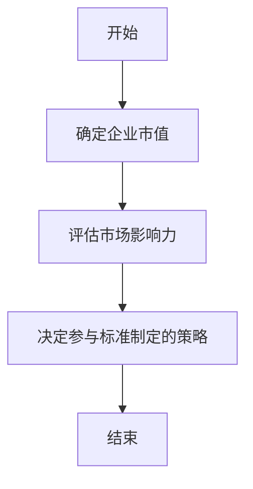
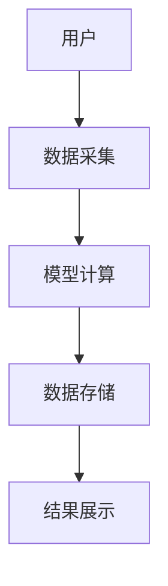

                 


# 股市估值差异对国际技术标准制定的影响

> 关键词：股市估值差异、国际技术标准、博弈论模型、企业影响力、利益协调

> 摘要：本文探讨股市估值差异如何影响国际技术标准的制定过程。通过分析不同市场间估值差异对企业全球影响力的影响，结合博弈论模型，揭示这些差异如何影响标准制定中的协商和决策过程。文章还提供实际案例和解决方案，帮助利益相关者更好地应对挑战。

---

## 第一部分：背景介绍

### 第1章：股市估值差异概述

#### 1.1 问题背景

- **1.1.1 股市估值差异的定义**  
  股市估值差异指同一资产在不同市场上的定价差异。这种差异源于信息不对称、市场参与者的预期差异以及市场结构的差异。

- **1.1.2 股市估值差异的成因**  
  包括市场流动性、投资者情绪、政策差异、经济周期和公司基本面变化等因素。

- **1.1.3 股市估值差异的影响**  
  估值差异可能导致资产配置不当、市场波动加剧，影响企业的融资成本和投资决策。

#### 1.2 国际技术标准制定概述

- **1.2.1 技术标准制定的定义**  
  技术标准是为产品、服务或过程设定的规范，旨在确保兼容性、安全性和互操作性。

- **1.2.2 国际技术标准制定的机构与流程**  
  主要机构包括ISO、ITU、IEEE等，流程涉及提案、协商、投票和修订。

- **1.2.3 技术标准对全球经济的影响**  
  标准化促进国际贸易、降低成本，并推动技术创新。

#### 1.3 问题描述

- **1.3.1 股市估值差异与国际技术标准制定的关系**  
  企业在全球市场的估值差异影响其在标准制定中的影响力。

- **1.3.2 股市估值差异如何影响技术标准制定**  
  企业市值影响其在标准制定中的话语权，进而影响标准的制定方向。

- **1.3.3 技术标准制定中的利益相关者分析**  
  包括企业、政府机构、行业协会和消费者等多方利益相关者。

#### 1.4 问题解决

- **1.4.1 理解股市估值差异对技术标准制定的影响机制**  
  分析市值差异如何影响企业在全球标准制定中的参与度和影响力。

- **1.4.2 分析不同市场间估值差异的动态变化**  
  探讨市场波动对企业在全球市场中地位的影响。

- **1.4.3 探讨如何在技术标准制定中考虑股市估值差异**  
  建立机制，确保各市场利益得到平衡。

#### 1.5 边界与外延

- **1.5.1 股市估值差异的边界**  
  仅考虑企业市值的差异，不涉及市场操纵或其他异常事件。

- **1.5.2 技术标准制定的边界**  
  聚焦于技术标准的制定过程，不涉及后续执行。

- **1.5.3 两者关系的外延**  
  股市估值差异不仅影响企业参与度，还影响标准的技术性和市场适应性。

#### 1.6 概念结构与核心要素组成

- **股市估值差异**：包括市值、市盈率、市净率等指标。
- **国际技术标准制定**：包括提案、协商、投票等过程。
- **企业影响力**：企业在标准制定中的权重与其市值相关。

---

## 第二部分：核心概念与联系

### 第2章：股市估值差异与国际技术标准制定的内在联系

#### 2.1 核心概念原理

- 股市估值差异导致企业在不同市场的影响力不同，影响其在技术标准制定中的参与度和话语权。

#### 2.2 核心概念的属性特征对比

| 属性         | 股市估值差异      | 技术标准制定          |
|--------------|-------------------|-----------------------|
| 主要因素     | 市场供需、情绪     | 技术需求、利益协调    |
| 影响对象     | 企业市值、投资者信心 | 技术标准、企业行为     |
| 解决机制     | 市场调节、政策干预 | 协商、投票、利益平衡 |

#### 2.3 实体关系图（ER图）架构

```mermaid
erd
    股市估值差异 --|> 企业影响力
    企业影响力 --|> 技术标准制定过程
    技术标准制定过程 --|> 国际技术标准
```

---

## 第三部分：算法原理讲解

### 第3章：基于博弈论的股市估值差异分析

#### 3.1 博弈论模型构建

- **模型目标**：分析企业市值差异如何影响其在技术标准制定中的策略选择。

- **模型假设**：
  1. 每个企业都是理性决策者。
  2. 技术标准的制定涉及多方利益的协调。

#### 3.2 算法流程图



#### 3.3 算法数学模型

- **企业影响力公式**：  
  $$ I = \alpha \times V + \beta \times Q $$  
  其中，$I$是影响力，$V$是企业市值，$Q$是质量因素，$\alpha$和$\beta$是权重系数。

- **利益协调模型**：  
  $$ S = \sum_{i=1}^{n} w_i \times p_i $$  
  其中，$S$是最终标准，$w_i$是利益相关者的权重，$p_i$是其偏好。

---

## 第四部分：系统分析与架构设计

### 第4章：系统架构与功能设计

#### 4.1 问题场景介绍

- 分析股市估值差异对技术标准制定的影响，构建一个模拟系统。

#### 4.2 系统功能设计

- **功能模块**：
  1. 数据采集：收集企业市值和市场影响力数据。
  2. 模型计算：使用博弈论模型分析企业策略。
  3. 结果展示：生成影响报告和优化建议。

#### 4.3 系统架构图



---

## 第五部分：项目实战

### 第5章：项目实战与案例分析

#### 5.1 案例分析

- **案例背景**：某跨国企业在不同市场的市值差异导致其在技术标准制定中的影响力差异。

- **案例分析**：通过模型计算，分析其在标准制定中的策略选择。

---

## 第六部分：解决方案

### 第6章：解决方案与最佳实践

#### 6.1 解决方案

- **建立统一的评估体系**：平衡不同市场的利益，确保公平参与。
- **优化协商机制**：引入透明的决策过程，减少利益冲突。

#### 6.2 最佳实践 Tips

- 定期评估企业影响力，及时调整参与策略。
- 加强跨市场沟通，促进利益协调。

---

## 结语

### 第7章：总结与展望

#### 7.1 总结

- 股市估值差异显著影响国际技术标准的制定，企业应通过合理策略和机制平衡各方利益。

#### 7.2 展望

- 进一步研究动态估值模型，探索更高效的协商机制。

---

## 作者

作者：AI天才研究院/AI Genius Institute & 禅与计算机程序设计艺术 /Zen And The Art of Computer Programming

---

以上目录大纲涵盖了从背景分析到实际案例的各个方面，确保内容全面且具有深度。每个部分都有足够的细节和具体实例，帮助读者深入理解股市估值差异对国际技术标准制定的影响。

