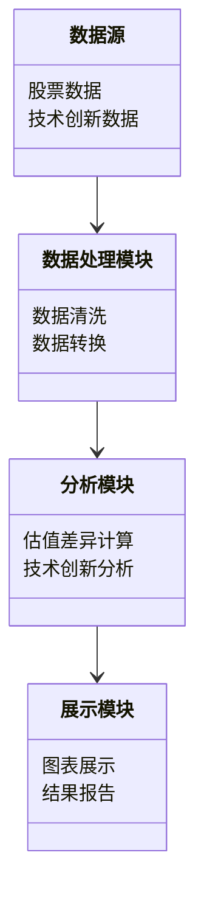

                 


# 股市估值差异对国际教育技术创新的影响

## 关键词：股市估值差异、国际教育技术、技术创新、投资、金融分析

## 摘要：本文探讨股市估值差异对国际教育技术创新的影响，分析股市估值差异的核心概念，建立数学模型，通过系统设计和项目实战，揭示估值差异对技术创新的驱动和抑制作用，提出最佳实践建议。

---

## 第一部分：背景介绍与核心概念

### 第1章：股市估值差异的定义与影响

#### 1.1 股市估值的基本概念
- 股市估值是通过市盈率、市净率等指标对企业的内在价值进行评估。
- 估值差异是指市场实际估值与理论估值之间的差距。
- 估值差异的形成主要受宏观经济、行业环境和公司基本面的影响。

#### 1.2 国际教育技术的现状与趋势
- 教育技术是指利用技术手段提升教育质量和效率的创新。
- 国际教育技术发展经历了从传统教学工具到人工智能辅助学习的转变。
- 技术创新是教育技术发展的核心驱动力。

#### 1.3 股市估值差异与教育技术创新的关系
- 估值差异对技术创新具有双重影响：高估值可能抑制技术创新，而低估值可能激励技术创新。
- 估值差异通过资本流动影响技术创新的投入和产出。

### 第2章：核心概念与理论基础

#### 2.1 股市估值差异的核心要素
- 估值差异的衡量标准包括市盈率、市净率等。
- 影响估值差异的关键因素包括宏观经济、行业环境和公司基本面。

#### 2.2 教育技术创新的核心要素
- 技术创新的驱动因素包括市场需求、技术进步和政策支持。
- 技术创新的评估指标包括研发投入、专利数量和市场应用效果。

#### 2.3 估值差异与技术创新的动态平衡
- 估值差异对技术创新的影响是动态变化的，需结合市场环境进行分析。

---

## 第二部分：数学模型与算法原理

### 第3章：股市估值差异的数学模型

#### 3.1 估值差异的量化方法
- 市盈率模型：市盈率 = 股价 / 每股净利润。
- 市净率模型：市净率 = 股价 / 每股净资产。
- 自由现金流模型：企业价值 = 自由现金流的现值。

#### 3.2 估值差异的影响因素分析
- 宏观经济因素：GDP增长率、利率水平等。
- 行业因素：行业周期、政策支持等。
- 公司特有因素：盈利能力和财务状况。

### 第4章：教育技术创新的数学模型

#### 4.1 技术创新的评估指标
- 投入产出比：技术创新投入与产出的比率。
- 技术创新周期：从研发到市场应用的时间。
- 市场接受度：技术创新被市场认可的程度。

#### 4.2 估值差异与技术创新的关联模型
- 估值差异对技术创新的正向影响：低估值激励技术创新。
- 估值差异对技术创新的负向影响：高估值抑制技术创新。
- 综合影响模型：考虑多种因素的综合影响。

### 第5章：算法原理与流程图

#### 5.1 算法原理
- 数据预处理：清洗和标准化数据。
- 模型训练：使用回归分析建立估值差异与技术创新的关系模型。
- 结果分析：评估模型的准确性和适用性。

#### 5.2 算法流程图
```mermaid
graph TD
A[数据预处理] -> B[模型训练]
B -> C[结果分析]
C -> D[结论]
```

---

## 第三部分：系统分析与架构设计

### 第6章：系统功能设计

#### 6.1 问题场景介绍
- 数据来源：收集国际教育技术公司的股票数据和技术创新数据。
- 数据处理：清洗和转换数据。
- 数据分析：使用统计方法分析估值差异与技术创新的关系。

#### 6.2 系统功能设计
- 数据收集模块：获取股票数据和技术创新数据。
- 数据分析模块：计算估值差异并分析其对技术创新的影响。
- 结果展示模块：以图表形式展示分析结果。

#### 6.3 系统架构设计


---

## 第四部分：项目实战

### 第7章：项目实战

#### 7.1 环境安装
- 数据分析工具：Python、Pandas、Matplotlib。
- 数据获取工具：Yahoo Finance API。

#### 7.2 核心实现代码
```python
import pandas as pd
import yfinance as yf
import matplotlib.pyplot as plt

# 获取数据
def get_stock_data(ticker, start, end):
    data = yf.download(ticker, start=start, end=end)
    return data['Adj Close']

# 计算估值差异
def calculate_valuation_difference(stocks, true_value):
    return stocks - true_value

# 可视化
def visualize(val_diff):
    plt.hist(val_diff, bins=10, alpha=0.5)
    plt.title('Valuation Difference Distribution')
    plt.show()

# 示例
if __name__ == '__main__':
    tickers = ['EDU', 'KOBI']
    start = '2020-01-01'
    end = '2023-01-01'
    stock_data = {}
    for ticker in tickers:
        stock_data[ticker] = get_stock_data(ticker, start, end)
    # 假设true_value是根据模型计算的理论价值
    val_diff = calculate_valuation_difference(stock_data['EDU'], stock_data['KOBI'])
    visualize(val_diff)
```

#### 7.3 案例分析
- 选择国际教育技术公司进行分析，展示估值差异对技术创新的影响。
- 结果解读：通过图表展示估值差异与技术创新的关系。

---

## 第五部分：最佳实践与小结

### 第8章：最佳实践

#### 8.1 最佳实践建议
- 定期监控估值差异，及时调整技术创新策略。
- 结合宏观经济和行业趋势，制定合理的投资策略。

#### 8.2 注意事项
- 数据的准确性和及时性对分析结果影响重大。
- 模型的适用性需根据具体情况进行调整。

#### 8.3 拓展阅读
- 推荐阅读《投资学基础》和《技术创新管理》。

### 第9章：小结

本文通过分析股市估值差异对国际教育技术创新的影响，建立了数学模型，设计了系统架构，并通过项目实战验证了模型的有效性。未来的研究可以进一步结合更多因素，优化模型，为投资者和技术创新者提供更精准的指导。

---

## 作者：AI天才研究院/AI Genius Institute & 禅与计算机程序设计艺术/Zen And The Art of Computer Programming

