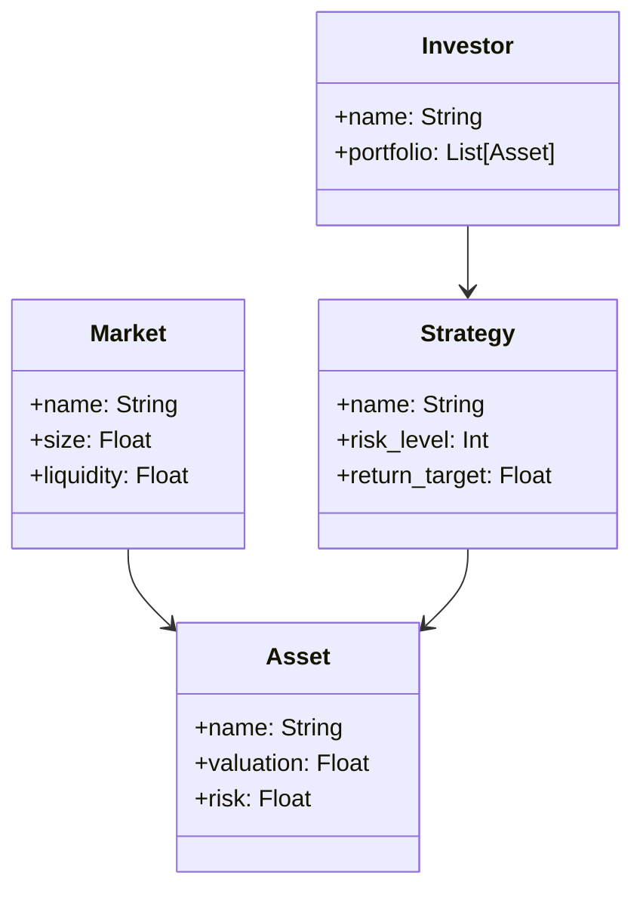
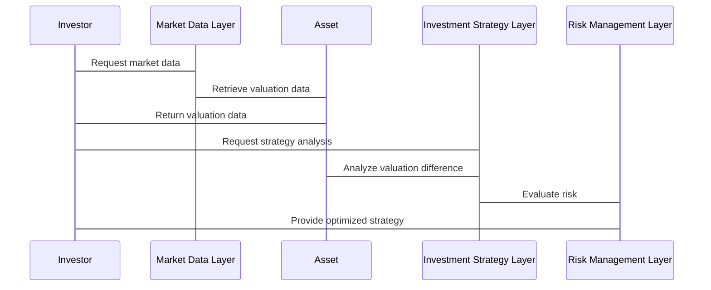

                 


# 股市估值差异对国际文化产业投资的影响

> 关键词：股市估值差异，国际文化产业，投资影响，市场分析，风险管理

> 摘要：本文探讨股市估值差异对国际文化产业投资的影响，分析其背景、机制及策略，结合实际案例和数学模型，提供系统化的解决方案和投资建议。

---

## 第一部分：股市估值差异的背景与概念

### 第1章：股市估值差异的定义与影响

#### 1.1 股市估值差异的定义

- **估值差异的定义与范围**  
  股市估值差异指同一资产在不同市场中的定价差异，受流动性、投资者情绪和信息不对称影响。

- **估值差异的形成机制**  
  信息不对称导致定价差异，市场参与者行为加剧波动，影响整体估值。

- **估值差异的分类与特征**  
  分为短期和长期差异，短期由情绪驱动，长期由基本面因素主导。

#### 1.2 股市估值差异的影响因素

- **市场流动性对估值的影响**  
  流动性高的市场估值更准确，反之则可能高估或低估。

- **投资者情绪与行为分析**  
  情绪波动影响定价，羊群效应加剧估值差异。

- **信息不对称与市场结构**  
  信息不透明导致定价偏差，跨市场套利机会增加。

#### 1.3 股市估值差异对投资决策的影响

- **估值差异与投资机会**  
  低估值市场可能带来投资机会，高估市场需谨慎。

- **估值差异与投资风险**  
  高估市场风险大，低估市场风险相对较小。

- **估值差异与市场效率**  
  跨市套利减少差异，提升市场效率。

---

## 第二部分：国际文化产业的市场特征

### 第2章：国际文化产业的定义与规模

#### 2.1 国际文化产业的定义

- **文化产业的定义与范围**  
  包括电影、音乐、游戏等，具有全球性特征。

- **国际文化产业的特征**  
  规模大、增长快，文化差异影响市场表现。

#### 2.2 国际文化产业的市场规模

- **全球文化产业的市场规模**  
  全球市场规模庞大，年增长率稳定。

- **主要国家文化产业的规模对比**  
  美国、欧洲、亚洲市场对比，文化差异影响规模。

#### 2.3 国际文化产业的市场结构

- **市场参与者与竞争格局**  
  大型跨国公司与本地企业竞争。

- **产业链分析**  
  包括内容生产、分发、消费等环节。

- **市场进入壁垒与退出机制**  
  高壁垒限制新进入者，退出机制不畅影响市场流动性。

---

## 第三部分：股市估值差异对国际文化产业投资的影响

### 第3章：股市估值差异与文化产业投资的关系

#### 3.1 估值差异对文化产业投资的影响机制

- **估值差异与投资决策**  
  低估值市场提供投资机会，高估值市场风险增加。

- **估值差异与市场预期**  
  投资者预期影响市场情绪，进而影响估值。

- **估值差异与投资收益**  
  通过套利和分散投资实现收益最大化。

#### 3.2 不同市场环境下的估值差异分析

- **发达市场与新兴市场的估值差异**  
  发达市场估值更稳定，新兴市场波动大。

- **地区性市场差异对文化产业投资的影响**  
  文化差异导致投资偏好不同。

- **政治经济环境对估值的影响**  
  政治风险影响市场信心，经济波动影响估值。

#### 3.3 估值差异对文化产业投资的正反两面影响

- **正面影响：套利机会与市场效率提升**  
  利用估值差异套利，促进市场效率。

- **负面影响：投资风险增加与信息不对称加剧**  
  高估市场风险大，信息不对称加剧投资者决策难度。

#### 3.4 应对策略：利用估值差异优化投资组合

- **资产配置策略**  
  通过分散投资降低风险，利用估值差异提高收益。

- **风险管理策略**  
  设定止损点，监控市场波动。

---

## 第四部分：系统分析与架构设计方案

### 第4章：系统功能设计

#### 4.1 问题场景介绍

- **文化产业投资中的估值差异问题**  
  投资者需应对跨市场估值差异，优化投资策略。

#### 4.2 系统功能设计

- **领域模型（Mermaid 类图）**



---

### 第4.3 系统架构设计

- **系统架构（Mermaid 架构图）**


---

### 第4.4 系统接口设计

- **API接口设计**  
  提供市场数据接口，支持投资者获取实时估值数据，优化投资决策。

---

### 第4.5 系统交互设计

- **系统交互（Mermaid 序列图）**



---

## 第五部分：项目实战

### 第5章：环境安装与系统实现

#### 5.1 环境安装

- **工具安装**  
  安装Python、Jupyter Notebook、Pandas、Matplotlib等工具。

#### 5.2 核心实现源代码

- **Python代码示例**

```python
import pandas as pd
import matplotlib.pyplot as plt

# 示例数据：不同市场的文化产业资产估值
data = {
    'Market': ['US', 'EU', 'AP'], 
    'Valuation': [100, 80, 120]
}

df = pd.DataFrame(data)
df.plot(kind='bar', x='Market', y='Valuation', title='Market Valuation Differences')
plt.show()
```

#### 5.3 代码应用解读与分析

- **代码功能解读**  
  绘制不同市场的估值差异图表，帮助投资者直观分析市场差异。

---

## 第六部分：总结与展望

### 第6章：总结

- **核心观点回顾**  
  股市估值差异显著影响文化产业投资，投资者需结合市场环境制定策略。

### 第6.1 小结

- **最佳实践 tips**  
  分散投资、监控市场波动、定期评估投资组合。

---

## 参考文献

- 文献1：《金融市场与投资学》，作者：XX
- 文献2：《文化产业经济学》，作者：YY
- 文献3：《投资学原理》，作者：ZZ

---

## 作者信息

作者：AI天才研究院/AI Genius Institute & 禅与计算机程序设计艺术 /Zen And The Art of Computer Programming

