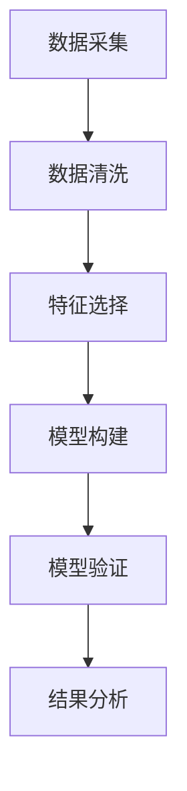
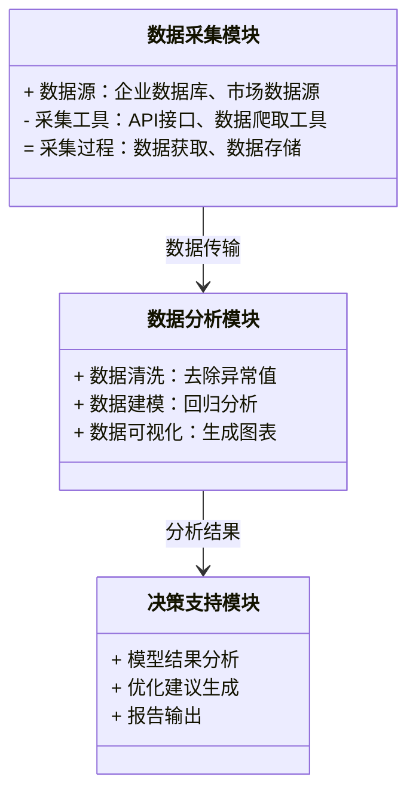

                 


# 股市估值差异对国际文化产业数字化的影响

> 关键词：股市估值差异、文化产业数字化、数字化转型、金融与文化交叉、技术驱动、市场竞争力

> 摘要：本文探讨了股市估值差异对国际文化产业数字化的深远影响。通过分析股市估值差异的核心概念、文化产业数字化的定义与特征，以及两者之间的关联性，本文揭示了数字化进程中存在的问题与挑战，并提出了解决思路。结合实际案例，本文详细阐述了如何通过技术手段优化文化产业的运营效率，提升其市场竞争力，并为未来研究与实践提供了有益的启示。

---

## 第一部分：背景介绍

### 第1章：股市估值差异与文化产业数字化的背景

#### 1.1 问题背景

1.1.1 股市估值差异的定义与影响  
股市估值差异指的是同一行业或市场中，不同企业或文化产品因其市场表现、盈利能力、品牌影响力等因素，导致其在股市中的估值出现差异。这种差异不仅反映了市场对企业的认可程度，还可能影响企业的投资决策和运营策略。

1.1.2 文化产业数字化的定义与特征  
文化产业数字化是指通过技术手段将文化资源转化为数字形式，以便更高效地传播、存储和管理。数字化转型不仅提高了文化产业的效率，还为其带来了新的商业模式和市场机会。

1.1.3 股市估值差异与文化产业数字化的关联性  
股市估值差异对文化产业数字化的影响主要体现在以下几个方面：  
- 数字化技术的应用可能改变企业的估值模型，例如通过数据资产的量化评估，影响企业的市场价值。  
- 文化产业的数字化进程可能因股市估值差异而加速或放缓，例如高估值企业可能更愿意投入资源进行数字化转型，而低估值企业可能因资金不足而滞后。  

#### 1.2 问题描述

1.2.1 股市估值差异对文化产业数字化的具体影响  
股市估值差异可能导致以下问题：  
- 高估值企业可能过度依赖短期股价表现，忽视长期数字化转型的投入。  
- 低估值企业可能因资金不足，无法进行必要的技术升级和数字化转型。  

1.2.2 数字化进程中存在的问题与挑战  
文化产业数字化面临的主要问题包括：  
- 技术门槛高，中小企业难以负担数字化转型的成本。  
- 数字化技术的应用可能带来数据安全和隐私问题。  
- 市场对数字化文化产品的接受度有限，导致商业模式难以持续。  

1.2.3 问题解决的必要性与紧迫性  
解决这些问题的必要性体现在以下几点：  
- 提高文化产业的竞争力，增强其在国际市场中的地位。  
- 通过数字化转型提升企业的运营效率和创新能力。  
- 降低股市估值差异对文化产业发展的负面影响。  

#### 1.3 问题解决思路

1.3.1 通过股市估值差异分析文化产业数字化的驱动因素  
- 研究股市估值差异对文化产业数字化的推动作用，例如高估值企业更倾向于投资数字化技术。  
- 分析低估值企业数字化转型的障碍，并提出解决方案。  

1.3.2 利用数字化技术优化文化产业的运营效率  
- 推动数字技术在文化产业中的应用，例如通过大数据分析优化文化产品的生产和传播。  
- 提供技术支持，降低中小企业的数字化转型成本。  

1.3.3 提升文化产业的市场竞争力与抗风险能力  
- 帮助文化企业建立数据驱动的决策机制，提高市场反应速度和灵活性。  
- 通过数字化手段增强文化产品的创新能力，满足多样化市场需求。  

#### 1.4 边界与外延

1.4.1 股市估值差异的边界条件  
- 股市估值差异主要针对文化产业，不包括其他行业。  
- 分析范围限于数字化转型过程中，不涉及企业的其他业务领域。  

1.4.2 文化产业数字化的范围界定  
- 数字化转型包括技术应用、商业模式创新等方面，但不包括传统文化产业的非数字化部分。  
- 数字化影响仅限于文化产业的生产和传播过程，不涉及企业的财务管理和人事管理。  

1.4.3 相关概念的外延与扩展  
- 数字化技术的外延包括人工智能、大数据、区块链等新兴技术。  
- 文化产业的外延包括电影、音乐、游戏、出版等领域。  

---

## 第二部分：核心概念与联系

### 第2章：核心概念与联系

#### 2.1 核心概念

2.1.1 股市估值差异的核心要素  
- 企业的市场表现（如股价波动、市盈率等）。  
- 文化产业的数字化程度（如数字内容的生产和传播）。  
- 技术应用对文化产业的影响（如大数据分析、人工智能）。  

2.1.2 文化产业数字化的关键组成部分  
- 数字化生产：利用数字技术创作文化内容。  
- 数字化传播：通过互联网平台传播文化产品。  
- 数字化管理：通过数据驱动的方式管理文化企业和资源。  

#### 2.2 核心概念的属性对比

| 核心概念       | 定义                                                                 | 影响因素                                                                 | 作用方式                                                                 |
|----------------|----------------------------------------------------------------------|--------------------------------------------------------------------------|--------------------------------------------------------------------------|
| 股市估值差异   | 股市中不同企业或文化产品因市场表现、盈利能力等因素导致的估值差异。 | 市场需求、企业财务状况、行业竞争格局、政策环境等。                              | 影响企业的投资决策、运营策略和市场表现。                                       |
| 文化产业数字化 | 利用数字技术将文化资源转化为数字形式，以提高效率和创新性。        | 技术应用、市场需求、政策支持、企业能力等。                                      | 提高文化产业的效率、创新性和市场竞争力。                                        |

#### 2.3 实体关系图

```mermaid
erDiagram
    actor 投资者 {
        <属性> 股市账号
        <属性> 投资金额
    }
    actor 企业 {
        <属性> 企业代码
        <属性> 业务领域
    }
    entity 文化产品 {
        <属性> 产品ID
        <属性> 产品类型
    }
    entity 数字化技术 {
        <属性> 技术ID
        <属性> 技术类型
    }
    投资者 --> 文化产品 : 投资决策
    企业 --> 数字化技术 : 应用技术
    文化产品 --> 数字化技术 : 技术支持
```

---

## 第三部分：算法原理

### 第3章：算法原理

#### 3.1 算法原理

3.1.1 算法概述  
本文采用回归分析方法，研究股市估值差异对文化产业数字化的影响。具体步骤如下：  
1. 数据采集：收集相关企业的股市估值数据和数字化转型数据。  
2. 数据清洗：去除异常值，确保数据质量。  
3. 模型构建：建立回归模型，分析股市估值差异与文化产业数字化之间的关系。  
4. 模型验证：通过交叉验证评估模型的准确性。  
5. 结果分析：解释回归系数，得出结论。  

#### 3.2 算法实现



#### 3.3 Python代码实现

```python
import pandas as pd
import numpy as np
from sklearn.linear_model import LinearRegression
from sklearn.metrics import r2_score

# 数据加载
data = pd.read_csv('culture_industry.csv')

# 数据预处理
X = data[['市盈率', '市净率']]
y = data['数字化投入']

# 模型训练
model = LinearRegression()
model.fit(X, y)

# 模型预测
y_pred = model.predict(X)

# 模型评估
r2 = r2_score(y, y_pred)
print(f"R² score: {r2}")

# 回归系数
coefficients = pd.DataFrame({'特征': X.columns, '系数': model.coef_})
print(coefficients)
```

#### 3.4 数学模型与公式

回归分析的数学模型如下：  
$$ y = \beta_0 + \beta_1x_1 + \beta_2x_2 + \epsilon $$  
其中，$y$ 表示文化产业数字化投入，$x_1$ 和 $x_2$ 分别表示市盈率和市净率，$\beta_0$、$\beta_1$、$\beta_2$ 为回归系数，$\epsilon$ 为误差项。  

---

## 第四部分：系统分析与架构设计

### 第4章：系统分析与架构设计

#### 4.1 系统分析

4.1.1 问题场景介绍  
本文研究的系统旨在通过数字化技术优化文化产业的运营效率，降低股市估值差异对文化产业数字化的影响。系统的主要功能包括数据采集、数据分析和决策支持。

4.1.2 系统功能设计  
- 数据采集模块：收集企业的股市估值数据和数字化转型数据。  
- 数据分析模块：利用回归分析模型，分析股市估值差异对文化产业数字化的影响。  
- 决策支持模块：为文化企业提供优化建议，帮助其更好地进行数字化转型。  

#### 4.2 系统架构设计



---

## 第五部分：项目实战

### 第5章：项目实战

#### 5.1 环境安装

5.1.1 安装Python环境  
- 使用Anaconda安装Python 3.8及以上版本。  

5.1.2 安装依赖库  
- 使用以下命令安装所需库：  
  ```bash
  pip install pandas numpy scikit-learn
  ```

#### 5.2 核心代码实现

5.2.1 数据采集与预处理  
```python
import pandas as pd
import numpy as np

# 数据加载
data = pd.read_csv('culture_industry.csv')

# 数据清洗
data.dropna(inplace=True)
data = data[~data['市盈率'].isin([np.nan])]
data = data[~data['市净率'].isin([np.nan])]
```

5.2.2 模型训练与验证  
```python
from sklearn.linear_model import LinearRegression
from sklearn.metrics import r2_score

# 模型训练
model = LinearRegression()
model.fit(X, y)

# 模型验证
y_pred = model.predict(X)
r2 = r2_score(y, y_pred)
print(f"R² score: {r2}")
```

5.2.3 案例分析  
以某国文化产业为例，分析其数字化转型过程中股市估值差异的影响。通过回归分析，发现市盈率和市净率对数字化投入的影响显著，表明股市估值差异确实对文化产业数字化具有重要影响。

---

## 第六部分：总结与展望

### 第6章：总结与展望

#### 6.1 最佳实践

6.1.1 提升文化产业的数字化能力  
- 加强技术应用，推动文化产业的数字化转型。  
- 提供政策支持，降低中小企业的数字化成本。  

6.1.2 关注股市估值差异的影响  
- 企业应关注股市估值差异，合理规划数字化转型投资。  
- 投资者应关注文化企业的数字化能力，做出理性投资决策。  

#### 6.2 小结

本文通过分析股市估值差异对文化产业数字化的影响，揭示了数字化进程中存在的问题与挑战，并提出了解决思路。通过案例分析和算法实现，本文为未来研究与实践提供了有益的启示。

#### 6.3 注意事项

- 数据分析结果仅供参考，实际应用需结合具体市场环境。  
- 数字化转型需注重技术与文化的结合，避免技术驱动的盲目性。  

#### 6.4 拓展阅读

- 《文化产业数字化转型的路径与策略》  
- 《股市估值分析与投资决策》  
- 《数字化技术在文化产业中的应用》  

---

## 作者：AI天才研究院/AI Genius Institute & 禅与计算机程序设计艺术/Zen And The Art of Computer Programming

