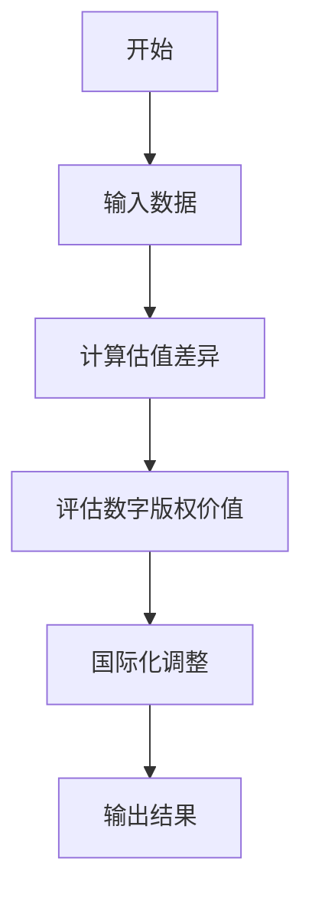
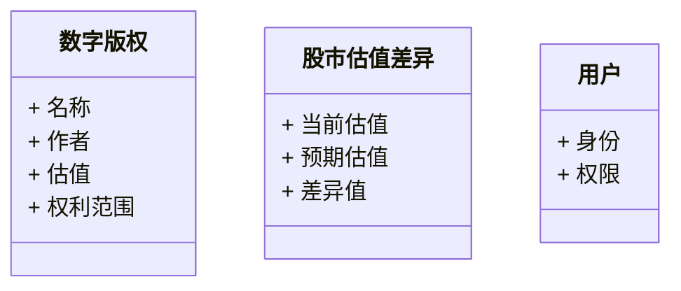
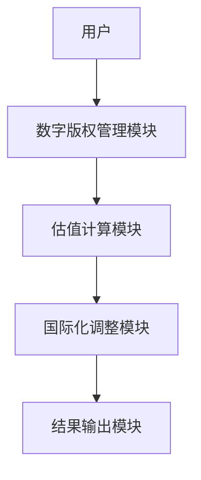
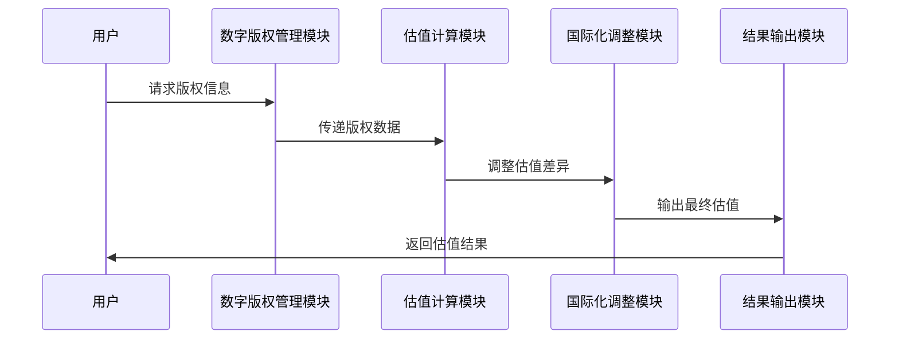

                 


# 股市估值差异对国际文化产业数字版权的影响

> 关键词：股市估值差异，数字版权，文化产业，国际化，算法模型

> 摘要：本文系统探讨了股市估值差异对国际文化产业数字版权的影响，从背景分析、核心概念、算法原理、系统架构到项目实战，层层深入，结合具体案例，分析了数字版权价值评估的方法、国际化视角下的解决方案以及系统架构设计，提出了具有实际指导意义的最佳实践建议。

---

## 第一部分：背景与核心概念

### 第1章：背景介绍

#### 1.1 问题背景

##### 1.1.1 股市估值差异的定义
股市估值差异是指同一资产在不同市场或不同时间点上，因信息不对称、市场情绪、政策差异等因素导致的市场价格与实际价值之间的差异。这种差异在数字版权领域尤为显著，因为数字版权的价值受到市场波动、消费者行为和技术创新的多重影响。

##### 1.1.2 数字版权在文化产业中的重要性
数字版权是文化产业的核心资产，涵盖了音乐、影视、游戏、文学等多个领域。数字版权的价值不仅体现在其创作成本上，还取决于其市场流通性和用户接受度。随着数字化转型的加速，数字版权的估值问题变得尤为重要。

##### 1.1.3 国际化视角下的问题扩展
在国际化背景下，数字版权的估值受到不同国家的法律、文化差异和市场环境的影响。例如，欧美市场对版权保护较为严格，而新兴市场可能因法律法规不完善导致版权价值低估。这种差异性使得跨国文化企业面临复杂的估值挑战。

#### 1.2 问题描述

##### 1.2.1 股市估值差异的形成机制
股市估值差异的形成主要由市场信息不对称、投资者情绪波动和市场结构差异等因素驱动。例如，同一数字版权在A股和港股市场的估值可能因投资者预期不同而产生显著差异。

##### 1.2.2 数字版权对文化产业的影响
数字版权是文化产业的核心竞争力。通过合理估值，企业可以优化资源配置，提升市场竞争力。反之，估值不准确可能导致资源浪费或市场机会的错失。

##### 1.2.3 估值差异与数字版权的关联性
数字版权的估值差异直接影响文化产业的市场表现。例如，低估的数字版权可能导致企业投资不足，而高估的数字版权可能引发市场泡沫。

#### 1.3 问题解决

##### 1.3.1 数字版权价值评估的方法
数字版权的估值需要综合考虑其市场潜力、用户基础和法律保护等因素。常用方法包括收益法、市场法和成本法。

##### 1.3.2 股市估值差异的量化分析
通过统计学方法，量化分析不同市场环境下数字版权的估值差异。例如，利用回归分析评估不同市场的估值偏差。

##### 1.3.3 国际化视角下的解决方案
建立国际化估值模型，考虑不同市场的法律、文化和经济差异，实现跨市场的估值一致性。

#### 1.4 边界与外延

##### 1.4.1 股市估值差异的边界条件
包括市场流动性、政策环境和企业规模等因素，这些因素可能影响估值差异的范围和程度。

##### 1.4.2 数字版权的边界与外延
数字版权的边界包括其权利范围和保护期限，外延则涉及衍生产品和服务。

##### 1.4.3 问题解决的适用范围与限制
该解决方案适用于跨国文化企业，但在新兴市场或法律法规不完善的地区可能效果有限。

#### 1.5 核心概念组成

##### 1.5.1 股市估值差异的核心要素
包括市场价格、实际价值和市场环境。

##### 1.5.2 数字版权的核心属性
包括独创性、可复制性和可交易性。

##### 1.5.3 国际化视角下的系统架构
包括数据采集、估值模型和结果输出三个主要部分。

---

## 第2章：核心概念与联系

### 2.1 核心概念原理

#### 2.1.1 股市估值差异的理论基础
基于金融学中的资产定价理论，分析数字版权的市场定价机制。

#### 2.1.2 数字版权的经济学分析
从经济学视角，分析数字版权的市场供给和需求关系。

#### 2.1.3 国际化视角下的系统理论
运用系统理论，分析跨国文化企业的数字版权管理。

### 2.2 概念属性对比

#### 2.2.1 股市估值差异与数字版权的对比分析
| 属性         | 股市估值差异 | 数字版权 |
|--------------|--------------|----------|
| 影响因素     | 市场情绪、政策 | 用户需求、技术 |
| 评估方法     | 统计模型      | 收益法、成本法 |
| 调整手段     | 投资者预期调整 | 法律保护、市场推广 |

#### 2.2.2 不同文化产业中的差异性
以音乐和影视为例，分析不同文化领域数字版权的估值差异。

#### 2.2.3 国际化视角下的异同点
在国际化视角下，不同市场的文化差异导致数字版权的估值差异更加显著。

### 2.3 ER实体关系图

```mermaid
er
actor: 投资者
entity: 股市估值差异
entity: 数字版权
entity: 文化产业
```

---

## 第三部分：算法原理与数学模型

## 第3章：算法原理

### 3.1 算法原理概述

#### 3.1.1 股市估值差异的计算方法
采用统计学方法，计算不同市场的数字版权估值差异。

#### 3.1.2 数字版权价值的评估算法
基于机器学习的回归分析，评估数字版权的市场价值。

#### 3.1.3 国际化视角下的算法优化
通过多因素模型，调整不同市场的估值差异。

### 3.2 算法流程图



### 3.3 数学模型与公式

#### 3.3.1 股市估值差异模型
$$ V_{\text{差异}} = |V_{\text{当前}} - V_{\text{预期}}| $$

#### 3.3.2 数字版权价值评估公式
$$ V_{\text{版权}} = \alpha \cdot C + \beta \cdot

---

## 第四部分：系统分析与架构设计

## 第4章：系统分析与架构设计

### 4.1 系统分析

#### 4.1.1 问题场景介绍
描述一个跨国文化企业的数字版权估值问题。

#### 4.1.2 项目介绍
概述数字版权估值系统的目标和范围。

### 4.2 系统功能设计

#### 4.2.1 领域模型


#### 4.2.2 系统架构设计


### 4.3 系统接口设计

#### 4.3.1 API接口
定义RESTful API接口，用于数据交互。

### 4.4 系统交互设计

#### 4.4.1 序列图


---

## 第五部分：项目实战

## 第5章：项目实战

### 5.1 环境安装

#### 5.1.1 安装Python
安装Python 3.8及以上版本，配置环境变量。

#### 5.1.2 安装依赖库
安装numpy、pandas、scikit-learn等库。

### 5.2 核心实现

#### 5.2.1 数据预处理
```python
import pandas as pd

# 读取数据
data = pd.read_csv('copyright.csv')
# 数据清洗
data.dropna(inplace=True)
```

#### 5.2.2 估值模型实现
```python
from sklearn.linear_model import LinearRegression

model = LinearRegression()
model.fit(X, y)
```

### 5.3 案例分析

#### 5.3.1 案例选择
以音乐版权为例，分析不同市场的估值差异。

#### 5.3.2 结果展示
展示模型输出的估值结果，并进行对比分析。

---

## 第六部分：总结与展望

## 第6章：总结与展望

### 6.1 最佳实践 tips

#### 6.1.1 选择合适的模型
根据具体场景选择合适的估值模型。

#### 6.1.2 数据清洗的重要性
确保数据质量，避免偏差。

### 6.2 小结

总结全文，强调数字版权估值的重要性。

### 6.3 注意事项

提醒读者注意模型的适用性和数据的敏感性。

### 6.4 拓展阅读

推荐相关领域的书籍和论文。

---

作者：AI天才研究院/AI Genius Institute & 禅与计算机程序设计艺术 /Zen And The Art of Computer Programming

