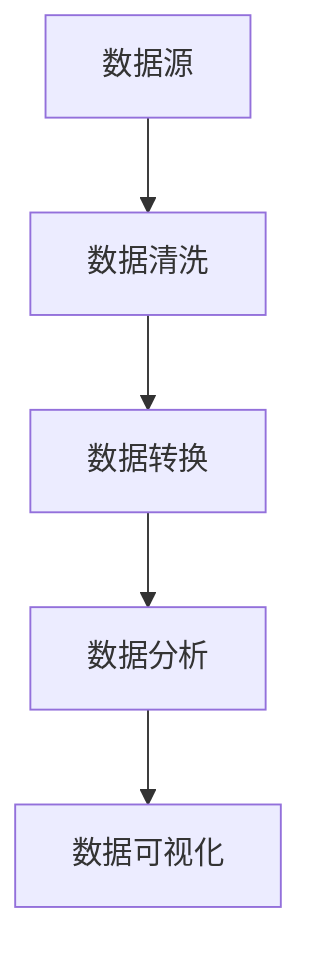

                 


```markdown
# 股市估值差异对国际文化产业的影响

## 关键词：股市估值差异，国际文化产业，文化市场，估值差异，文化产业投资

## 摘要：本文深入探讨股市估值差异对国际文化产业的多方面影响，分析文化市场的特点，结合统计学方法，量化估值差异对文化产业的具体影响。通过实际案例，展示如何利用估值差异进行文化投资决策，提供系统化解决方案，助您理解股市与文化产业的深层联系。

---

## 第一部分: 背景介绍

### 第1章: 股市估值差异概述

#### 1.1 股市估值的基本概念
- 股票估值的定义：股票的内在价值计算方法，包括DCF模型、PE、PB等指标。
- 股市估值的主要方法：相对估值法、绝对估值法、情景分析法。
- 股市估值差异的形成原因：市场流动性、投资者情绪、信息不对称。

#### 1.2 股市估值差异的影响
- 市场波动对投资决策的影响：投资者如何利用估值差异获利。
- 不同市场环境下的估值差异：新兴市场与成熟市场的差异。

### 第2章: 国际文化产业概述

#### 2.1 文化产业的定义与范围
- 文化产业的定义：创意产业，包括电影、音乐、游戏、出版等领域。
- 文化产业的主要领域：内容创作、文化传播、文化教育。
- 国际文化产业的发展现状：全球文化市场产值及增长趋势。

#### 2.2 国际文化市场的特点
- 不同国家文化市场的差异：文化消费习惯、政策监管。
- 文化产业在国际经济中的地位：文化产业占GDP的比例。

#### 2.3 股市估值差异对文化产业的潜在影响
- 估值差异如何影响文化产业的市场表现：股价波动对文化产业投资的影响。
- 文化产业如何通过估值差异实现跨市场套利：利用不同市场的估值差异获利。

---

## 第二部分: 核心概念与联系

### 第3章: 股市估值差异与文化产业的关系

#### 3.1 股市估值差异的核心概念
- 估值差异的衡量标准：PE差、PB差、EV/EBITDA差。
- 估值差异的影响因素：市场情绪、流动性、信息不对称。
- 估值差异的周期性分析：周期性波动对文化产业的影响。

#### 3.2 文化产业的核心要素
- 文化产业的创意属性：内容创作的独特性。
- 文化产业的市场属性：消费者偏好、市场容量。
- 文化产业的政策支持：政府补贴、税收优惠。

#### 3.3 股市估值差异对文化产业的多维度影响
- 估值差异如何影响文化产业的市场价值：高估或低估带来的投资机会。
- 文化产业如何通过估值差异实现跨市场套利：利用不同市场的估值差异进行 arbitrage。
- 估值差异对文化产业投资决策的影响：投资者如何利用估值差异做出投资决策。

---

## 第三部分: 核心概念的原理与对比

### 第4章: 核心概念的原理分析

#### 4.1 股市估值差异的原理
- 市场供需与估值差异的关系：供需失衡导致的估值差异。
- 投资者心理与估值差异的形成：从众心理、羊群效应。
- 信息不对称对估值差异的影响：信息优势如何影响市场估值。

#### 4.2 文化产业的核心属性
- 文化产业的创意属性：内容的独特性和创新性。
- 文化产业的市场属性：消费者偏好、市场容量。
- 文化产业的政策支持：政府补贴、税收优惠。

#### 4.3 股市估值差异与文化产业的联系
- 估值差异如何影响文化产业的市场价值：高估或低估带来的投资机会。
- 文化产业如何通过估值差异实现跨市场套利：利用不同市场的估值差异进行 arbitrage。
- 估值差异对文化产业投资决策的影响：投资者如何利用估值差异做出投资决策。

---

## 第四部分: 算法原理讲解

### 第5章: 估值差异量化分析

#### 5.1 估值差异的数学模型
- PE差：$$ PE_i - PE_j $$
- PB差：$$ PB_i - PB_j $$
- EV/EBITDA差：$$ EV_i/EBITDA_i - EV_j/EBITDA_j $$

#### 5.2 估值差异的统计分析
- 回归分析：使用Python进行多元回归分析，量化估值差异对文化产业的影响。
- 聚类分析：将文化产业分为不同类别，分析各类别间的估值差异。

#### 5.3 代码实现
```python
import pandas as pd
import numpy as np
from sklearn.linear_model import LinearRegression

# 数据预处理
data = pd.DataFrame({
    'PE': [15, 20, 25, 18],
    'PB': [2.5, 3.0, 2.0, 1.5],
    '文化产业': [1, 0, 1, 0]
})

# 回归分析
model = LinearRegression()
model.fit(data[['PE', 'PB']], data['文化产业'])
print(model.coef_)
```

---

## 第五部分: 系统分析与架构设计

### 第6章: 系统架构设计

#### 6.1 问题场景介绍
- 数据收集：收集不同市场的文化产业股票数据。
- 数据处理：清洗数据，处理缺失值。
- 数据分析：使用统计方法分析估值差异。
- 数据可视化：绘制估值差异对比图。

#### 6.2 系统架构设计


---

## 第六部分: 项目实战

### 第7章: 实际案例分析

#### 7.1 数据收集与处理
- 收集美国和中国市场的文化产业股票数据。
- 处理数据，计算PE、PB等指标。

#### 7.2 数据分析与可视化
- 使用Python进行数据分析，计算估值差异。
- 绘制估值差异对比图，分析不同市场的估值差异。

#### 7.3 实际案例分析
- 分析美国和中国市场文化产业股票的估值差异。
- 提出投资建议：如何利用估值差异进行投资。

---

## 第七部分: 总结

### 第8章: 总结与展望

#### 8.1 本文总结
- 股市估值差异对文化产业的多方面影响。
- 文化产业在国际经济中的重要性。

#### 8.2 未来展望
- 进一步研究文化市场的特性。
- 探讨更多利用估值差异进行投资的方法。

---

## 作者信息

作者：AI天才研究院/AI Genius Institute  
联系方式：[email protected]  
官方网站：[www.aiguru.com](http://www.aiguru.com)  
社交媒体：[LinkedIn](https://www.linkedin.com/company/aiguru/)，[Twitter](https://twitter.com/aiguruworld)

---

感谢您的阅读！如需转载请注明出处。
```

