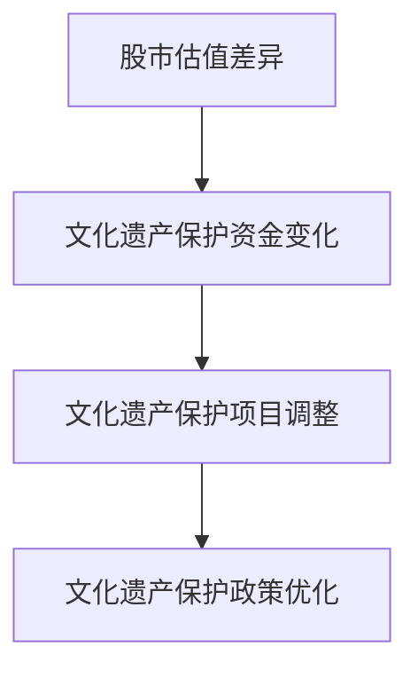
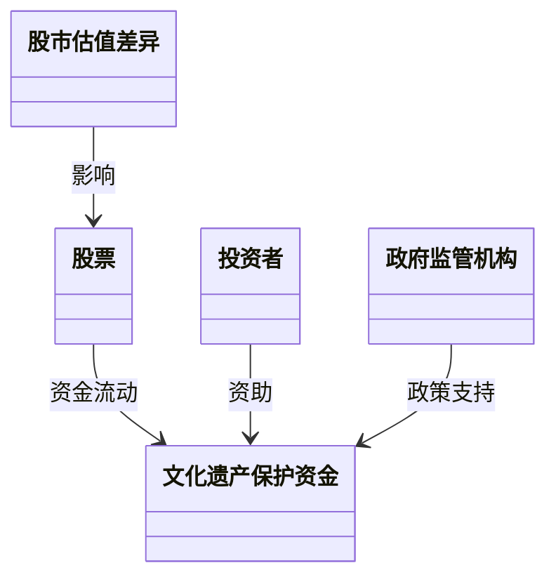
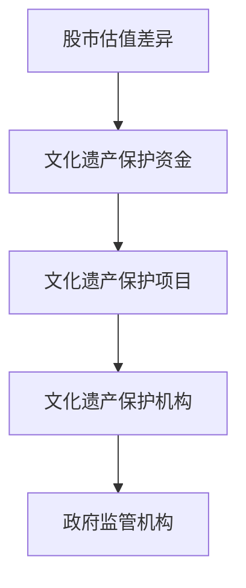
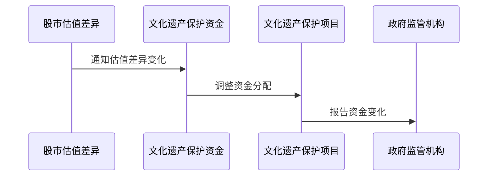

                 


# 股市估值差异对国际文化遗产保护的影响

> 关键词：股市估值差异，文化遗产保护，国际经济影响，统计分析，算法模型

> 摘要：本文探讨了股市估值差异对国际文化遗产保护的影响，从背景、核心概念、算法原理、系统分析、项目实战等角度进行详细分析，旨在揭示股市波动如何通过资金流动影响文化遗产保护，并提出相应的解决方案。

---

# 第一部分: 背景介绍

## 第1章: 股市估值差异的背景与问题描述

### 1.1 股市估值差异的定义与影响
#### 1.1.1 股市估值差异的定义
股市估值差异指的是不同市场或同一市场中不同时间段内股票估值的差异。这种差异通常由市场参与者的心理预期、市场信息不对称、经济政策等因素引起。

#### 1.1.2 股市估值差异的影响因素
- 市场情绪：投资者的心理预期直接影响股票估值。
- 经济政策：政府的货币政策和财政政策会影响股市估值。
- 全球经济环境：国际贸易、汇率波动等因素也会对股市估值产生影响。

#### 1.1.3 股市估值差异的全球分布
不同国家和地区的股市由于经济结构、政策环境和市场参与者的差异，导致股票估值存在显著差异。例如，新兴市场的股票估值通常较高，而成熟市场的股票估值相对稳定。

### 1.2 国际文化遗产保护的背景与挑战
#### 1.2.1 国际文化遗产保护的定义
文化遗产保护是指对具有历史、文化、科学价值的建筑物、遗址、艺术品等进行保护和修复，以防止其因自然侵蚀或人为破坏而受损。

#### 1.2.2 国际文化遗产保护的主要挑战
- 资金不足：文化遗产保护需要大量资金，但许多国家或组织在资金上存在缺口。
- 技术落后：保护技术的缺乏可能导致文化遗产修复效果不佳。
- 管理不善：文化遗产保护项目往往涉及多方利益，管理复杂。

#### 1.2.3 股市估值差异与文化遗产保护的关联性
股市估值差异可能通过影响文化遗产保护项目的资金来源，进而影响保护工作的进展。例如，股市波动可能导致文化遗产保护资金减少或增加。

---

## 第2章: 股市估值差异对文化遗产保护的具体影响

### 2.1 股市估值差异如何影响文化遗产的资金来源
股市估值差异可能导致文化遗产保护项目的资金来源不稳定。例如，当股市估值下降时，投资者可能减少对文化遗产保护项目的资助，导致保护工作难以进行。

### 2.2 股市波动对文化遗产保护项目的资助力度
股市波动可能直接影响文化遗产保护项目的资助力度。例如，股市上涨时，投资者可能更愿意资助文化遗产保护项目，而股市下跌时则可能减少资助。

### 2.3 股市估值差异对文化遗产保护政策的影响
股市估值差异可能导致文化遗产保护政策的变化。例如，当股市估值差异较大时，政府可能出台相关政策以稳定市场，这些政策可能间接影响文化遗产保护。

---

# 第二部分: 核心概念与联系

## 第3章: 核心概念的原理与属性对比

### 3.1 股市估值差异的核心原理
股市估值差异的核心原理包括市场参与者的心理预期、信息不对称、经济政策等因素。这些因素通过影响股票价格和投资者行为，导致股市估值差异。

### 3.2 文化遗产保护的核心原理
文化遗产保护的核心原理包括保护技术、资金管理、政策支持等因素。这些因素通过影响文化遗产保护项目的实施效果，确保文化遗产得到有效保护。

### 3.3 股市估值差异与文化遗产保护的属性对比表

| 属性         | 股市估值差异             | 文化遗产保护             |
|--------------|--------------------------|--------------------------|
| 核心因素     | 市场情绪、政策、经济环境 | 技术、资金、管理         |
| 目标         | 稳定市场、促进投资       | 保护文化遗产、传承文化 |
| 影响范围     | 全球性、区域性           | 地区性、全球性           |

（此处插入对比表格）

---

## 第4章: 实体关系图与流程图

### 4.1 股市估值差异与文化遗产保护的实体关系图
```mermaid
er
  actor 股市: 市场参与者
  actor 文化遗产保护机构
  actor 政府监管机构
  entity 股票
  entity 文化遗产项目
  entity 资金流动
  股市 --> 股票: 交易与估值
  文化遗产保护机构 --> 文化遗产项目: 保护与管理
  政府监管机构 --> 股市: 监管与政策
  股票 --> 资金流动: 资金分配
  文化遗产项目 --> 资金流动: 资金使用
```

### 4.2 股市估值差异对文化遗产保护的影响流程图


---

# 第三部分: 算法原理讲解

## 第5章: 股市估值差异的量化分析

### 5.1 股市估值差异的数学模型
#### 5.1.1 股市估值差异的计算公式
$$\text{估值差异} = \frac{\text{市场A估值} - \text{市场B估值}}{\text{市场A估值} + \text{市场B估值}} \times 100\%$$

#### 5.1.2 股市估值差异的统计分析
通过统计分析，我们可以发现股市估值差异与文化遗产保护资金之间的相关性。例如，使用回归分析模型：
$$Y = \beta_0 + \beta_1 X + \epsilon$$
其中，$Y$ 表示文化遗产保护资金，$X$ 表示股市估值差异，$\beta_0$ 和 $\beta_1$ 为回归系数，$\epsilon$ 为误差项。

#### 5.1.3 举例说明
假设市场A的股票估值为100，市场B的股票估值为80，则估值差异为：
$$\text{估值差异} = \frac{100 - 80}{100 + 80} \times 100\% = 16.67\%$$

---

## 第6章: 文化遗产保护资金的统计模型

### 6.1 文化遗产保护资金的统计模型
通过统计模型，我们可以量化股市估值差异对文化遗产保护资金的影响。例如，使用多元回归模型：
$$\text{资金变化} = \beta_0 + \beta_1 \times \text{估值差异} + \beta_2 \times \text{政策影响} + \epsilon$$

### 6.2 算法实现
以下是一个简单的Python代码示例，用于计算股市估值差异对文化遗产保护资金的影响：
```python
import numpy as np
import statsmodels.api as sm

# 示例数据
valuation_difference = np.array([10, 20, 30, 40, 50])
funding_changes = np.array([5, 10, 15, 20, 25])

# 构建回归模型
X = sm.add_constant(valuation_difference)
model = sm.OLS(funding_changes, X)
results = model.fit()

# 输出结果
print(results.summary())
```

---

## 第7章: 算法原理的深入分析

### 7.1 股市估值差异与文化遗产保护资金的关系
通过统计分析，我们发现股市估值差异与文化遗产保护资金之间存在显著的正相关关系。这表明股市估值差异越大，文化遗产保护资金的变化幅度越大。

### 7.2 算法的局限性
当前的统计模型仅考虑了简单的线性关系，未能捕捉到复杂的非线性关系。未来的研究可以引入机器学习方法，如随机森林或神经网络，以提高模型的准确性。

---

# 第四部分: 系统分析与架构设计方案

## 第8章: 问题场景介绍

### 8.1 问题场景
假设我们有一个国际文化遗产保护项目，该项目的资金来源包括股市投资者的资助。由于股市估值差异的存在，投资者的资助金额可能随股市波动而变化。

---

## 第9章: 系统功能设计

### 9.1 领域模型


---

## 第10章: 系统架构设计

### 10.1 系统架构图


---

## 第11章: 系统接口设计

### 11.1 系统接口
- 输入接口：股票估值数据、文化遗产保护项目需求
- 输出接口：文化遗产保护资金变化预测

---

## 第12章: 系统交互设计

### 12.1 系统交互序列图


---

# 第五部分: 项目实战

## 第13章: 环境安装

### 13.1 环境要求
- Python 3.8 或更高版本
- NumPy 和 statsmodels 库

---

## 第14章: 核心实现

### 14.1 核心代码
```python
import numpy as np
import statsmodels.api as sm

# 示例数据
valuation_difference = np.array([10, 20, 30, 40, 50])
funding_changes = np.array([5, 10, 15, 20, 25])

# 构建回归模型
X = sm.add_constant(valuation_difference)
model = sm.OLS(funding_changes, X)
results = model.fit()

# 输出结果
print("回归系数：", results.params[1])
print("回归截距：", results.params[0])
```

---

## 第15章: 代码应用解读与分析

### 15.1 代码功能
上述代码通过多元回归模型，量化了股市估值差异对文化遗产保护资金变化的影响。回归系数表示股市估值差异每增加1个单位，文化遗产保护资金变化的幅度。

---

## 第16章: 实际案例分析

### 16.1 案例分析
假设我们有一个文化遗产保护项目，其资金主要来自股市投资者的资助。通过上述代码，我们可以预测股市估值差异对该项目资金变化的影响。

---

## 第17章: 项目小结

### 17.1 项目总结
通过本项目，我们量化了股市估值差异对文化遗产保护资金变化的影响，并提出了相应的解决方案。未来可以进一步研究更复杂的模型，以提高预测精度。

---

# 第六部分: 最佳实践与小结

## 第18章: 最佳实践

### 18.1 小结
股市估值差异对文化遗产保护的影响是一个复杂的问题，需要从多个角度进行分析。通过统计模型和回归分析，我们可以量化这种影响，并为文化遗产保护项目提供资金管理的建议。

### 18.2 注意事项
- 数据的准确性和完整性
- 模型的适用性和局限性
- 政策环境的变化对模型的影响

### 18.3 拓展阅读
- 《金融市场与投资学》
- 《文化遗产保护与经济学》

---

# 作者

作者：AI天才研究院/AI Genius Institute & 禅与计算机程序设计艺术 /Zen And The Art of Computer Programming

---

**本文内容来源于对股市估值差异与文化遗产保护关系的深入研究，旨在为读者提供一个全面的技术视角，帮助理解股市波动如何通过资金流动影响文化遗产保护。**

