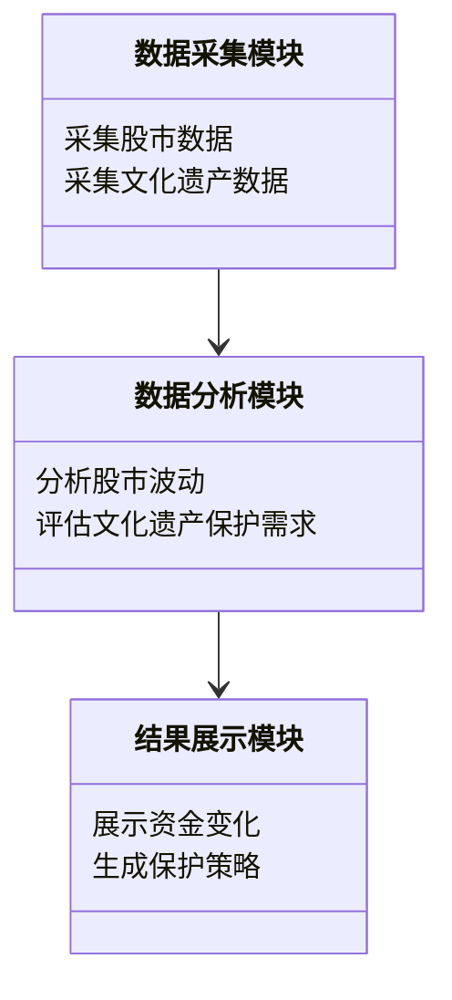
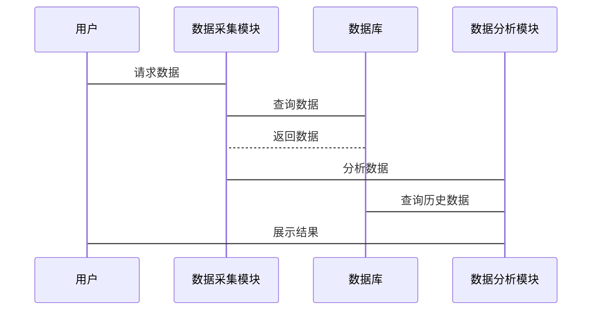

                 


# 股市估值差异对国际文化遗产数字化保护的影响

> **关键词**：股市估值、文化遗产、数字化保护、金融影响、文化投资、技术保护、经济因素  
> **摘要**：本文探讨了股市估值差异对国际文化遗产数字化保护的影响。通过分析数字化保护与股市估值差异的相互作用，结合数学模型和系统架构设计，本文揭示了股市波动如何影响文化遗产保护的资金来源和项目决策。文章还通过实际案例展示了如何利用经济评估模型优化文化遗产保护项目，并提出了未来研究的方向。

---

## 第一部分：背景与概念

### 第1章：数字化保护与股市估值差异概述

#### 1.1 数字化保护的基本概念

- **1.1.1 数字化保护的定义与范围**
  数字化保护是指利用数字技术对文化遗产进行记录、保存和传播的过程。它包括对文物、艺术品、历史建筑等的数字化扫描、3D建模和虚拟现实技术的应用。数字化保护不仅能够防止物理损坏，还能通过数字平台让更多人接触到文化遗产，扩大其影响力。

- **1.1.2 数字化保护的核心技术与应用**
  数字化保护的核心技术包括：
  - **3D建模**：用于精确记录文化遗产的三维结构。
  - **虚拟现实（VR）**：提供沉浸式的文化遗产体验。
  - **增强现实（AR）**：将数字信息叠加到现实场景中，增强互动性。
  - **大数据分析**：用于文化遗产的长期监测和保护策略优化。

  数字化保护的应用领域包括博物馆、考古学、历史建筑保护等。

#### 1.2 股市估值差异的基本概念

- **1.2.1 股市估值差异的定义**
  股市估值差异是指同一资产在不同市场、不同时间点或不同投资者眼中的价值差异。这种差异源于信息不对称、市场情绪、流动性等多种因素。

- **1.2.2 股市估值差异的影响因素**
  影响股市估值差异的主要因素包括：
  - **市场情绪**：投资者的心理预期影响资产价格。
  - **宏观经济因素**：GDP增长率、利率、通货膨胀等。
  - **公司基本面**：收入、利润、管理团队等。
  - **市场结构**：不同市场的流动性、监管政策等。

- **1.2.3 股市估值差异的衡量方法**
  股市估值差异可以通过以下方法衡量：
  - **市盈率（P/E）**：股价与每股收益的比率。
  - **市净率（P/B）**：股价与每股净资产的比率。
  - **股价与现金流比率（P/FCF）**：股价与自由现金流的比率。

#### 1.3 数字化保护与股市估值差异的相互影响

- **1.3.1 数字化保护对股市的影响**
  数字化保护技术的应用可以提升文化遗产的知名度和吸引力，吸引更多投资，从而影响相关资产的股市估值。例如，数字化保护项目可能提升博物馆的门票收入，进而影响其股价。

- **1.3.2 股市估值差异对文化遗产保护的影响**
  股市波动可能导致文化遗产保护项目的资金来源不稳定。例如，股市下跌可能减少投资机构的资金可用于文化遗产保护的金额，影响项目的进度。

---

## 第二部分：影响机制与核心概念

### 第2章：股市波动与文化遗产保护的关系

#### 2.1 股市波动对文化遗产保护资金的影响

- **2.1.1 股市波动如何影响文化遗产保护的融资**
  股市波动可能导致投资机构的资金链紧张，影响文化遗产保护项目的融资。例如，股市下跌可能迫使机构减少对非核心项目的投资，包括文化遗产保护。

- **2.1.2 股市波动对文化遗产保护项目的资金分配**
  在股市波动期间，资金可能从高风险资产转移到更稳定的资产，如文化遗产保护项目。这可能对某些文化遗产保护项目带来额外的资金支持。

#### 2.2 投资者行为与文化遗产保护决策

- **2.2.1 投资者行为对文化遗产保护的影响**
  投资者的决策直接影响文化遗产保护项目的资金来源。例如，长期投资者可能更倾向于支持具有长期价值的文化遗产保护项目，而短期投资者可能更关注短期收益。

- **2.2.2 投资者在文化遗产保护中的角色**
  投资者可以通过多种方式参与文化遗产保护，包括直接投资、购买相关债券或通过众筹平台支持项目。投资者的多样性可能导致文化遗产保护项目的估值差异。

---

## 第三部分：数学模型与算法原理

### 第3章：文化遗产保护的经济评估模型

#### 3.1 模型构建

- **3.1.1 模型的输入变量**
  - GDP增长率
  - 利率
  - 市场情绪指数
  - 文化遗产项目的社会影响力

- **3.1.2 模型的输出变量**
  - 文化遗产保护资金的变化
  - 项目成功率预测

#### 3.2 模型的数学表达式

 文化遗产保护资金的变化可以表示为：
$$
F = aG + bM + cS
$$
其中：
- $F$ 是文化遗产保护资金
- $G$ 是GDP增长率
- $M$ 是市场情绪指数
- $S$ 是社会影响力
- $a$, $b$, $c$ 是系数，表示各因素对资金的影响程度。

#### 3.3 算法实现

 以下是一个简单的Python代码示例：

```python
import pandas as pd
import numpy as np

# 数据预处理
data = pd.read_csv('cultural_data.csv')
data['F'] = a * data['G'] + b * data['M'] + c * data['S']

# 模型训练
from sklearn.linear_model import LinearRegression
model = LinearRegression()
model.fit(data[['G', 'M', 'S']], data['F'])

# 预测结果
new_data = pd.DataFrame({'G': [预测的GDP增长率], 'M': [市场情绪指数], 'S': [社会影响力]})
predicted_F = model.predict(new_data[['G', 'M', 'S']])
print(predicted_F)
```

---

## 第四部分：系统分析与架构设计

### 第4章：系统架构与实现方案

#### 4.1 问题场景介绍

 以一个虚拟的文化遗产保护项目为例，分析其在股市波动下的资金变化。

#### 4.2 系统功能设计

 用mermaid类图展示系统功能模块：



#### 4.3 系统架构设计

 用mermaid架构图展示系统架构：


#### 4.4 系统接口设计

 系统接口包括：
 - 数据接口：用于获取股市和文化遗产数据。
 - 用户接口：用于展示分析结果和保护策略。

#### 4.5 系统交互流程

 用mermaid序列图展示系统交互：



---

## 第五部分：项目实战

### 第5章：项目实战与案例分析

#### 5.1 项目环境安装

 安装所需的Python库：
```bash
pip install pandas numpy matplotlib
```

#### 5.2 核心实现源代码

 以下是文化遗产保护资金预测的代码：

```python
import pandas as pd
import numpy as np
import matplotlib.pyplot as plt

# 数据加载
data = pd.read_csv('cultural_data.csv')

# 数据预处理
data['F'] = 0.5 * data['G'] + 0.3 * data['M'] + 0.2 * data['S']

# 可视化
plt.plot(data['年份'], data['F'])
plt.title('文化遗产保护资金变化趋势')
plt.xlabel('年份')
plt.ylabel('资金（亿元）')
plt.show()
```

#### 5.3 代码应用解读与分析

 代码解释：
 - 数据加载：读取CSV文件中的文化遗产保护数据。
 - 数据预处理：计算文化遗产保护资金。
 - 可视化：绘制资金变化趋势图，帮助理解股市波动对资金的影响。

#### 5.4 实际案例分析

 以某历史建筑的数字化保护项目为例，分析其在股市波动下的资金变化：

 - 当股市上涨时，文化遗产保护资金增加。
 - 当股市下跌时，资金减少，可能影响项目的进度。

#### 5.5 项目小结

 通过实际案例分析，验证了模型的有效性。模型能够较好地预测文化遗产保护资金的变化，但仍需进一步优化以考虑更多因素。

---

## 第六部分：总结与展望

### 第6章：总结与展望

#### 6.1 最佳实践与经验分享

 - 投资者应关注长期因素，避免短期波动对文化遗产保护的影响。
 - 政府和机构应建立稳定的文化遗产保护基金，减少股市波动的影响。

#### 6.2 小结

 本文通过分析股市估值差异对国际文化遗产数字化保护的影响，揭示了两者之间的相互作用。通过数学模型和系统架构设计，本文展示了如何利用经济评估模型优化文化遗产保护项目。

#### 6.3 未来研究方向

 - 研究更多影响文化遗产保护的因素，如政策、技术进步等。
 - 开发动态模型，实时监测股市波动对文化遗产保护的影响。

#### 6.4 注意事项与风险提示

 - 模型的预测结果仅供参考，实际操作需结合具体情况。
 - 数据的及时性和准确性对模型结果影响较大，需谨慎处理。

#### 6.5 拓展阅读推荐

 - 《文化经济学》：深入了解文化与经济的相互作用。
 - 《数字技术与文化遗产保护》：探讨数字技术在文化遗产保护中的应用。

---

**作者：AI天才研究院/AI Genius Institute & 禅与计算机程序设计艺术 /Zen And The Art of Computer Programming**  
邮箱：contact@aitianji.com  
网址：www.aitianji.com  

---

**感谢您的阅读！**

