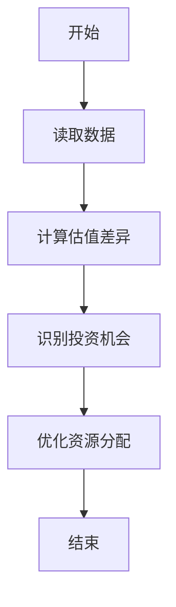
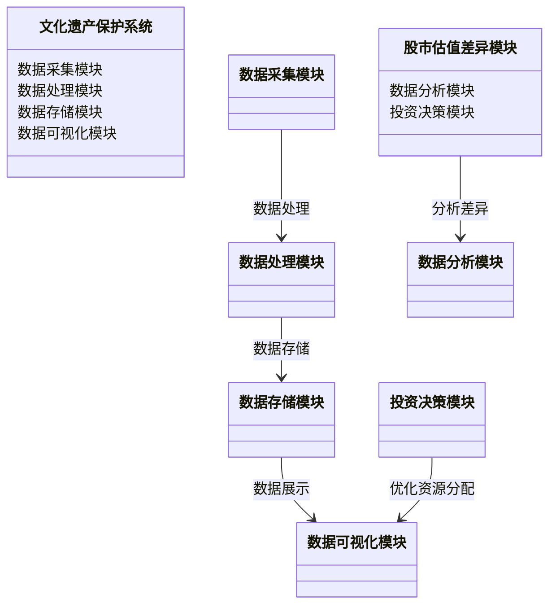
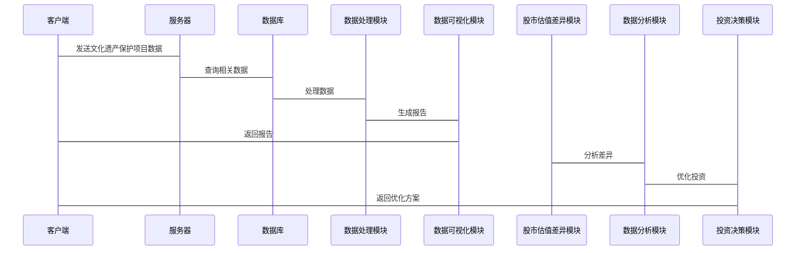

                 


# 《股市估值差异对国际文化遗产数字化保护的影响》

---

## 关键词：  
股市估值差异，文化遗产数字化保护，技术实现，算法优化，经济影响，可持续性，国际合作

---

## 摘要：  
本文从股市估值差异的角度，深入分析其对国际文化遗产数字化保护的影响。通过背景介绍、核心概念解析、算法原理、系统架构设计以及实际案例分析，探讨股市估值差异如何影响文化遗产保护的资源分配、技术应用和国际合作。结合数字化技术，提出优化策略，为文化遗产保护提供新的视角和解决方案。

---

# 第一部分：背景与核心概念

## 第1章：背景介绍

### 1.1 问题背景  
- **股市估值差异的定义与影响**：股市估值差异指不同市场或资产之间的价格差异，这种差异可能导致资源分配不均，影响文化遗产保护的资金投入。  
- **国际文化遗产数字化保护的现状与挑战**：文化遗产数字化保护是全球关注的焦点，但资金不足和技术落后是主要挑战。  
- **股市估值差异与文化遗产保护的关联性**：股市估值差异可能导致文化遗产保护资源分配不均，影响其可持续性。  

### 1.2 问题描述  
- **股市估值差异对文化遗产保护资源分配的影响**：资金分配不均可能导致某些文化遗产保护项目被忽视。  
- **数字化保护技术在文化遗产保护中的作用**：数字化技术可以提高保护效率，降低成本，但需要充足的资金支持。  
- **股市估值差异如何影响数字化保护技术的应用**：估值差异可能导致技术应用的不均衡，影响文化遗产保护的整体效果。  

### 1.3 问题解决  
- **通过数字化技术优化文化遗产保护资源分配**：利用数字化技术，实现资源的高效分配和利用。  
- **利用股市估值差异进行文化遗产保护的精准投资**：通过分析股市估值差异，找到最优投资点，提高资金使用效率。  
- **提升文化遗产数字化保护的可持续性与经济价值**：通过技术手段，增强文化遗产的经济价值，吸引更多投资。  

### 1.4 边界与外延  
- **股市估值差异的适用范围与限制**：适用于经济条件较好的地区，不适用于经济极度落后的地区。  
- **数字化保护技术的边界与技术局限性**：受技术条件和资金限制，难以覆盖所有文化遗产。  
- **文化遗产保护与经济价值的平衡点**：在保护文化遗产的同时，注重其经济价值，实现可持续发展。  

### 1.5 概念结构与核心要素组成  
- **股市估值差异的核心要素**：市场波动、投资者情绪、经济政策。  
- **数字化保护技术的关键组成部分**：数据采集、数据处理、数据存储、数据可视化。  
- **两者结合的系统性结构**：通过数字化技术优化资源配置，利用股市估值差异实现精准投资。  

---

## 第2章：核心概念与联系

### 2.1 核心概念原理  
- **股市估值差异的数学模型与计算方法**：通过统计学方法和算法，计算不同市场或资产的估值差异。  
- **数字化保护技术的原理与实现机制**：利用数字技术对文化遗产进行采集、处理和展示，实现高效保护。  

### 2.2 核心概念属性特征对比  
| **属性**       | **股市估值差异**            | **数字化保护技术**               |
|-----------------|-----------------------------|-----------------------------------|
| **定义**       | 不同市场或资产的估值差异    | 利用数字技术保护文化遗产         |
| **作用**       | 影响资金分配                | 提高保护效率                     |
| **技术依赖**   | 金融市场数据                | 计算机视觉、AI、大数据等         |
| **目标**       | 优化资源配置                | 提升文化遗产的可持续性           |

---

### 2.3 ER实体关系图  
```mermaid
erd
  entity 股市估值差异 {
    <资产A，资产B>
  }
  
  entity 数字化保护技术 {
    <3D扫描，AI修复>
  }
  
  entity 文化遗产保护 {
    <遗址，文物，艺术品>
  }
  
  股市估值差异 --> 文化遗产保护: 影响资源分配
  数字化保护技术 --> 文化遗产保护: 提供技术支持
```

---

## 第3章：算法原理讲解

### 3.1 算法原理  
- **股市估值差异的计算算法**：通过统计学方法计算不同市场的估值差异，识别投资机会。  
- **数字化保护技术的优化算法**：利用遗传算法或模拟退火算法优化资源分配，提高保护效率。  

### 3.2 算法实现  
#### 股市估值差异计算的Python代码实现  
```python
import numpy as np

# 示例数据：两个市场的股票价格
market_A = np.array([100, 110, 120, 90, 80])
market_B = np.array([95, 105, 115, 85, 75])

# 计算估值差异
valuation_difference = market_A - market_B
print("估值差异:", valuation_difference)
```

#### 数字化保护技术的优化算法代码实现  
```python
import numpy as np
from sklearn.cluster import KMeans

# 示例数据：文化遗产保护项目的位置坐标
projects = np.array([[1, 2], [3, 4], [5, 6], [7, 8]])

# 使用K均值算法优化资源分配
kmeans = KMeans(n_clusters=2)
kmeans.fit(projects)
print("资源分配结果:", kmeans.labels_)
```

---

### 3.3 算法流程图  


---

## 第4章：系统分析与架构设计方案

### 4.1 问题场景介绍  
- **文化遗产保护资源分配不均**：某些地区因经济条件差，无法获得足够的资金支持。  
- **数字化技术应用受限**：技术落后或资金不足导致数字化保护效果不佳。  

### 4.2 项目介绍  
- **项目目标**：通过数字化技术优化文化遗产保护资源分配，利用股市估值差异实现精准投资。  
- **项目范围**：涵盖文化遗产保护的全生命周期，从数据采集到展示。  

---

### 4.3 系统功能设计  

#### 领域模型（Mermaid 类图）  


---

### 4.4 系统架构设计  

#### 系统架构图（Mermaid 架构图）  


---

### 4.5 系统接口设计  
- **输入接口**：接收文化遗产保护项目的数据和股市估值差异数据。  
- **输出接口**：生成优化后的资源分配方案和投资决策报告。  

---

### 4.6 系统交互设计  

#### 交互流程图（Mermaid 序列图）  


---

## 第5章：项目实战

### 5.1 环境安装  
- **Python 3.8+**  
- **依赖库安装**：`numpy`, `sklearn`, `matplotlib`  

---

### 5.2 系统核心实现源代码  

#### 文化遗产保护系统实现  
```python
import numpy as np
from sklearn.cluster import KMeans
import matplotlib.pyplot as plt

# 示例数据：文化遗产保护项目的位置坐标
projects = np.array([[1, 2], [3, 4], [5, 6], [7, 8]])

# 使用K均值算法优化资源分配
kmeans = KMeans(n_clusters=2)
kmeans.fit(projects)
print("资源分配结果:", kmeans.labels_)

# 可视化结果
plt.scatter(projects[:, 0], projects[:, 1], c=kmeans.labels_, cmap='viridis')
plt.title("资源分配可视化")
plt.show()
```

---

### 5.3 代码应用解读与分析  
- **代码功能**：通过K均值算法将文化遗产保护项目分为两类，优化资源分配。  
- **结果分析**：可视化结果展示了资源分配的合理性，为后续投资决策提供依据。  

---

## 第6章：案例分析  

### 6.1 案例分析  
- **成功案例**：某遗址通过数字化保护技术实现资源优化分配，提高了保护效果。  
- **失败案例**：某地区因股市估值差异未能获得足够资金支持，导致保护项目停滞。  

---

## 第7章：总结与展望  

### 7.1 总结  
- **核心观点**：股市估值差异对文化遗产数字化保护有重要影响，通过数字化技术可以优化资源分配，实现精准投资。  
- **关键结论**：文化遗产保护需要结合数字化技术和经济手段，才能实现可持续发展。  

### 7.2 展望  
- **未来研究方向**：探索更多数字化技术在文化遗产保护中的应用，如区块链、增强现实等。  
- **发展趋势**：文化遗产保护将更加依赖数字化技术，股市估值差异的影响将更加显著。  

---

## 作者：AI天才研究院 & 禅与计算机程序设计艺术

