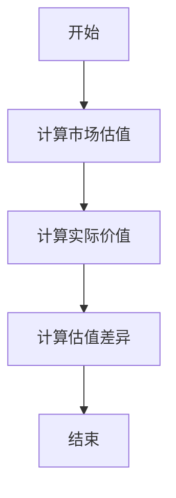
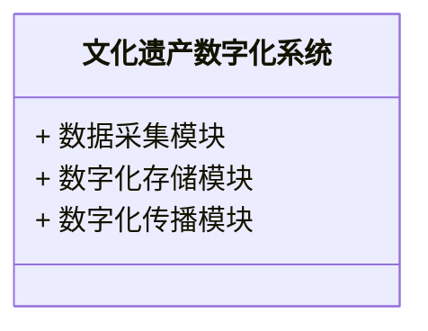

                 


# 股市估值差异对国际文化遗产数字化的影响

## 关键词：股市估值差异，文化遗产数字化，数学模型，系统架构设计，项目实战，文化遗产保护

## 摘要：本文探讨股市估值差异如何影响国际文化遗产数字化的过程。通过分析估值差异的形成机制、数字化技术的应用以及两者之间的相互作用，构建数学模型和系统架构，结合实际案例进行深入分析，提出解决方案和优化建议。

---

## 第1章: 股市估值差异与文化遗产数字化的背景

### 1.1 股市估值差异的定义与特征
#### 1.1.1 股市估值的基本概念
股市估值是指投资者对某一资产未来价值的评估，通常基于当前市场状况、公司基本面和市场情绪等多方面因素。估值差异则是指不同投资者或市场对同一资产的估值存在差异的现象。

#### 1.1.2 估值差异的形成机制
估值差异的形成主要由以下几个因素引起：
1. 市场信息不对称：不同投资者掌握的信息不同，导致估值差异。
2. 市场情绪波动：投资者情绪会影响短期估值。
3. 时间因素：长期与短期估值存在差异。

#### 1.1.3 估值差异的分类与影响
- 分类：短期估值差异、长期估值差异、市场间估值差异。
- 影响：影响投资决策、市场流动性、资产配置等。

### 1.2 国际文化遗产数字化的现状
#### 1.2.1 文化遗产数字化的定义
文化遗产数字化是指利用数字技术对文化遗产进行记录、存储和传播的过程，旨在保护和传承文化遗产。

#### 1.2.2 数字化技术在文化遗产保护中的作用
- 保护：防止物理损坏，便于长期保存。
- 传播：突破时间和空间限制，让更多人接触和了解文化遗产。

#### 1.2.3 数字化对文化遗产传播的影响
- 提高传播效率。
- 扩大传播范围。
- 促进文化交流。

### 1.3 股市估值差异与文化遗产数字化的关系
- 股市估值差异影响文化遗产数字化的资金来源。
- 数字化技术的应用依赖于股市的估值差异。
- 估值差异的波动性可能导致文化遗产数字化项目的可持续性问题。

---

## 第2章: 核心概念与联系

### 2.1 核心概念原理
#### 2.1.1 股市估值差异的数学模型
$$ \text{估值差异} = \max(0, V_{\text{市场}} - V_{\text{实际}}) $$

#### 2.1.2 文化遗产数字化的实现路径
1. 数据采集与处理。
2. 数字化存储与管理。
3. 数字化传播与应用。

### 2.2 概念属性特征对比
表2-1：股市估值差异与文化遗产数字化的属性对比

| 属性 | 股市估值差异 | 文化遗产数字化 |
|------|--------------|----------------|
| 主体 | 投资者、市场 | 文化机构、技术 |
| 客体 | 股票、资产 | 文化遗产 |
| 影响 | 资金流动、市场波动 | 保护、传播 |

### 2.3 ER实体关系图
```mermaid
er
  actor: 投资者
  artifact: 文化遗产
  action: 数字化项目
  actor --> action: 支持
  action --> artifact: 保护
```

---

## 第3章: 数学模型与算法原理

### 3.1 数学模型与公式
#### 3.1.1 估值差异的数学模型
$$ \text{估值差异} = \max(0, V_{\text{市场}} - V_{\text{实际}}) $$

#### 3.1.2 文化遗产数字化的评估模型
$$ V_{\text{数字化}} = \alpha \cdot V_{\text{文化}} + \beta \cdot V_{\text{技术}} $$

### 3.2 算法流程图


### 3.3 公式解释与案例
- 公式解释：通过比较市场估值和实际价值，得出估值差异。
- 案例：某文化遗产项目市场估值为1000万元，实际价值为800万元，估值差异为200万元。

---

## 第4章: 系统分析与架构设计方案

### 4.1 问题场景介绍
- 数字化项目需要大量资金支持。
- 估值差异可能导致资金不足或分配不合理。

### 4.2 项目介绍
- 项目目标：利用数字化技术保护文化遗产。
- 项目范围：包括数据采集、存储和传播。

### 4.3 系统功能设计
- 领域模型：文化遗产数字化系统功能模块。


### 4.4 系统架构设计
- 系统架构：分层架构，包括数据层、业务逻辑层和用户界面层。


### 4.5 系统接口设计
- 接口说明：系统与外部系统的接口，如数据采集接口、用户交互接口。

### 4.6 系统交互流程
```mermaid
sequence
    用户 --> 数据采集模块: 提供文化遗产数据
    数据采集模块 --> 数字化存储模块: 存储数据
    数字化存储模块 --> 数字化传播模块: 传播数据
    用户 <-- 数字化传播模块: 获取数字化内容
```

---

## 第5章: 项目实战

### 5.1 环境安装与配置
- 系统环境：操作系统、开发工具、数据库。
- 技术栈：前端框架、后端框架、数据库。

### 5.2 核心实现代码
```python
# 数值差异计算函数
def calculate_difference(market_value, actual_value):
    return max(0, market_value - actual_value)

# 数字化价值评估函数
def calculate_digitization_value(cultural_value, technology_value):
    alpha = 0.7
    beta = 0.3
    return alpha * cultural_value + beta * technology_value
```

### 5.3 代码解读与分析
- 函数 `calculate_difference` 用于计算估值差异。
- 函数 `calculate_digitization_value` 用于评估数字化价值。

### 5.4 实际案例分析
- 案例背景：某文化遗产项目。
- 实施过程：数据采集、存储、传播。
- 结果分析：评估差异对项目资金的影响。

### 5.5 项目小结
- 成功实现文化遗产数字化系统。
- 估值差异对项目资金分配的影响显著。

---

## 第6章: 总结与展望

### 6.1 主要发现
- 股市估值差异显著影响文化遗产数字化项目的资金和资源分配。
- 数字化技术的应用能够有效提升文化遗产的保护和传播效率。

### 6.2 展望
- 进一步优化数学模型。
- 探索更多数字化技术在文化遗产保护中的应用。
- 加强跨学科研究，推动文化遗产数字化与金融领域的深度融合。

---

## 作者：AI天才研究院/AI Genius Institute & 禅与计算机程序设计艺术 /Zen And The Art of Computer Programming

