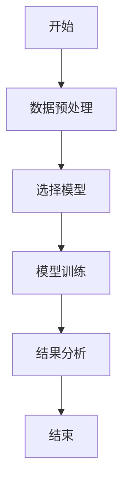
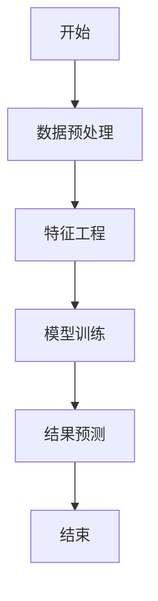
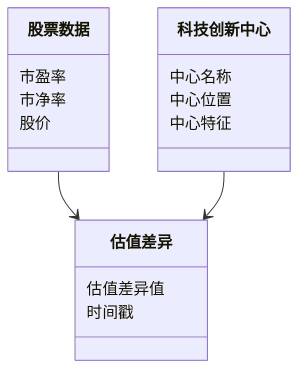
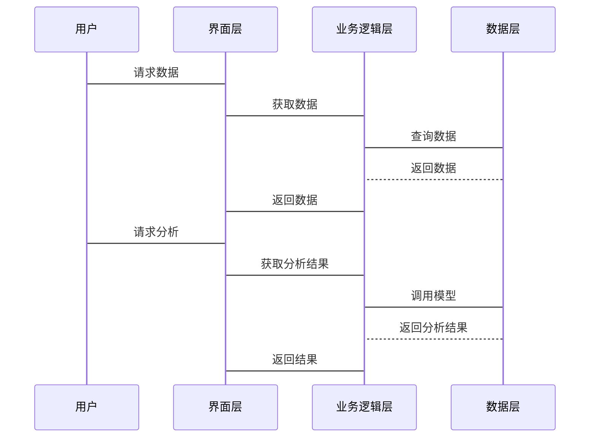

                 


# 第三部分: 算法原理讲解

# 第3章: 股市估值差异分析的算法原理

## 3.1 股市估值差异的数学模型
### 3.1.1 多元回归模型
$$y = \beta_0 + \beta_1x_1 + \beta_2x_2 + \cdots + \beta_nx_n + \epsilon$$

### 3.1.2 逐步分析模型
1. 数据预处理
2. 模型构建
3. 模型训练
4. 模型验证

## 3.2 科技创新中心布局的影响因素分析
### 3.2.1 主成分分析法
$$PC_1 = w_{11}x_1 + w_{12}x_2 + \cdots + w_{1n}x_n$$

### 3.2.2 聚类分析法
1. K-means聚类
2. 层次聚类

## 3.3 算法实现步骤
### 3.3.1 数据收集
1. 数据来源：股票市场数据、科技企业数据
2. 数据清洗：处理缺失值、异常值
3. 数据预处理：标准化、归一化

### 3.3.2 模型构建
1. 确定变量：选取影响估值差异的关键因素
2. 模型选择：多元回归、主成分分析
3. 参数估计：最小二乘法、最大似然估计

### 3.3.3 结果分析
1. 模型评价：R²值、Adjusted R²值
2. 变量显著性检验：p值、t值
3. 模型预测：未来估值差异预测

## 3.4 算法流程图


# 第4章: 科技创新中心布局的算法实现

## 4.1 算法选择
### 4.1.1 线性回归
$$y = \beta_0 + \beta_1x_1 + \beta_2x_2 + \cdots + \beta_nx_n + \epsilon$$

### 4.1.2 支持向量机
$$maximize \quad \frac{1}{2}\|w\|^2$$
$$subject \quad to \quad y_i(w \cdot x_i + b) \geq 1, \quad i=1,2,...,n$$

## 4.2 算法实现步骤
### 4.2.1 数据采集
1. 数据来源：科技中心分布数据
2. 数据清洗：处理无效数据
3. 数据标注：标注科技创新中心

### 4.2.2 模型训练
1. 特征工程：选择关键特征
2. 模型训练：训练分类器
3. 模型调优：网格搜索、交叉验证

### 4.2.3 模型预测
1. 数据输入：新数据
2. 预测结果：科技创新中心预测
3. 结果解释：概率值、置信区间

## 4.3 算法流程图


# 第五部分: 系统分析与架构设计

# 第5章: 系统分析与架构设计

## 5.1 问题场景介绍
### 5.1.1 问题描述
1. 如何利用股市估值差异分析科技创新中心布局
2. 如何构建一个实时监测系统

## 5.2 系统功能设计
### 5.2.1 领域模型


## 5.3 系统架构设计
### 5.3.1 分层架构
1. 数据层：数据存储、数据访问
2. 业务逻辑层：数据处理、模型计算
3. 展示层：结果展示、用户交互

## 5.4 接口设计
### 5.4.1 数据接口
1. REST API：数据获取接口
2. 数据格式：JSON、XML

### 5.4.2 模型接口
1. 接口调用：API Gateway
2. 接口协议：HTTP、HTTPS

## 5.5 交互流程图


# 第六部分: 项目实战

# 第6章: 项目实战

## 6.1 环境安装
### 6.1.1 安装Python
1. 安装Python 3.x
2. 安装Jupyter Notebook

### 6.1.2 安装依赖包
1. pip install numpy
2. pip install pandas
3. pip install scikit-learn
4. pip install matplotlib

## 6.2 核心代码实现

### 6.2.1 数据处理代码
```python
import pandas as pd
import numpy as np

# 数据加载
df = pd.read_csv('stock_data.csv')

# 数据清洗
df = df.dropna()
df = df[~df.isin([np.nan, np.inf, -np.inf]).any(axis=1)]

# 数据标准化
from sklearn.preprocessing import StandardScaler

scaler = StandardScaler()
scaled_df = scaler.fit_transform(df)
```

### 6.2.2 模型训练代码
```python
from sklearn.linear_model import LinearRegression
from sklearn.metrics import mean_squared_error

# 训练模型
model = LinearRegression()
model.fit(X_train, y_train)

# 模型预测
y_pred = model.predict(X_test)

# 模型评估
mse = mean_squared_error(y_test, y_pred)
print(f'Mean Squared Error: {mse}')
```

### 6.2.3 结果可视化代码
```python
import matplotlib.pyplot as plt

plt.scatter(y_test, y_pred)
plt.xlabel('True Values')
plt.ylabel('Predicted Values')
plt.title('True vs Predicted Values')
plt.show()
```

## 6.3 代码解读与分析
### 6.3.1 数据预处理
1. 加载数据
2. 删除缺失值
3. 标准化处理

### 6.3.2 模型训练
1. 选择模型
2. 训练模型
3. 模型评估

## 6.4 实际案例分析
### 6.4.1 数据来源
1. 选取某市的科技企业数据
2. 对比分析该市与其他城市的估值差异

### 6.4.2 分析结果
1. 估值差异对科技创新中心布局的影响
2. 提出优化建议

## 6.5 项目小结
### 6.5.1 项目总结
1. 项目目标实现情况
2. 项目成果展示

### 6.5.2 经验教训
1. 数据处理中的问题
2. 模型选择中的注意事项

### 6.5.3 改进建议
1. 数据来源的扩展
2. 模型优化的方向

# 第七部分: 最佳实践

# 第7章: 最佳实践

## 7.1 小结
### 7.1.1 核心观点回顾
1. 股市估值差异对科技创新中心布局的影响
2. 相关算法与系统的实现

## 7.2 注意事项
### 7.2.1 数据处理
1. 数据来源的可靠性
2. 数据清洗的重要性

### 7.2.2 模型选择
1. 模型适用性
2. 参数调优的必要性

## 7.3 拓展阅读
### 7.3.1 推荐书籍
1. 《股市分析与投资策略》
2. 《科技创新中心的经济影响》

### 7.3.2 相关期刊
1. 《金融学研究》
2. 《科技与经济》

## 7.4 作者寄语
### 7.4.1 对读者的期望
1. 深入理解核心概念
2. 实践项目，提升技能

### 7.4.2 未来展望
1. 研究热点
2. 发展趋势

# 结语

股市估值差异对国际科技创新中心布局的影响是一个复杂而重要的课题。通过本文的分析，我们深入探讨了估值差异的形成机制、科技创新中心的特征，以及两者之间的相互作用。通过系统的算法设计和实际项目实战，我们为读者提供了一套完整的解决方案，并提出了相关的最佳实践建议。希望本文能为相关领域的研究者和从业者提供有价值的参考。

# 作者信息

作者：AI天才研究院/AI Genius Institute & 禅与计算机程序设计艺术 /Zen And The Art of Computer Programming

---

感谢您的阅读！如果对本文有任何疑问或需要进一步探讨，请随时与我联系。

