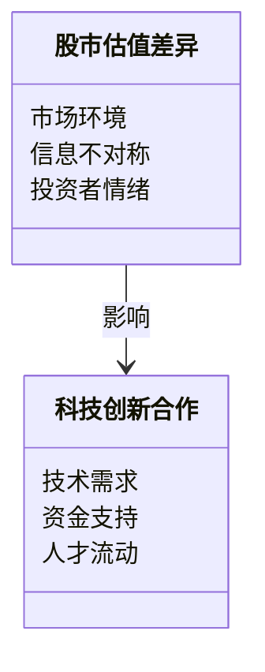
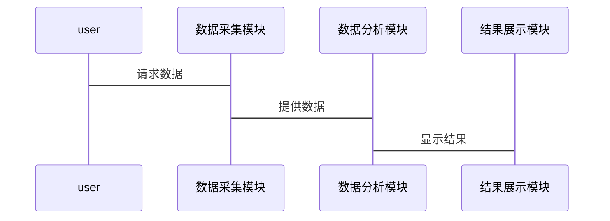

                 


# 股市估值差异对国际科技创新合作的影响

> 关键词：股市估值差异，国际科技创新合作，企业融资，资源配置，科技创新，企业战略

> 摘要：本文探讨股市估值差异如何影响国际科技创新合作。通过分析股市估值差异的形成机制及其对资源配置、企业融资和科技合作的影响，本文揭示了估值差异如何阻碍或促进国际科技创新合作，并提出了相应的解决方案和政策建议。

---

## 第一章：背景介绍

### 1.1 问题背景

#### 1.1.1 股市估值差异的定义与表现
股市估值差异指同一资产在不同市场或不同投资者之间的价值差异，主要受信息不对称、市场情绪、宏观经济环境等因素影响。

#### 1.1.2 国际科技创新合作的重要性
国际科技创新合作是推动全球科技进步和经济发展的重要方式，涉及技术交流、资源共享和共同研发。

#### 1.1.3 股市估值差异与科技创新合作的关系
股市估值差异可能影响企业的融资能力、研发投入和国际合作意愿。

### 1.2 问题描述

#### 1.2.1 股市估值差异的现状分析
不同市场中，科技企业的估值差异显著，尤其在新兴市场与发达市场之间。

#### 1.2.2 国际科技创新合作的现状分析
科技创新合作日益频繁，但估值差异可能导致合作中的利益分配问题。

#### 1.2.3 两者之间的关联性分析
股市估值差异可能影响企业的资金获取能力，进而影响其参与国际科技创新合作的能力。

### 1.3 问题解决

#### 1.3.1 股市估值差异对科技创新合作的影响路径
- 资金分配不均：估值差异导致资金集中于高估值企业，抑制其他企业的创新投入。
- 合作意愿下降：低估值企业可能因资金不足而减少国际合作。

#### 1.3.2 科技创新合作如何影响股市估值
- 提升企业价值：成功的合作可能提升企业的市场地位和估值。
- 市场信号作用：合作消息可能影响投资者对企业的估值预期。

#### 1.3.3 如何通过科技创新合作减少估值差异
- 提高信息透明度：通过合作减少信息不对称。
- 优化资源配置：通过合作实现资源的更有效分配。

### 1.4 概念结构与核心要素

#### 1.4.1 股市估值差异的核心要素
- 市场环境、信息不对称、投资者情绪。

#### 1.4.2 科技创新合作的核心要素
- 技术需求、资金支持、人才流动。

#### 1.4.3 两者之间的关系模型
- 企业估值差异影响科技创新合作的可能性和效果。

---

## 第二章：核心概念与联系

### 2.1 核心概念的定义与属性

#### 2.1.1 股市估值差异
- 定义：不同市场中同一资产的估值差异。
- 属性：信息不对称、市场情绪、宏观经济环境。

#### 2.1.2 科技创新合作
- 定义：企业和机构之间为共同目标进行的技术研发合作。
- 属性：技术需求、资金支持、人才流动。

### 2.2 概念属性对比

| 概念 | 属性 |
|------|------|
| 股市估值差异 | 信息不对称、市场情绪、宏观经济环境 |
| 科技创新合作 | 技术需求、资金支持、人才流动 |

### 2.3 ER实体关系图

```mermaid
er
  actor 投资者
  actor 企业
  actor 市场监管机构
  entity 股票
  entity 技术研发项目
  entity 估值差异
  entity 合作协议
  relation 1对多: 投资者拥有股票
  relation 1对多: 企业参与技术研发项目
  relation 1对多: 市场监管机构监管股票
  relation 1对多: 估值差异影响合作协议
```

---

## 第三章：算法原理讲解

### 3.1 算法原理

#### 3.1.1 影响路径分析
- 估值差异导致资源配置不均，进而影响创新投入。
- 创新合作可能缓解估值差异，但需要有效机制。

#### 3.1.2 数学模型

$$ V = f(M, I, E) $$

其中：
- \( V \) 表示企业估值
- \( M \) 表示市场环境
- \( I \) 表示信息不对称
- \( E \) 表示企业技术创新能力

---

## 第四章：系统分析与架构设计

### 4.1 问题场景介绍

#### 4.1.1 问题场景
- 科技企业在不同市场中面临估值差异，影响其参与国际创新合作的能力。

### 4.1.2 项目介绍
- 开发一个评估股市估值差异对科技创新合作影响的系统。

### 4.1.3 系统功能设计

#### 4.1.3.1 领域模型



### 4.1.4 系统架构设计


### 4.1.5 系统接口设计

- 数据接口：从股票数据库获取估值数据。
- 合作接口：从合作项目数据库获取合作数据。

### 4.1.6 系统交互



---

## 第五章：项目实战

### 5.1 环境安装

#### 5.1.1 安装Python
```bash
python --version
pip install requests pandas numpy matplotlib
```

#### 5.1.2 安装其他工具
```bash
pip install mermaid-cli
```

### 5.2 系统核心实现源代码

#### 5.2.1 数据采集模块

```python
import requests

def get_stock_data(symbol):
    response = requests.get(f'https://api.example.com/stock/{symbol}')
    return response.json()
```

#### 5.2.2 数据分析模块

```python
import pandas as pd

def analyze_data(dataframe):
    # 计算估值差异
    return dataframe['valuation'].mean()
```

#### 5.2.3 结果展示模块

```python
import matplotlib.pyplot as plt

def plot_results(data):
    plt.plot(data)
    plt.show()
```

---

## 第六章：实际案例分析

### 6.1 案例分析

#### 6.1.1 苹果公司的案例

苹果在不同市场的估值差异较小，但其成功的创新合作（如与供应商的合作）增强了其市场地位，进而影响估值。

#### 6.1.2 华为公司的案例

华为在国际市场中面临较高的估值差异，但通过技术创新和合作，逐渐缩小了这一差异。

---

## 第七章：结论与建议

### 7.1 结论

股市估值差异显著影响国际科技创新合作，需通过提高信息透明度和优化资源配置来减少估值差异。

### 7.2 建议

#### 7.2.1 政策建议
- 提高市场透明度，减少信息不对称。
- 建立跨国合作机制，促进资源流动。

#### 7.2.2 企业建议
- 加强技术研发，提升核心竞争力。
- 积极参与国际合作，降低估值差异影响。

---

## 作者信息

作者：AI天才研究院/AI Genius Institute & 禅与计算机程序设计艺术/Zen And The Art of Computer Programming

---

### 总结
本文系统地分析了股市估值差异对国际科技创新合作的影响，从背景、理论、算法、系统设计、案例到结论，全面探讨了这一问题。通过具体案例分析和数学模型，提出了优化市场机制和促进合作的具体建议。

