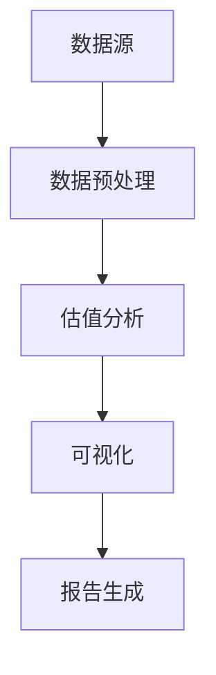

                 


# 股市估值差异对国际科技合作的影响

> 关键词：股市估值差异、国际科技合作、市场效率、信息不对称、协同效应

> 摘要：本文探讨了股市估值差异对国际科技合作的影响，分析了估值差异的形成原因及其对科技合作的多维度影响。通过对比分析和案例研究，揭示了估值差异如何影响国际科技合作的效率和资源配置，提出了优化建议。

---

## 第一部分：背景介绍

### 第1章：问题背景与概念解析

#### 1.1 股市估值差异的定义与特征

股市估值差异指的是不同市场或同一市场中不同股票之间的估值差异。这些差异源于市场效率、信息不对称、投资者行为等多种因素。理解这些差异是分析其对国际科技合作影响的基础。

1.1.1 股市估值的基本概念  
股市估值是通过市盈率、市净率等指标衡量股票价格与公司基本面之间的关系。这些指标反映了市场对公司的未来盈利能力的预期。

1.1.2 估值差异的形成机制  
估值差异主要由市场效率、信息不对称和投资者情绪等因素引起。例如，新兴市场的信息不透明可能导致估值偏差。

1.1.3 估值差异的度量方法  
常用的度量方法包括相对估值法（如市盈率差异）和绝对估值法（如现金流折现法）。

#### 1.2 国际科技合作的定义与模式

国际科技合作涉及跨国公司、研究机构和政府之间的合作，形式多样，包括技术转让、联合研发和合资企业。

1.2.1 科技合作的多维度解读  
科技合作不仅涉及技术交流，还包括知识共享和资源协同。这种合作能够促进技术进步和创新能力。

1.2.2 国际科技合作的主要模式  
包括直接投资、技术授权、联合研发和国际标准制定等。这些模式有助于降低研发成本，提高效率。

1.2.3 科技合作的经济影响  
通过协同效应和规模经济，科技合作可以降低研发成本，加速技术商业化。

#### 1.3 问题描述与研究意义

估值差异对科技合作的影响不容忽视。例如，高估值可能导致投资决策失误，影响合作项目的可行性。

1.3.1 问题描述  
股市估值差异可能导致资源配置不当，影响科技合作的效率和效果。

1.3.2 研究意义  
研究这一影响有助于优化资源配置，提升国际科技合作的效率，促进技术创新。

1.3.3 研究的边界与外延  
本文聚焦于股市估值差异对科技合作的影响，但未涉及企业内部管理和微观层面的具体操作。

#### 1.4 核心概念与联系

1.4.1 核心概念的属性特征对比表  

| 概念       | 属性特征                         |
|------------|----------------------------------|
| 股市估值差异 | 市场效率、信息不对称、投资者情绪 |
| 科技合作   | 技术协同、资源优化、知识共享      |

1.4.2 ER实体关系图  

```mermaid
erd
  table StockValuationDifferences {
    StockID primary key
    MarketID foreign key
    ValuationMetrics
    DifferenceValue
  }
  table TechnologyCooperation {
    ProjectID primary key
    PartnerID
    ValuationImpact
    CollaborationType
  }
  StockValuationDifferences --> TechnologyCooperation: 影响科技合作
```

---

## 第二部分：核心概念与联系

### 第2章：股市估值差异的核心概念

#### 2.1 股市估值差异的原理

2.1.1 市场效率与估值差异  
高效市场中信息透明，估值差异较小；低效市场中信息不对称，导致估值偏差。

2.1.2 信息不对称与估值偏差  
卖方和买方信息不对称可能导致估值差异，影响投资决策。

#### 2.2 科技合作的经济效应

2.2.1 科技合作的协同效应  
通过合作，企业可以共享资源，降低研发成本，加速技术开发。

2.2.2 科技合作的资源配置效率  
优化资源配置，提升技术商业化效率，促进经济增长。

#### 2.3 核心概念的关联性分析

2.3.1 估值差异与科技合作的互动关系  
估值差异影响科技合作的可行性，而科技合作反过来可能影响市场对科技公司的估值。

2.3.2 估值差异对科技合作的影响路径  
通过影响投资决策、资源配置和风险偏好，估值差异影响科技合作的效率和效果。

---

## 第三部分：算法原理讲解

### 第3章：估值差异

#### 3.1 估值差异的统计分析

3.1.1 数据收集与预处理  
收集不同市场的股票数据，处理缺失值和异常值。

3.1.2 估值差异的度量  
使用回归分析等统计方法，量化不同市场中的估值差异。

#### 3.2 基于回归分析的估值差异模型

3.2.1 回归分析的基本原理  
通过回归模型，分析影响估值差异的主要因素。

3.2.2 回归模型的建立与应用  

```python
import statsmodels.api as sm

# 假设X为自变量，y为因变量
X = sm.add_constant(X)
model = sm.OLS(y, X).fit()
print(model.summary())
```

3.2.3 案例分析  
以某科技公司为例，分析其在不同市场的估值差异，探讨影响因素。

---

## 第四部分：系统分析与架构设计

### 第4章：问题场景介绍

#### 4.1 系统功能设计

4.1.1 数据收集模块  
收集全球主要市场的股票数据，处理并存储。

4.1.2 估值分析模块  
计算估值差异，生成可视化报告。

#### 4.2 系统架构设计

4.2.1 模块划分与交互流程  
数据收集、分析、可视化和报告生成的流程设计。

4.2.2 架构图  



---

## 第五部分：项目实战

### 第5章：环境安装与核心代码实现

#### 5.1 环境安装

5.1.1 安装Python和相关库  
安装Pandas、NumPy、Matplotlib和StatsModels。

#### 5.2 核心代码实现

5.2.1 数据收集与处理代码  

```python
import pandas as pd
import numpy as np

# 数据收集
data = pd.read_csv('stock_data.csv')
# 数据处理
data.dropna(inplace=True)
data['valuation_diff'] = data['市盈率'] - data['行业平均市盈率']
```

5.2.2 估值差异分析代码  

```python
import statsmodels.api as sm

X = data[['市盈率', '行业平均市盈率']]
y = data['valuation_diff']
X = sm.add_constant(X)
model = sm.OLS(y, X).fit()
print(model.summary())
```

5.2.3 可视化代码  

```python
import matplotlib.pyplot as plt

plt.hist(data['valuation_diff'], bins=10, alpha=0.5)
plt.xlabel('估值差异')
plt.ylabel('频率')
plt.show()
```

#### 5.3 案例分析与结果解读

5.3.1 案例分析  
以某科技公司为例，分析其在不同市场的估值差异，探讨影响因素。

5.3.2 结果解读  
通过回归分析，识别主要影响估值差异的因素，并解释其对科技合作的影响。

---

## 第六部分：最佳实践

### 第6章：总结与展望

#### 6.1 总结

本文系统分析了股市估值差异对国际科技合作的影响，探讨了其形成原因和具体影响路径。通过统计分析和案例研究，揭示了估值差异对资源配置和科技合作效率的影响，并提出了优化建议。

#### 6.2 展望

未来研究可以进一步探讨其他因素，如政策环境和文化差异，对估值差异的影响，以及如何通过政策引导和市场机制优化资源配置，促进国际科技合作。

---

## 作者：AI天才研究院 & 禅与计算机程序设计艺术

---

以上是《股市估值差异对国际科技合作的影响》的技术博客文章大纲。

