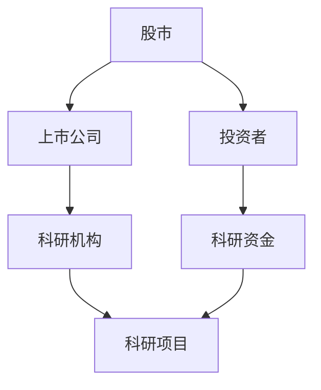
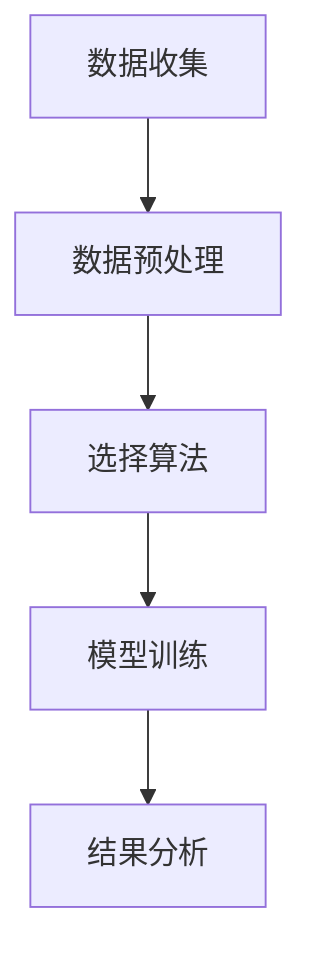
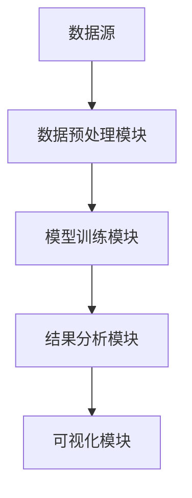

                 


# 股市估值差异对国际科研资金分配的影响

> 关键词：股市估值，科研资金分配，国际比较，数学模型，政策影响

> 摘要：本文探讨股市估值差异如何影响国际科研资金的分配。通过分析股市估值差异的核心概念、数学模型、算法原理和实际案例，揭示股市波动对科研投入的影响机制。结合系统架构设计和最佳实践，提出优化科研资金分配的策略。

---

## 第一部分：背景介绍

### 第1章：股市估值差异与科研资金分配的背景

#### 1.1 股市估值的基本概念
股市估值是衡量上市公司市场价值的重要指标，通常通过市盈率（P/E）、市净率（P/B）等指标来衡量。这些指标反映了市场对公司的信心和预期，也影响着企业的融资能力和科研投入能力。

#### 1.2 科研资金分配的现状
科研资金主要来源于政府拨款、企业投入和私人捐赠。国际间科研资金分配不均衡，发达国家占主导地位，发展中国家资金相对匮乏。科研资金的分配直接影响国家创新能力。

#### 1.3 股市估值差异与科研资金分配的关系
股市估值差异可能导致资金流向高增长地区，影响科研投入的地理分布。股市波动还可能通过资本流动影响科研资金的分配。

---

### 第2章：核心概念与联系

#### 2.1 核心概念原理
- **股市估值差异**：不同地区股市表现差异导致资本流向变化。
- **科研资金分配**：受经济实力、政策支持和市场环境影响。

#### 2.2 概念属性特征对比
| 概念      | 属性               | 特征描述                             |
|-----------|--------------------|--------------------------------------|
| 股市估值差异 | 影响因素          | 经济政策、市场信心、企业盈利       |
| 科研资金分配 | 主要来源          | 政府拨款、企业投入、私人捐赠       |

#### 2.3 ER实体关系图


---

## 第二部分：算法原理讲解

### 第3章：算法原理讲解

#### 3.1 算法原理
- **回归分析**：用于分析股市估值与科研资金之间的关系。
- **时间序列分析**：研究股市波动对科研资金分配的长期影响。

#### 3.2 算法流程图


#### 3.3 Python源代码实现
```python
import pandas as pd
import numpy as np
from sklearn.linear_model import LinearRegression

# 数据加载与预处理
data = pd.read_csv('research_funding.csv')
data['log_revenue'] = np.log(data['revenue'])

# 模型训练
model = LinearRegression()
model.fit(data[['log_revenue', 'market_val']], data['funding'])

# 结果分析
print('Coefficients:', model.coef_)
```

---

## 第三部分：数学模型和公式

### 第4章：数学模型和公式

#### 4.1 科研资金分配模型
$$ \text{科研资金} = \beta_0 + \beta_1 \times \text{GDP} + \beta_2 \times \text{市场信心} + \epsilon $$

#### 4.2 股市估值与科研资金关系模型
$$ \text{市场信心} = \alpha_0 + \alpha_1 \times \text{利润增长率} + \alpha_2 \times \text{行业风险} + \epsilon $$

---

## 第四部分：系统分析与架构设计

### 第5章：系统分析与架构设计

#### 5.1 问题场景介绍
分析股市波动对科研资金分配的影响，构建模型预测资金流动。

#### 5.2 系统架构设计


---

## 第五部分：项目实战

### 第6章：项目实战

#### 6.1 环境安装
安装必要的Python库，如Pandas、NumPy、Scikit-learn。

#### 6.2 核心实现代码
```python
import pandas as pd
import numpy as np
from sklearn.linear_model import LinearRegression

# 数据加载与预处理
data = pd.read_csv('research_funding.csv')
data['log_revenue'] = np.log(data['revenue'])

# 模型训练
model = LinearRegression()
model.fit(data[['log_revenue', 'market_val']], data['funding'])

# 结果分析
print('Coefficients:', model.coef_)
```

#### 6.3 案例分析
分析美国股市波动对科研资金的影响，展示模型的应用和结果。

---

## 第六部分：总结与展望

### 第7章：总结与展望

#### 7.1 最佳实践
建议优化科研资金分配政策，促进资本合理流动。

#### 7.2 小结
股市估值差异显著影响科研资金分配，需加强政策引导和市场调控。

#### 7.3 注意事项
模型假设需验证，数据质量影响结果准确性。

---

# 作者：AI天才研究院 & 禅与计算机程序设计艺术

