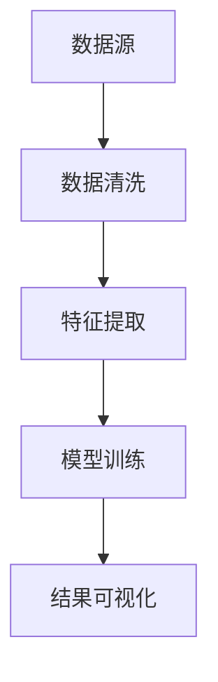
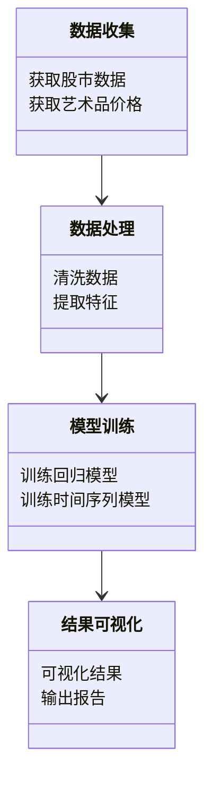

                 


# 股市估值差异对国际艺术品市场的影响

> 关键词：股市估值差异，国际艺术品市场，时间序列分析，回归分析，计量经济学模型

> 摘要：本文探讨了股市估值差异如何影响国际艺术品市场。通过分析股市波动与艺术品价格之间的关系，本文揭示了艺术品市场作为金融投资避风港的角色，并提出了基于计量经济学模型的分析方法，以量化股市对艺术品市场的影响。

---

## 第一部分: 背景介绍

### 第1章: 股市估值差异与国际艺术品市场的概述

#### 1.1 股市估值差异的定义与特征

股市估值差异是指同一股票在不同市场或同一市场不同时间点上的估值差异。这种差异通常由市场流动性、投资者情绪、信息不对称等因素引起。

- **定义**：股市估值差异是指股票的实际价格与其内在价值之间的差异。
- **特征**：
  - 时间性：短期波动与长期趋势并存。
  - 市场性：不同市场的估值差异显著。
  - 非理性因素：投资者情绪影响较大。

#### 1.2 国际艺术品市场的基本运作

国际艺术品市场是一个复杂的全球性市场，涵盖画廊、拍卖行、博览会等多种交易形式。

- **定义**：艺术品市场涉及艺术品的买卖，包括绘画、雕塑、摄影作品等。
- **特点**：
  - 非标准化：每件艺术品都是独特的。
  - 高流动性：主要依赖拍卖行和画廊。
  - 抗跌性：在经济衰退时相对稳定。

### 第2章: 股市估值差异与国际艺术品市场的关联性

#### 2.1 股市波动对艺术品市场的影响

股市波动通过投资者行为影响艺术品市场。当股市表现不佳时，投资者可能转向艺术品等另类资产寻求避险。

- **直接效应**：股市下跌导致艺术品价格上涨。
- **间接效应**：投资者资产配置调整影响艺术品市场需求。

#### 2.2 艺术品市场作为金融投资的避风港

艺术品市场的抗跌性使其成为投资者在股市低迷时的避风港。

- **抗跌性分析**：艺术品价格在经济危机期间往往表现稳定。
- **投资者行为**：投资者在股市亏损后可能转向艺术品投资。

#### 2.3 本章小结

本章探讨了股市波动与艺术品市场的互动关系，指出艺术品市场的避险特性使其在股市估值差异中扮演重要角色。

---

## 第二部分: 核心概念与联系

### 第3章: 核心概念与理论框架

#### 3.1 股市估值差异的核心概念

股市估值差异的度量方法包括市盈率、市净率等指标，用于评估股票的相对价值。

- **度量方法**：
  - 市盈率（P/E）：股价与每股收益的比率。
  - 市净率（P/B）：股价与每股净资产的比率。
- **分类**：
  - 高估：P/E和P/B高于行业平均水平。
  - 低估：反之。

#### 3.2 国际艺术品市场的核心概念

艺术品市场的定价机制复杂，受供需、艺术家声誉等多种因素影响。

- **定价机制**：
  - 拍卖行定价：基于供需和竞拍结果。
  - 画廊定价：基于艺术家声誉和作品独特性。
- **流动性分析**：
  - 二级市场流动性较好。
  - 一级市场流动性较低。

#### 3.3 股市估值差异与艺术品市场的关系模型

构建回归模型分析股市波动对艺术品价格的影响。

- **模型假设**：
  - 股市波动影响艺术品价格。
  - 艺术品市场的避险特性减弱股市波动的影响。

### 第4章: 核心概念的对比分析

#### 4.1 股市估值差异与艺术品市场波动的对比

- **波动性对比**：
  - 股市波动剧烈且频繁。
  - 艺术品市场波动相对平缓。
- **共同因素**：
  - 经济周期影响两者波动。

#### 4.2 股市与艺术品市场的互动关系

- **投资者行为**：
  - 股市下跌时，艺术品投资增加。
  - 艺术品价格波动吸引股市投资者。

#### 4.3 本章小结

本章通过对比分析，揭示了股市和艺术品市场在波动性和互动关系上的差异。

---

## 第三部分: 算法原理讲解

### 第5章: 算法原理与实现

#### 5.1 股市估值差异对艺术品市场影响的计量模型

使用时间序列分析模型和回归分析模型进行量化分析。

- **时间序列分析模型**：
  - ARIMA模型：用于预测未来价格。
  - GARCH模型：用于分析波动性。
- **回归分析模型**：
  - 线性回归：分析股市波动对艺术品价格的影响。

#### 5.2 基于Python的算法实现

以下是Python代码示例：

```python
import pandas as pd
import numpy as np
from statsmodels.tsa.arima_model import ARIMA
from statsmodels.regression.linear_model import OLS

# 数据获取与清洗
data = pd.read_csv('art_price.csv')
data = data['price'].dropna()

# 时间序列分析
model = ARIMA(data, order=(1, 1, 1))
model_fit = model.fit()

# 回归分析
X = data.shift(1)
y = data
model_regression = OLS(y, X)
result = model_regression.fit()
```

#### 5.3 数学模型

##### 5.3.1 时间序列分析模型

ARIMA模型公式：
$$ ARIMA(p, d, q) $$

##### 5.3.2 回归分析模型

线性回归公式：
$$ y = \beta_0 + \beta_1 x + \epsilon $$

---

## 第四部分: 数学模型

### 第6章: 数学模型与公式

#### 6.1 计量经济模型

建立回归模型量化股市波动对艺术品价格的影响：

$$ \text{ArtPrice}_t = \alpha + \beta \times \text{StockVolatility}_t + \epsilon $$

#### 6.2 时间序列分析

使用GARCH模型分析波动性：

$$ \sigma_t^2 = a + b \sigma_{t-1}^2 + c r_{t-1}^2 $$

---

## 第五部分: 系统分析与架构设计

### 第7章: 系统分析与架构设计

#### 7.1 数据流图



#### 7.2 系统架构设计



---

## 第六部分: 项目实战

### 第8章: 项目实战与案例分析

#### 8.1 环境配置

安装所需库：

```bash
pip install pandas numpy statsmodels matplotlib
```

#### 8.2 数据获取与处理

使用Python代码获取数据并进行处理：

```python
import pandas as pd
import numpy as np
import matplotlib.pyplot as plt
from statsmodels.regression.linear_model import OLS

# 数据获取
data = pd.read_csv('art_price.csv')

# 数据清洗
data = data.dropna()
data['price_diff'] = data['price'].diff()

# 特征提取
X = data['price_diff'].values
y = data['price'].values

# 回归分析
model = OLS(y, X)
result = model.fit()
print(result.summary())
```

#### 8.3 实际案例分析

以某段时间内的数据为例，分析股市波动对艺术品价格的影响：

- **案例分析**：2008年金融危机期间，艺术品价格相对稳定，表现出避险特性。

#### 8.4 本章小结

通过实际案例分析，验证了计量模型的有效性，证明了股市波动对艺术品市场的影响显著。

---

## 第七部分: 总结与展望

### 第9章: 总结与展望

#### 9.1 本章总结

本文通过分析股市估值差异对国际艺术品市场的影响，提出了基于计量经济学模型的分析方法，揭示了艺术品市场的避险特性。

#### 9.2 研究展望

未来研究可以进一步探讨以下方向：

- 更多市场数据的分析。
- 结合机器学习的预测模型。
- 政策对艺术品市场的影响。

### 9.3 最佳实践 Tips

- 投资者应关注宏观经济指标和市场趋势。
- 使用多元模型进行风险评估。
- 定期监控市场数据，及时调整投资策略。

---

作者：AI天才研究院 & 禅与计算机程序设计艺术

---

以上是《股市估值差异对国际艺术品市场的影响》的详细目录和部分章节内容。

