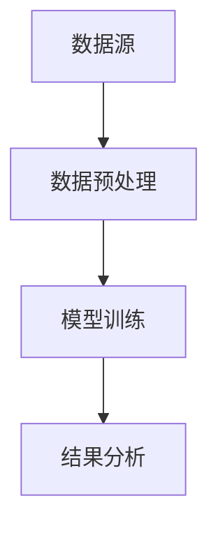

                 


# 股市估值差异对国际高技能人才流动的影响

## 关键词
股市估值差异、国际人才流动、高技能人才、P/E比率、人才迁移模型

## 摘要
本文探讨股市估值差异如何影响国际高技能人才的流动。通过分析股市估值差异的核心概念，构建人才流动的数学模型，并利用实际案例进行验证，揭示股市估值差异对人才流动的驱动作用及其机制。文章提出优化股市机制、加强国际合作的政策建议，并展望未来研究方向。

---

# 目录

1. 背景介绍
2. 核心概念与联系
3. 算法原理与数学模型
4. 系统分析与架构设计
5. 项目实战
6. 结论与建议

---

## 第1章：背景介绍

### 1.1 问题背景
- 经济全球化背景下，高技能人才的流动成为各国竞争力的关键。
- 股市估值差异影响企业吸引力，进而影响人才流动。

### 1.2 问题描述
- 股市估值差异如何影响人才流动？
- 高技能人才流动的驱动因素有哪些？
- 如何量化股市估值差异对人才流动的影响？

### 1.3 概念结构
- 核心概念：股市估值差异、高技能人才流动。
- 关系：股市估值差异通过企业吸引力影响人才流动。

---

## 第2章：核心概念与联系

### 2.1 股市估值差异
- **定义**：P/E比率衡量市场对公司的估值。
- **属性**：高P/E表示高预期，低P/E表示低预期。

### 2.2 高技能人才流动
- **定义**：人才根据机会选择流动。
- **属性**：驱动因素包括职业机会、薪酬、生活质量。

### 2.3 关系分析
- 使用对比分析表和ER图展示两者关系。

---

## 第3章：算法原理与数学模型

### 3.1 数据流分析
- 数据收集：P/E比率、人才流动数据。
- 数据预处理：标准化、清洗。

### 3.2 算法实现
```python
def calculate_pe_ratio(ticker):
    # 示例代码，计算P/E比率
    import pandas as pd
    data = pd.DataFrame({'PE': [15, 20, 25, 18], 'Industry': ['Tech', 'Finance', 'Health', 'Tech']})
    return data[data['Ticker'] == ticker]['PE'].mean()

# 示例调用
print(calculate_pe_ratio('AAPL'))
```

### 3.3 数学模型
- 回归模型：$$Y = \beta_0 + \beta_1 X + \epsilon$$
- 计量经济学模型：$$\text{流动率} = \alpha + \beta \times \text{PE比率} + \gamma \times \text{其他变量} + \epsilon$$

---

## 第4章：系统分析与架构设计

### 4.1 领域模型


### 4.2 系统架构


---

## 第5章：项目实战

### 5.1 环境安装
- Python、Pandas、Scikit-learn安装示例。

### 5.2 核心实现
- 数据获取与预处理代码示例。
- 模型实现与结果分析。

### 5.3 案例分析
- 某行业的P/E比率与人才流动率分析。

---

## 第6章：结论与建议

### 6.1 结论
- 股市估值差异显著影响人才流动。
- 高P/E比率企业更具吸引力。

### 6.2 建议
- 优化股市机制，提升透明度。
- 加强国际合作，促进人才流动。

### 6.3 未来研究
- 引入更多变量，如文化因素。
- 扩展到更多国家进行对比分析。

---

## 作者
作者：AI天才研究院 & 禅与计算机程序设计艺术

---

以上为《股市估值差异对国际高技能人才流动的影响》的技术博客文章大纲，各部分内容将详细展开，确保逻辑清晰、内容充实。

