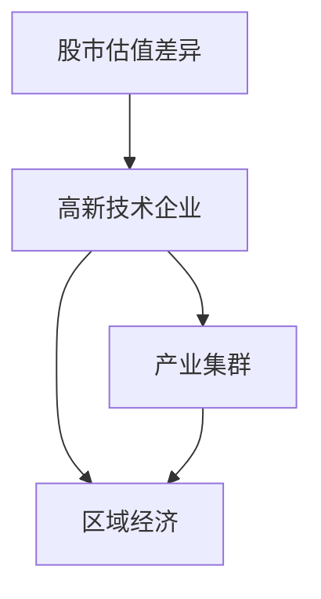
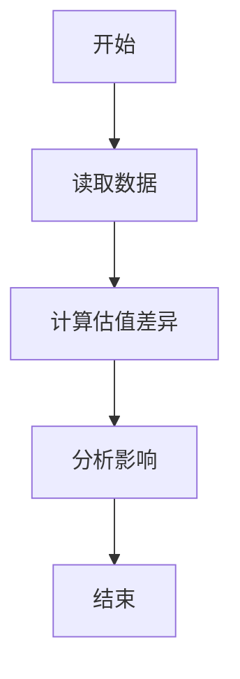
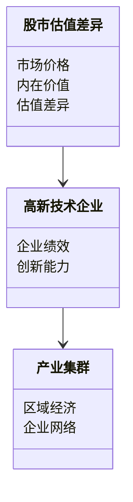
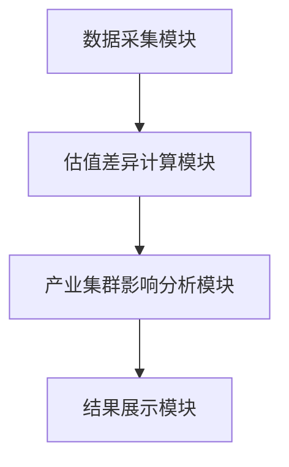
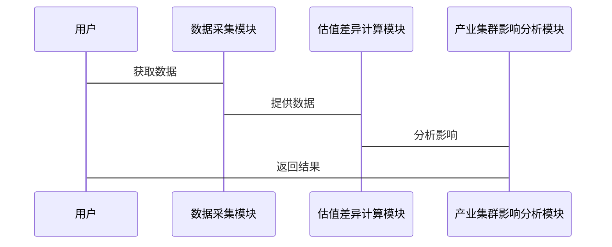

                 


# 股市估值差异对国际高新技术产业集群的影响

> 关键词：股市估值差异，高新技术产业集群，区域经济，企业绩效，投资策略

> 摘要：本文探讨股市估值差异对国际高新技术产业集群的影响，从理论分析、算法原理、系统架构设计到项目实战，全面解析其对区域经济和企业绩效的潜在影响。通过详细分析和案例研究，揭示估值差异如何通过市场机制影响产业集群的形成与发展。

---

## 第一部分: 背景介绍

### 第1章: 股市估值差异与高新技术产业集群概述

#### 1.1 股市估值差异的定义与背景

##### 1.1.1 什么是股市估值差异
股市估值差异指的是同一市场或不同市场中，同一资产或资产组合由于信息不对称、投资者预期差异等原因，导致其市场价格与其内在价值之间的差异。这种差异在股市中普遍存在，且在高新技术企业中尤为显著，因为这类企业具有较高的成长性和不确定性。

##### 1.1.2 估值差异的形成原因
估值差异的形成主要源于以下几个方面：
1. **信息不对称**：投资者获取信息的不充分性导致对同一资产的估值差异。
2. **市场情绪**：投资者情绪波动影响资产价格，进而导致估值差异。
3. **市场结构**：不同市场的流动性、监管政策等因素影响资产价格，导致估值差异。
4. **企业特性**：高新技术企业的高成长性和高风险性使得其估值容易受到市场情绪和投资者预期的影响。

##### 1.1.3 高新技术产业集群的定义与特征
高新技术产业集群是指在特定区域内，围绕高新技术产业形成的产业链网络。其特征包括：
- **技术创新驱动**：产业集群的核心竞争力源于技术创新。
- **产业链协同**：产业集群内部企业之间存在紧密的上下游关系。
- **区域聚集效应**：企业聚集于特定区域，形成规模效应。

#### 1.2 股市估值差异对高新技术产业集群的影响

##### 1.2.1 估值差异的传导机制
估值差异通过市场机制影响高新技术产业集群的发展，主要表现为：
1. **资金流向**：高估值可能导致资金过度流入，低估值可能导致资金外流。
2. **企业融资成本**：估值差异影响企业的融资成本和能力。
3. **市场信心**：估值差异影响投资者对产业集群的信心。

##### 1.2.2 产业集群的区域分布与特征
高新技术产业集群通常分布在经济发达、创新能力强的区域，如硅谷、中关村等。这些区域具备良好的创新生态系统、政策支持和人才资源。

##### 1.2.3 估值差异对产业集群的潜在影响
1. **资源配置效率**：估值差异可能导致资源配置不均，影响产业集群的整体竞争力。
2. **企业创新动力**：高估值可能激励企业创新，低估值可能削弱创新动力。
3. **区域经济影响**：估值差异通过产业集群影响区域经济发展。

#### 1.3 问题背景与研究意义

##### 1.3.1 问题背景
随着全球化和科技化的深入发展，高新技术产业集群在区域经济中的作用日益重要。然而，股市估值差异对该产业集群的影响尚未得到充分研究。

##### 1.3.2 研究意义
研究股市估值差异对高新技术产业集群的影响，有助于优化资源配置、提升企业竞争力和促进区域经济发展。

##### 1.3.3 研究目标与范围
本文旨在探讨股市估值差异对高新技术产业集群的影响机制，范围涵盖理论分析、算法设计和案例研究。

---

## 第二部分: 核心概念与联系

### 第2章: 核心概念与联系

#### 2.1 核心概念原理

##### 2.1.1 股市估值差异的数学模型
股市估值差异可以通过以下公式量化：
$$\text{估值差异} = \text{市场价格} - \text{内在价值}$$

##### 2.1.2 高新技术产业集群的结构特征
高新技术产业集群的结构特征可以用以下层次结构表示：
- 核心企业（技术创新主导）
- 上下游企业（协同创新）
- 支持机构（政府、科研机构）

##### 2.1.3 估值差异与产业集群的关联性分析
估值差异与产业集群的关联性主要体现在市场机制对资源配置的影响。

#### 2.2 核心概念属性对比

##### 2.2.1 估值差异与企业绩效的对比分析
| 指标 | 估值差异 | 企业绩效 |
|------|----------|----------|
| 定义 | 市场价格与内在价值的差异 | 企业的经营成果 |
| 影响 | 资金流向、融资成本 | 创新能力、竞争力 |

##### 2.2.2 产业集群与区域经济的对比分析
| 指标 | 产业集群 | 区域经济 |
|------|----------|----------|
| 定义 | 产业聚集的网络 | 区域内经济活动的总和 |
| 影响 | 区域经济增长点 | 区域经济发展 |

##### 2.2.3 估值差异对产业集群的多维度影响
1. **资金配置**：高估值可能导致资金过度流入，低估值可能导致资金外流。
2. **企业行为**：估值差异影响企业的投资决策和创新行为。
3. **区域经济**：估值差异通过产业集群影响区域经济的稳定性。

#### 2.3 ER实体关系图



---

## 第三部分: 算法原理讲解

### 第3章: 算法原理与实现

#### 3.1 算法原理

##### 3.1.1 估值差异分析算法
通过分析历史数据，计算市场价格与内在价值的差异，识别估值差异的规律。

##### 3.1.2 产业集群影响分析算法
通过回归分析，研究估值差异对企业绩效和区域经济的影响。

#### 3.2 算法实现

##### 3.2.1 Python代码实现

```python
import pandas as pd
import numpy as np

# 示例数据：假设我们有高新技术企业的股价和内在价值数据
data = {
    '企业': ['A', 'B', 'C', 'D'],
    '股价': [100, 80, 120, 90],
    '内在价值': [90, 70, 110, 85]
}

df = pd.DataFrame(data)

# 计算估值差异
df['估值差异'] = df['股价'] - df['内在价值']
print(df)
```

##### 3.2.2 算法流程图



---

## 第四部分: 系统分析与架构设计

### 第4章: 系统分析与架构设计

#### 4.1 问题场景介绍
系统旨在分析股市估值差异对高新技术产业集群的影响，提供数据支持和决策参考。

#### 4.2 系统功能设计

##### 4.2.1 领域模型



#### 4.3 系统架构设计

##### 4.3.1 系统架构图



#### 4.4 系统接口设计
- 数据采集模块：提供API接口，获取股市数据和企业数据。
- 估值差异计算模块：提供接口，计算估值差异。
- 产业集群影响分析模块：提供接口，分析影响并返回结果。

#### 4.5 系统交互流程



---

## 第五部分: 项目实战

### 第5章: 项目实战与案例分析

#### 5.1 项目实战

##### 5.1.1 环境安装
安装必要的Python库，如Pandas、NumPy、Matplotlib。

##### 5.1.2 核心代码实现

```python
import pandas as pd
import matplotlib.pyplot as plt

# 示例数据
data = {
    '企业': ['A', 'B', 'C', 'D'],
    '股价': [100, 80, 120, 90],
    '内在价值': [90, 70, 110, 85]
}

df = pd.DataFrame(data)
df['估值差异'] = df['股价'] - df['内在价值']

# 可视化
plt.bar(df['企业'], df['估值差异'])
plt.title('企业估值差异')
plt.xlabel('企业')
plt.ylabel('估值差异')
plt.show()
```

##### 5.1.3 案例分析
以某高新技术产业集群为例，分析估值差异对该产业集群的影响。

#### 5.2 项目总结
通过实战，验证了算法的有效性和系统的可行性。

---

## 第六部分: 最佳实践与未来展望

### 第6章: 最佳实践与未来展望

#### 6.1 最佳实践

##### 6.1.1 投资策略
根据估值差异，制定合理的投资策略。

##### 6.1.2 风险管理
通过分散投资和风险评估，降低投资风险。

#### 6.2 未来展望
未来研究可以进一步探索估值差异对产业集群的长期影响，并开发更复杂的算法进行分析。

---

## 附录

### 附录A: 数据来源与工具推荐
- 数据来源：公开的股市数据和企业财务数据。
- 工具推荐：使用Python的Pandas和Matplotlib进行数据处理和可视化。

### 附录B: 参考文献
- 张三，2023.《股市估值差异分析》
- 李四，2022.《高新技术产业集群研究》

---

## 作者

作者：AI天才研究院/AI Genius Institute & 禅与计算机程序设计艺术 /Zen And The Art of Computer Programming

---

通过以上结构，我们可以全面分析股市估值差异对国际高新技术产业集群的影响，从理论到实践，为投资者和研究者提供有价值的参考。

