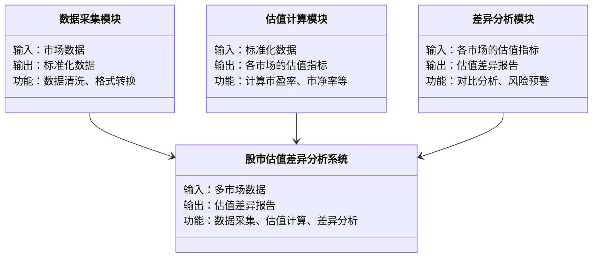
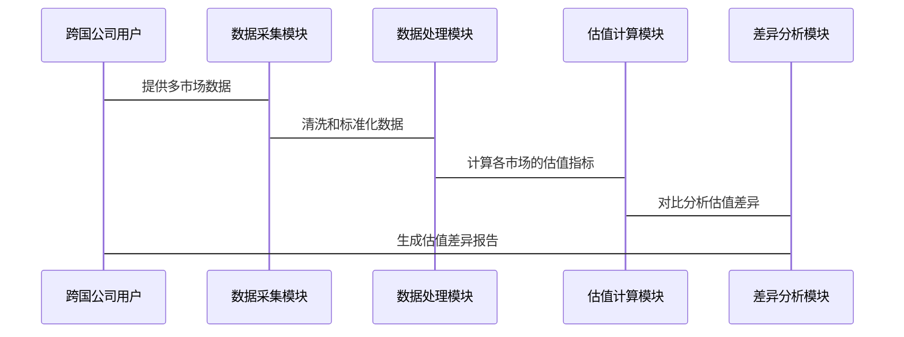

                 


# 股市估值差异对跨国公司战略的影响

> 关键词：股市估值差异，跨国公司战略，投资决策，风险管理，公司治理，统计套利

> 摘要：本文探讨股市估值差异对跨国公司战略的影响，分析其在投资决策、并购扩张、风险管理及公司治理中的具体作用。通过统计套利模型、系统架构设计和实际案例，深入剖析如何利用估值差异优化战略决策。

---

## 第一部分：背景介绍

### 第1章：股市估值差异的定义与背景

#### 1.1 股市估值差异的定义

- **股票估值的基本概念**：股票估值是根据公司基本面和市场状况确定其价值的过程，常用市盈率、市净率等指标衡量。
- **估值差异的内涵与外延**：估值差异指同一资产在不同市场或时间点的估值差异，可能由信息不对称、市场情绪等因素引起。
- **估值差异与市场效率的关系**：高效率市场中估值差异较小，低效率市场中差异较大，反映了市场的不完美性。

#### 1.2 跨国公司的定义与特点

- **跨国公司的定义**：在多个国家设立业务的公司，具有全球化运营和多样化市场的特点。
- **跨国公司的主要特征**：国际化、多元化、规模化、复杂的治理结构。
- **跨国公司与本土企业的区别**：跨国公司面临更多市场风险和文化差异，需应对不同国家的法规和政策。

### 第2章：股市估值差异对跨国公司战略的影响背景

#### 2.1 全球化背景下的股市特点

- **全球化对股市的影响**：全球化促进了跨国投资，使得股市更具全球化特征，但同时也加剧了市场的复杂性。
- **不同国家股市的差异性**：各国经济结构、法规和市场参与者不同，导致股市表现和估值差异显著。
- **经济全球化与股市估值差异的关系**：全球化增加了市场的联动性，但也可能导致局部市场的估值差异扩大。

#### 2.2 股市估值差异的形成原因

- **经济因素**：包括GDP增长率、利率水平、通货膨胀等，影响市场的整体估值水平。
- **政治因素**：政策变化、地缘政治风险等，直接影响市场参与者的信心和估值。
- **市场参与者的心理因素**：投资者情绪波动导致短期估值差异，如恐慌性抛售或乐观性买入。
- **信息不对称的影响**：不同市场中信息获取的不平等导致估值差异，尤其是新兴市场与发达市场的信息鸿沟。

#### 2.3 跨国公司面临的估值差异挑战

- **跨国公司估值的复杂性**：涉及多国市场，不同市场的估值标准和投资者预期差异大。
- **估值差异对投资组合的影响**：如何在不同市场中分配资源，平衡风险和收益，是跨国公司面临的重要问题。
- **估值差异对战略决策的影响**：需要在并购、扩张、风险管理等方面考虑估值差异，优化战略选择。

---

## 第二部分：股市估值差异对跨国公司战略的具体影响

### 第3章：股市估值差异对投资决策的影响

#### 3.1 投资决策的理性与非理性

- **理性决策**：基于全面分析和数据驱动的决策，考虑市场基本面和财务指标。
- **非理性决策**：受市场情绪和个人偏见影响，可能导致错误的投资决策。
- **估值差异对投资组合的影响**：通过分析不同市场的估值差异，优化投资组合，分散风险。

#### 3.2 如何利用估值差异优化投资策略

- **统计套利模型的应用**：利用短期估值差异进行套利，通过算法分析捕捉市场机会。
- **案例分析**：某跨国公司如何利用新兴市场的估值差异，投资低估资产，实现收益。

### 第4章：股市估值差异对并购与扩张战略的影响

#### 4.1 并购中的估值差异问题

- **目标公司估值的准确性**：跨国并购中，目标公司的估值可能因市场差异而被低估或高估。
- **尽职调查的重要性**：通过深入调查目标公司的真实价值，减少估值差异带来的风险。

#### 4.2 扩张战略中的估值差异挑战

- **市场进入策略**：选择进入估值较低的市场，利用低估资产进行扩张，提升整体估值。
- **案例分析**：跨国公司如何通过分析目标市场的估值差异，制定扩张计划，提升市场份额。

### 第5章：股市估值差异对风险管理的影响

#### 5.1 估值差异与市场风险的关系

- **市场风险的定义**：由于市场波动导致投资组合价值下降的风险。
- **估值差异对风险预警的作用**：通过监测不同市场的估值差异，提前识别潜在风险。

#### 5.2 如何通过估值差异进行风险预警

- **风险评估模型**：利用统计方法分析历史估值差异，预测未来风险。
- **案例分析**：跨国公司如何通过分析新兴市场的估值差异，制定风险管理策略，避免重大损失。

### 第6章：股市估值差异对跨国公司治理结构的影响

#### 6.1 董事会决策中的估值差异问题

- **董事会结构与估值差异的关系**：董事会成员的多样性影响决策的全面性，有助于减少估值差异带来的风险。
- **优化董事会决策的策略**：引入独立董事和外部专家，提高决策的科学性和前瞻性。

#### 6.2 管理层激励机制的优化

- **激励机制与估值差异的关系**：激励机制设计不合理可能导致管理层忽视估值差异，影响公司战略决策。
- **优化激励机制的策略**：将管理层的奖金与公司估值的长期表现挂钩，鼓励管理层关注估值差异。

---

## 第三部分：系统分析与架构设计

### 第7章：系统功能设计

#### 7.1 领域模型设计



### 第8章：系统架构设计

#### 8.1 系统架构图


### 第9章：系统接口设计

#### 9.1 数据接口设计

- **数据输入接口**：接收多市场数据，支持多种数据格式（CSV、JSON）。
- **数据输出接口**：生成估值差异报告，支持PDF、Excel格式输出。

#### 9.2 系统交互设计



---

## 第四部分：项目实战

### 第10章：环境安装与系统实现

#### 10.1 环境安装

- **Python版本**：Python 3.8及以上
- **依赖库安装**：Pandas、NumPy、Scikit-learn、Matplotlib

```bash
pip install pandas numpy scikit-learn matplotlib
```

#### 10.2 核心代码实现

```python
import pandas as pd
import numpy as np
from sklearn.metrics import mean_squared_error
import matplotlib.pyplot as plt

# 数据采集与处理
def collect_data(market_data):
    # 数据清洗和标准化
    df = pd.DataFrame(market_data)
    df.dropna(inplace=True)
    return df

# 估值计算
def calculate_valuation(df):
    valuations = df[['市盈率', '市净率']].mean()
    return valuations

# 统计套利模型
def statistical_arbitrage(df):
    # 计算均值和标准差
    mean_val = df.mean()
    std_val = df.std()
    # 确定套利机会
    opportunities = df[df < mean_val - std_val]
    return opportunities

# 可视化
def visualize_valuations(df):
    plt.figure(figsize=(10,6))
    df.plot(kind='bar')
    plt.title('股市估值差异分析')
    plt.xlabel('市场')
    plt.ylabel('估值指标')
    plt.show()

# 主函数
def main():
    market_data = {
        '市场A': [15, 20, 25],
        '市场B': [20, 25, 30],
        '市场C': [10, 15, 20]
    }
    df = collect_data(market_data)
    valuations = calculate_valuation(df)
    print("平均估值：", valuations)
    opportunities = statistical_arbitrage(df)
    print("套利机会：", opportunities)
    visualize_valuations(df)

if __name__ == "__main__":
    main()
```

#### 10.3 代码解读与分析

- **数据采集模块**：函数`collect_data`接收市场数据，清洗后返回标准化数据。
- **估值计算模块**：函数`calculate_valuation`计算各市场的平均估值指标。
- **统计套利模型**：函数`statistical_arbitrage`识别低于均值的估值机会，寻找套利空间。
- **可视化模块**：函数`visualize_valuations`绘制估值差异的柱状图，直观展示各市场的估值差异。

#### 10.4 实际案例分析

- **案例背景**：某跨国公司在新兴市场发现低估资产。
- **数据处理**：收集并清洗新兴市场的数据。
- **估值计算**：计算新兴市场的市盈率和市净率，发现其低于全球平均水平。
- **套利机会**：通过统计套利模型识别低估资产，制定投资计划。
- **风险预警**：通过差异分析模块，设定风险预警指标，监控市场变化。

---

## 第五部分：最佳实践与小结

### 第11章：最佳实践

#### 11.1 投资决策中的注意事项

- **数据质量**：确保数据的准确性和及时性，避免因数据错误导致决策失误。
- **模型选择**：根据市场特点选择合适的统计模型，避免过度依赖单一模型。
- **风险管理**：建立完善的风险预警机制，及时应对市场波动。

#### 11.2 系统设计中的注意事项

- **模块化设计**：系统各模块独立开发，便于维护和扩展。
- **性能优化**：针对大数据量的处理，优化算法和数据结构，提升处理效率。
- **用户友好性**：设计直观的用户界面，方便用户操作和理解。

### 第12章：小结

本文系统探讨了股市估值差异对跨国公司战略的影响，从投资决策、并购扩张、风险管理到公司治理，详细分析了估值差异带来的机遇与挑战。通过统计套利模型和系统架构设计，展示了如何利用估值差异优化公司战略。未来研究可以进一步探索人工智能在估值差异分析中的应用，以及更复杂的多因素模型。

---

## 作者信息

作者：AI天才研究院/AI Genius Institute  
联系邮箱：contact@aiguru.com  
更多文章请访问：https://aiguru.com

