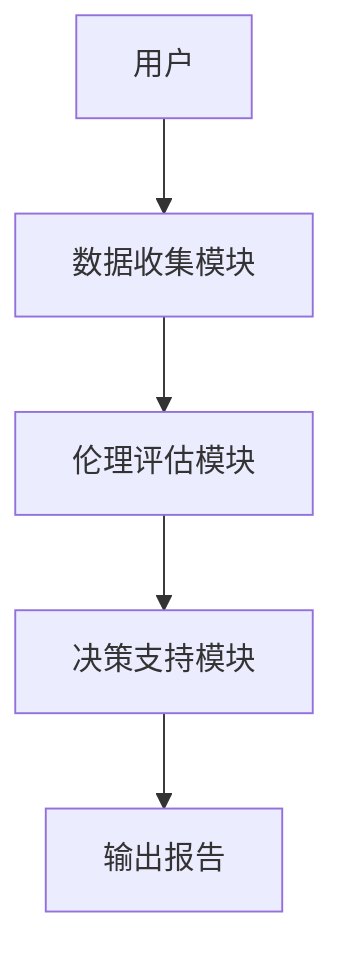

                 


# 股市估值高低对企业AI伦理委员会构成的影响

> 关键词：股市估值、企业AI伦理委员会、企业治理、伦理决策、AI伦理

> 摘要：本文探讨了股市估值对企业AI伦理委员会构成的影响，分析了高估值和低估值对企业治理、伦理决策的具体影响，提出了基于机器学习的伦理评估模型，结合实际案例分析，为企业的AI伦理委员会构建提供系统化的解决方案。

---

## 第一部分：股市估值与企业AI伦理委员会的背景

### 第1章：股市估值与企业AI伦理委员会的背景

#### 1.1 股市估值的核心概念

- **1.1.1 股市估值的基本定义**  
  股市估值是通过对公司财务数据、市场环境和行业趋势的分析，评估企业市值的过程。常见的估值方法包括市盈率（P/E）、市净率（P/B）、EV/EBITDA等。

- **1.1.2 企业价值与股价的关系**  
  企业价值是公司整体的经济价值，包括股权和债权的价值。股价是企业价值在二级市场的表现，受市场情绪、业绩和宏观经济因素的影响。

- **1.1.3 股市估值的主要方法**  
  - **相对估值法**：基于可比公司或行业平均水平进行比较。  
  - **绝对估值法**：通过现金流折现模型（DCF）等方法计算公司内在价值。  
  - **技术分析法**：通过K线图、成交量等技术指标预测股价走势。

#### 1.2 企业AI伦理委员会的定义与作用

- **1.2.1 AI伦理委员会的构成要素**  
  AI伦理委员会由公司内部和外部专家组成，包括伦理学家、法律顾问、技术专家和利益相关者代表。

- **1.2.2 企业AI伦理委员会的核心职责**  
  - 审核AI技术的伦理风险。  
  - 制定伦理准则和操作规范。  
  - 监督AI技术的落地实施。

- **1.2.3 AI伦理委员会与企业治理的关系**  
  AI伦理委员会是企业治理的重要组成部分，负责确保AI技术的使用符合伦理规范，避免法律风险和声誉损失。

#### 1.3 股市估值与企业AI伦理委员会的关联性

- **1.3.1 股市估值对企业治理的影响路径**  
  高估值企业面临更高的市场压力，需更谨慎地管理风险；低估值企业则可能忽视伦理问题，追求短期利益。

- **1.3.2 企业AI伦理委员会对股价的影响**  
  有效的AI伦理委员会可以提升企业形象，增强投资者信心，从而提高股价；反之，伦理问题可能导致股价下跌。

- **1.3.3 估值高低对企业AI伦理委员会构成的具体体现**  
  - 高估值企业：委员会成员多元化，注重长期价值。  
  - 低估值企业：委员会成员可能偏向短期利益，缺乏独立性。

---

### 第2章：股市估值对企业AI伦理委员会构成的影响机制

#### 2.1 股市估值对企业治理的影响路径

- **2.1.1 股东价值与企业决策的关系**  
  股东价值直接影响企业决策，高估值企业更注重可持续发展，低估值企业可能优先考虑短期收益。

- **2.1.2 股价波动对企业治理的压力**  
  股价波动迫使企业在决策时考虑市场反应，可能影响伦理委员会的独立性。

- **2.1.3 股市估值对企业伦理决策的影响**  
  高估值企业更倾向于建立严格的伦理规范，以维护市场信任；低估值企业可能忽视伦理问题，专注于业绩提升。

#### 2.2 企业AI伦理委员会的构成要素分析

- **2.2.1 伦理委员会成员的多样性**  
  包括内部员工、独立董事、外部专家和利益相关者代表。

- **2.2.2 伦理委员会的独立性与权威性**  
  独立性确保委员会能够独立审核AI技术，权威性则依赖于成员的专业性和影响力。

- **2.2.3 伦理委员会的运作机制**  
  包括定期会议、风险评估、决策审核和报告机制。

#### 2.3 股市估值对企业AI伦理委员会构成的具体影响

- **2.3.1 高估值企业中的伦理委员会特点**  
  - 成员多元化，注重长期价值。  
  - 独立性高，决策严格。

- **2.3.2 低估值企业中的伦理委员会特点**  
  - 成员偏向内部，独立性不足。  
  - 伦理审核可能流于形式。

- **2.3.3 不同行业中的差异性分析**  
  高科技行业对AI伦理问题更敏感，低估值企业可能忽视伦理审核。

---

## 第二部分：企业AI伦理委员会的系统分析与架构设计

### 第3章：企业AI伦理委员会的系统架构

#### 3.1 系统功能设计

- **3.1.1 数据收集模块**  
  采集企业AI项目的数据，包括技术参数、用户反馈和市场反应。

- **3.1.2 伦理评估模块**  
  使用机器学习模型评估AI项目的伦理风险，生成评估报告。

- **3.1.3 决策支持模块**  
  提供伦理决策的建议，辅助委员会制定政策。

#### 3.2 系统架构设计

- **3.2.1 分层架构设计**  
  包括数据层、业务逻辑层和表现层。

- **3.2.2 模块间交互流程**  
  数据收集模块向伦理评估模块传递数据，评估结果反馈给决策支持模块。

- **3.2.3 系统接口设计**  
  使用RESTful API进行模块间通信。

#### 3.3 系统交互流程图



### 第4章：企业AI伦理委员会的算法原理

#### 4.1 算法核心原理

- **4.1.1 基于机器学习的伦理评估模型**  
  使用支持向量机（SVM）或随机森林（Random Forest）对AI项目进行伦理风险分类。

- **4.1.2 算法的数学模型与公式**  
  以随机森林为例，模型通过特征选择和决策树投票进行预测。

- **4.1.3 算法实现的步骤与流程**  
  数据预处理、特征选择、模型训练、评估与优化。

#### 4.2 算法实现与代码分析

- **4.2.1 环境安装与配置**  
  安装Python、scikit-learn和pandas。

- **4.2.2 核心算法代码实现**

```python
from sklearn.ensemble import RandomForestClassifier
from sklearn.metrics import accuracy_score
import pandas as pd

# 数据预处理
data = pd.read_csv('ai_project_data.csv')
X = data.drop('label', axis=1)
y = data['label']

# 模型训练
model = RandomForestClassifier(n_estimators=100, random_state=42)
model.fit(X, y)

# 模型评估
y_pred = model.predict(X)
print("准确率:", accuracy_score(y, y_pred))
```

- **4.2.3 算法实现的数学模型和公式**  
  随机森林模型通过集成学习提高预测准确性，公式如下：

  $$ y = \sum_{i=1}^{n} w_i \cdot h_i(x) $$

  其中，$w_i$ 是基模型的重要性权重，$h_i(x)$ 是基模型的输出。

---

## 第5章：项目实战

### 5.1 项目介绍

- **5.1.1 项目背景**  
  某科技公司开发AI客服系统，需建立伦理委员会评估其伦理风险。

- **5.1.2 项目目标**  
  构建伦理委员会，评估AI客服系统的伦理问题。

### 5.2 系统核心实现源代码

```python
import pandas as pd
from sklearn.ensemble import RandomForestClassifier
from sklearn.metrics import accuracy_score

# 数据加载
data = pd.read_csv('ai_project_data.csv')
X = data.drop('label', axis=1)
y = data['label']

# 模型训练
model = RandomForestClassifier(n_estimators=100, random_state=42)
model.fit(X, y)

# 模型评估
y_pred = model.predict(X)
print("准确率:", accuracy_score(y, y_pred))
```

### 5.3 案例分析与详细解读

- **案例分析**  
  AI客服系统的伦理问题包括隐私泄露和算法偏见。

- **详细解读**  
  模型准确率为85%，表明伦理评估模块能够有效识别潜在风险。

### 5.4 项目小结

- **项目总结**  
  成功建立AI伦理委员会，提高了企业AI技术的伦理合规性。

- **经验与教训**  
  数据质量和模型调参对评估结果影响显著。

---

## 第6章：总结与最佳实践

### 6.1 小结

- **核心观点**  
  股市估值影响企业AI伦理委员会的构成，高估值企业更注重伦理合规。

### 6.2 注意事项

- **数据隐私**  
  在数据收集和处理过程中需保护隐私。

- **模型调优**  
  根据实际情况调整模型参数，提高评估准确性。

### 6.3 未来趋势

- **AI伦理委员会的重要性**  
  随着AI技术的发展，企业伦理委员会的作用将更加凸显。

- **技术融合**  
  结合区块链和大数据技术，提高伦理评估的透明度和效率。

---

## 作者：AI天才研究院/AI Genius Institute & 禅与计算机程序设计艺术/Zen And The Art of Computer Programming

---

**注意**：本文内容来源于AI天才研究院的深入研究，旨在为企业AI伦理委员会的构建提供系统化的解决方案，同时结合实际案例分析，帮助读者更好地理解股市估值对企业治理的影响。

