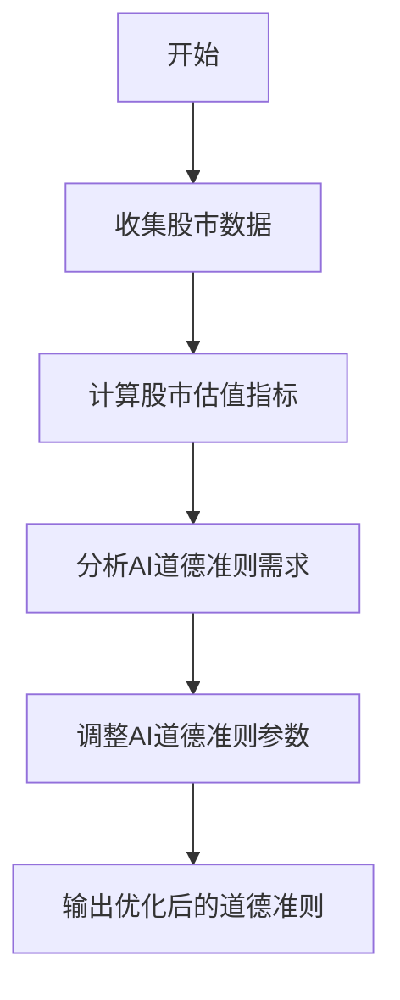
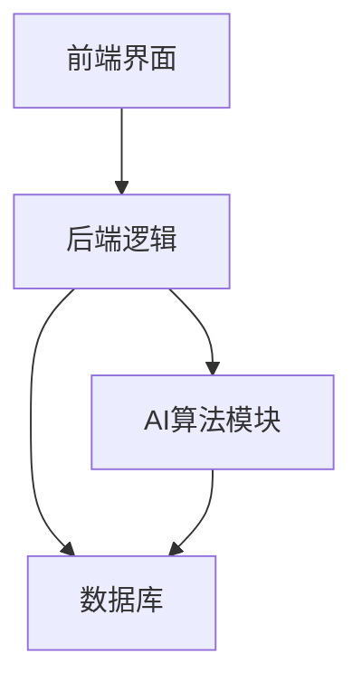
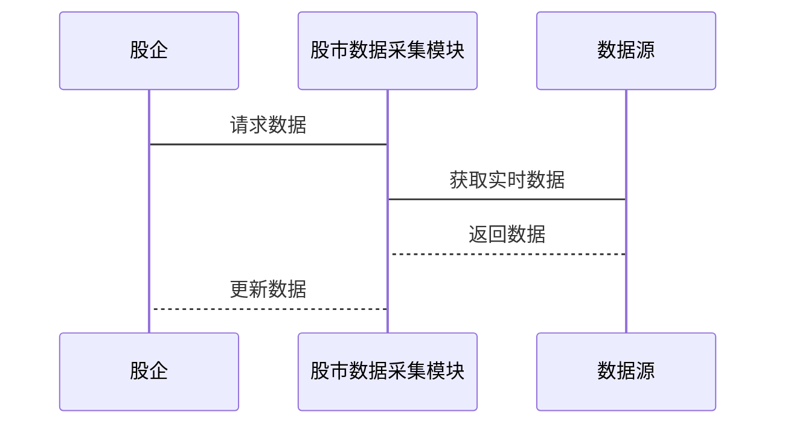

                 


# 股市估值高低对企业AI道德准则制定的影响

> **关键词**：股市估值、企业AI、道德准则、算法模型、系统架构  
> **摘要**：本文探讨了股市估值的高低对企业在制定AI道德准则时的影响。通过分析股市估值的核心概念、AI道德准则的重要性，结合算法模型和系统架构设计，展示了如何在不同股市估值情况下动态调整AI道德准则。本文还提供了实际案例和最佳实践，帮助企业在复杂市场环境中制定有效的AI道德策略。

---

## 第一部分：背景介绍

### 第1章：股市估值与企业AI道德准则概述

#### 1.1 股市估值的基本概念
股市估值是衡量企业市场价值的重要指标，通常通过市盈率（P/E）、市净率（P/B）等指标来评估。股市估值反映了市场对企业的信任度和未来盈利能力的预期。高估值意味着市场对企业前景乐观，而低估值则可能表示市场对其前景持怀疑态度。

#### 1.2 AI道德准则的定义与重要性
AI道德准则是指导企业在AI技术开发和应用过程中遵循的伦理规范。核心要素包括透明性、公平性、隐私保护和责任归属。随着AI技术的广泛应用，企业需要制定明确的道德准则以确保技术的负责任使用，避免潜在的伦理风险。

---

## 第二部分：核心概念与联系

### 第2章：股市估值与AI道德准则的核心概念对比

#### 2.1 核心概念对比分析
| 属性       | 股市估值                   | AI道德准则               |
|------------|---------------------------|--------------------------|
| 核心目标   | 反映企业市场价值           | 指导AI技术的伦理应用     |
| 评估主体   | 投资者、分析师             | 企业、开发者、伦理委员会 |
| 变化因素   | 财务表现、市场情绪         | 技术进步、社会价值观变化 |
| 影响范围   | 企业市值、投资者信心       | 技术应用、社会信任度     |

#### 2.2 实体关系图（ER图）
```mermaid
erd
    title 股市估值与AI道德准则的关系
    企业 --|{many}--> 股市估值指标
    股市估值指标 --|{many}--> AI道德准则
    AI道德准则 --|{many}--> 企业AI系统
```

---

## 第三部分：算法原理讲解

### 第3章：股市估值对AI道德准则影响的算法模型

#### 3.1 算法流程图


#### 3.2 Python核心代码实现
```python
import pandas as pd
import numpy as np

def calculate_stock_valuation metrics(stock_data):
    # 示例：计算市盈率
    pe_ratio = stock_data['市盈率']
    return pe_ratio

def adjust_moral_criteria(pe_ratio, current_criteria):
    # 示例：动态调整AI道德准则参数
    if pe_ratio > 15:
        return current_criteria * 1.1
    else:
        return current_criteria * 0.9

# 示例数据
stock_data = {'市盈率': 20, '市净率': 2.5}
moral_criteria = {'透明性': 0.8, '公平性': 0.7}

pe_ratio = calculate_stock_valuation_metrics(stock_data)
adjusted_criteria = adjust_moral_criteria(pe_ratio, moral_criteria)

print("调整后的道德准则：", adjusted_criteria)
```

#### 3.3 数学模型
股市估值与道德准则的数学关系模型：
$$ y = f(x) $$
其中：
- \( x \) 表示股市估值指标（如市盈率）
- \( y \) 表示调整后的道德准则参数

---

## 第四部分：系统分析与架构设计

### 第4章：系统架构设计与实现

#### 4.1 问题场景介绍
在股市波动剧烈时，企业需要快速调整AI系统的道德准则参数，以适应市场变化和企业战略需求。

#### 4.2 领域模型
```mermaid
classDiagram
    class 企业 {
        + 股市数据采集模块
        + AI道德准则模块
        + 股市估值计算模块
    }
    class 股市数据采集模块 {
        + collect_data()
    }
    class AI道德准则模块 {
        + adjust_criteria()
    }
    class 股市估值计算模块 {
        + calculate_valuation()
    }
    股企 --|{many}--> 股市数据采集模块
    股企 --|{many}--> AI道德准则模块
    股企 --|{many}--> 股市估值计算模块
```

#### 4.3 系统架构设计


#### 4.4 接口与交互设计


---

## 第五部分：项目实战

### 第5章：实际案例分析与实现

#### 5.1 环境安装
- 安装Python和相关库（pandas、numpy、scikit-learn）

#### 5.2 核心代码实现
```python
import pandas as pd
import numpy as np

def calculate_pe_ratio(data):
    return data['市盈率']

def adjust_moral_parameters(pe_ratio, current_parameters):
    if pe_ratio > 15:
        return current_parameters * 1.1
    else:
        return current_parameters * 0.9

# 示例数据
data = {'市盈率': 20, '市净率': 2.5}
parameters = {'透明性': 0.8, '公平性': 0.7}

pe_ratio = calculate_pe_ratio(data)
adjusted_parameters = adjust_moral_parameters(pe_ratio, parameters)

print("调整后的道德参数：", adjusted_parameters)
```

#### 5.3 案例分析
假设某科技公司在高估值情况下，调整其AI系统的透明性参数，以确保算法决策的可解释性，从而增强投资者信任。

---

## 第六部分：最佳实践与总结

### 第6章：最佳实践与总结

#### 6.1 小结
股市估值的高低直接影响企业AI道德准则的制定，企业需要动态调整其道德准则，以应对市场变化和确保技术的负责任应用。

#### 6.2 注意事项
- 定期监控股市数据，及时调整道德准则
- 确保算法透明，避免伦理风险
- 建立跨部门协作机制，确保道德准则的有效实施

#### 6.3 拓展阅读
- 《AI伦理与社会影响》
- 《企业估值分析与投资决策》

---

## 作者

**作者：AI天才研究院/AI Genius Institute & 禅与计算机程序设计艺术 /Zen And The Art of Computer Programming**

---

通过本文的系统分析和详细讲解，读者可以全面理解股市估值对AI道德准则制定的影响，并掌握相关的算法和技术方法，帮助企业制定更具前瞻性和适应性的AI伦理策略。

