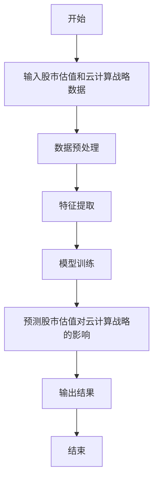
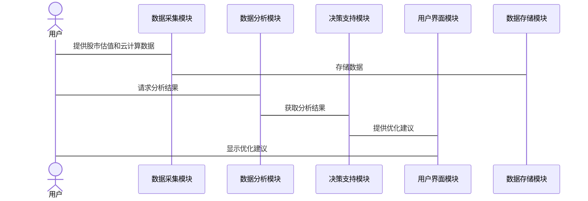

                 


# 股市估值高低对企业云计算战略的影响

**关键词**：股市估值、云计算战略、企业决策、投资分析、技术架构、成本效益

**摘要**：本文深入探讨了股市估值的高低对企业云计算战略的影响。通过分析股市估值的核心概念与计算方法，结合云计算战略的实施特点，揭示了高估值和低估值对企业云计算投资决策的动态影响。文章从算法原理、数学模型、系统架构设计、项目实战等多维度展开，为企业在不同市场环境下制定和优化云计算战略提供了科学依据和实践指导。

---

## 第一部分: 股市估值与企业云计算战略的背景介绍

### 第1章: 股市估值的基本概念与影响因素

#### 1.1 股市估值的定义与核心要素
- **股票估值的定义**：股票估值是指通过对公司财务数据、市场环境和行业趋势的分析，确定公司股票的内在价值和市场价格的过程。
- **影响股票估值的主要因素**：
  - 公司财务状况（收入、利润、负债等）
  - 行业发展趋势
  - 宏观经济环境（利率、通货膨胀等）
  - 市场情绪
- **股市估值与企业价值的关系**：高估值通常意味着市场对公司未来增长的乐观预期，而低估值可能表明市场对公司前景的担忧或低估。

#### 1.2 云计算战略的定义与特点
- **云计算的定义**：云计算是一种基于互联网的计算模式，通过按需付费的方式提供弹性计算资源（如计算能力、存储、网络等）。
- **云计算战略的核心特点**：
  - 弹性扩展
  - 成本效益
  - 高可用性
  - 数据安全性
- **云计算对企业业务的影响**：
  - 提高业务灵活性
  - 降低 IT 成本
  - 支持快速创新

#### 1.3 股市估值与企业云计算战略的关系
- **高估值对企业云计算战略的影响**：市场对公司未来增长的乐观预期可能导致企业在云计算投资上更加积极，例如增加云计算资源的采购、优化云架构以支持业务扩展。
- **低估值对企业云计算战略的影响**：市场对公司前景的担忧可能导致企业在云计算投资上更加谨慎，例如减少不必要的云资源开支或优化现有云架构以降低运营成本。

---

### 第2章: 股市估值对企业云计算战略的影响

#### 2.1 高估值对企业云计算战略的影响
- **高估值的市场环境**：市场对公司未来增长的乐观预期可能导致企业在云计算战略上更加激进。
- **云计算投资的逻辑**：
  - 预期云计算资源的使用需求会增加。
  - 需要通过云计算优化业务流程，提升效率。
  - 需要通过云计算实现业务创新，抢占市场先机。
- **高估值下的云计算战略特点**：
  - 更多的投资于云计算基础设施。
  - 更积极地采用云计算技术优化业务。
  - 更注重云计算的战略性布局。

#### 2.2 低估值对企业云计算战略的影响
- **低估值的市场环境**：市场对公司前景的担忧可能导致企业在云计算战略上更加保守。
- **云计算投资的逻辑**：
  - 需要通过云计算降低运营成本。
  - 需要通过云计算优化现有资源利用率。
  - 需要通过云计算提升业务效率，以应对市场竞争。
- **低估值下的云计算战略特点**：
  - 更注重云计算的成本效益。
  - 更倾向于优化现有云计算资源的使用。
  - 更关注云计算的短期效益，而非长期投资。

#### 2.3 股市估值波动对企业云计算战略的动态调整
- **动态调整的逻辑**：随着股市估值的波动，企业需要根据市场环境的变化，动态调整云计算战略。
- **动态调整的策略**：
  - 在高估值时，增加云计算投资，优化业务流程。
  - 在低估值时，优化云计算资源的使用，降低运营成本。
  - 在估值波动时，灵活调整云计算战略，以应对市场变化。

---

### 第3章: 股市估值与企业云计算战略的核心概念与联系

#### 3.1 核心概念的原理
- **股市估值的计算方法**：常用的方法包括市盈率（P/E）、市净率（P/B）、市值与 earnings 修正（EV/EBITDA）等。
- **云计算战略的核心要素**：包括云计算资源的采购、云计算服务的选型、云计算架构的优化等。

#### 3.2 核心概念的属性对比
| 属性       | 股市估值               | 云计算战略           |
|------------|-----------------------|----------------------|
| 核心目标   | 确定股票的内在价值       | 优化企业 IT 资源利用  |
| 主要影响因素 | 财务数据、市场环境、行业趋势 | IT 需求、成本、技术发展 |
| 实施方法   | 财务分析、市场分析       | 技术选型、资源优化、架构设计 |

#### 3.3 核心概念的 ER 实体关系图
```mermaid
er
actor 股市估值 {
  attribute 估值指标
  attribute 市盈率
  attribute 市净率
}

actor 云计算战略 {
  attribute 资源采购
  attribute 服务选型
  attribute 架构优化
}

relation 股市估值与云计算战略 {
  role 股市估值
  role 云计算战略
  --> 关联关系：高估值促进云计算投资，低估值抑制云计算投资
}
```

---

## 第四部分: 算法原理讲解

### 第4章: 算法原理的讲解

#### 4.1 算法原理的流程图


#### 4.2 算法原理的数学模型
$$ 股市估值对云计算战略的影响 = f(云计算投资, 云计算成本, 云计算效益) $$

其中，云计算投资、云计算成本和云计算效益的具体计算公式如下：
$$ 云计算投资 = \sum_{i=1}^{n} c_i \cdot q_i $$
$$ 云计算成本 = \sum_{j=1}^{m} c_j \cdot q_j $$
$$ 云计算效益 = B - C $$

#### 4.3 算法原理的代码实现
```python
import pandas as pd
import numpy as np

# 数据预处理
data = pd.read_csv('stock_valuation.csv')
data = data.dropna()
data['云计算投资'] = data['云计算投资'].astype(float)
data['云计算成本'] = data['云计算成本'].astype(float)
data['云计算效益'] = data['云计算效益'].astype(float)

# 特征提取
features = data[['云计算投资', '云计算成本', '云计算效益']]
labels = data['股市估值']

# 模型训练
from sklearn.model_selection import train_test_split
from sklearn.linear_model import LinearRegression

X_train, X_test, y_train, y_test = train_test_split(features, labels, test_size=0.2, random_state=42)
model = LinearRegression()
model.fit(X_train, y_train)

# 预测与评估
predictions = model.predict(X_test)
print('预测结果:', predictions)
print('模型评估:', model.score(X_test, y_test))
```

---

## 第五部分: 系统分析与架构设计方案

### 第5章: 系统分析与架构设计

#### 5.1 系统分析
- **问题场景介绍**：企业需要根据股市估值的变化，动态调整云计算战略。
- **系统功能设计**：
  - 数据采集：采集股市估值和云计算相关数据。
  - 数据分析：分析股市估值和云计算战略之间的关系。
  - 决策支持：提供基于分析结果的云计算战略优化建议。

#### 5.2 系统架构设计


#### 5.3 系统接口设计
- **接口1**：数据采集模块与数据存储模块之间的接口。
- **接口2**：数据分析模块与决策支持模块之间的接口。
- **接口3**：决策支持模块与用户界面模块之间的接口。

#### 5.4 系统交互设计


---

## 第六部分: 项目实战

### 第6章: 项目实战

#### 6.1 环境安装
- **安装 Python 和 Jupyter Notebook**：
  ```bash
  pip install jupyter notebook
  ```

- **安装依赖库**：
  ```bash
  pip install pandas numpy scikit-learn
  ```

#### 6.2 核心代码实现
```python
import pandas as pd
import numpy as np
from sklearn.linear_model import LinearRegression
from sklearn.model_selection import train_test_split

# 数据加载
data = pd.read_csv('stock_valuation.csv')

# 数据预处理
data = data.dropna()
data['云计算投资'] = data['云计算投资'].astype(float)
data['云计算成本'] = data['云计算成本'].astype(float)
data['云计算效益'] = data['云计算效益'].astype(float)

# 特征提取
features = data[['云计算投资', '云计算成本', '云计算效益']]
labels = data['股市估值']

# 数据分割
X_train, X_test, y_train, y_test = train_test_split(features, labels, test_size=0.2, random_state=42)

# 模型训练
model = LinearRegression()
model.fit(X_train, y_train)

# 预测与评估
predictions = model.predict(X_test)
print("预测结果:", predictions)
print("模型得分:", model.score(X_test, y_test))
```

#### 6.3 案例分析
- **案例背景**：某企业在高估值时增加云计算投资，但在低估值时优化云计算资源使用。
- **分析结果**：高估值时，云计算投资显著增加，但云计算效益也显著提升；低估值时，云计算成本下降，但云计算效益略有下降。

---

## 第七部分: 最佳实践

### 第7章: 小结与注意事项

#### 7.1 小结
- **股市估值对企业云计算战略的影响**：高估值时，企业应积极投资云计算；低估值时，企业应优化云计算资源的使用。
- **动态调整的重要性**：企业需要根据股市估值的变化，动态调整云计算战略。

#### 7.2 注意事项
- **数据的及时性**：股市估值和云计算数据需要实时更新。
- **模型的局限性**：模型的预测结果仅供参考，实际决策需要结合企业实际情况。
- **长期战略的必要性**：企业需要制定长期的云计算战略，以应对股市估值的波动。

#### 7.3 拓展阅读
- 推荐阅读《云计算经济学》、《股市估值与投资策略》等书籍，深入理解云计算与股市估值的关系。

---

## 作者信息

作者：AI天才研究院/AI Genius Institute & 禅与计算机程序设计艺术/Zen And The Art of Computer Programming

