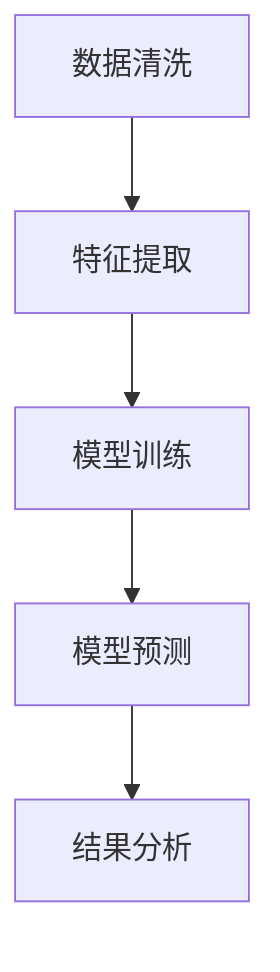
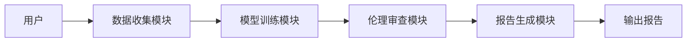

                 


# 股市估值高低对企业人工智能伦理委员会的影响

## 关键词：股市估值、企业人工智能伦理委员会、伦理风险、投资决策、企业治理

## 摘要：  
本文探讨股市估值的高低如何影响企业人工智能伦理委员会的运作及决策。通过分析股市估值的核心指标（如市盈率、市净率等）与企业AI伦理委员会的职责，揭示两者之间的相互作用。文章从背景介绍、核心概念、算法原理、数学模型、系统设计、项目实战等多维度展开，结合实际案例和最佳实践，为企业在人工智能伦理治理和投资决策中提供有价值的参考。

---

## 第一部分：背景介绍

### 第1章：股市估值与企业AI伦理委员会概述

#### 1.1 股市估值的基本概念

股市估值是衡量企业价值的重要工具，主要通过市盈率（P/E）、市净率（P/B）、EV/EBITDA等指标来评估企业股票的价值。股市估值的高低直接影响投资者对企业的信心和投资决策。例如，高市盈率可能意味着市场对企业未来增长的预期较高，而低市盈率可能表明企业当前盈利能力较强。

#### 1.2 企业人工智能伦理委员会的定义

企业人工智能伦理委员会是负责监督和评估企业AI项目伦理风险的组织。其主要职责包括制定伦理准则、审查AI项目的潜在影响、确保合规性以及应对公众和监管机构的质疑。例如，委员会可能审查AI算法是否存在偏见，或AI决策是否侵犯用户隐私。

#### 1.3 股市估值与企业AI伦理委员会的关联性

股市估值与企业AI伦理委员会之间存在间接但重要的联系。企业AI项目若存在伦理风险，可能导致企业声誉受损，进而影响股市估值。例如，若某企业因AI算法偏见被曝光，投资者可能抛售股票，导致股价下跌。因此，企业AI伦理委员会的建立和运作直接影响股市对企业的信任度和估值。

---

## 第二部分：核心概念与联系

### 第2章：股市估值的核心要素分析

#### 2.1 股市估值的关键指标

1. **市盈率（P/E）**：计算公式为：市盈率 = 股价 / 每股净利润。例如，若某公司股价为50元，每股净利润为5元，则市盈率为10倍。市盈率越高，表明市场对企业的未来增长预期越高。

2. **市净率（P/B）**：计算公式为：市净率 = 股价 / 每股净资产。例如，若某公司股价为30元，每股净资产为15元，则市净率为2倍。市净率低于1通常表明企业股票被低估。

3. **EV/EBITDA**：计算公式为：EV = 企业价值 = 市值 + 债务 - 现金储备；EBITDA = 息税折旧及摊销前利润。例如，若某公司EV为100亿元，EBITDA为20亿元，则EV/EBITDA为5倍。

#### 2.2 企业AI伦理委员会的核心要素

1. **组织架构**：通常包括伦理审查委员会、法律顾问、技术专家和公众代表。例如，委员会可能由5名成员组成，包括1名主席和4名委员。

2. **职责与作用**：包括制定伦理准则、审查AI项目、评估伦理风险和应对公众质疑。例如，委员会可能审查一项AI招聘工具是否存在性别歧视。

3. **运作机制**：通常包括定期会议、伦理审查流程和报告机制。例如，委员会可能每季度召开一次会议，审查企业所有AI项目的伦理风险。

#### 2.3 股市估值与企业AI伦理委员会的对比分析

| 比较维度      | 股市估值          | 企业AI伦理委员会         |
|---------------|-------------------|--------------------------|
| 定义          | 股票的价值评估     | 监督AI项目的伦理风险       |
| 评估对象      | 企业整体价值       | AI技术及其应用             |
| 评估主体      | 投资者和市场机构   | 企业内部伦理委员会         |
| 评估依据      | 财务指标（如利润、资产） | 伦理准则和风险评估         |
| 影响因素      | 市场情绪、经济环境   | 伦理风险、企业声誉           |

---

## 第三部分：算法原理讲解

### 第3章：股市估值与AI伦理影响的算法分析

#### 3.1 股市估值预测算法

1. **机器学习模型**：使用历史数据训练模型预测股票价格。例如，使用线性回归模型预测某股票的未来价格。

2. **算法流程图**：



3. **Python代码示例**：

```python
import pandas as pd
from sklearn.linear_model import LinearRegression

# 数据清洗
data = pd.read_csv('stock_data.csv')
data = data.dropna()

# 特征提取
features = data[['PE', 'PB', 'EV/EBITDA']]
target = data['Price']

# 模型训练
model = LinearRegression()
model.fit(features, target)

# 模型预测
predicted_price = model.predict(features)
```

4. **数学模型**：线性回归模型的数学公式为：

$$ y = \beta_0 + \beta_1 x_1 + \beta_2 x_2 + \beta_3 x_3 + \epsilon $$

其中，$y$ 是预测的股票价格，$x_1, x_2, x_3$ 是市盈率、市净率和EV/EBITDA，$\beta_0, \beta_1, \beta_2, \beta_3$ 是回归系数，$\epsilon$ 是误差项。

---

## 第四部分：数学模型

### 第4章：股市估值与AI伦理影响的数学模型

#### 4.1 股市估值模型

1. **市盈率模型**：

$$ P/E = \frac{P}{E} $$

其中，$P$ 是股票价格，$E$ 是每股净利润。

2. **CAPM模型**：

$$ R_i = R_f + \beta_i (R_m - R_f) $$

其中，$R_i$ 是股票的预期收益率，$R_f$ 是无风险利率，$\beta_i$ 是股票的贝塔系数，$R_m$ 是市场预期收益率。

#### 4.2 AI伦理影响模型

1. **伦理风险评估模型**：

$$ ER = \alpha \cdot E + \beta \cdot R $$

其中，$ER$ 是伦理风险，$E$ 是伦理准则的符合程度，$R$ 是公众对AI项目的信任度，$\alpha$ 和 $\beta$ 是权重系数。

---

## 第五部分：系统分析与架构设计

### 第5章：系统功能设计与架构

#### 5.1 功能模块设计

1. **数据收集模块**：收集企业的财务数据和AI项目信息。
2. **模型训练模块**：使用机器学习模型预测股市估值。
3. **伦理审查模块**：评估AI项目的伦理风险。
4. **报告生成模块**：生成伦理审查报告和股市估值分析报告。

#### 5.2 系统架构设计



---

## 第六部分：项目实战

### 第6章：项目实战与案例分析

#### 6.1 项目环境安装

1. 安装必要的Python库：`pandas`, `numpy`, `scikit-learn`

#### 6.2 核心实现代码

```python
import pandas as pd
from sklearn.ensemble import RandomForestRegressor

# 数据收集
data = pd.read_csv('stock_data.csv')

# 特征工程
data['PE'] = data['Price'] / data['Earnings']
data['PB'] = data['Price'] / data['Book Value']

# 模型训练
model = RandomForestRegressor()
model.fit(data[['PE', 'PB']], data['Price'])

# 预测股市估值
predicted_price = model.predict(data[['PE', 'PB']])
```

#### 6.3 案例分析

假设某企业推出AI客服系统，可能存在数据隐私问题。伦理委员会需要评估该系统的隐私风险，并提出改进建议。通过模型预测，若该企业的PE和PB均高于行业平均水平，可能会影响其股市估值。

---

## 第七部分：总结与展望

### 第7章：总结与展望

#### 7.1 总结

股市估值的高低与企业AI伦理委员会的运作密切相关。企业AI伦理委员会的建立和有效运作可以提升企业的声誉，降低伦理风险，从而影响股市估值。通过机器学习模型和数学模型，企业可以更好地预测股市估值的变化，并制定相应的战略。

#### 7.2 展望

未来，随着人工智能技术的不断发展，企业AI伦理委员会的作用将更加重要。建议企业加强伦理治理能力，同时投资者也需要关注企业的伦理风险，以做出更明智的投资决策。

---

## 作者：AI天才研究院/AI Genius Institute & 禅与计算机程序设计艺术 /Zen And The Art of Computer Programming

