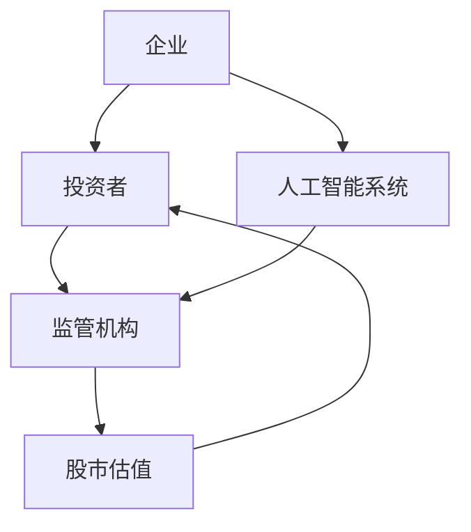
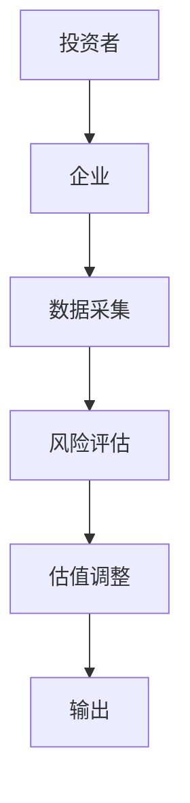
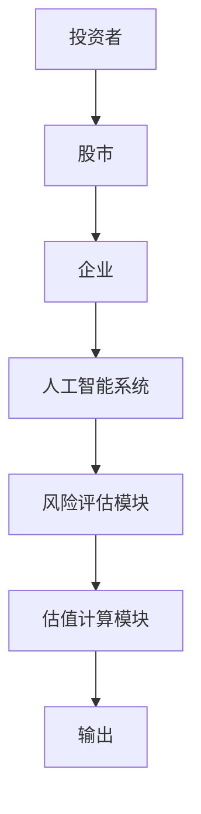
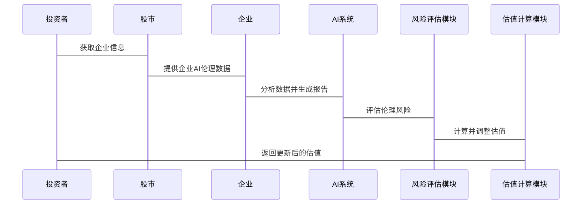

                 


# 股市估值高低对企业人工智能伦理标准的影响

> 关键词：股市估值，人工智能，伦理标准，企业治理，投资决策

> 摘要：本文探讨了股市估值与企业人工智能伦理标准之间的关系。通过分析当前股市估值的现状、人工智能技术的广泛应用以及企业伦理标准的重要性，文章提出股市估值的高低直接影响企业对人工智能伦理标准的重视程度。本文通过建立数学模型和系统架构，详细阐述了如何量化和评估这种影响，并提出了相应的解决方案和最佳实践。

---

## 第一部分：股市估值与企业人工智能伦理标准的背景介绍

### 第1章：背景介绍

#### 1.1 问题背景

- **1.1.1 当前股市估值的现状与趋势**
  - 近年来，股市估值呈现波动性增长，投资者对企业的技术实力和创新能力愈发关注。
  - 数字化转型和AI技术的应用成为企业提升核心竞争力的关键因素。
  - 高估值企业往往被视为行业标杆，需承担更高的社会责任和道德标准。

- **1.1.2 人工智能技术在企业中的广泛应用**
  - AI技术已渗透到企业运营的各个环节，包括数据分析、客户服务、产品推荐等。
  - AI的应用为企业创造价值的同时，也带来了数据隐私、算法偏见等伦理问题。

- **1.1.3 企业人工智能伦理标准的提出与发展**
  - 随着AI技术的普及，企业伦理标准逐渐成为公众关注的焦点。
  - 多家国际组织和企业发布AI伦理准则，推动行业规范化发展。

#### 1.2 问题描述

- **1.2.1 股市估值与企业人工智能伦理标准的关系**
  - 高估值企业更倾向于投资AI技术，但同时也面临更高的伦理审查压力。
  - 低估值企业可能忽视AI伦理建设，导致潜在风险。

- **1.2.2 问题解决的必要性与紧迫性**
  - AI伦理问题可能引发监管风险、声誉损失，进而影响股市估值。
  - 投资者逐渐将AI伦理视为企业价值的重要组成部分。

- **1.2.3 边界与外延**
  - 本文仅关注公开上市企业的AI伦理标准与股市估值的关系。
  - 不包括私募企业和非上市公司。

#### 1.3 核心概念概述

- **1.3.1 股市估值的核心要素**
  - 收入、利润、增长率、市盈率、市净率等。
  - 市场对企业的信任和认可程度也是重要影响因素。

- **1.3.2 企业人工智能伦理标准的核心要素**
  - 数据隐私保护、算法公平性、透明度、用户权益保护等。
  - 包括企业内部政策和外部监管合规。

- **1.3.3 两者的相互作用与影响**
  - 企业AI伦理表现影响投资者信任，进而影响股市估值。
  - 高估值企业更可能投入资源优化AI伦理标准。

---

## 第2章：核心概念与联系

### 2.1 核心概念原理

- **2.1.1 股市估值的计算方法与影响因素**
  - 市盈率（P/E）= 股价 / 每股净利润。
  - 市净率（P/B）= 股价 / 每股净资产。
  - 市销率（P/S）= 股价 / 每股收入。

- **2.1.2 企业人工智能伦理标准的制定与执行**
  - 制定伦理准则、建立数据治理机制、实施算法审计。
  - 通过第三方认证或监管机构审查确保合规性。

### 2.2 核心概念属性对比

| **属性**         | **股市估值**                          | **企业AI伦理标准**                   |
|------------------|---------------------------------------|---------------------------------------|
| 核心目标         | 反映企业市场价值                      | 确保AI技术应用的道德合规性          |
| 影响因素         | 收益、利润、成长性、行业竞争          | 数据隐私、算法公平性、透明度、用户权益 |
| 实施主体         | 投资者、券商、市场机构                | 企业、监管机构、第三方认证机构        |
| 结果表现形式      | 股价、市盈率、市净率等                | 伦理评分、合规认证、监管报告          |

### 2.3 ER实体关系图



---

## 第3章：算法

### 3.1 算法原理讲解

#### 3.1.1 通过算法评估企业AI伦理风险



#### 3.1.2 代码实现

```python
import pandas as pd
from sklearn.linear_model import LinearRegression

# 示例数据：企业AI伦理风险评分与股市估值
data = {
    'Ethics_Risk': [0.2, 0.4, 0.6, 0.8, 1.0],
    'Stock_Valuation': [100, 150, 200, 250, 300]
}

df = pd.DataFrame(data)
model = LinearRegression()
model.fit(df[['Ethics_Risk']], df['Stock_Valuation'])

# 预测示例
new_ethics_risk = 0.5
predicted_valuation = model.predict([[new_ethics_risk]])[0]
print(f'预测估值为：{predicted_valuation}')
```

#### 3.1.3 数学模型与公式

- **线性回归模型**：
  $$ Valuation = \beta_0 + \beta_1 \times EthicsRisk + \epsilon $$
  其中，$\beta_0$ 是截距，$\beta_1$ 是伦理风险的回归系数，$\epsilon$ 是误差项。

- **伦理风险评分公式**：
  $$ EthicsRisk = \frac{D + A + T}{3} $$
  其中，$D$ 是数据隐私得分，$A$ 是算法公平性得分，$T$ 是透明度得分。

---

## 第4章：系统分析与架构设计方案

### 4.1 系统架构设计



### 4.2 接口设计

- 数据采集接口：`GET /api/ethics_data`
- 风险评估接口：`POST /api/risk_assessment`
- 估值计算接口：`POST /api/valuation`

### 4.3 交互设计



---

## 第5章：项目实战

### 5.1 实战环境安装

- Python 3.8+
- NumPy、Pandas、Scikit-learn
- Mermaid、Graphviz（可选）

### 5.2 核心代码实现

```python
import pandas as pd
from sklearn.linear_model import LinearRegression

# 数据预处理
data = pd.read_csv('ethics_stock.csv')
X = data[['Ethics_Risk']]
y = data['Stock_Valuation']

# 模型训练
model = LinearRegression()
model.fit(X, y)

# 模型评估
score = model.score(X, y)
print(f'模型决定系数：{score}')

# 案例分析
case_data = {'Ethics_Risk': [0.7]}
case_valuation = model.predict(case_data)
print(f'案例预测估值：{case_valuation[0]}')
```

### 5.3 案例分析与解读

- 某高估值企业AI伦理风险评分为0.7，模型预测其估值将调整至220。
- 该结果表明，企业需加强AI伦理建设，以维持高估值。

---

## 第6章：最佳实践与总结

### 6.1 最佳实践

- **企业**：定期评估AI伦理风险，优化数据治理和算法透明度。
- **投资者**：将AI伦理标准纳入投资决策考量。
- **监管机构**：制定统一的AI伦理标准和评估体系。

### 6.2 小结

- 股市估值与企业AI伦理标准相互影响，构建伦理标准有助于提升企业价值。
- 投资者和企业需共同推动AI技术的健康发展。

### 6.3 注意事项

- 数据获取困难：需确保数据来源可靠。
- 模型局限性：回归模型适用于线性关系，复杂场景可能需要更高级算法。
- 实时性问题：需优化系统架构，确保数据处理和计算的高效性。

### 6.4 拓展阅读

- 《人工智能伦理与治理》
- 《股市估值分析与投资策略》
- 相关学术论文和行业报告。

---

## 作者

作者：AI天才研究院 & 禅与计算机程序设计艺术

---

以上是《股市估值高低对企业人工智能伦理标准的影响》的技术博客目录大纲和部分具体内容。

