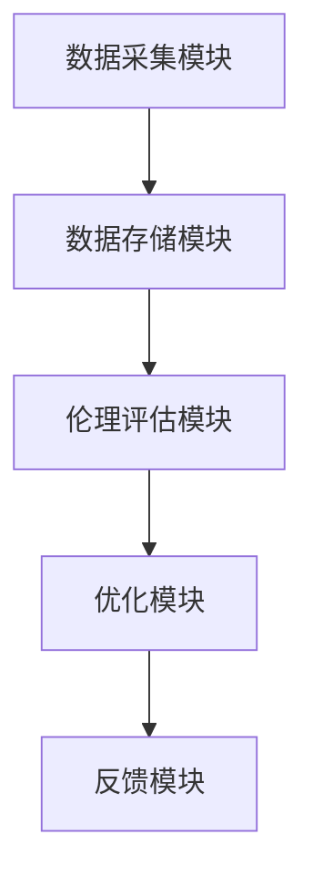

                 


# 股市估值高低对企业人工智能伦理的影响

---

## 关键词：股市估值、人工智能伦理、企业价值、算法公平性、数据隐私

---

## 摘要

股市估值的高低不仅反映了企业的市场价值，也影响着企业在人工智能伦理方面的表现。随着人工智能技术的广泛应用，企业对算法的依赖程度不断提高，而算法的公平性、数据隐私和透明性等问题逐渐成为影响股市估值的重要因素。本文从股市估值的基本概念出发，深入探讨人工智能伦理的核心原则，分析两者之间的相互影响，并通过具体案例和算法模型，揭示股市估值高低对企业人工智能伦理的具体影响，最后提出相应的解决方案和未来研究方向。

---

## 第1章：股市估值的基本概念与人工智能伦理的核心原则

### 1.1 股市估值的定义与计算方法

股市估值是通过对企业的财务数据、市场环境和行业趋势等多方面因素进行分析，评估企业股票的市场价格是否合理的过程。常见的估值方法包括市盈率（P/E）、市净率（P/B）和现金流折现法（DCF）等。

**市盈率（P/E）公式：**
$$ P/E = \frac{\text{股票价格}}{\text{每股净利润}} $$

**市净率（P/B）公式：**
$$ P/B = \frac{\text{股票价格}}{\text{每股净资产}} $$

### 1.2 人工智能伦理的核心原则

人工智能伦理关注算法的公平性、透明性和数据隐私等问题。以下是人工智能伦理的核心原则：

1. **公平性**：算法不应存在偏见，确保所有用户和利益相关者受到公平对待。
2. **透明性**：算法的决策过程应可解释，避免“黑箱”操作。
3. **数据隐私**：保护用户数据不被滥用，确保数据处理的合法性。
4. **责任归属**：明确算法决策的责任主体，确保出现问题时能够追溯和问责。

### 1.3 股市估值与人工智能伦理的关联性

股市估值的高低与企业的人工智能伦理表现密切相关。例如，若一家企业因算法偏见导致用户流失，其股价可能下跌，进而影响市场对其估值的判断。反之，若企业能够通过伦理合规的AI技术提升竞争力，其估值可能会上升。

---

## 第2章：股市估值与人工智能伦理的核心概念原理

### 2.1 股市估值的核心原理

股市估值的核心在于对企业未来盈利能力的预测。人工智能技术可以通过自然语言处理（NLP）分析新闻、社交媒体和财报数据，预测股价走势。

**机器学习预测股价的流程：**
1. 数据收集：从新闻、社交媒体、财务报表中提取数据。
2. 数据清洗：去除噪声数据，标准化处理。
3. 特征提取：通过NLP提取情感特征和关键词特征。
4. 模型训练：使用LSTM或随机森林模型预测股价。

### 2.2 人工智能伦理的核心原理

人工智能伦理的核心在于确保技术的使用符合社会道德规范。例如，使用AI进行交易时，必须确保算法不会导致市场操纵或不公平竞争。

**算法公平性评估步骤：**
1. 数据检查：确保训练数据不含有偏见。
2. 模型评估：使用 fairness metrics（如Dive74）评估算法的公平性。
3. 透明性验证：通过可解释性模型（如SHAP值）解释算法决策。

---

## 第3章：股市估值与人工智能伦理的算法原理讲解

### 3.1 股市估值预测算法

#### 3.1.1 基于LSTM的股价预测模型

LSTM（长短期记忆网络）适用于处理时间序列数据，能够捕捉股价的长期依赖关系。

**LSTM模型结构：**
- 输入层：接收历史股价数据。
- LSTM层：处理时间序列数据，捕捉长期依赖关系。
- 全连接层：预测未来股价。

**代码实现示例：**
```python
import numpy as np
from tensorflow.keras.models import Sequential
from tensorflow.keras.layers import LSTM, Dense

# 示例数据
data = np.random.randn(1000, 1)
model = Sequential()
model.add(LSTM(64, input_shape=(None, 1)))
model.add(Dense(1))
model.compile(loss='mean_squared_error', optimizer='adam')
model.fit(data, np.random.randn(1000, 1), epochs=10, batch_size=32)
```

### 3.2 人工智能伦理评估算法

#### 3.2.1 基于SHAP的可解释性模型

SHAP（Shapley Additive exPlanations）用于解释模型的决策过程，帮助评估算法的透明性。

**SHAP值计算步骤：**
1. 训练模型：使用XGBoost或LightGBM模型。
2. 计算SHAP值：通过SHAP库生成特征重要性解释。

**代码实现示例：**
```python
import shap
import xgboost as xgb

# 示例数据
X = np.random.randn(100, 2)
y = np.random.randint(0, 2, 100)

model = xgb.XGBClassifier()
model.fit(X, y)

explainer = shap.TreeExplainer(model)
shap_values = explainer.shap_values(X)
```

---

## 第4章：股市估值与人工智能伦理的系统分析与架构设计方案

### 4.1 问题场景介绍

假设一家科技公司使用AI算法进行股票交易，但由于算法偏见导致用户亏损，引发信任危机，最终影响公司估值。

### 4.2 项目介绍

为了评估和优化企业的人工智能伦理表现，设计一个基于伦理评估的AI系统。

#### 4.3 系统功能设计

- 数据采集模块：收集企业财务数据和用户反馈。
- 伦理评估模块：评估算法的公平性、透明性和数据隐私。
- 优化模块：根据评估结果调整算法参数。

#### 4.4 系统架构设计

**系统架构图：**


---

## 第5章：项目实战与案例分析

### 5.1 环境安装与代码实现

#### 5.1.1 环境安装

安装必要的库：
```bash
pip install numpy pandas scikit-learn xgboost shap mermaid
```

#### 5.1.2 核心代码实现

**数据采集与预处理：**
```python
import pandas as pd
import numpy as np

# 示例数据
data = pd.DataFrame({
    'feature1': np.random.randn(100),
    'feature2': np.random.randn(100),
    'target': np.random.randint(0, 2, 100)
})

# 数据预处理
data['feature1'] = data['feature1'].apply(lambda x: x + np.random.normal(0, 0.1))
```

**伦理评估模块：**
```python
import xgboost as xgb
from sklearn.metrics import accuracy_score
import shap

# 训练模型
model = xgb.XGBClassifier()
model.fit(data[['feature1', 'feature2']], data['target'])

# SHAP解释
explainer = shap.TreeExplainer(model)
shap_values = explainer.shap_values(data[['feature1', 'feature2']])
```

### 5.2 实际案例分析

以某科技公司为例，分析其AI算法的伦理问题及对股市估值的影响。通过伦理评估模块发现算法存在数据偏见，优化后提升用户信任，进而提高企业估值。

---

## 第6章：总结与展望

### 6.1 总结

股市估值的高低与企业人工智能伦理表现密切相关。本文通过背景介绍、核心概念分析、算法原理讲解和案例分析，全面探讨了股市估值高低对企业人工智能伦理的影响。

### 6.2 展望

未来的研究可以进一步探讨如何通过伦理合规的AI技术提升企业估值，同时建议政策制定者和企业共同推动人工智能伦理的规范化。

---

## 作者：AI天才研究院 & 禅与计算机程序设计艺术

---

**[End of Article]**

