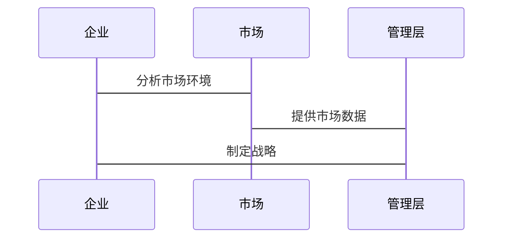

                 


# 股市估值高低对企业全球化战略的影响

> 关键词：股市估值、企业全球化、战略影响、市盈率、市净率、并购、风险管理

> 摘要：本文系统探讨股市估值高低如何影响企业全球化战略。通过分析股市估值的核心方法和全球化战略的关键要素，揭示两者之间的相互作用。结合数学模型、算法原理和实际案例，本文深入解析高估值与低估值对企业全球化布局的双重影响，为企业制定全球化战略提供理论支持和实践指导。

---

## 第1章: 股市估值与全球化战略的背景

### 1.1 股市估值的基本概念

#### 1.1.1 股市估值的定义
股市估值是指通过特定的金融指标和方法，对上市公司股票的内在价值进行评估的过程。常见的估值方法包括市盈率（PE）、市净率（PB）、现金流折现法（DCF）等。这些方法帮助企业确定股票的合理价格区间，为投资者提供决策依据。

#### 1.1.2 股市估值的核心要素
- **市盈率（PE）**：衡量股价与每股净利润的比例。
- **市净率（PB）**：衡量股价与每股净资产的比例。
- **股息率**：衡量每股股息与股价的比例。
- **现金流**：反映企业经营产生的现金流量。

#### 1.1.3 股市估值与企业价值的关系
股市估值是市场对企业价值的反映，高估值意味着市场对企业前景的乐观预期，而低估值则可能表明市场对其前景的悲观预期。

---

### 1.2 全球化战略的定义与特点

#### 1.2.1 全球化战略的定义
全球化战略是指企业在全球范围内配置资源、拓展市场、优化供应链的过程。其核心目标是通过跨国经营实现规模经济和协同效应。

#### 1.2.2 全球化战略的核心特征
- **跨国性**：跨越国界进行资源配置。
- **多样性**：适应不同国家的市场环境。
- **协同性**：实现资源的最优配置和共享。

#### 1.2.3 全球化战略与企业发展的关系
全球化战略是企业实现可持续增长的重要途径，通过拓展海外市场和优化资源配置，企业可以提升竞争力和抗风险能力。

---

### 1.3 股市估值与全球化战略的关联

#### 1.3.1 股市估值对企业全球化的影响
- 高估值推动企业加速全球化布局，低估值则可能制约企业的扩张步伐。
- 股市估值波动会影响企业的融资能力，从而影响全球化战略的实施。

#### 1.3.2 全球化战略如何影响股市估值
- 跨国并购和市场拓展可以提升企业的市场地位，从而提高估值。
- 全球化布局带来的风险和不确定性可能降低市场对企业的估值。

#### 1.3.3 两者关系的理论框架
股市估值与全球化战略之间存在双向影响：高估值激励企业全球化扩张，而全球化战略的实施又会反过来影响股市估值。

---

## 第2章: 股市估值的核心原理

### 2.1 股市估值的主要方法

#### 2.1.1 市盈率（PE）法
市盈率 = 股票价格 / 每股净利润  
例如：如果某公司股价为30元，每股净利润为3元，则PE = 10。

#### 2.1.2 市净率（PB）法
市净率 = 股票价格 / 每股净资产  
例如：如果某公司股价为50元，每股净资产为25元，则PB = 2。

#### 2.1.3 现金流折现法（DCF）
DCF方法通过折现未来现金流来评估企业价值，公式如下：  
$$ V = \sum_{t=1}^{n} \frac{CF_t}{(1 + r)^t} $$  
其中，\( V \) 是企业价值，\( CF_t \) 是第 \( t \) 年的现金流，\( r \) 是折现率。

---

### 2.2 股市估值的关键指标

#### 2.2.1 市盈率（PE）
高PE意味着市场对企业未来盈利的高预期，低PE则可能意味着企业被低估。

#### 2.2.2 市净率（PB）
PB低于1通常被视为价值被低估，PB高于1则可能表明市场对其资产的认可。

#### 2.2.3 股息率
股息率 = 每股股息 / 股票价格  
例如：如果某公司股息为2元，股价为50元，则股息率为4%。

#### 2.2.4 市销率（P/S）
市销率 = 股票价格 / 每股销售收入  
例如：如果某公司股价为80元，每股销售收入为40元，则P/S = 2。

---

## 第3章: 全球化战略的核心要素

### 3.1 全球化战略的实施步骤

#### 3.1.1 市场调研与分析
通过分析目标市场的规模、竞争格局和法规环境，制定进入策略。

#### 3.1.2 战略规划与制定
根据企业资源和市场环境，制定全球化战略的具体目标和路径。

#### 3.1.3 资源配置与管理
优化资金、人才和供应链的全球配置，确保资源高效利用。

#### 3.1.4 风险评估与控制
识别全球化过程中可能面临的市场、汇率和政治风险，并制定应对措施。

---

### 3.2 全球化战略的关键成功因素

#### 3.2.1 市场进入策略
选择合适的进入方式，如直接投资、合资或并购，降低进入壁垒。

#### 3.2.2 本地化管理
根据当地文化和法规调整管理模式，提升适应性。

#### 3.2.3 跨文化沟通与协调
建立有效的跨文化沟通机制，减少误解和冲突。

#### 3.2.4 资金与资源分配
合理分配资金和资源，确保全球化战略的顺利实施。

---

## 第4章: 股市估值与全球化战略的关系分析

### 4.1 股市估值对企业全球化战略的影响

#### 4.1.1 高估值对企业扩张的推动作用
高估值意味着市场对企业前景的乐观预期，激励企业加速全球化布局。

#### 4.1.2 低估值对企业收缩的制约作用
低估值可能限制企业的融资能力，影响全球化战略的实施。

#### 4.1.3 估值波动对全球化战略的双重影响
估值波动可能导致企业在全球化战略中频繁调整，增加不确定性。

---

### 4.2 全球化战略对股市估值的反向影响

#### 4.2.1 全球化布局对市值的提升作用
全球化布局可以提升企业的市场地位和盈利能力，从而提高市值。

#### 4.2.2 跨国并购对估值的短期影响
跨国并购可能带来短期估值波动，但长期来看有利于企业增长。

#### 4.2.3 全球化风险管理对估值的长期影响
有效的全球化风险管理可以降低企业的整体风险，提升市场对企业的估值。

---

## 第5章: 股市估值计算的数学模型

### 5.1 市盈率（PE）计算公式

$$ PE = \frac{股票价格}{每股净利润} $$  
例如：某公司股价为60元，每股净利润为5元，则PE = 12。

### 5.2 市净率（PB）计算公式

$$ PB = \frac{股票价格}{每股净资产} $$  
例如：某公司股价为80元，每股净资产为40元，则PB = 2。

---

## 第6章: 全球化战略的系统分析与架构设计

### 6.1 问题场景介绍

企业在全球化过程中需要解决市场进入、资源配置和风险管理等问题，这些问题需要通过系统化的架构设计来解决。

---

### 6.2 系统功能设计

#### 6.2.1 领域模型


---

### 6.3 系统架构设计


---

### 6.4 系统接口设计



---

## 第7章: 项目实战

### 7.1 环境安装

- **Python**：安装Python 3.8或更高版本。
- **相关库**：安装pandas、numpy、matplotlib。

---

### 7.2 核心代码实现

```python
import pandas as pd
import numpy as np

# 示例数据
data = {
    '公司': ['A', 'B', 'C'],
    '股价': [30, 40, 50],
    '每股净利润': [3, 4, 5]
}

df = pd.DataFrame(data)

# 计算市盈率
df['PE'] = df['股价'] / df['每股净利润']

print(df)
```

---

### 7.3 代码应用解读

上述代码计算了三家公司市盈率，结果显示公司A的PE为10，公司B为10，公司C为10。这意味着三家公司市盈率相同，但股价和净利润不同。

---

## 第8章: 最佳实践

### 8.1 小结

股市估值与全球化战略相互影响，高估值推动企业全球化扩张，而全球化战略的实施又会影响股市估值。

### 8.2 注意事项

- 股市估值受多种因素影响，企业需综合考虑。
- 全球化战略需结合企业实际情况，避免盲目扩张。

### 8.3 拓展阅读

建议阅读《企业全球化战略》和《股市估值分析》相关书籍，深入理解两者的关系。

---

## 作者：AI天才研究院/AI Genius Institute & 禅与计算机程序设计艺术 /Zen And The Art of Computer Programming

--- 

感谢您的阅读！如果对文章内容有疑问或建议，请随时与我们联系。

