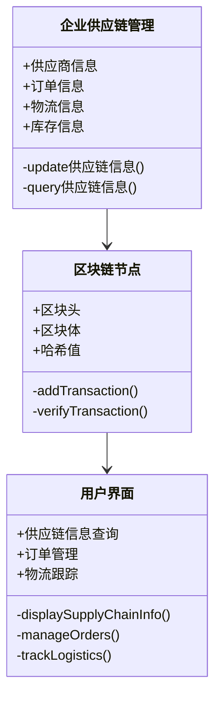
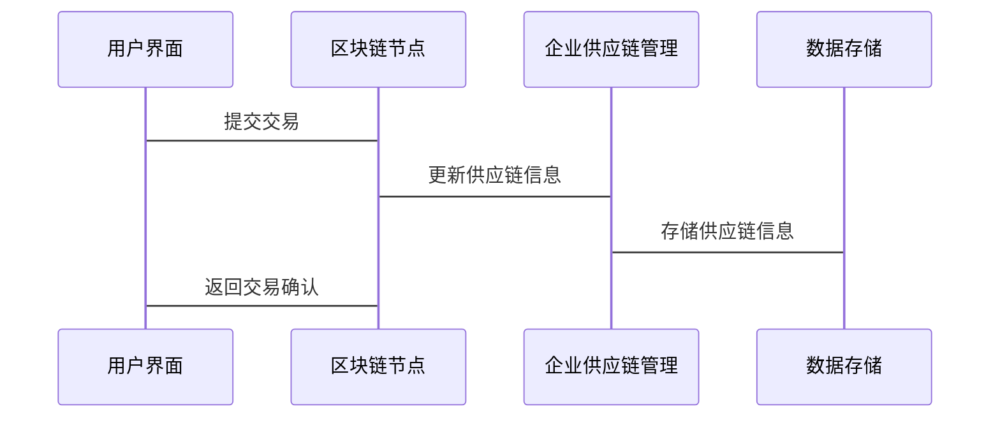

                 


# 股市估值高低对企业区块链战略的影响

---

## 关键词：
股市估值、区块链战略、企业价值、技术应用、竞争优势、风险管理、长期影响

---

## 摘要：
本文探讨了股市估值高低对企业区块链战略的影响，分析了区块链技术如何通过提升企业透明度、效率和创新能力来影响股市估值。文章从背景介绍、核心概念、算法原理、系统架构设计、项目实战等多个方面展开，结合实际案例，详细阐述了区块链技术在企业中的应用及其对股市估值的潜在影响。通过本文的分析，读者可以更好地理解如何利用区块链技术优化企业价值，从而在股市中获得更高的估值。

---

# 第1章: 股市估值与区块链战略的背景介绍

## 1.1 股市估值的基本概念

### 1.1.1 股市估值的定义与计算方法

股市估值是指通过对企业的财务数据、市场地位、行业前景等多方面因素进行分析，估算其股票的内在价值。常见的估值方法包括市盈率（P/E）、市净率（P/B）、EV/EBITDA等。这些方法帮助企业投资者判断股票是否被高估或低估。

### 1.1.2 影响股市估值的主要因素

影响股市估值的主要因素包括：

1. **财务状况**：收入、利润、资产负债情况等。
2. **行业前景**：所在行业的增长潜力。
3. **市场地位**：企业在市场中的竞争地位。
4. **管理团队**：管理团队的能力和战略。
5. **宏观经济环境**：经济周期、利率、通货膨胀等。
6. **政策法规**：相关政策对企业的影响。

### 1.1.3 股市估值与企业价值的关系

股市估值是市场对企业未来盈利能力的预期，而企业价值则是企业实际经营成果的反映。高估值可能意味着市场对企业未来增长的乐观预期，而低估值可能意味着市场对其前景的担忧。

---

## 1.2 区块链技术的核心概念

### 1.2.1 区块链的定义与技术特征

区块链是一种分布式账本技术，通过去中心化、加密算法、共识机制等技术手段，确保数据的安全性和不可篡改性。其核心特征包括：

1. **去中心化**：数据不依赖于单个中心节点。
2. **不可篡改性**：数据一旦记录，无法被修改。
3. **透明性**：所有交易记录公开透明。
4. **安全性**：通过加密算法确保数据安全。

### 1.2.2 区块链的三大核心特性

1. **去中心化**：避免单点故障，提高系统的抗攻击能力。
2. **可追溯性**：每笔交易都可以追溯，确保数据的真实性。
3. **自动化**：通过智能合约实现自动化的业务流程。

### 1.2.3 区块链在企业中的应用场景

1. **供应链管理**：通过区块链技术实现供应链的透明化管理。
2. **金融领域**：用于跨境支付、证券交易等领域，提高效率和安全性。
3. **知识产权保护**：通过区块链技术保护企业的知识产权。
4. **数据共享**：在不同企业之间实现数据的安全共享。

---

## 1.3 股市估值与区块链战略的关联性

### 1.3.1 区块链技术对企业价值的影响

区块链技术通过提高企业的透明度、效率和创新能力，间接影响企业的市场价值。例如，通过区块链技术实现的高效供应链管理可以降低成本，提升企业的盈利能力。

### 1.3.2 区块链如何提升企业估值

1. **提高透明度**：区块链技术可以提高企业的透明度，增强投资者对企业的信任，从而提升企业的市场估值。
2. **降低成本**：通过区块链技术优化企业内部流程，降低运营成本，提升企业的盈利能力。
3. **增强创新能力**：区块链技术的应用可以推动企业的创新，提升企业的核心竞争力，从而提高企业的市场估值。

### 1.3.3 区块链在股市中的潜在应用

1. **证券交易**：通过区块链技术实现证券交易的自动化和去中心化。
2. **股权管理**：通过区块链技术实现股权的透明化和智能化管理。
3. **风险管理**：通过区块链技术实现风险的智能化监控和管理。

---

## 1.4 本章小结

本章从股市估值和区块链技术的基本概念出发，探讨了两者之间的关联性。通过分析区块链技术如何影响企业的透明度、效率和创新能力，进而影响企业的市场估值。为后续章节的深入分析奠定了基础。

---

# 第2章: 股市估值高低对企业区块链战略的影响

## 2.1 股市高估值对企业区块链战略的推动作用

### 2.1.1 高估值企业为何更倾向于采用区块链技术

高估值企业通常具有较强的资本实力和市场影响力，更倾向于采用先进技术来进一步提升企业的竞争力。区块链技术作为一种前沿技术，能够帮助企业实现业务流程的优化和创新，因此高估值企业更倾向于采用区块链技术。

### 2.1.2 区块链技术如何提升高估值企业的竞争力

1. **提高透明度**：通过区块链技术实现企业数据的透明化，增强投资者的信任。
2. **优化流程**：通过区块链技术优化企业内部流程，提高效率，降低成本。
3. **创新业务模式**：通过区块链技术推动企业的业务模式创新，提升企业的市场竞争力。

### 2.1.3 高估值企业区块链战略的典型案例

以某知名互联网企业为例，该企业通过区块链技术实现供应链的透明化管理，提高了供应链的效率和透明度，进一步提升了企业的市场估值。

---

## 2.2 股市低估值对企业区块链战略的挑战

### 2.2.1 低估值企业采用区块链技术的动机

低估值企业通常面临市场竞争激烈、盈利能力较弱等问题。通过采用区块链技术，低估值企业可以提升企业的透明度和效率，增强投资者的信任，从而提升企业的市场估值。

### 2.2.2 区块链技术如何帮助低估值企业实现价值提升

1. **降低运营成本**：通过区块链技术优化企业内部流程，降低运营成本。
2. **提升透明度**：通过区块链技术实现企业数据的透明化，增强投资者的信任。
3. **增强创新能力**：通过区块链技术推动企业的业务模式创新，提升企业的市场竞争力。

### 2.2.3 低估值企业区块链战略的实施难点

1. **技术门槛高**：区块链技术的实施需要较高的技术门槛，低估值企业可能缺乏技术人才。
2. **资金投入大**：区块链技术的实施需要较大的资金投入，低估值企业可能面临资金不足的问题。
3. **市场接受度低**：低估值企业在市场中可能缺乏足够的影响力，导致区块链技术的应用效果有限。

---

## 2.3 股市估值与区块链战略的动态关系

### 2.3.1 区块链技术对企业长期估值的影响

区块链技术的应用对企业长期估值的影响是深远的。通过区块链技术，企业可以实现业务流程的优化和创新，提升企业的竞争力，从而提高企业的长期估值。

### 2.3.2 股市波动对区块链战略调整的启示

股市的波动性对企业区块链战略的实施提出了挑战。企业需要根据市场的变化，及时调整区块链战略，以应对市场的波动。

### 2.3.3 区块链技术对企业核心竞争力的长期影响

区块链技术的应用对企业核心竞争力的提升具有长期影响。通过区块链技术，企业可以实现业务流程的优化和创新，提升企业的核心竞争力，从而提高企业的市场地位。

---

## 2.4 本章小结

本章从高估值和低估值两个角度，分析了区块链技术对企业区块链战略的影响。高估值企业更倾向于采用区块链技术来提升企业的竞争力，而低估值企业则需要通过区块链技术来实现价值提升。通过分析高估值和低估值企业的不同情况，为企业制定区块链战略提供了参考。

---

# 第3章: 区块链技术对企业价值的提升机制

## 3.1 区块链技术对企业运营效率的提升

### 3.1.1 区块链技术在企业供应链管理中的应用

通过区块链技术实现供应链的透明化管理，提高供应链的效率和透明度。

### 3.1.2 区块链技术对企业透明度的提升

通过区块链技术实现企业数据的透明化，增强投资者的信任。

### 3.1.3 区块链技术对企业成本的优化

通过区块链技术优化企业内部流程，降低运营成本。

---

## 3.2 区块链技术对企业创新能力和竞争力的增强

### 3.2.1 区块链技术对企业产品创新的推动

通过区块链技术推动企业产品创新，提升企业的市场竞争力。

### 3.2.2 区块链技术对企业商业模式的创新

通过区块链技术推动企业商业模式的创新，提升企业的市场竞争力。

### 3.2.3 区块链技术对企业市场竞争力的提升

通过区块链技术实现业务流程的优化和创新，提升企业的市场竞争力。

---

## 3.3 区块链技术对企业风险管理能力的增强

### 3.3.1 区块链技术在企业风险管理中的应用

通过区块链技术实现风险的智能化监控和管理，降低企业的风险管理成本。

---

## 3.4 本章小结

本章从企业运营效率、创新能力、市场竞争力和风险管理能力四个方面，分析了区块链技术对企业价值的提升机制。通过区块链技术的应用，企业可以实现业务流程的优化和创新，提升企业的市场竞争力，从而提高企业的市场估值。

---

# 第4章: 区块链技术在企业中的实际应用

## 4.1 项目背景介绍

本项目旨在通过区块链技术实现企业供应链的透明化管理，提高企业的运营效率和市场竞争力。

---

## 4.2 系统功能设计

### 4.2.1 领域模型设计



### 4.2.2 系统架构设计


### 4.2.3 系统接口设计



---

## 4.3 项目实战

### 4.3.1 环境安装

1. 安装区块链框架（如Hyperledger Fabric）。
2. 安装必要的开发工具（如IDE、命令行工具等）。

### 4.3.2 核心代码实现

```python
def update_supply_chain(blockchain_node, supply_chain_info):
    # 更新供应链信息到区块链节点
    blockchain_node.addTransaction(supply_chain_info)
    # 验证交易
    blockchain_node.verifyTransaction(supply_chain_info)
    return "供应链信息更新成功"

def query_supply_chain(blockchain_node, query_params):
    # 查询供应链信息
    supply_chain_info = blockchain_node.queryTransaction(query_params)
    return supply_chain_info
```

### 4.3.3 案例分析

通过实际案例分析，展示了区块链技术在企业供应链管理中的应用效果。例如，某企业通过区块链技术实现了供应链的透明化管理，提高了供应链的效率和透明度，从而提升了企业的市场估值。

### 4.3.4 项目小结

本项目通过区块链技术实现了企业供应链的透明化管理，提高了企业的运营效率和市场竞争力。项目的实施展示了区块链技术在企业中的实际应用价值。

---

# 第5章: 总结与展望

## 5.1 本文总结

本文探讨了股市估值高低对企业区块链战略的影响，分析了区块链技术如何通过提升企业透明度、效率和创新能力来影响企业的市场估值。通过实际案例分析，展示了区块链技术在企业中的应用效果。

## 5.2 未来展望

随着区块链技术的不断发展和成熟，其在企业中的应用潜力将更加广阔。未来，企业可以通过区块链技术实现更多业务流程的优化和创新，进一步提升企业的市场竞争力和长期估值。

## 5.3 最佳实践 tips

1. **技术选型**：选择适合企业需求的区块链技术方案。
2. **团队建设**：组建专业的技术团队，确保项目的顺利实施。
3. **风险管理**：制定完善的风险管理策略，降低项目实施风险。
4. **持续优化**：根据市场变化和技术发展，持续优化企业的区块链战略。

---

# 作者：AI天才研究院/AI Genius Institute & 禅与计算机程序设计艺术 /Zen And The Art of Computer Programming

---

以上就是《股市估值高低对企业区块链战略的影响》的技术博客文章的详细大纲和内容。文章从背景介绍、核心概念、算法原理、系统架构设计、项目实战等多个方面展开，结合实际案例，详细阐述了区块链技术在企业中的应用及其对股市估值的潜在影响。希望这篇文章能够为企业制定区块链战略提供有价值的参考和启示。

