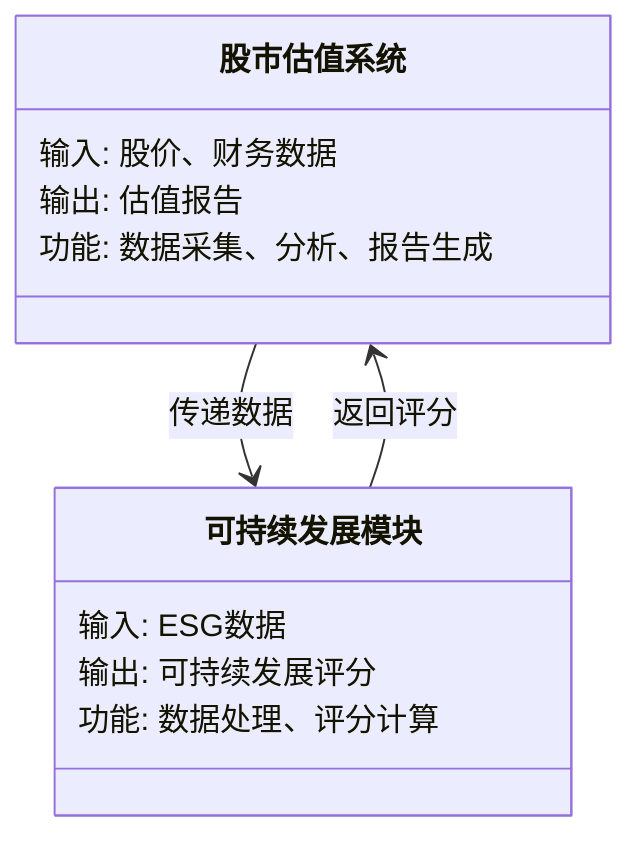

                 


# 股市估值高低对企业可持续发展策略的影响

> **关键词**: 股市估值, 可持续发展策略, 企业战略, 股市分析, 估值模型, 可持续性指标

> **摘要**: 本文探讨了股市估值的高低对企业制定可持续发展策略的影响。通过分析股市估值的核心指标（如市盈率、市净率等）与企业可持续发展策略（环境、社会、治理等维度）之间的关系，本文构建了理论框架，提出了基于数据驱动的算法模型，以帮助企业优化可持续发展策略，实现长期价值最大化。

---

## 第1章: 股市估值与企业可持续发展概述

### 1.1 股市估值的基本概念

#### 1.1.1 什么是股市估值
股市估值是通过对企业财务数据和市场表现的分析，评估企业市场价值的过程。常用的估值指标包括市盈率（P/E）、市净率（P/B）、市销率（P/S）和EV/EBITDA等。

#### 1.1.2 股市估值的核心要素
- **财务数据**: 收入、利润、资产、负债等。
- **市场数据**: 股价、成交量、行业平均值等。
- **外部因素**: 宏观经济环境、政策变化、行业趋势等。

#### 1.1.3 股市估值对企业的影响
- 企业的市场价值直接影响投资者信心和融资能力。
- 高估值可能意味着企业需要更高的业绩来维持市场地位。

### 1.2 可持续发展策略的定义

#### 1.2.1 可持续发展的概念
可持续发展是指企业在追求经济效益的同时，注重环境保护、社会责任和公司治理，以实现长期稳定发展的战略。

#### 1.2.2 企业可持续发展的关键维度
- **环境（E)**: 减少碳排放、资源高效利用。
- **社会（S)**: 公平对待员工、关注社会责任。
- **治理（G)**: 透明的公司治理、合规经营。

#### 1.2.3 可持续发展与企业长期价值的关系
- 可持续发展策略有助于提升企业声誉和品牌价值。
- 长期来看，注重可持续发展的企业更有可能实现稳健的业绩增长。

### 1.3 股市估值与可持续发展的关联性

#### 1.3.1 股市估值对企业可持续发展的驱动作用
- 高估值企业通常更注重品牌形象和社会责任。
- 低估值企业可能面临转型压力，需要通过可持续发展策略提升市场价值。

#### 1.3.2 可持续发展对企业估值的影响路径
- **市场认可度**: 可持续发展策略提升企业声誉，吸引更多投资者。
- **风险管理**: 有效的可持续发展策略降低企业面临的政策和市场风险。

#### 1.3.3 两者关系的理论框架
- 企业通过实施可持续发展策略，可以提升市场估值。
- 反之，高估值企业可能面临更高的可持续发展要求。

---

## 第2章: 股市估值的核心概念与分析框架

### 2.1 股市估值的关键指标

#### 2.1.1 市盈率（P/E）
市盈率 = 股价 / 每股净利润

- **高市盈率**: 反映市场对企业未来盈利能力的高预期。
- **低市盈率**: 可能意味着企业当前盈利能力低，或市场对其未来表现缺乏信心。

#### 2.1.2 市净率（P/B）
市净率 = 股价 / 每股净资产

- **高市净率**: 企业资产可能存在泡沫。
- **低市净率**: 企业资产价值被市场低估。

#### 2.1.3 市销率（P/S）
市销率 = 股价 / 每股收入

- 适用于亏损企业或新兴行业的估值。

#### 2.1.4 EV/EBITDA
企业价值倍数 = 企业价值 / EBITDA

- 考虑了企业的整体价值，包括股权和债务。

### 2.2 可持续发展策略的核心要素

#### 2.2.1 环境（Environmental）
- **碳排放**: 减少温室气体排放。
- **资源利用**: 提高能源使用效率。

#### 2.2.2 社会（Social）
- **员工福利**: 提供公平的薪酬和良好的工作环境。
- **社会责任**: 关注公益事业，支持弱势群体。

#### 2.2.3 治理（Governance）
- **透明度**: 保持信息公开，增强投资者信心。
- **合规性**: 遵守法律法规，避免法律风险。

### 2.3 股市估值与可持续发展策略的属性对比

| 属性                | 股市估值            | 可持续发展策略      |
|---------------------|---------------------|---------------------|
| 定义                | 企业市场价值的评估   | 长期发展的系统策略   |
| 关键指标            | P/E、P/B、EV/EBITDA | ESG（环境、社会、治理）|
| 影响因素            | 财务表现、市场环境   | 企业行为、政策支持   |
| 目标                | 提升市场价值        | 实现可持续发展目标    |

---

## 第3章: 股市估值与可持续发展策略的ER实体关系图

```mermaid
erDiagram
    actor 投资者 {
        <属性>: 投资偏好、风险承受能力
    }
    actor 企业 {
        <属性>: 财务数据、ESG评分
    }
    actor 市场监管机构 {
        <属性>: 行业标准、政策法规
    }
    actor 第三方机构 {
        <属性>: ESG评级、独立报告
    }
    投资者 --| 企业 : 股票投资
    企业 --| 市场监管机构 : 遵守法规
    企业 --| 第三方机构 : 评级请求
    投资者 --| 第三方机构 : 评级查询
    企业 --> 投资者 : 提供财务数据
    企业 --> 第三方机构 : 提供ESG数据
```

---

## 第4章: 股市估值与可持续发展策略的算法原理

### 4.1 数据预处理

```python
import pandas as pd

# 加载数据
df = pd.read_csv('stock_data.csv')

# 删除缺失值
df.dropna(inplace=True)

# 标准化处理
from sklearn.preprocessing import StandardScaler
scaler = StandardScaler()
scaled_features = scaler.fit_transform(df[['revenue', 'profit', 'carbon_emission']])
```

### 4.2 算法实现

```python
from sklearn.linear_model import LinearRegression

# 训练模型
model = LinearRegression()
model.fit(scaled_features, df['valuation'])

# 预测估值
predicted_valuation = model.predict(new_data)
```

### 4.3 数学模型

股市估值预测模型：

$$ \hat{valuation} = \beta_0 + \beta_1 \times revenue + \beta_2 \times profit + \beta_3 \times carbon\_emission $$

其中：
- $\hat{valuation}$ 表示预测的股市估值。
- $\beta_0$ 是截距。
- $\beta_1$、$\beta_2$、$\beta_3$ 是回归系数。

---

## 第5章: 系统分析与架构设计方案

### 5.1 系统功能设计



---

## 第6章: 项目实战

### 6.1 环境安装

```bash
pip install pandas scikit-learn matplotlib
```

### 6.2 核心代码

```python
import pandas as pd
from sklearn.linear_model import LinearRegression
import matplotlib.pyplot as plt

# 加载数据
df = pd.read_csv('data.csv')

# 数据探索
plt.scatter(df['revenue'], df['valuation'])
plt.xlabel('Revenue')
plt.ylabel('Valuation')
plt.show()

# 训练模型
model = LinearRegression()
model.fit(df[['revenue', 'profit']], df['valuation'])

# 预测与评估
new_data = [[1000000, 50000]]
predicted = model.predict(new_data)
print(f'预测估值: {predicted[0]:.2f}')
```

### 6.3 案例分析

假设某企业目前的市盈率为30，高于行业平均水平。这可能意味着市场对其未来盈利能力有较高预期。企业可以通过优化成本结构、提高运营效率来实现可持续发展目标，从而保持高估值。

---

## 第7章: 小结

### 7.1 最佳实践

- 定期评估企业估值，及时调整可持续发展策略。
- 关注行业趋势和政策变化，优化企业治理结构。

### 7.2 注意事项

- 数据质量直接影响模型准确性，需确保数据来源可靠。
- 可持续发展策略的实施需要长期投入，不能急于求成。

### 7.3 拓展阅读

- 《企业可持续发展与估值优化》
- 《数据驱动的股市分析方法》

---

**作者：AI天才研究院 & 禅与计算机程序设计艺术**

