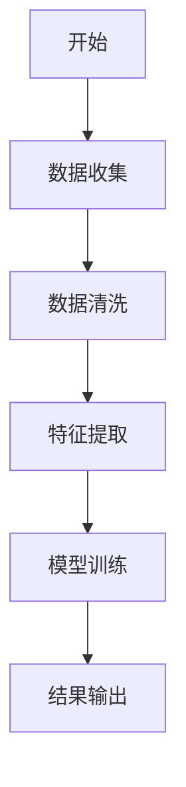
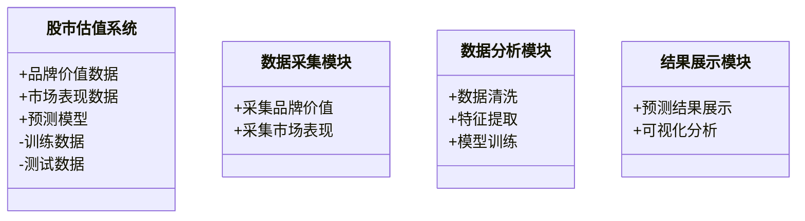

                 


# 股市估值高低对企业品牌价值的影响

## 关键词：股市估值、品牌价值、企业价值、市场表现、算法分析

## 摘要：本文探讨股市估值与品牌价值之间的关系，分析股市估值对企业品牌价值的影响机制。通过背景介绍、核心概念对比、算法原理、系统设计和实际案例，帮助读者理解如何将品牌价值纳入股市估值模型，提升企业价值。

---

## 第一部分：背景介绍

### 第1章：股市估值与品牌价值的核心概念

#### 1.1 问题背景与描述

- **股市估值的基本概念**：股市估值是通过对企业财务数据、市场地位和行业趋势的分析，评估企业市值的过程。
- **品牌价值的定义与内涵**：品牌价值是企业在市场中通过品牌认知度、客户忠诚度和品牌声誉所体现的价值。
- **两者关系**：股市估值反映企业整体价值，品牌价值是其重要组成部分，影响投资者对企业未来盈利能力的预期。

#### 1.2 问题解决与边界

- **问题解决**：通过分析品牌价值对股市估值的影响，优化企业价值评估模型。
- **边界与外延**：仅考虑品牌价值对股市估值的影响，不涉及其他因素如财务业绩。
- **核心要素**：品牌认知度、客户忠诚度、品牌声誉。

---

## 第二部分：核心概念与联系

### 第2章：股市估值与品牌价值的属性对比

#### 2.1 核心概念原理

- **股市估值**：基于财务指标和市场表现，评估企业市值。
- **品牌价值**：通过品牌资产和市场影响力，评估品牌带来的附加价值。

#### 2.2 属性对比分析

| 属性维度 | 股市估值 | 品牌价值 |
|----------|----------|----------|
| 评估依据 | 财务数据、市场表现 | 品牌认知度、客户忠诚度 |
| 评估主体 | 投资者、金融机构 | 品牌评估机构、消费者 |
| 评估目的 | 确定企业市值 | 评估品牌资产价值 |

#### 2.3 实体关系图


---

## 第三部分：算法原理与数学模型

### 第3章：股市估值与品牌价值的算法分析

#### 3.1 算法流程图



#### 3.2 核心代码实现

```python
# 环境安装
pip install numpy pandas scikit-learn

# 核心代码
from sklearn.linear_model import LinearRegression
import pandas as pd

# 数据加载与预处理
data = pd.read_csv('input.csv')
X = data[['brand_value']]
y = data['stock_value']

# 模型训练
model = LinearRegression()
model.fit(X, y)

# 模型预测
predicted = model.predict(X)
```

#### 3.3 数学模型与公式

- **线性回归模型**：用于预测股市估值
  $$ y = \beta_0 + \beta_1 x + \epsilon $$
  其中，$$ y $$ 是股市估值，$$ x $$ 是品牌价值，$$ \epsilon $$ 是误差项。

---

## 第四部分：系统分析与架构设计

### 第4章：系统分析与架构设计方案

#### 4.1 问题场景介绍

- **问题场景**：如何将品牌价值数据纳入股市估值模型，提升预测准确性。
- **系统介绍**：开发一个基于品牌价值的股市估值预测系统。

#### 4.2 功能设计与类图



#### 4.3 系统架构与接口设计


---

## 第五部分：项目实战

### 第5章：项目实战与应用

#### 5.1 环境安装与数据准备

- **环境安装**：安装Python、Pandas、Scikit-learn。
- **数据准备**：收集品牌价值和市场表现数据，保存为CSV文件。

#### 5.2 核心代码实现

```python
import pandas as pd
from sklearn.metrics import mean_squared_error

# 数据加载
data = pd.read_csv('input.csv')

# 特征与目标变量
X = data[['brand_value']]
y = data['stock_value']

# 划分训练集和测试集
from sklearn.model_selection import train_test_split
X_train, X_test, y_train, y_test = train_test_split(X, y, test_size=0.2, random_state=42)

# 模型训练
model = LinearRegression()
model.fit(X_train, y_train)

# 模型预测
y_pred = model.predict(X_test)

# 模型评估
mse = mean_squared_error(y_test, y_pred)
print(f'Mean Squared Error: {mse}')
```

#### 5.3 实际案例分析

- **案例分析**：使用某企业品牌价值数据，训练模型并预测股市估值。
- **结果解读**：模型预测的股市估值与实际值进行对比，评估模型准确性。

---

## 第六部分：最佳实践与小结

### 第6章：最佳实践与小结

#### 6.1 小结

- **核心观点**：品牌价值是影响股市估值的重要因素，企业应注重品牌建设。
- **方法总结**：通过算法分析和系统设计，将品牌价值纳入股市估值模型，提升预测准确性。

#### 6.2 注意事项

- **数据质量**：确保品牌价值数据的准确性和完整性。
- **模型选择**：根据实际情况选择合适的算法，避免过拟合。
- **持续优化**：定期更新模型，适应市场变化。

#### 6.3 拓展阅读

- 推荐阅读相关书籍和论文，深入研究品牌价值与股市估值的关系。

---

## 作者：AI天才研究院 & 禅与计算机程序设计艺术

通过本文的详细分析，我们探讨了股市估值与品牌价值之间的关系，提供了从理论到实践的全面指导。希望读者能通过本文，更好地理解品牌价值对企业整体价值的影响，并在实际中应用这些方法。

