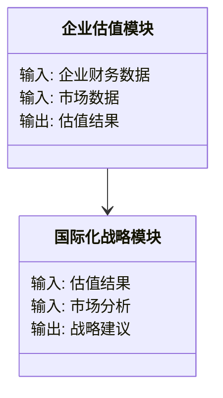
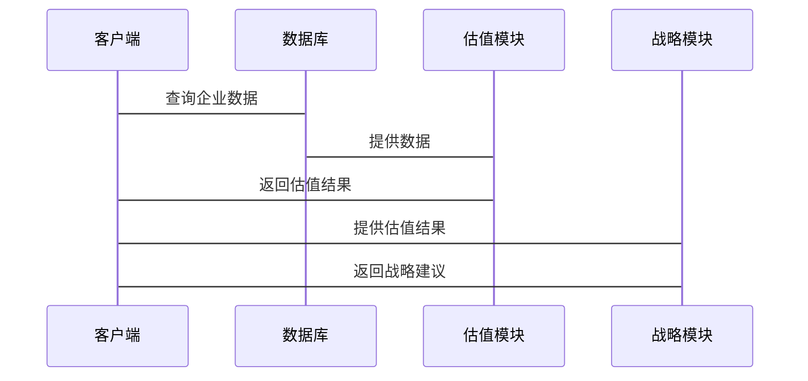

                 


# 股市估值高低对企业国际化战略的影响

**关键词**：股市估值、国际化战略、企业价值、全球化、资产定价模型

**摘要**：本文探讨股市估值高低对企业国际化战略的影响，分析不同估值水平下企业采取的不同战略选择，并结合数学模型和实际案例，提出优化企业国际化战略的建议。文章从理论基础、数学模型、系统架构、项目实战等多方面展开分析，为企业制定国际化战略提供参考。

---

# 第1章: 股市估值与国际化战略的背景介绍

## 1.1 股市估值的基本概念

### 1.1.1 股票估值的定义与方法
股票估值是通过一定的方法和模型对企业的内在价值进行评估，常用的估值方法包括市盈率（PE）、市净率（PB）、股息率等。这些方法帮助企业确定股票的合理价格区间，为投资者提供决策依据。

### 1.1.2 国际化战略的定义与内涵
国际化战略是指企业在拓展国际市场时采取的一系列策略，包括市场进入方式（如直接投资、并购）、产品本地化、风险管理等。国际化战略的核心目标是利用全球资源和市场，提升企业的竞争力和增长潜力。

### 1.1.3 股市估值与国际化战略的关联性
股市估值反映了市场对企业的整体评价，高估值意味着市场对企业未来增长的预期较高，而国际化战略的实施能够提升企业的增长潜力，从而影响股市估值。两者的相互作用为企业制定战略提供了重要参考。

## 1.2 问题背景与问题描述

### 1.2.1 全球化背景下企业扩张的需求
随着全球经济一体化的深入，企业为了寻找新的增长点，纷纷实施国际化战略。然而，国际化过程中面临的风险和挑战也不断增加，如何通过合理估值优化战略选择成为关键。

### 1.2.2 股市估值对企业价值的影响
股市估值直接影响企业的市场价值和资本成本。高估值可能带来更高的资本成本，而低估值可能影响企业的市场形象和融资能力。因此，企业需要根据估值水平调整国际化战略。

### 1.2.3 企业国际化战略中的估值问题
企业在制定国际化战略时，需考虑目标市场的估值水平。高估值市场可能面临竞争压力，而低估值市场可能隐藏着并购机会。如何在不同估值水平下制定最优战略，是本文的核心问题。

## 1.3 问题解决与边界外延

### 1.3.1 通过估值优化提升国际化能力
企业可以通过优化估值模型，准确评估目标市场的潜力，从而制定更具竞争力的国际化战略。

### 1.3.2 估值与国际化战略的边界与限制
本文研究的边界包括企业规模、行业特点、市场环境等因素，确保研究结果的适用性和可行性。

### 1.3.3 核心要素与组成结构分析
企业国际化战略的核心要素包括市场分析、估值模型、风险评估等，这些要素共同构建了本文的分析框架。

---

# 第2章: 核心概念与联系

## 2.1 核心概念原理

### 2.1.1 股市估值的核心模型
常用的估值模型包括现金流折现模型（DCF）、相对估值模型（PE、PB等）。这些模型帮助企业评估企业的内在价值。

### 2.1.2 国际化战略的驱动因素
市场扩张、资源获取、技术整合是驱动企业国际化的主要因素。不同驱动因素决定了企业选择不同的国际化策略。

### 2.1.3 估值与战略的相互作用机制
高估值市场可能促使企业采取有机增长策略，而低估值市场则可能促使企业寻求并购机会。估值水平与战略选择相互影响，共同决定企业的国际化进程。

## 2.2 核心概念对比分析

### 2.2.1 不同估值水平下的战略选择
| 估值水平 | 战略选择                  |
|----------|---------------------------|
| 高估值   | 有机增长、品牌建设        |
| 低估值   | 并购、市场整合            |

### 2.2.2 ER实体关系图架构
```mermaid
er
actor 企业
actor 市场
actor 估值
```

---

# 第3章: 股市估值与国际化战略的数学模型分析

## 3.1 理论基础

### 3.1.1 国际投资组合理论
国际投资组合理论强调通过多元化投资降低风险，为企业制定国际化战略提供理论支持。

### 3.1.2 资产定价模型（CAPM、APT）
CAPM模型用于评估资产的期望回报率，APT模型则基于市场因素解释资产定价。

## 3.2 数学模型与公式

### 3.2.1 CAPM 模型公式
$$ CAPM = R_f + β (R_m - R_f) $$

### 3.2.2 资产价值评估公式
$$ V = \sum_{t=1}^{n} \frac{CF_t}{(1 + r)^t} $$

### 3.2.3 国际化战略的估值影响模型
$$ V_{intl} = V_{base} \times (1 + \beta \times (R_m - R_f)) $$

---

# 第4章: 系统分析与架构设计方案

## 4.1 问题场景介绍
企业在制定国际化战略时，需综合考虑股市估值、市场风险、竞争环境等因素。系统需帮助企业分析这些因素，制定最优战略。

## 4.2 系统功能设计


## 4.3 系统架构设计


## 4.4 系统交互序列图


---

# 第5章: 项目实战

## 5.1 环境安装
安装Python、数据分析库（如Pandas、NumPy）和可视化工具（如Matplotlib）。

## 5.2 核心实现源代码

```python
import pandas as pd
import numpy as np

def calculate_valuation(fundamentals, market_data):
    # 示例：使用CAPM模型计算估值
    R_f = 0.05
    beta = 1.2
    R_m = 0.1
    required_return = R_f + beta * (R_m - R_f)
    # 使用DCF模型计算企业价值
    CF_t = [100, 150, 200]
    discount_rate = 0.08
    V = sum([CF / (1 + discount_rate)**t for t, CF in enumerate(CF_t)])
    return V

# 示例数据
fundamentals = {' revenues': 1000, 'profits': 200}
market_data = {'market_return': 0.1, 'risk_free_rate': 0.05}

valuation = calculate_valuation(fundamentals, market_data)
print("企业估值:", valuation)
```

## 5.3 案例分析
通过具体案例分析，展示如何应用上述模型和代码制定国际化战略。例如，分析某企业在高估值市场中的有机增长策略。

## 5.4 本章小结
总结项目实现的关键点，强调理论与实践的结合。

---

# 结论与展望

## 6.1 结论
本文通过理论分析和案例研究，探讨了股市估值高低对企业国际化战略的影响，提出了优化战略的建议。

## 6.2 展望
未来研究可进一步结合人工智能技术，提升估值模型的精准度，为企业制定更智能的国际化战略。

---

# 参考文献
（此处列出相关文献）

---

作者：AI天才研究院/AI Genius Institute & 禅与计算机程序设计艺术 /Zen And The Art of Computer Programming

