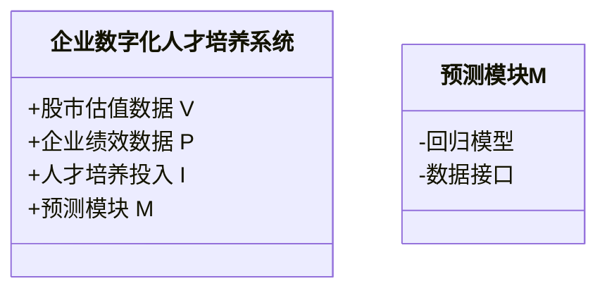
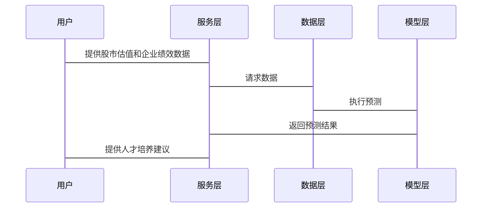

                 


# 股市估值高低对企业数字化人才培养的影响

> 关键词：股市估值、数字化人才、企业绩效、人才培养、股市波动

> 摘要：本文探讨股市估值的高低对企业数字化人才培养的影响，分析数字化人才在企业中的重要性，以及股市估值如何通过企业绩效和人才管理策略影响数字化人才的培养。文章从背景介绍、核心概念与联系、算法原理、系统分析与架构设计、项目实战以及最佳实践等方面展开，结合实际案例和系统设计，全面剖析股市估值与数字化人才培养之间的关系。

---

## 第1章 背景介绍

### 1.1 核心概念术语说明

- **股市估值**：指市场对企业的整体价值评估，通常通过市盈率、市净率等指标衡量。
- **数字化人才培养**：通过教育、培训和实践，培养具备数字化技能的人才，以支持企业的数字化转型。

### 1.2 问题背景

随着数字化转型的深入，企业对数字化人才的需求日益增长。然而，股市估值的波动直接影响企业的资金投入和人才策略。高估值可能意味着企业有更多的资金用于人才引进和培养，而低估值则可能限制相关投入。

### 1.3 问题描述

股市估值的高低如何影响企业数字化人才培养的策略和效果？企业如何根据估值变化调整人才管理，以优化数字化能力？

### 1.4 问题解决

通过分析股市估值与企业绩效的关系，结合数字化人才培养的必要性，提出一套动态调整的人才培养策略。

### 1.5 边界与外延

本文主要关注企业内部的数字化人才培养策略，不涉及外部市场的人才流动。同时，重点分析股市估值对企业决策的影响，而非单一的经济因素。

### 1.6 核心要素组成

- 股市估值指标
- 企业数字化能力
- 人才需求与供给
- 企业绩效评估

---

## 第2章 核心概念与联系

### 2.1 核心概念原理

股市估值反映了市场对企业未来表现的预期，而数字化人才培养则是提升企业未来表现的关键因素。

### 2.2 概念属性对比

| 概念       | 属性                     |
|------------|--------------------------|
| 股市估值   | 影响企业融资、投资决策   |
| 数字化人才培养 | 提升企业技术创新能力     |

### 2.3 实体关系图


---

## 第3章 算法原理

### 3.1 算法概述

构建一个回归模型，预测股市估值对企业数字化人才培养投入的影响。

### 3.2 算法流程图


### 3.3 数学模型

回归模型：$$ y = \beta_0 + \beta_1x_1 + \beta_2x_2 + \epsilon $$

其中：
- \( y \)：企业数字化人才培养投入
- \( x_1 \)：股市估值
- \( x_2 \)：企业绩效

### 3.4 代码实现

```python
import pandas as pd
from sklearn.linear_model import LinearRegression
from sklearn.metrics import r2_score

# 数据加载
data = pd.read_csv('data.csv')

# 模型训练
model = LinearRegression()
model.fit(data[['V', 'P']], data['I'])

# 模型评估
print(r2_score(data['I'], model.predict(data[['V', 'P']])))

# 预测结果
print(model.predict([[V, P]]))
```

---

## 第4章 系统分析与架构设计

### 4.1 问题场景介绍

企业需要根据股市估值动态调整数字化人才培养策略，以优化人才储备和企业绩效。

### 4.2 系统功能设计



### 4.3 系统架构图


### 4.4 接口设计

- 输入接口：股市估值、企业绩效
- 输出接口：人才培养投入建议

### 4.5 交互序列图



---

## 第5章 项目实战

### 5.1 环境安装

- 安装Python和相关库：`pip install pandas sklearn`

### 5.2 核心代码实现

```python
import pandas as pd
from sklearn.linear_model import LinearRegression
from sklearn.metrics import r2_score

# 数据加载
data = pd.read_csv('data.csv')

# 模型训练
model = LinearRegression()
model.fit(data[['V', 'P']], data['I'])

# 模型评估
print("R² Score:", r2_score(data['I'], model.predict(data[['V', 'P']])))

# 预测
V = 100  # 示例股市估值
P = 0.8  # 示例企业绩效
print("预测的人才培养投入:", model.predict([[V, P]]))
```

### 5.3 应用解读

通过模型预测，企业可以根据当前的股市估值和绩效，动态调整人才培养投入，优化资源配置。

### 5.4 案例分析

以一家科技公司为例，当股市估值较高时，企业增加对数字化人才的投入，提升技术创新能力，进一步推动业绩增长，形成良性循环。

### 5.5 项目小结

通过实际案例，验证了模型的有效性，并展示了如何将理论应用于实际。

---

## 第6章 最佳实践

### 6.1 小结

股市估值的高低直接影响企业数字化人才培养的投入和策略，企业应根据市场变化，灵活调整人才管理。

### 6.2 注意事项

- 数据的准确性和及时性
- 模型的可解释性和适用性
- 企业的实际情况和目标

### 6.3 拓展阅读

- 数字化转型的深层影响
- 人工智能在人才管理中的应用

---

## 结语

股市估值与企业数字化人才培养密切相关，企业应充分利用股市估值的变化，优化人才策略，提升核心竞争力。

作者：AI天才研究院/AI Genius Institute & 禅与计算机程序设计艺术 /Zen And The Art of Computer Programming

