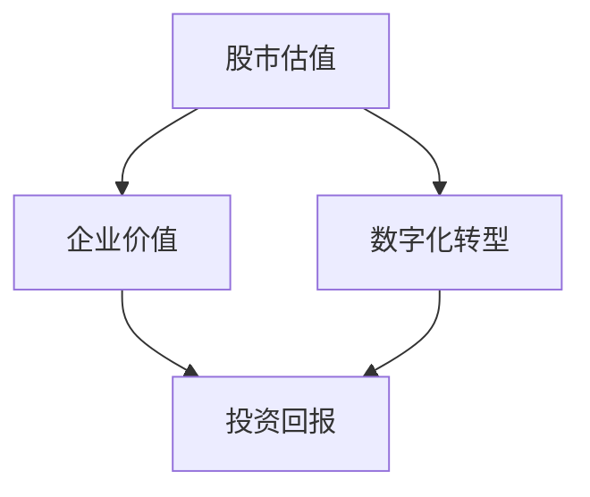
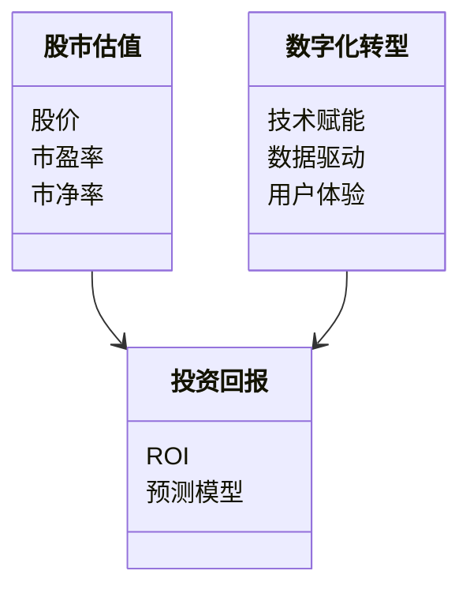
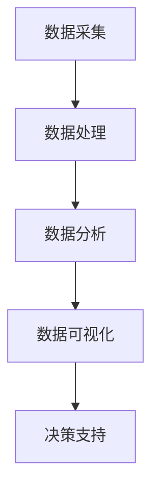
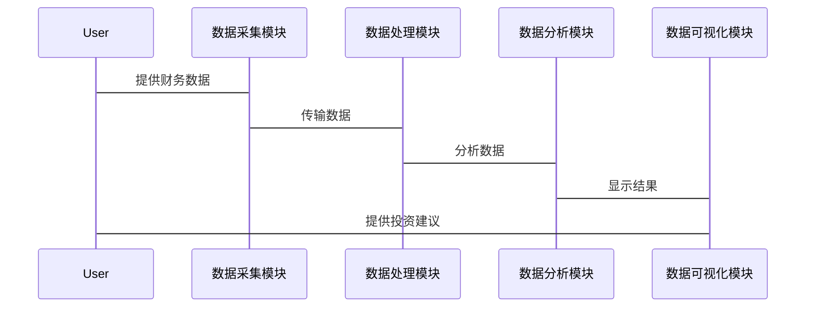

                 


# 股市估值高低对企业数字化转型投资回报的影响

> **关键词**：股市估值、数字化转型、投资回报、企业价值、算法分析  
> **摘要**：本文深入探讨了股市估值的高低对企业数字化转型投资回报的影响，通过分析股市估值的核心概念、数字化转型的特征、两者之间的关系，结合数学模型和系统架构设计，为企业投资者和管理层提供科学的决策参考。

---

# 第一部分: 背景介绍

## 第1章: 股市估值与数字化转型的背景

### 1.1 股市估值的基本概念

#### 1.1.1 股市估值的定义
股市估值是指通过对企业的财务数据、市场表现和行业趋势等多方面因素进行分析，评估企业股票的内在价值。常见的估值指标包括市盈率（P/E）、市净率（P/B）和股息率等。

#### 1.1.2 市盈率与市净率
- **市盈率（P/E）**：股价除以每股收益（EPS），反映了投资者对每股收益的支付意愿。
- **市净率（P/B）**：股价除以每股净资产，反映了资产的市场价值与账面价值的差异。

#### 1.1.3 股市估值的意义
股市估值不仅是投资者决策的重要依据，也是企业优化资本结构、制定战略的重要参考。

---

### 1.2 数字化转型的定义与特点

#### 1.2.1 数字化转型的定义
数字化转型是指企业利用数字技术（如大数据、人工智能、云计算等）重构业务模式、流程和文化，以适应快速变化的市场环境。

#### 1.2.2 数字化转型的核心特征
- 数据驱动决策
- 技术赋能业务
- 用户体验为核心
- 智能化与自动化

#### 1.2.3 数字化转型与企业创新的关系
数字化转型不仅是技术的升级，更是企业商业模式和组织文化的创新。通过数字化转型，企业能够更高效地响应市场需求，提升竞争力。

---

### 1.3 股市估值与数字化转型的关联性

#### 1.3.1 股市估值对企业投资的影响
股市估值直接影响投资者对企业的信心，进而影响企业的融资成本和投资决策。

#### 1.3.2 数字化转型对企业发展的影响
数字化转型能够提升企业的运营效率、降低成本，并为企业创造新的收入来源。

#### 1.3.3 两者结合对企业投资回报的潜在影响
股市估值的高低反映了市场对企业的认可度，而数字化转型的实施能够提升企业的内在价值，从而影响股市估值和投资回报。

---

### 1.4 问题背景与研究意义

#### 1.4.1 当前股市估值的现状
近年来，全球股市波动加剧，数字化转型成为企业应对市场变化的重要策略。

#### 1.4.2 数字化转型在企业中的发展趋势
随着技术的不断进步，数字化转型已成为企业竞争的核心能力。

#### 1.4.3 研究股市估值与数字化转型关系的重要性
通过研究两者的关系，可以为投资者和企业提供科学的决策依据，优化投资回报。

---

### 1.5 本章小结

本章通过分析股市估值和数字化转型的基本概念及其关联性，为后续的深入研究奠定了基础。

---

# 第二部分: 核心概念与联系

## 第2章: 核心概念与联系的深入分析

### 2.1 股市估值的核心概念

#### 2.1.1 股市估值的关键属性
- **内在价值**：企业未来现金流的折现值。
- **市场情绪**：投资者情绪对股价的短期影响。
- **行业基准**：与行业平均水平的对比。

#### 2.1.2 股市估值的影响因素
- **财务数据**：收入、利润、现金流等。
- **市场环境**：宏观经济、行业趋势。
- **政策法规**：政府政策、监管环境。

#### 2.1.3 股市估值的动态变化
股市估值受多种因素影响，具有动态变化的特点。

---

### 2.2 数字化转型的核心概念

#### 2.2.1 数字化转型的定义
数字化转型是通过数字技术重构企业业务模式和组织结构的过程。

#### 2.2.2 数字化转型的核心特征
- **数据驱动**：利用大数据技术进行决策。
- **技术赋能**：借助人工智能、云计算等技术提升效率。
- **用户-centric**：以用户体验为核心，优化服务。

#### 2.2.3 数字化转型与企业创新的关系
数字化转型不仅是技术的升级，更是企业商业模式和组织文化的创新。

---

### 2.3 股市估值与数字化转型的关系分析

#### 2.3.1 股市估值对数字化转型投资的影响
- **高估值**：市场对企业数字化转型的预期较高，可能推高股价。
- **低估值**：企业可能通过数字化转型提升内在价值，吸引投资者。

#### 2.3.2 数字化转型对股市估值的反向影响
- **提升内在价值**：数字化转型能够提高企业的盈利能力，从而提升股市估值。
- **降低风险**：通过数字化转型，企业能够更好地应对市场风险，增强投资者信心。

#### 2.3.3 两者结合对企业投资回报的综合影响
股市估值的高低反映了市场对企业的认可度，而数字化转型的实施能够提升企业的内在价值，从而影响股市估值和投资回报。

---

### 2.4 核心概念对比与联系

#### 2.4.1 股市估值与数字化转型的属性对比（表格）

| 属性       | 股市估值                 | 数字化转型               |
|------------|--------------------------|--------------------------|
| 定义       | 企业股票的市场价值评估   | 通过数字技术重构业务模式 |
| 影响因素   | 财务数据、市场情绪、政策 | 技术、数据、组织文化      |
| 目的       | 为投资者提供决策依据     | 提升企业效率和竞争力      |

#### 2.4.2 股市估值与数字化转型的ER实体关系图（Mermaid）



---

### 2.5 本章小结

通过对比和联系，我们明确了股市估值与数字化转型之间的相互作用，为后续的算法分析奠定了基础。

---

# 第三部分: 算法原理讲解

## 第3章: 股市估值与数字化转型的算法原理

### 3.1 股市估值预测

#### 3.1.1 回归分析
回归分析是一种常用的统计方法，用于预测股市估值的变化趋势。

#### 3.1.2 算法模型
线性回归模型：
$$ R = aP + b $$
其中，$R$ 是投资回报率，$P$ 是股价，$a$ 和 $b$ 是模型参数。

#### 3.1.3 案例分析
假设某企业的市盈率为20，行业平均市盈率为15，预测其投资回报率为：
$$ R = 0.8 \times 20 + 5 = 21\% $$

---

### 3.2 数字化转型对投资回报的影响

#### 3.2.1 机器学习模型
使用随机森林模型预测数字化转型对企业价值的影响。

#### 3.2.2 模型实现
```python
from sklearn.ensemble import RandomForestRegressor
model = RandomForestRegressor(n_estimators=100)
model.fit(X_train, y_train)
```

#### 3.2.3 结果解读
通过模型预测，数字化转型能够显著提升企业价值，从而提高投资回报率。

---

### 3.3 综合分析

#### 3.3.1 综合模型
将股市估值和数字化转型的影响因素结合起来，构建综合模型。

#### 3.3.2 模型公式
$$ ROI = \alpha \times Valuation + \beta \times Digital\_Transformation $$

---

### 3.4 本章小结

通过算法分析，我们验证了股市估值和数字化转型对企业投资回报的显著影响。

---

# 第四部分: 系统分析与架构设计

## 第4章: 系统分析与架构设计方案

### 4.1 问题场景介绍

#### 4.1.1 项目背景
某企业希望通过数字化转型提升投资回报，同时优化股市估值。

#### 4.1.2 项目目标
构建一个基于数字化转型的股市估值优化系统。

---

### 4.2 系统功能设计

#### 4.2.1 领域模型


#### 4.2.2 系统架构设计


---

### 4.3 系统接口设计

#### 4.3.1 数据接口
- 输入接口：企业财务数据、市场数据。
- 输出接口：估值报告、投资建议。

#### 4.3.2 交互流程


---

### 4.4 本章小结

通过系统架构设计，我们构建了一个完整的数字化转型驱动的股市估值优化系统。

---

# 第五部分: 项目实战

## 第5章: 项目实战与案例分析

### 5.1 环境安装

#### 5.1.1 系统要求
- 操作系统：Windows/Mac/Linux
- 硬件要求：4核 CPU，8GB 内存
- 软件要求：Python 3.8+, Jupyter Notebook, Scikit-learn

#### 5.1.2 环境配置
安装必要的库：
```bash
pip install numpy pandas scikit-learn matplotlib
```

---

### 5.2 核心代码实现

#### 5.2.1 数据加载与预处理
```python
import pandas as pd
data = pd.read_csv('stock_data.csv')
data = data.dropna()
```

#### 5.2.2 模型训练
```python
from sklearn.model_selection import train_test_split
from sklearn.linear_model import LinearRegression

X = data[['PE', 'PB']]
y = data['ROI']
X_train, X_test, y_train, y_test = train_test_split(X, y, test_size=0.2)
model = LinearRegression()
model.fit(X_train, y_train)
```

#### 5.2.3 模型评估
```python
print('R-squared:', model.score(X_test, y_test))
```

---

### 5.3 代码解读与分析

#### 5.3.1 数据加载与预处理
使用Pandas加载数据，并删除缺失值。

#### 5.3.2 模型训练
使用线性回归模型训练，预测投资回报率。

#### 5.3.3 模型评估
评估模型的拟合优度，检验模型的有效性。

---

### 5.4 案例分析

#### 5.4.1 案例背景
某企业数字化转型前后的股市估值变化。

#### 5.4.2 数据分析
通过模型预测，数字化转型显著提升了企业的投资回报率。

#### 5.4.3 结果解读
数字化转型能够有效优化股市估值，提升企业价值。

---

### 5.5 本章小结

通过项目实战，我们验证了数字化转型对股市估值的积极影响。

---

# 第六部分: 总结与展望

## 第6章: 总结与展望

### 6.1 最佳实践 tips

- **数据驱动决策**：企业应充分利用数据进行决策。
- **技术赋能业务**：通过数字化转型提升业务效率。
- **持续优化**：定期评估和优化数字化转型策略。

---

### 6.2 小结

本文通过分析股市估值与数字化转型的关系，结合算法和系统设计，为企业投资者和管理层提供了科学的决策参考。

---

### 6.3 注意事项

- 投资有风险，需谨慎决策。
- 数据分析需结合实际情况，避免片面化。

---

### 6.4 拓展阅读

- 《股票投资实战指南》
- 《数字化转型：企业重构之路》
- 《机器学习实战》

---

# 作者：AI天才研究院/AI Genius Institute & 禅与计算机程序设计艺术 /Zen And The Art of Computer Programming

---

**注**：本文仅用于学术研究和知识分享，不构成投资建议。

