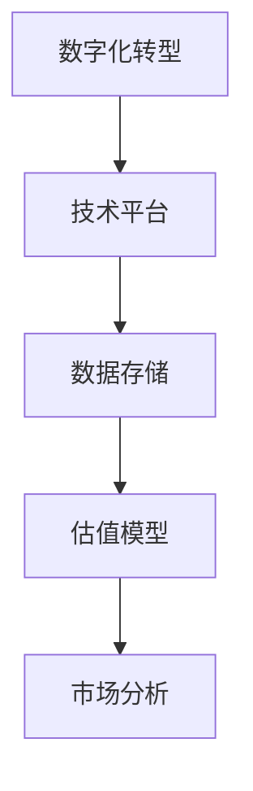

                 


# 股市估值高低对企业数字化转型投资的影响

---

## 关键词

- 股市估值
- 数字化转型
- 投资影响
- 企业价值
- 数学模型

---

## 摘要

股市估值的高低对企业数字化转型的投资决策具有重要影响。高估值可能导致企业投资过于激进，而低估值则可能限制企业的转型能力。本文从数字化转型的定义、股市估值的核心概念出发，结合实际案例，分析两者之间的关系，并通过数学模型和算法，量化股市估值对数字化转型的影响。最后，本文总结了最佳实践和投资策略，为企业在数字化转型中的投资决策提供指导。

---

## 正文

### 第1章：背景介绍

#### 1.1 核心概念

- **数字化转型**：指企业利用数字技术（如大数据、人工智能、云计算等）重构业务模式、组织架构和流程的变革过程。
- **股市估值**：指市场对企业的价值评估，通常通过市盈率、市净率等指标衡量。

#### 1.2 问题背景

- 数字化转型已成为企业竞争力的核心，但高估值可能导致企业过度投资，而低估值可能限制转型能力。
- 本文通过分析股市估值与数字化转型的关系，为企业投资决策提供参考。

---

### 第2章：股市估值高低对企业的影响

#### 2.1 高估值的影响

- **优势**：高估值企业有更多资金进行数字化转型，但可能面临过度投资风险。
- **风险**：高估值可能导致企业杠杆过高，市场波动时风险更大。

#### 2.2 低估值的影响

- **劣势**：低估值企业资金有限，转型能力受限。
- **机会**：低估值企业可能通过数字化转型提升估值。

---

### 第3章：数字化转型对股市估值的影响

#### 3.1 技术提升企业价值

- 数字化转型通过提高效率和竞争力，增加企业未来收益，从而提升估值。

#### 3.2 市场预期的改变

- 数字化转型改变市场对企业未来业绩的预期，进而影响估值。

---

### 第4章：股市估值与数字化转型的相互影响

#### 4.1 数学模型

- 使用回归分析量化两者关系，模型如下：

$$
\text{估值变化} = \beta_1 \times \text{数字化转型投入} + \epsilon
$$

#### 4.2 算法实现

- 使用Python代码实现回归分析，代码如下：

```python
import statsmodels.api as sm

# 假设x是数字化转型投入，y是估值变化
x = df['数字化转型投入']
y = df['估值变化']

model = sm.OLS(y, sm.add_constant(x)).fit()
print(model.summary())
```

---

### 第5章：系统分析与架构设计

#### 5.1 领域模型

- 用Mermaid绘制领域模型图：


#### 5.2 系统架构

- 用Mermaid绘制系统架构图：



---

### 第6章：项目实战

#### 6.1 环境安装

- 安装Python和相关库（如pandas、statsmodels）。

#### 6.2 核心实现

- 代码实现回归分析，数据处理和可视化。

#### 6.3 案例分析

- 分析某科技公司的数字化转型如何影响其估值。

---

### 第7章：最佳实践与小结

#### 7.1 最佳实践

- 合理评估企业估值，制定可持续的数字化转型策略。
- 定期监控市场变化，调整投资决策。

#### 7.2 注意事项

- 避免过度依赖高估值，注重实际效益。
- 低估值企业应抓住数字化转型的机会。

#### 7.3 总结

股市估值与数字化转型相互影响，企业需结合自身情况制定投资策略。

---

## 作者

作者：AI天才研究院 & 禅与计算机程序设计艺术

