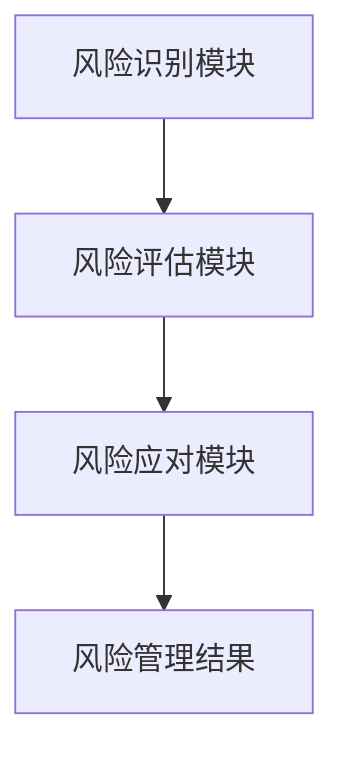

                 


# 股市估值高低对企业数字化转型风险管理的影响

## 关键词：
股市估值、企业数字化转型、风险管理、数字化转型风险管理、风险管理工具、风险管理策略、风险管理系统

## 摘要：
股市估值的高低对企业数字化转型过程中的风险管理具有重要影响。本文从数字化转型的定义与特征出发，结合风险管理的基本概念，分析数字化转型中的主要风险，并探讨股市估值与企业风险管理之间的关系。通过系统架构设计、算法原理分析、案例研究等方法，本文揭示了如何在高估值或低估值的市场环境中优化企业数字化转型风险管理策略，以应对潜在风险并提升企业竞争力。文章还提供了风险管理工具和技术的实现方案，并展望了未来的研究方向。

---

# 第1章: 数字化转型的定义与特征

## 1.1 数字化转型的定义与特征

### 1.1.1 数字化转型的定义
数字化转型（Digital Transformation）是指企业利用数字技术（如大数据、人工智能、云计算等）对其业务模式、流程、文化进行根本性重构，以实现业务创新和效率提升的过程。它不仅仅是技术的升级，更是对企业战略、组织结构和运营方式的深刻变革。

### 1.1.2 数字化转型的核心特征
- **数据驱动**：依赖数据进行决策，而非传统经验。
- **技术融合**：将数字技术与传统业务相结合。
- **敏捷性**：快速响应市场变化和客户需求。
- **创新性**：通过技术应用实现业务模式创新。

### 1.1.3 数字化转型对企业的影响
- 提高效率和生产力。
- 创新业务模式，拓展市场。
- 优化客户体验，增强客户忠诚度。
- 增强企业的竞争力和抗风险能力。

---

## 1.2 风险管理的基本概念

### 1.2.1 风险的定义与分类
- **风险**：企业可能面临的损失或机会的不确定性。
- **分类**：市场风险、信用风险、操作风险、技术风险等。

### 1.2.2 风险管理的基本原则
- **全面性**：覆盖所有可能的风险来源。
- **预防性**：提前识别和评估风险。
- **动态性**：根据环境变化调整风险管理策略。

### 1.2.3 风险管理在企业中的作用
- 降低企业损失。
- 提高企业决策的科学性。
- 增强企业的抗风险能力。

---

## 1.3 企业数字化转型中的风险管理

### 1.3.1 数字化转型中的主要风险
- **技术风险**：技术选型不当或系统故障。
- **数据风险**：数据泄露或数据质量管理不善。
- **运营风险**：转型过程中业务中断或效率下降。
- **市场风险**：市场需求变化导致转型失败。

### 1.3.2 风险管理在数字化转型中的重要性
- 确保数字化转型的顺利推进。
- 降低转型过程中的潜在损失。
- 提高企业的市场竞争力。

### 1.3.3 数字化转型风险管理的边界与外延
- 边界：仅关注数字化转型过程中直接相关的风险。
- 外延：扩展到企业整体风险管理框架中。

---

## 1.4 股市估值的基本概念

### 1.4.1 股市估值的定义
股市估值（Stock Market Valuation）是通过特定指标（如市盈率、市净率等）对企业价值进行评估的过程。

### 1.4.2 股市估值的主要方法
- **市盈率（P/E）**：企业股价除以每股收益。
- **市净率（P/B）**：企业股价除以每股净资产。
- **EV/EBITDA**：企业价值与息税折旧及摊销前利润的比率。

### 1.4.3 股市估值对企业的影响
- 高估值：市场对企业前景的乐观预期，但也可能隐藏风险。
- 低估值：市场对企业前景的悲观预期，可能低估企业价值。

---

## 1.5 本章小结
本章从数字化转型和风险管理的基本概念出发，分析了数字化转型中的主要风险，并探讨了股市估值的基本概念和对企业的影响。通过这些分析，我们可以更好地理解股市估值与企业数字化转型风险管理之间的关系。

---

# 第2章: 数字化转型风险管理的核心概念

## 2.1 数字化转型风险管理的核心要素

### 2.1.1 风险识别
- **定义**：识别可能影响数字化转型的所有风险。
- **方法**：头脑风暴法、问卷调查、数据分析等。

### 2.1.2 风险评估
- **定义**：评估风险发生的概率和影响程度。
- **工具**：风险矩阵、概率-影响矩阵。

### 2.1.3 风险应对
- **定义**：制定应对风险的具体策略。
- **方法**：风险规避、风险减轻、风险转移、风险接受。

---

## 2.2 数字化转型风险管理的理论框架

### 2.2.1 风险管理的系统模型
- **系统模型**：输入（风险因素）→处理（风险识别、评估、应对）→输出（风险管理结果）。

### 2.2.2 数字化转型风险管理的系统架构
- **系统架构**：包括风险识别模块、风险评估模块、风险应对模块。

---

## 2.3 数字化转型风险管理的核心原理

### 2.3.1 风险管理的基本原理
- **全面性**：覆盖所有可能的风险。
- **动态性**：根据环境变化调整策略。
- **科学性**：基于数据分析和模型进行决策。

### 2.3.2 数字化转型风险管理的独特性
- **技术驱动**：依赖数字技术进行风险识别和应对。
- **数据驱动**：基于数据进行风险评估和预测。

### 2.3.3 数字化转型风险管理的数学模型
$$
\text{风险值} = \text{概率} \times \text{影响程度}
$$

---

## 2.4 本章小结
本章从数字化转型风险管理的核心要素和理论框架出发，分析了风险管理的基本原理和数学模型。通过这些分析，我们可以更好地理解数字化转型风险管理的核心概念。

---

# 第3章: 数字化转型风险管理的系统分析

## 3.1 数字化转型风险管理的系统架构

### 3.1.1 系统架构设计
- **模块划分**：风险识别模块、风险评估模块、风险应对模块。
- **功能描述**：每个模块的具体功能和交互方式。

### 3.1.2 系统架构图


---

## 3.2 数字化转型风险管理的接口设计

### 3.2.1 系统接口设计
- **输入接口**：接收风险因素数据。
- **输出接口**：输出风险管理结果。

### 3.2.2 接口交互图
```mermaid
sequenceDiagram
A[用户] ->>+ B[风险识别模块]: 提交风险因素
B -->+ C[风险评估模块]: 评估风险
C -->+ D[风险应对模块]: 制定应对策略
D ->>- A: 输出风险管理结果
```

---

## 3.3 数字化转型风险管理的实现方案

### 3.3.1 环境配置
- **技术选型**：选择适合的编程语言和开发框架。
- **数据存储**：选择合适的数据存储方案。

### 3.3.2 核心代码实现
```python
def risk_assessment(risk_factors):
    # 风险评估函数
    risk_score = 0
    for factor in risk_factors:
        if factor['probability'] > 0.5 and factor['impact'] > 0.5:
            risk_score += 1
    return risk_score
```

---

## 3.4 本章小结
本章从系统架构设计、接口设计和核心代码实现三个方面，详细分析了数字化转型风险管理的系统实现方案。通过这些分析，我们可以更好地理解如何将风险管理理论应用于实际系统中。

---

# 第4章: 数字化转型风险管理的案例分析

## 4.1 成功案例分析

### 4.1.1 案例背景
- **企业**：某互联网公司。
- **背景**：数字化转型过程中面临技术风险和数据风险。

### 4.1.2 风险管理策略
- **风险识别**：识别技术选型不当的风险。
- **风险评估**：评估技术选型失败的概率和影响。
- **风险应对**：制定技术选型的备选方案。

### 4.1.3 实施效果
- **结果**：成功实现数字化转型，提升企业竞争力。

---

## 4.2 失败案例分析

### 4.2.1 案例背景
- **企业**：某传统制造企业。
- **背景**：数字化转型过程中忽视数据风险管理。

### 4.2.2 风险管理失败的原因
- **原因**：数据泄露事件导致企业声誉受损。

### 4.2.3 教训与启示
- **教训**：忽视数据风险管理可能导致严重后果。
- **启示**：在数字化转型中必须重视数据风险管理。

---

## 4.3 本章小结
本章通过成功和失败案例分析，总结了数字化转型风险管理中的经验和教训。这些案例为我们提供了宝贵的经验和启示。

---

# 第5章: 数字化转型风险管理的未来展望

## 5.1 风险管理工具与技术的创新

### 5.1.1 新兴技术的应用
- **人工智能**：用于风险预测和风险评估。
- **区块链**：用于数据安全和风险管理。

### 5.1.2 工具创新
- **智能化风险管理平台**：利用AI技术实现自动化风险管理。

---

## 5.2 数字化转型风险管理的未来趋势

### 5.2.1 数据驱动的决策
- **数据的重要性**：数据将成为风险管理的核心。
- **数据质量管理**：提高数据的准确性和完整性。

### 5.2.2 全球化与风险管理
- **全球化趋势**：企业需要应对全球化的风险管理挑战。
- **跨国风险管理**：需要考虑不同国家的法律法规和市场环境。

---

## 5.3 本章小结
本章从风险管理工具与技术的创新和未来趋势出发，展望了数字化转型风险管理的未来发展。通过这些分析，我们可以更好地把握未来的风险管理方向。

---

# 作者：AI天才研究院/AI Genius Institute & 禅与计算机程序设计艺术 /Zen And The Art of Computer Programming

