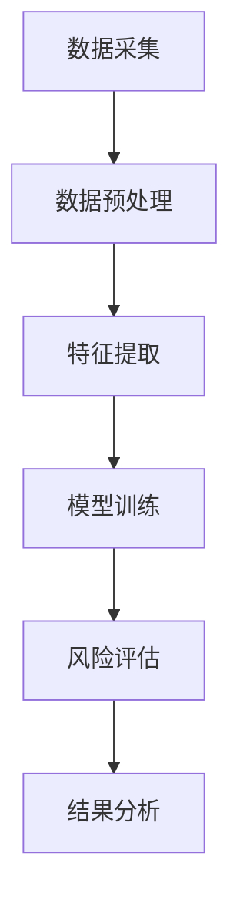

                 


# 股市估值高低对企业数字化转型风险管理的影响

## 关键词：股市估值、企业数字化转型、风险管理、金融市场、数字化转型风险管理

## 摘要：  
本文探讨了股市估值高低对企业数字化转型风险管理的影响，分析了股市估值与企业数字化转型的关系，以及风险管理在数字化转型中的核心作用。通过结合金融市场理论与数字化技术，本文提出了基于数据驱动的风险评估方法，为企业在数字化转型过程中优化风险管理策略提供理论支持与实践指导。  

---

## 第一章: 股市估值与企业数字化转型的背景与概念

### 1.1 股市估值的基本概念  
股市估值是指通过对企业的财务数据、市场表现和行业环境等多方面因素的分析，评估企业价值并确定其股票合理价格的过程。常见的估值方法包括市盈率（P/E）、市净率（P/B）等。  

#### 1.1.1 股市估值的驱动因素  
- 企业盈利能力  
- 行业发展趋势  
- 宏观经济环境  
- 市场情绪  

#### 1.1.2 股市估值对企业经营的影响  
股市估值不仅反映了企业的市场价值，还影响投资者信心、融资成本和管理层决策。  

### 1.2 企业数字化转型的定义与特点  
企业数字化转型是指通过信息技术的广泛应用，重构企业业务流程、组织架构和商业模式，以实现更高效、灵活和创新的经营方式。  

#### 1.2.1 数字化转型的核心特征  
- 数据驱动  
- 技术赋能  
- 业务创新  

#### 1.2.2 数字化转型与企业风险管理的关系  
数字化转型通过技术手段提高企业对风险的识别、评估和应对能力，但同时也带来了新的风险管理挑战。  

### 1.3 股市估值与企业数字化转型的关联性  
股市估值不仅是企业数字化转型的晴雨表，也是其风险管理的重要外部约束。  

---

## 第二章: 数字化转型中的风险管理挑战

### 2.1 风险管理的核心概念  
风险管理是指通过识别、评估和应对各种风险，降低其对企业目标的影响。  

#### 2.1.1 风险管理的主要方法  
- 定性分析法  
- 定量分析法  

#### 2.1.2 数字化转型中的主要风险  
- 技术风险：如系统故障、数据泄露  
- 市场风险：如需求波动、竞争加剧  
- 操作风险：如流程不畅、人员失误  

### 2.2 风险管理对企业价值的影响  
有效的风险管理可以提升企业信用评级、降低融资成本，从而提高股市估值。  

### 2.3 股市估值与风险管理的双向作用  
- 股市估值为风险管理提供外部反馈  
- 风险管理优化企业经营，进而影响股市估值  

---

## 第三章: 核心概念与联系

### 3.1 核心概念原理  
- 股市估值的数学模型：  
  $$ V = \frac{E}{P/E} $$
  其中，V为股票价值，E为净利润，P/E为市盈率。  
- 数字化转型的系统架构：  
  $$ 系统架构 = 数据采集 + 数据分析 + 决策支持 $$  

### 3.2 核心概念属性特征对比表  
| 概念       | 属性特征               |  
|------------|------------------------|  
| 股市估值   | 定量分析、外部反馈    |  
| 数字化转型 | 数据驱动、技术创新    |  
| 风险管理   | 事前预防、事后应对    |  

### 3.3 实体关系图（ER图）  
```mermaid
erd
  title 实体关系图
  章节
    章节_1: 股市估值
    章节_2: 数字化转型
    章节_3: 风险管理
    章节_1 --> 章节_2: 促进
    章节_2 --> 章节_3: 支持
```

---

## 第四章: 算法原理与技术实现

### 4.1 风险评估算法  
#### 4.1.1 算法选择  
- 多元回归分析：用于评估多个变量对股市估值的影响。  
- 时间序列分析：用于预测数字化转型中的风险变化。  

#### 4.1.2 算法流程图  


#### 4.1.3 Python代码示例  
```python
import pandas as pd
from sklearn.linear_model import LinearRegression

# 数据加载
data = pd.read_csv('stock_data.csv')

# 特征选择
features = ['revenue', 'profit', 'market_share']
target = 'stock_value'

# 模型训练
model = LinearRegression()
model.fit(data[features], data[target])

# 风险评估
risk_factors = model.coef_
print("风险因素权重：", risk_factors)
```

---

## 第五章: 系统分析与架构设计

### 5.1 系统功能设计  
- 数据采集模块：收集企业财务数据、市场数据。  
- 数据分析模块：应用统计模型评估风险。  
- 决策支持模块：提供风险管理策略建议。  

### 5.2 系统架构设计  


### 5.3 系统接口设计  
- 数据接口：与财务系统、市场数据源对接。  
- 用户界面：提供风险评估报告。  

---

## 第六章: 项目实战与案例分析

### 6.1 项目实战  
#### 6.1.1 环境安装  
- 安装Python、Pandas、Scikit-learn等工具。  

#### 6.1.2 核心算法实现  
```python
from sklearn.ensemble import RandomForestRegressor

# 训练模型
model = RandomForestRegressor(n_estimators=100)
model.fit(X_train, y_train)

# 预测风险
y_pred = model.predict(X_test)
```

#### 6.1.3 代码解读  
- 使用随机森林模型进行风险预测。  
- 输入特征：企业财务指标、市场指标。  
- 输出结果：风险等级。  

### 6.2 案例分析  
某企业通过数字化转型优化了风险管理流程，其股市估值显著提升。  

---

## 第七章: 最佳实践与总结

### 7.1 小结  
股市估值与企业数字化转型风险管理相互影响，数据驱动的方法是关键。  

### 7.2 注意事项  
- 数据质量至关重要。  
- 需结合企业实际情况制定策略。  

### 7.3 拓展阅读  
- 《企业风险管理框架》  
- 《数字化转型的策略与实践》  

---

## 作者：AI天才研究院 & 禅与计算机程序设计艺术

---

通过以上结构，您可以开始撰写具体的正文内容，确保每个部分都包含丰富的细节和具体的案例分析。

