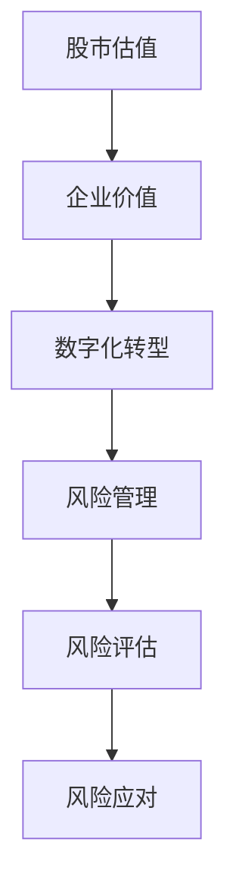
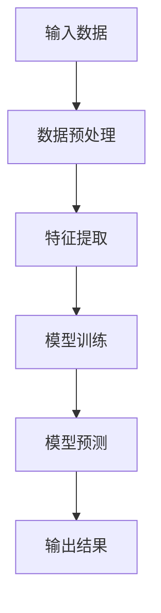

                 


# 股市估值高低对企业数字化转型风险管理的影响

## 关键词：股市估值，数字化转型，风险管理，企业价值，算法原理

## 摘要：本文深入分析了股市估值高低对企业数字化转型风险管理的影响。首先，我们从股市估值和数字化转型的基本概念入手，详细阐述了两者的核心原理和联系。接着，通过算法原理和数学模型，分析了股市估值预测和数字化转型风险管理的具体实现。最后，结合系统架构设计和项目实战，提出了在实际应用中需要注意的关键点和最佳实践。

---

# 第1章 股市估值与数字化转型风险管理的背景介绍

## 1.1 股市估值的基本概念

### 1.1.1 股市估值的定义与核心要素

股市估值是指通过对企业的财务数据、市场环境和行业状况等多方面因素的分析，对企业股票的内在价值或市场价值进行评估的过程。股市估值的核心要素包括企业的盈利能力、成长性、财务状况、行业地位以及市场情绪等。

- 盈利能力：通过净利润率、毛利率等指标衡量企业的盈利水平。
- 成长性：通过收入增长率、净利润增长率等指标衡量企业的成长潜力。
- 财务状况：通过资产负债率、流动比率等指标衡量企业的财务健康状况。
- 行业地位：通过市场占有率、竞争格局等指标衡量企业在行业中的地位。
- 市场情绪：通过市场波动率、投资者情绪等指标衡量市场对企业的看法。

### 1.1.2 股市估值的主要方法

股市估值的主要方法包括：

1. **相对估值法**：通过比较企业的市盈率（P/E）、市净率（P/B）等指标，与行业平均水平或可比公司进行比较。
2. **绝对估值法**：通过现金流折现模型（DCF）等方法，计算企业的内在价值。
3. **技术分析法**：通过分析股票价格的走势、成交量等技术指标，预测股票的未来走势。

### 1.1.3 股市估值对企业价值的影响

股市估值直接影响投资者对企业的信心和投资决策，从而影响企业的市场价值和资本运作能力。高估值意味着市场对企业未来表现的乐观预期，低估值则可能意味着市场对企业的悲观预期。

---

## 1.2 数字化转型的定义与特点

### 1.2.1 数字化转型的定义

数字化转型是指企业通过引入数字技术（如大数据、人工智能、云计算等）来优化业务流程、提升效率、创新商业模式的过程。数字化转型不仅仅是技术的升级，更是企业战略和组织结构的深刻变革。

### 1.2.2 数字化转型的核心特征

1. **数据驱动**：以数据为基础，通过数据分析驱动决策。
2. **技术融合**：将数字技术与传统业务深度融合。
3. **业务创新**：通过技术创新推动商业模式和业务流程的创新。
4. **组织变革**：数字化转型要求企业组织结构和文化进行调整，以适应新的业务需求。

### 1.2.3 数字化转型对企业的影响

1. **提升效率**：通过自动化和智能化技术，减少人工干预，提高效率。
2. **增强竞争力**：通过技术创新，提升企业的市场竞争力。
3. **创造新价值**：通过数字化转型，创造新的业务价值和客户体验。

---

## 1.3 风险管理的基本概念

### 1.3.1 风险管理的定义

风险管理是指通过识别、评估和应对各种风险，降低风险对企业目标实现的影响的过程。

### 1.3.2 风险管理的主要方法

1. **风险识别**：通过分析企业内外部环境，识别潜在的风险因素。
2. **风险评估**：对识别出的风险进行量化评估，确定其影响程度。
3. **风险应对**：根据风险的性质和影响程度，制定相应的应对策略。

### 1.3.3 风险管理在企业中的作用

1. **降低损失**：通过有效管理风险，减少企业因风险事件带来的损失。
2. **提高决策质量**：通过风险评估，为企业决策提供科学依据。
3. **增强企业韧性**：通过风险管理，增强企业应对不确定性的能力。

---

## 1.4 股市估值高低对企业数字化转型风险管理的影响

### 1.4.1 股市估值与企业数字化转型的关系

股市估值的高低反映了市场对企业数字化转型的预期和信心。高估值意味着市场对企业数字化转型的前景持乐观态度，而低估值则可能意味着市场对企业数字化转型的前景持悲观态度。

### 1.4.2 高低估值对企业风险管理的差异化影响

1. **高估值**：高估值意味着市场对企业有较高的期望，企业需要更加谨慎地进行数字化转型，以避免因未能达到市场预期而导致股价下跌。
2. **低估值**：低估值意味着市场对企业有较低的期望，企业可以更加灵活地进行数字化转型，通过实现超预期的业绩来提升股价。

### 1.4.3 本章小结

股市估值的高低对企业数字化转型风险管理有重要影响。高估值要求企业更加注重风险控制，以满足市场较高的期望；低估值则为企业提供了更大的灵活性，可以通过实现超预期的业绩来提升市场信心。

---

# 第2章 股市估值与数字化转型风险管理的核心概念

## 2.1 股市估值的核心原理

### 2.1.1 股票内在价值的计算公式

股票的内在价值可以通过现金流折现模型（DCF）进行计算：

$$
\text{内在价值} = \frac{\text{自由现金流}}{\text{折现率}}
$$

其中，自由现金流是指企业在偿还了所有资本成本后的剩余现金流，折现率则是基于企业风险和市场利率确定的贴现率。

### 2.1.2 市场价值与内在价值的差异

市场价值是指股票在市场上的实际交易价格，内在价值是指股票的理论价值。两者的差异反映了市场的理性与非理性。

### 2.1.3 股市估值的波动性分析

股市估值的波动性主要受市场情绪、宏观经济环境、行业动态等因素的影响。高波动性意味着市场对企业的未来表现存在较大的不确定性。

---

## 2.2 数字化转型风险管理的原理

### 2.2.1 数字化转型中的主要风险类型

1. **技术风险**：技术选型不当、技术实现难度大等。
2. **数据风险**：数据泄露、数据质量差等。
3. **业务风险**：业务模式创新失败、市场需求变化等。
4. **组织风险**：组织结构调整困难、员工适应性差等。

### 2.2.2 风险评估的数学模型

风险评估可以通过概率加权法进行：

$$
\text{风险值} = \sum (\text{风险发生概率} \times \text{风险影响程度})
$$

### 2.2.3 风险管理策略的选择

1. **风险规避**：通过改变策略或计划来消除风险。
2. **风险降低**：通过技术手段降低风险的发生概率或影响程度。
3. **风险转移**：通过保险、合同等方式将风险转移给第三方。
4. **风险承受**：在企业可承受范围内接受风险。

---

## 2.3 股市估值与数字化转型风险管理的联系

### 2.3.1 股市估值对企业数字化转型决策的影响

高估值的企业需要更加注重数字化转型的风险管理，以避免因数字化转型失败导致股价下跌。低估值的企业则可以通过成功的数字化转型提升股价。

### 2.3.2 数字化转型风险管理对股市估值的反馈作用

成功的数字化转型风险管理可以提升企业的市场信心，从而提高股市估值。反之，风险管理失败可能导致股市估值的下降。

### 2.3.3 两者关系的综合分析

股市估值与数字化转型风险管理是相互影响的。高估值要求企业更加注重风险管理，而风险管理的成功又可以反过来提升股市估值。

---

## 2.4 核心概念对比分析

### 2.4.1 股市估值与数字化转型的对比表格

| 对比维度 | 股市估值 | 数字化转型 |
|----------|----------|------------|
| 核心目标 | 评估企业价值 | 优化业务流程 |
| 主要方法 | 相对估值法、绝对估值法 | 数据驱动、技术融合 |
| 影响因素 | 市场情绪、财务数据 | 数据质量、技术实现 |
| 关系 | 股市估值影响数字化转型决策 | 数字化转型风险管理影响股市估值 |

### 2.4.2 数字化转型风险管理与传统风险管理的对比

| 对比维度 | 数字化转型风险管理 | 传统风险管理 |
|----------|-------------------|---------------|
| 风险类型 | 技术风险、数据风险 | 市场风险、操作风险 |
| 管理方法 | 数据分析、技术手段 | 定性分析、经验判断 |
| 管理目标 | 提升数字化转型成功率 | 降低企业损失 |
| 依赖因素 | 数字化技术、数据质量 | 企业组织、市场环境 |

### 2.4.3 核心概念的ER实体关系图（Mermaid流程图）



---

# 第3章 股市估值与数字化转型风险管理的算法原理

## 3.1 股市估值预测算法

### 3.1.1 常用的股市估值预测模型

1. **线性回归模型**：通过历史数据建立股票价格与财务指标之间的线性关系。
2. **支持向量机（SVM）**：通过非线性模型进行股票价格预测。
3. **随机森林**：通过集成学习进行股票价格预测。

### 3.1.2 基于机器学习的估值预测算法

以下是使用Python实现的股票价格预测算法示例：

```python
import pandas as pd
import numpy as np
from sklearn.ensemble import RandomForestRegressor
from sklearn.metrics import mean_squared_error

# 加载数据
data = pd.read_csv('stock_data.csv')

# 特征选择
features = data.columns.tolist()
target = 'Price'

# 训练集和测试集划分
train_data = data[:-30]
test_data = data[-30:]

train_features = train_data[features]
train_target = train_data[target]
test_features = test_data[features]
test_target = test_data[target]

# 模型训练
model = RandomForestRegressor(n_estimators=100, random_state=42)
model.fit(train_features, train_target)

# 模型预测
predictions = model.predict(test_features)

# 模型评估
mse = mean_squared_error(test_target, predictions)
rmse = np.sqrt(mse)
print(f'均方误差：{mse}\n根均方误差：{rmse}')
```

### 3.1.3 算法流程图（Mermaid）



---

## 3.2 数字化转型风险管理算法

### 3.2.1 风险识别算法

1. **基于规则的识别**：通过预定义的规则识别潜在风险。
2. **基于机器学习的识别**：通过聚类分析或分类算法识别风险。

### 3.2.2 风险评估算法

1. **概率加权法**：通过概率和影响程度加权评估风险。
2. **层次分析法（AHP）**：通过层次分析法评估风险优先级。

### 3.2.3 风险应对策略生成算法

1. **基于规则的策略生成**：根据风险类型和优先级生成应对策略。
2. **基于优化的策略生成**：通过数学优化模型生成最优应对策略。

---

## 3.3 算法实

