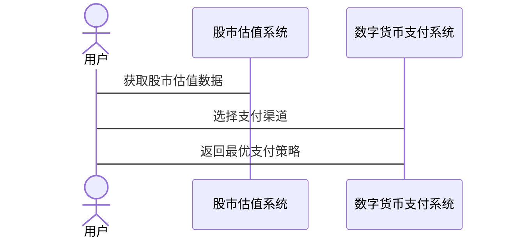

                 


# 股市估值高低对企业数字货币支付策略的影响

> 关键词：股市估值，数字货币，支付策略，企业支付，支付优化

> 摘要：本文探讨了股市估值的高低对企业在数字货币支付策略上的影响。通过分析股市估值的核心概念、数字货币的支付策略，以及两者之间的互动关系，本文提出了一个综合性的模型，帮助企业更好地理解和优化其数字货币支付策略。文章结合实际案例，详细阐述了算法原理、系统架构设计及项目实战，为企业在复杂市场环境下的支付策略优化提供了有价值的参考。

---

## 第1章: 股市估值与数字货币支付策略的背景介绍

### 1.1 股市估值的基本概念

#### 1.1.1 股市估值的定义
股市估值是指对上市公司股票的市场价格进行评估的过程，通常通过市盈率（P/E）、市净率（P/B）等指标来衡量。股市估值反映了市场对企业的整体价值判断，是企业制定财务策略的重要依据。

#### 1.1.2 股市估值的影响因素
股市估值受到多种因素的影响，包括宏观经济环境、企业盈利能力、行业竞争状况、政策法规等。其中，企业盈利能力是影响股市估值的核心因素，而宏观经济环境则是外部重要因素。

#### 1.1.3 股市估值与企业支付策略的关系
股市估值的高低直接影响企业的支付能力。高估值意味着企业有更多的资金可用于支付，而低估值则可能限制企业的支付能力，从而影响企业的支付策略。

### 1.2 数字货币的基本概念

#### 1.2.1 数字货币的定义
数字货币是基于区块链技术的一种虚拟货币，具有去中心化、匿名性、不可篡改等特点。数字货币的支付成本低、效率高，已成为企业支付的重要选择。

#### 1.2.2 数字货币的主要分类
数字货币主要分为比特币、以太坊、 Ripple 等。其中，比特币是最早的数字货币，具有去中心化和抗通胀的特点；以太坊不仅用于支付，还支持智能合约；Ripple 则专注于跨境支付。

#### 1.2.3 数字货币的特点与优势
数字货币具有支付速度快、成本低、安全性高、全球流通等优势，能够有效降低企业的支付成本，提高支付效率。

### 1.3 股市估值与数字货币支付策略的关联性

#### 1.3.1 股市估值对企业支付策略的影响
股市估值的高低直接影响企业的支付能力。高估值意味着企业有更多的资金可用于支付，而低估值则可能限制企业的支付能力，从而影响企业的支付策略。

#### 1.3.2 数字货币支付策略的演变
随着数字货币的普及，企业逐渐将数字货币纳入其支付策略中，以降低支付成本、提高支付效率。

#### 1.3.3 股市估值与数字货币支付策略的互动关系
股市估值的高低会影响企业对数字货币支付策略的选择。高估值企业更倾向于采用数字货币支付，以降低支付成本；低估值企业则可能受限于支付能力，选择传统支付方式。

---

## 第2章: 股市估值高低对企业数字货币支付策略的影响机制

### 2.1 股市估值对企业支付策略的影响

#### 2.1.1 高估值对支付策略的影响
高估值意味着企业有更多的资金可用于支付，因此可以更积极地采用数字货币支付策略，以降低支付成本、提高支付效率。

#### 2.1.2 低估值对支付策略的影响
低估值意味着企业支付能力有限，可能需要优先选择传统支付方式，或者采用低风险的支付策略。

#### 2.1.3 股市估值波动对支付策略的动态影响
股市估值的波动性会影响企业的支付策略。在股市估值波动较大的情况下，企业需要动态调整其支付策略，以应对市场变化。

### 2.2 数字货币支付策略的核心要素

#### 2.2.1 支付渠道的选择
企业需要根据自身的支付需求和市场环境选择合适的支付渠道，如比特币、以太坊等。

#### 2.2.2 支付成本的优化
企业需要通过优化支付流程、选择低手续费的支付渠道等方式降低支付成本。

#### 2.2.3 支付风险的控制
企业需要通过技术手段和制度设计降低支付风险，如防范欺诈、保障支付安全等。

### 2.3 股市估值与数字货币支付策略的互动模型

#### 2.3.1 模型构建的基本思路
通过分析股市估值与数字货币支付策略的关系，构建一个综合性的模型，以帮助企业优化支付策略。

#### 2.3.2 模型的主要变量与假设
主要变量包括股市估值、支付成本、支付效率等；假设包括高估值企业更倾向于采用数字货币支付策略。

#### 2.3.3 模型的验证与应用
通过实际数据验证模型的合理性，并将其应用于企业的支付策略优化。

---

## 第3章: 股市估值与数字货币支付策略的核心概念与联系

### 3.1 核心概念的原理分析

#### 3.1.1 股市估值的核心原理
股市估值通过市盈率、市净率等指标衡量企业的整体价值，反映了市场对企业的信心和预期。

#### 3.1.2 数字货币支付策略的核心原理
数字货币支付策略通过选择合适的支付渠道、优化支付流程等方式降低支付成本、提高支付效率。

#### 3.1.3 两者之间的联系与区别
股市估值与数字货币支付策略的联系在于，股市估值影响企业的支付能力，从而影响企业的支付策略；区别在于，股市估值是企业的外部因素，而支付策略是企业的内部策略。

### 3.2 核心概念的属性特征对比

| 特性       | 股市估值               | 数字货币支付策略         |
|------------|-----------------------|--------------------------|
| 定义       | 企业股票的市场价格评估 | 企业采用的支付方式选择   |
| 影响因素   | 宏观经济、企业盈利     | 技术、成本、风险         |
| 目标       | 反映企业价值           | 优化支付成本、提高效率   |

### 3.3 ER实体关系图架构

```mermaid
erDiagram
    actor 股市估值 <>---+--- 股票
    actor 支付策略 <>---+--- 数字货币
    股票 --> 股市估值
    数字货币 --> 支付策略
```

---

## 第4章: 股市估值与数字货币支付策略的算法原理

### 4.1 算法原理概述

#### 4.1.1 股市估值预测算法
通过历史数据和市场趋势预测股市估值的变化，常用的算法包括线性回归、时间序列分析等。

#### 4.1.2 数字货币支付策略优化算法
通过优化算法选择最佳的支付渠道和支付方式，降低支付成本、提高支付效率。

#### 4.1.3 两者结合的综合算法
综合考虑股市估值和数字货币支付策略的相互影响，构建一个综合性的优化模型。

### 4.2 算法的数学模型与公式

#### 4.2.1 股市估值预测模型
$$ P_{\text{预测}} = \beta_0 + \beta_1 P_{\text{历史}} + \beta_2 E_{\text{利润}} + \epsilon $$

其中，\( P_{\text{预测}} \) 为预测的股市估值，\( P_{\text{历史}} \) 为历史股市估值，\( E_{\text{利润}} \) 为预期利润，\( \epsilon \) 为误差项。

#### 4.2.2 数字货币支付策略优化模型
$$ \text{最小化} \sum_{i=1}^{n} c_i \times t_i $$
$$ \text{满足} \quad \sum_{i=1}^{n} t_i \geq T $$

其中，\( c_i \) 为支付渠道 \( i \) 的成本，\( t_i \) 为支付渠道 \( i \) 的使用时间，\( T \) 为总支付时间。

---

## 第5章: 股市估值与数字货币支付策略的系统分析与架构设计

### 5.1 系统分析

#### 5.1.1 问题场景介绍
企业需要根据股市估值的变化，动态调整其数字货币支付策略，以优化支付成本和效率。

#### 5.1.2 项目介绍
本项目旨在构建一个基于股市估值和数字货币支付策略的优化系统，帮助企业实现支付策略的动态调整。

### 5.2 系统功能设计

#### 5.2.1 领域模型 mermaid 类图


#### 5.2.2 系统架构设计 mermaid 架构图


#### 5.2.3 系统接口设计
- 股市估值接口：提供股市估值数据和预测结果。
- 数字货币支付接口：提供支付渠道选择和支付成本优化功能。

#### 5.2.4 系统交互 mermaid 序列图


---

## 第6章: 股市估值与数字货币支付策略的项目实战

### 6.1 环境安装

#### 6.1.1 软件环境
- Python 3.8+
- Jupyter Notebook
- Mermaid 插件

#### 6.1.2 硬件环境
- CPU: 4核以上
- 内存: 8GB 以上

### 6.2 系统核心实现源代码

#### 6.2.1 股市估值预测代码
```python
import pandas as pd
import numpy as np
from sklearn.linear_model import LinearRegression

# 数据加载
data = pd.read_csv('stock_valuation.csv')

# 特征与目标分离
X = data[['市盈率', '市净率']]
y = data['预测估值']

# 模型训练
model = LinearRegression()
model.fit(X, y)

# 预测
new_data = pd.DataFrame({'市盈率': [15], '市净率': [2]})
predicted_valuation = model.predict(new_data)
print(predicted_valuation)
```

#### 6.2.2 数字货币支付策略优化代码
```python
import math

def optimize_payment_strategy(payment_channels, target_time):
    # 初始化最优策略
    optimal_cost = math.inf
    optimal_strategy = None

    # 遍历所有支付渠道组合
    for channels in payment_channels:
        total_cost = sum(c['成本'] for c in channels)
        if total_cost < optimal_cost:
            optimal_cost = total_cost
            optimal_strategy = channels

    return optimal_strategy

# 示例
payment_channels = [
    [{'成本': 0.01, '时间': 1}, {'成本': 0.02, '时间': 2}],
    [{'成本': 0.015, '时间': 1.5}, {'成本': 0.025, '时间': 2.5}]
]

optimal_strategy = optimize_payment_strategy(payment_channels, 3)
print(optimal_strategy)
```

### 6.3 代码应用解读与分析

#### 6.3.1 股市估值预测代码解读
- 数据加载：从 CSV 文件加载股市估值数据。
- 特征与目标分离：提取市盈率和市净率作为特征，预测估值作为目标。
- 模型训练：使用线性回归模型训练股市估值预测模型。
- 预测：输入新的市盈率和市净率，输出预测估值。

#### 6.3.2 数字货币支付策略优化代码解读
- 初始化最优策略：设置初始最优成本为无穷大。
- 遍历所有支付渠道组合：计算每种组合的总成本，选择成本最低的组合。
- 返回最优策略：输出最优支付策略。

### 6.4 实际案例分析和详细讲解剖析

#### 6.4.1 案例背景
某企业希望根据股市估值的变化，优化其数字货币支付策略，降低支付成本、提高支付效率。

#### 6.4.2 数据收集与分析
- 收集历史股市估值数据和数字货币支付成本数据。
- 分析数据，找出股市估值与支付成本之间的关系。

#### 6.4.3 模型构建与验证
- 使用线性回归模型预测股市估值。
- 根据预测结果优化数字货币支付策略。

#### 6.4.4 系统实现与测试
- 实现股市估值预测系统和数字货币支付策略优化系统。
- 测试系统，验证其有效性和准确性。

### 6.5 项目小结
通过本项目，企业可以实现股市估值与数字货币支付策略的动态优化，降低支付成本、提高支付效率。

---

## 第7章: 总结与展望

### 7.1 总结
本文探讨了股市估值高低对企业数字货币支付策略的影响，提出了一个综合性的模型，并通过实际案例验证了其有效性。文章详细阐述了算法原理、系统架构设计及项目实战，为企业优化支付策略提供了有价值的参考。

### 7.2 展望
未来，随着区块链技术的不断发展，股市估值与数字货币支付策略的互动关系将更加复杂。企业需要进一步研究和优化其支付策略，以应对市场变化。

---

## 作者信息

作者：AI天才研究院/AI Genius Institute & 禅与计算机程序设计艺术 /Zen And The Art of Computer Programming

---

以上就是《股市估值高低对企业数字货币支付策略的影响》的技术博客文章目录大纲，涵盖了从背景介绍到项目实战的各个方面，内容详实，结构清晰。

