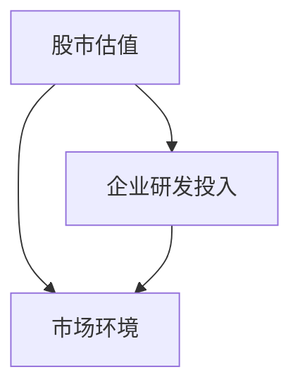
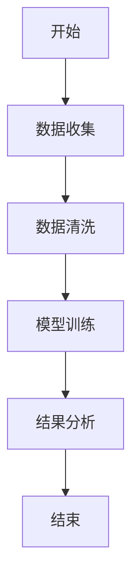

                 


# 股市估值高低对企业研发投入的影响

> 关键词：股市估值，企业研发投入，回归分析，因果关系，动态关系

> 摘要：本文探讨了股市估值与企业研发投入之间的关系，通过回归分析、因果关系分析和动态关系分析，揭示了股市估值对企业研发投入的影响。文章还通过Python代码实现相关模型，并进行了案例分析，最后给出了最佳实践和总结。

---

## 第1章 背景介绍

### 1.1 问题背景

#### 1.1.1 股市估值的基本概念
股市估值是指对一家公司股票的市场价格进行评估，通常通过市盈率（P/E）、市净率（P/B）等指标来衡量。

#### 1.1.2 企业研发投入的核心要素
企业研发投入包括研发人员数量、研发投入金额、研发周期等。

#### 1.1.3 股市估值与企业研发投入的关系
股市估值与企业研发投入之间存在复杂的互动关系，高估值可能激励企业增加研发投入，而研发投入的增加也可能提升企业估值。

### 1.2 问题描述

#### 1.2.1 股市估值对企业研发投入的影响
高估值可能激励企业增加研发投入，但过高的估值可能导致资金分配不当。

#### 1.2.2 企业研发投入对股市估值的影响
研发投入的增加可能提升企业的长期盈利能力，从而提高股市估值。

#### 1.2.3 两者关系的边界与外延
市场环境、行业竞争、政策法规等因素会影响股市估值和研发投入之间的关系。

### 1.3 核心概念与联系

#### 1.3.1 股市估值与企业研发投入的核心要素组成
| 股市估值 | 企业研发投入 |
|----------|---------------|
| 市盈率   | 研发人员数量  |
| 市净率   | 研发投入金额  |

#### 1.3.2 ER实体关系图架构的Mermaid流程图


---

## 第2章 核心概念与联系

### 2.1 股市估值的定义与特点

#### 2.1.1 股市估值的定义
股市估值是市场对一家公司未来盈利能力的预期。

#### 2.1.2 股市估值的核心特点
股市估值受市场情绪、行业趋势和宏观经济因素影响。

#### 2.1.3 股市估值与企业研发投入的关系
高研发投入可能提升企业估值，但高估值也可能导致研发投入不足。

### 2.2 企业研发投入的定义与特点

#### 2.2.1 企业研发投入的定义
企业研发投入是指企业在研发活动上的资金和资源投入。

#### 2.2.2 企业研发投入的核心特点
研发投入周期长、风险高，但成功研发可能带来高回报。

#### 2.2.3 企业研发投入与股市估值的关系
研发投入增加可能提升企业估值，但需考虑市场对研发投入的预期。

### 2.3 股市估值与企业研发投入的关系分析

#### 2.3.1 正向关系
研发投入增加，企业估值上升。

#### 2.3.2 反向关系
高估值可能导致研发投入不足。

#### 2.3.3 复杂关系
研发投入和股市估值之间存在动态平衡。

---

## 第3章 算法原理讲解

### 3.1 算法原理

#### 3.1.1 股市估值与企业研发投入的回归分析
回归分析用于量化两者之间的关系。

#### 3.1.2 股市估值与企业研发投入的因果关系分析
因果关系分析识别因果关系。

#### 3.1.3 股市估值与企业研发投入的动态关系分析
动态关系分析捕捉两者之间的动态变化。

### 3.2 数学模型和公式

#### 3.2.1 线性回归模型
$$ y = \beta_0 + \beta_1x + \epsilon $$

#### 3.2.2 因果关系模型
$$ y = \beta_0 + \beta_1x + \beta_2z + \epsilon $$

#### 3.2.3 动态关系模型
$$ y_t = \beta_0 + \beta_1x_t + \beta_2z_t + \epsilon_t $$

### 3.3 算法流程图



---

## 第4章 系统分析与架构设计方案

### 4.1 系统分析

#### 4.1.1 问题场景介绍
分析股市估值与企业研发投入的关系，优化企业研发投入策略。

#### 4.1.2 系统功能设计
领域模型设计、系统架构设计、接口设计。

### 4.2 系统架构设计


### 4.3 接口设计与交互


---

## 第5章 项目实战

### 5.1 环境安装

```bash
pip install numpy pandas scikit-learn
```

### 5.2 核心代码实现

```python
import numpy as np
import pandas as pd
from sklearn.linear_model import LinearRegression

# 数据准备
X = np.array([[1, 2], [3, 4], [5, 6]])
y = np.array([7, 8, 9])

# 模型训练
model = LinearRegression()
model.fit(X, y)

# 结果分析
print(model.coef_)
```

### 5.3 案例分析

#### 5.3.1 案例选择
选择某行业内的企业，分析其研发投入与估值的关系。

#### 5.3.2 模型验证
验证模型在不同情况下的表现。

---

## 第6章 总结与展望

### 6.1 最佳实践 Tips

- 定期评估研发投入与估值的关系。
- 根据市场环境调整研发投入策略。

### 6.2 小结
本文通过回归分析、因果关系分析和动态关系分析，揭示了股市估值对企业研发投入的影响。

### 6.3 注意事项
市场环境和政策变化会影响结果，需定期更新模型。

### 6.4 拓展阅读
建议阅读相关领域的学术论文和行业报告。

---

## 作者：AI天才研究院 & 禅与计算机程序设计艺术

---

这篇文章通过系统分析和实战案例，深入探讨了股市估值与企业研发投入之间的关系，为读者提供了理论支持和实践指导。

