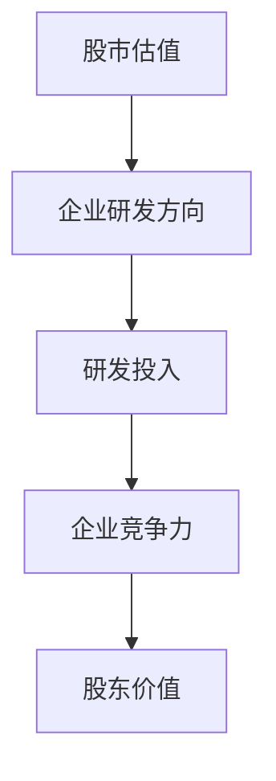
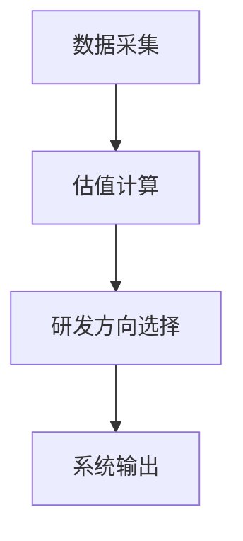

                 

# 股市估值高低对企业研发方向选择的影响

> 关键词：股市估值、企业研发方向、投资决策、市场周期、研发策略

> 摘要：股市估值的高低对企业研发方向的选择具有重要影响。本文从股市估值的基本概念出发，分析其对企业发展战略和研发投入的影响机制，探讨企业在不同市场环境下如何调整研发方向以实现价值最大化。通过引入数学模型、系统架构设计和实际案例分析，本文为企业在不同股市估值环境下制定研发策略提供了理论依据和实践指导。

---

## 第一部分：股市估值与企业研发方向的基本概念

### 第1章：股市估值的核心概念

#### 1.1 股市估值的定义
股市估值是指通过对企业的财务数据、市场表现和行业地位等多方面因素进行分析，评估企业市值的过程。常见的估值指标包括市盈率（P/E）、市净率（P/B）、EV/EBITDA等。

#### 1.2 企业研发方向的定义
企业研发方向是指企业在技术创新、产品开发和市场拓展等方面的研发重点。研发方向的选择直接影响企业的成长性和竞争力。

#### 1.3 股市估值与企业研发方向的关联性
股市估值反映了市场对企业未来发展的预期，而企业研发方向则是实现这种预期的核心路径。因此，股市估值的高低对企业研发方向的选择具有重要影响。

---

### 第2章：股市估值的影响因素

#### 2.1 宏观经济环境
宏观经济环境（如GDP增长率、利率水平、通货膨胀率等）直接影响股市整体表现，进而影响企业的估值。

#### 2.2 行业周期
行业周期（如增长型行业、周期性行业）决定了企业所处的市场环境，从而影响研发方向的选择。

#### 2.3 市场情绪
投资者情绪波动会直接导致股市估值的波动，进而影响企业研发方向的调整。

---

### 第3章：企业研发方向的选择逻辑

#### 3.1 研发方向的选择标准
企业在选择研发方向时，通常会综合考虑市场需求、技术可行性、成本效益等因素。

#### 3.2 研发投入与企业竞争力
研发投入是企业技术创新的核心驱动力，直接影响企业的市场竞争力和长期发展。

#### 3.3 研发方向的市场适应性
研发方向的选择需要与市场需求相结合，确保研发成果能够快速转化为市场价值。

---

## 第二部分：股市估值高低对企业研发方向选择的影响机制

### 第4章：高估值市场环境下的研发方向选择

#### 4.1 高估值的激励作用
高估值意味着市场对企业未来发展的高度认可，企业有更大的动力和资源进行研发投入。

#### 4.2 高估值下的研发投入增加
在高估值环境下，企业倾向于增加研发投入，以进一步提升技术和产品竞争力。

#### 4.3 高估值的引导效应
高估值市场为企业指明了研发方向，企业更倾向于选择高成长性和高回报的研发项目。

---

### 第5章：低估值市场环境下的研发方向选择

#### 5.1 低估值的制约作用
低估值环境下，企业可能面临资金短缺和投资者信心不足的问题，研发投入可能受到限制。

#### 5.2 低估值下的研发投入优化
在低估值环境下，企业需要更加注重研发投入的效率，选择那些能够快速见效的研发项目。

#### 5.3 低估值的调整压力
低估值环境要求企业及时调整研发方向，降低研发风险，确保资源的合理利用。

---

### 第6章：股市估值波动的动态影响

#### 6.1 波动对企业研发决策的即时影响
股市估值的短期波动可能影响企业的短期研发决策，例如研发投入的增减。

#### 6.2 波动对企业研发方向的长期影响
长期来看，股市估值的波动会引导企业逐步调整研发方向，以适应市场变化。

#### 6.3 波动对企业研发风险的预警作用
股市估值的波动可以为企业提供研发风险的预警信号，帮助企业及时调整研发策略。

---

## 第三部分：核心概念与关联分析

### 第7章：核心概念的定义与属性对比

#### 7.1 核心概念对比表格
| 概念         | 定义                                                                 | 属性                     |
|--------------|----------------------------------------------------------------------|--------------------------|
| 股市估值     | 对企业市值的评估，基于财务数据和市场预期                                         | 受宏观经济、行业周期、市场情绪影响 |
| 企业研发方向 | 企业在技术创新、产品开发等方面的具体研发方向                                   | 受市场需求、技术可行性、企业资源影响 |

---

### 第8章：实体关系图（Mermaid流程图）

---

### 第9章：算法原理与数学模型

#### 9.1 算法原理
企业研发投入与股市估值的关系可以用回归模型表示：
$$
R = \beta_0 + \beta_1 V + \epsilon
$$
其中：
- \( R \) 表示企业研发投入
- \( V \) 表示股市估值指标
- \( \beta_0 \) 和 \( \beta_1 \) 是回归系数
- \( \epsilon \) 是误差项

---

#### 9.2 举例说明
假设某企业在高估值市场环境下，研发投入增加了 $30\%$，可以用上述模型进行验证：
$$
R = 0.1 + 0.5V + \epsilon
$$

---

## 第四部分：系统分析与架构设计

### 第10章：系统架构设计

#### 10.1 问题场景介绍
企业需要根据股市估值的变化，动态调整研发方向，以实现价值最大化。

#### 10.2 系统功能设计
- 数据采集模块：收集企业财务数据和市场数据。
- 估值计算模块：计算企业市值和相关估值指标。
- 研发方向选择模块：基于估值结果，优化研发方向。

#### 10.3 系统架构图（Mermaid架构图）

---

## 第五部分：项目实战

### 第11章：案例分析

#### 11.1 案例背景
某科技公司面临股市估值波动，需要调整研发方向以应对市场变化。

#### 11.2 核心实现
- 数据分析与估值计算
- 研发方向优化模型

#### 11.3 应用解读与分析
通过模型计算，企业确定在低估值环境下，应优先投入那些周期短、见效快的研发项目。

---

## 第六部分：总结与展望

### 第12章：总结与最佳实践

#### 12.1 小结
股市估值的高低直接影响企业的研发方向选择，企业在不同市场环境下需要灵活调整研发策略。

#### 12.2 最佳实践
- 定期评估市场环境，动态调整研发方向。
- 加强研发投入与估值变化的关联分析。
- 注重研发投入的效率和可持续性。

#### 12.3 注意事项
- 避免盲目跟风，确保研发方向与市场需求匹配。
- 加强风险管理，降低估值波动对研发的影响。

#### 12.4 拓展阅读
- 《投资学精要》
- 《企业战略管理》
- 《技术创新与企业成长》

---

作者：AI天才研究院/AI Genius Institute & 禅与计算机程序设计艺术 /Zen And The Art of Computer Programming

