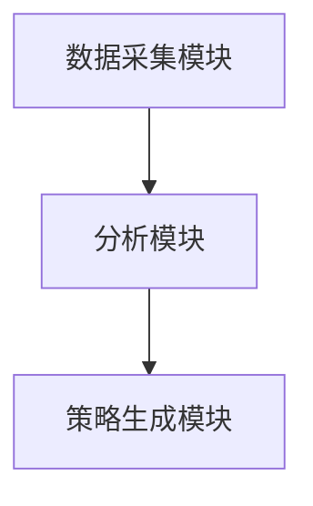

                 


# 股市估值高低对企业网络安全保险策略的影响

> 关键词：股市估值，网络安全保险，企业风险管理，金融建模，系统架构

> 摘要：本文深入分析股市估值的高低对企业网络安全保险策略的影响。通过背景介绍、核心概念解析、数学建模、系统架构设计、项目实战和最佳实践等多维度探讨，揭示股市估值波动如何影响企业网络安全风险管理决策，并为企业制定动态网络安全保险策略提供参考。

---

## 第1章: 股市估值与网络安全保险的基本概念

### 1.1 股市估值的基本概念

#### 1.1.1 股市估值的定义与计算方法
股市估值是指通过市场数据对企业价值的评估。常用的估值方法包括市盈率（P/E Ratio）、市净率（P/B Ratio）和市销率（P/S Ratio）等。市盈率=股价/每股收益，市净率=股价/每股净资产，市销率=股价/每股收入。

#### 1.1.2 市盈率、市净率等核心估值指标
市盈率反映市场对企业的盈利预期，市净率衡量资产重企业的真实价值，市销率适用于高成长企业。

#### 1.1.3 股市估值对企业经营决策的影响
高估值企业面临更大的市场压力，需通过稳健经营和风险管理来维持股价；低估值企业则有更大的市场机会，可通过优化管理提升估值。

### 1.2 网络安全保险的基本概念

#### 1.2.1 网络安全保险的定义与覆盖范围
网络安全保险覆盖因网络攻击导致的财务损失、法律赔偿、恢复成本等，是企业转移网络安全风险的有效工具。

#### 1.2.2 网络安全保险与传统保险的区别
网络安全保险具有动态风险评估、覆盖范围广、条款灵活等特点，传统保险通常基于静态风险评估。

#### 1.2.3 网络安全保险的市场需求与发展趋势
随着网络安全威胁增加，企业对网络安全保险的需求上升，保险产品的种类和覆盖范围也在不断扩展。

### 1.3 股市估值与网络安全保险的关联性

#### 1.3.1 股市估值对企业网络安全投入的影响
高估值企业有更多资金投入网络安全防护，低估值企业则可能在保险覆盖范围上寻求平衡。

#### 1.3.2 网络安全风险对股市估值的潜在影响
网络安全事件可能导致企业估值下降，反之，良好的网络安全管理可以提升市场对企业的信心。

#### 1.3.3 企业网络安全保险策略的经济意义
通过合理的保险策略，企业可以在高估值时分散风险，在低估值时优化成本，提升整体抗风险能力。

---

## 第2章: 股市估值对企业网络安全保险策略的影响机制

### 2.1 股市估值对企业财务状况的影响

#### 2.1.1 高估值企业面临的财务压力
高估值企业需维持高盈利预期，可能减少研发投入和创新，影响长期增长。

#### 2.1.2 低估值企业的市场机会
低估值企业有机会通过优化管理、提升效率，逐步恢复市场信心。

#### 2.1.3 股市估值波动对企业经营决策的影响
估值波动促使企业频繁调整经营策略，尤其是风险管理方面的决策。

### 2.2 网络安全风险对企业价值的影响

#### 2.2.1 网络安全事件对企业财务损失的计算
网络安全事件的直接损失包括修复成本、赔偿支出，间接损失包括收入下降、品牌损失。

#### 2.2.2 网络安全风险对股价波动的影响
重大网络安全事件可能导致股价短期大幅下跌，长期影响企业估值。

#### 2.2.3 网络安全风险管理的经济价值
有效的风险管理可以降低企业因网络安全事件带来的财务损失，增强市场信心。

### 2.3 股市估值与网络安全保险策略的互动关系

#### 2.3.1 高估值企业为何需要加强网络安全保险
高估值企业承受更大市场压力，通过保险分散风险，降低股价波动对估值的影响。

#### 2.3.2 低估值企业如何通过保险降低成本
低估值企业利用保险转移风险，降低实际损失，为估值回升创造条件。

#### 2.3.3 股市估值波动如何影响保险策略调整
根据估值变化，企业动态调整保险覆盖范围和额度，优化风险管理成本。

---

## 第3章: 股市估值与网络安全保险策略的数学模型

### 3.1 股市估值的数学模型

#### 3.1.1 市盈率模型（P/E Ratio）
$$ P/E = \frac{\text{股价}}{\text{每股收益}} $$

#### 3.1.2 市净率模型（P/B Ratio）
$$ P/B = \frac{\text{股价}}{\text{每股净资产}} $$

#### 3.1.3 市销率模型（P/S Ratio）
$$ P/S = \frac{\text{股价}}{\text{每股收入}} $$

### 3.2 网络安全保险需求的数学模型

#### 3.2.1 保险需求与企业网络安全风险的线性回归模型
$$ \text{保险需求} = \beta_0 + \beta_1 \times \text{网络安全风险} + \epsilon $$

#### 3.2.2 保险需求与企业财务状况的相关性分析
通过相关系数矩阵分析保险需求与企业财务指标之间的相关性。

#### 3.2.3 网络安全保险需求的多元回归模型
$$ \text{保险需求} = \beta_0 + \beta_1 \times \text{网络安全风险} + \beta_2 \times \text{企业估值} + \epsilon $$

---

## 第4章: 系统架构与项目实战

### 4.1 系统架构设计

#### 4.1.1 系统功能设计
- 数据采集模块：收集企业财务数据和网络安全风险数据。
- 分析模块：评估股市估值与网络安全保险需求的关系。
- 策略生成模块：制定动态保险策略。

#### 4.1.2 系统架构图


### 4.2 项目实战

#### 4.2.1 项目环境安装
- 数据采集工具：Python的pandas库
- 数据分析工具：Python的statsmodels库
- 可视化工具：Matplotlib

#### 4.2.2 核心代码实现
```python
import pandas as pd
import statsmodels.api as sm

# 数据预处理
data = pd.read_csv('security_insurance.csv')
data['网络安全保险需求'] = sm.OLS(data['网络安全保险需求'], sm.add_constant(data[['网络安全风险', '企业估值']])).fit().predict()

# 可视化
import matplotlib.pyplot as plt
plt.scatter(data['企业估值'], data['网络安全保险需求'])
plt.xlabel('企业估值')
plt.ylabel('网络安全保险需求')
plt.show()
```

---

## 第5章: 最佳实践与未来展望

### 5.1 最佳实践

#### 5.1.1 定期评估企业网络安全策略
根据企业估值和网络安全风险的变化，定期调整保险策略。

#### 5.1.2 动态调整保险方案
高估值时增加保险覆盖，低估值时优化保险成本。

#### 5.1.3 加强与保险公司的合作
选择合适的保险公司，确保保险条款与企业风险管理目标一致。

### 5.2 未来展望

随着网络安全威胁的增加和股市波动的加剧，企业需要更加动态地调整网络安全保险策略。结合大数据和人工智能技术，未来的保险策略将更加精准和智能化。

---

## 作者：AI天才研究院 & 禅与计算机程序设计艺术

---

通过以上内容，我们全面分析了股市估值对企业网络安全保险策略的影响，从理论到实践，为企业制定有效的风险管理策略提供了参考。

