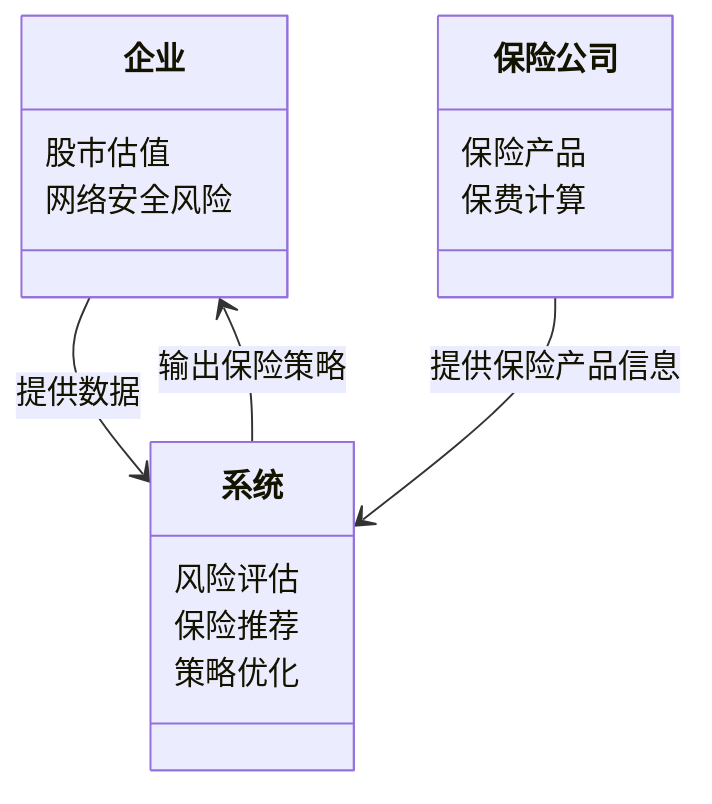
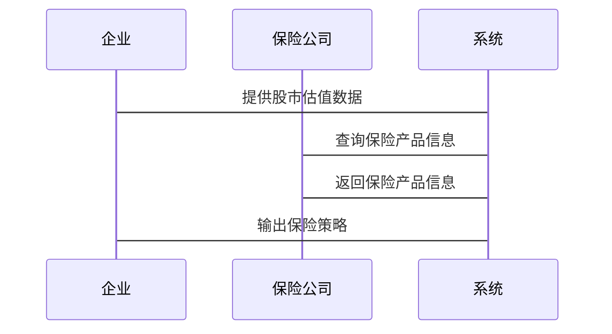

                 


# 股市估值高低对企业网络安全保险策略的影响

> 关键词：股市估值、企业网络安全、保险策略、风险管理、网络安全保险

> 摘要：本文深入分析股市估值波动如何影响企业的网络安全保险策略。通过探讨股市波动对财务状况和风险管理的影响，揭示企业如何在不同市场环境下调整保险策略。结合数学模型和实际案例，为企业的网络安全风险管理提供新的视角和策略选择。

## 第3章: 股市波动对网络安全保险策略的影响分析

### 3.1 股市波动对企业风险管理的影响

#### 3.1.1 高估值对企业财务压力的缓解作用
在高估值情况下，企业通常拥有较高的市值，这为企业提供了更多的财务灵活性。企业可能更愿意投资于高级网络安全措施，因为它们能够承受更高的保险费用。此外，高估值企业更容易获得贷款和投资，从而在网络安全方面投入更多资源。

#### 3.1.2 低估值对企业风险管理的约束
在低估值情况下，企业的财务状况可能较为紧张，这限制了他们在网络安全方面的投入。企业可能选择更经济的保险方案，或者减少安全措施的投入，从而增加了网络安全风险。

#### 3.1.3 股市波动对保险需求的周期性影响
股市波动具有周期性，企业可能在牛市期间增加保险支出，而在熊市期间减少投入。这种周期性变化直接影响企业的网络安全保险策略。

### 3.2 企业网络安全保险需求的弹性分析

#### 3.2.1 高估值企业保险需求的弹性
高估值企业通常具有较高的财务弹性，能够根据市场变化调整保险支出。在高估值时，企业可能选择更高保额或更全面的保险产品，以应对潜在的网络安全风险。

#### 3.2.2 低估值企业保险需求的弹性
低估值企业可能面临财务压力，保险需求的弹性较低。企业可能更倾向于选择保费较低的保险产品，或者在风险可控的情况下减少保险覆盖范围。

#### 3.2.3 股市波动对企业保险需求的调节作用
股市波动通过影响企业的财务状况，间接调节其保险需求。在股市上涨期间，企业可能增加保险支出；而在股市下跌期间，企业可能减少保险投入，转而寻求更经济的解决方案。

## 第4章: 网络安全保险定价机制与股市估值的关系

### 4.1 网络安全保险定价模型

#### 4.1.1 基于风险评估的定价方法
网络安全保险的定价通常基于企业的风险评估，包括企业的网络安全措施、历史赔付记录等因素。保险公司会根据这些因素评估企业的风险等级，并据此制定保费。

#### 4.1.2 市场供需对保险价格的影响
市场供需关系也会影响保险价格。在高需求期间，保险价格可能会上涨；而在低需求期间，价格可能会下降。

#### 4.1.3 股市估值对保险价格的间接影响
股市估值通过影响企业的财务状况，间接影响保险价格。高估值企业可能支付更高的保费，而低估值企业可能面临更高的保险费用，因为保险公司可能认为这些企业的风险更高。

### 4.2 股市估值对企业保险支出的影响

#### 4.2.1 高估值企业保险支出的增加
高估值企业通常具有较高的财务实力，能够在保险支出上投入更多。这可能包括购买更高保额的保险产品或增加保险覆盖范围。

#### 4.2.2 低估值企业保险支出的优化
低估值企业可能在保险支出上进行优化，寻找保费较低的保险产品或减少保险覆盖范围。这可能增加企业的网络安全风险，但也能够在财务紧张时节省成本。

#### 4.2.3 股市波动对保险支出的动态调节
股市波动会导致企业的保险支出发生变化。在股市上涨期间，企业可能增加保险支出；而在股市下跌期间，企业可能减少保险投入，转而寻求更经济的解决方案。

## 第5章: 系统分析与架构设计方案

### 5.1 系统功能设计

#### 5.1.1 系统功能描述
本系统旨在帮助企业根据股市估值和网络安全风险，制定最优的保险策略。系统功能包括风险评估、保险产品推荐、保费计算、策略优化等。

#### 5.1.2 领域模型（Mermaid 类图）


### 5.2 系统架构设计（Mermaid 架构图）

```mermaid
archi
    企业端
    保险公司
    第三方数据源
    系统核心
        API Gateway
        数据库
        计算引擎
    用户界面
```

### 5.3 系统接口设计

#### 5.3.1 输入接口
- 股市估值数据
- 网络安全风险评估结果
- 保险产品信息

#### 5.3.2 输出接口
- 保险产品推荐
- 保费计算结果
- 策略优化建议

### 5.4 系统交互流程（Mermaid 序列图）



## 第6章: 项目实战

### 6.1 环境安装

#### 6.1.1 系统要求
- 操作系统：Windows 10 或更高版本，或 Linux 系统
- 开发工具：Python 3.8 或更高版本，Jupyter Notebook
- 数据库：MySQL 或 PostgreSQL
- 依赖库：pandas、numpy、scikit-learn

### 6.2 核心实现源代码

```python
import pandas as pd
import numpy as np
from sklearn.linear_model import LinearRegression

# 数据加载
data = pd.read_csv('market_valuation.csv')

# 特征与目标变量分离
X = data[['market_valuation', 'risk_factors']]
y = data['insurance_cost']

# 建立线性回归模型
model = LinearRegression()
model.fit(X, y)

# 预测保险费用
predicted_cost = model.predict([[current_valuation, current_risk]])
print("预测的保险费用为:", predicted_cost[0])
```

### 6.3 实际案例分析

#### 6.3.1 案例背景
某科技公司近年来股价波动较大，希望通过调整网络安全保险策略来优化成本。

#### 6.3.2 数据分析
通过对该公司的历史股价和网络安全保险支出进行分析，建立回归模型，预测不同股市估值下的保险费用。

#### 6.3.3 结论
在高估值期间，公司应增加保险支出；在低估值期间，应优化保险方案，减少不必要的开支。

## 第7章: 总结与展望

### 7.1 总结
本文分析了股市估值波动如何影响企业的网络安全保险策略，揭示了股市波动对企业风险管理的影响，并提出了基于数学模型的定价机制。通过系统架构设计和实际案例分析，为企业的网络安全保险策略优化提供了新的思路。

### 7.2 展望
未来的研究可以进一步探讨更多市场因素对保险策略的影响，如通货膨胀、经济政策等。同时，开发更复杂的定价模型，结合机器学习技术，提高预测的准确性。

## 作者：AI天才研究院/AI Genius Institute & 禅与计算机程序设计艺术 /Zen And The Art of Computer Programming

