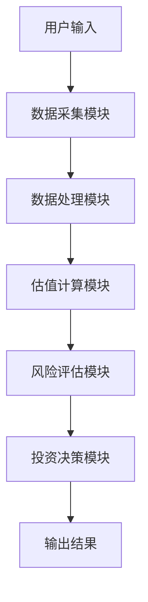

                 


# 股市估值高低对企业网络安全投资的影响

> 关键词：股市估值、企业网络安全、投资影响、风险管理、资产配置

> 摘要：本文探讨了股市估值的高低对企业网络安全投资的影响。通过分析股市估值对企业财务状况和投资决策的影响，结合网络安全投资的核心要素，提出了优化企业网络安全投资的策略。文章还通过实际案例分析，展示了如何在不同股市估值下调整网络安全投资策略，以实现企业风险管理与资产配置的最优平衡。

---

## 第一部分：背景介绍

### 第1章：股市估值与企业网络安全投资概述

#### 1.1 股市估值与企业网络安全投资的关系

##### 1.1.1 股市估值的定义与核心要素

股市估值是指通过对上市公司的财务数据、行业地位、市场表现等多方面因素的分析，对其股票的价值进行评估的过程。核心要素包括：

1. **市盈率（P/E Ratio）**：市盈率 = 股票价格 / 每股净利润。
2. **市净率（P/B Ratio）**：市净率 = 股票价格 / 每股净资产。
3. **市值（Market Value）**：公司股票的总市场价值。
4. **盈利能力（ROE）**：股东权益回报率，衡量公司的盈利能力。
5. **行业地位与竞争优势**：公司在行业中的地位及竞争优势。

##### 1.1.2 企业网络安全投资的定义与核心要素

企业网络安全投资是指企业在保障信息系统安全、防范网络攻击、保护数据资产等方面的资金投入。核心要素包括：

1. **技术投入**：购买安全设备、软件 licenses 等。
2. **人力资源**：安全人员的招聘与培训。
3. **风险管理**：制定安全策略、应对措施。
4. **合规性要求**：满足行业监管要求的投入。
5. **应急响应**：建立网络安全应急预案。

##### 1.1.3 股市估值与企业网络安全投资的联系与区别

- **联系**：股市估值反映了企业的财务状况和市场信心，直接影响企业的投资能力；企业网络安全投资是企业风险管理的重要组成部分，两者相互影响。
- **区别**：股市估值是市场的外部评价，而企业网络安全投资是企业的内部决策。

#### 1.2 问题背景与问题描述

##### 1.2.1 股市估值对企业财务状况的影响

股市估值的高低直接影响企业的融资能力、投资者信心以及管理层的决策。高估值可能意味着企业需要承担更高的资本成本，而低估值可能导致企业资本不足，影响其安全投资能力。

##### 1.2.2 企业网络安全投资的现状与挑战

随着网络安全威胁的增加，企业网络安全投资的必要性日益凸显。然而，投资不足可能导致企业面临更大的风险，而过度投资则可能影响企业的盈利能力。

##### 1.2.3 股市估值与企业网络安全投资之间的互动关系

股市估值影响企业的资金分配，进而影响网络安全投资；同时，企业网络安全投资的水平也会影响市场对企业的估值预期。

#### 1.3 问题解决与边界外延

##### 1.3.1 如何通过股市估值优化企业网络安全投资

- 结合股市估值分析企业的财务状况，合理分配安全预算。
- 在高估值时，适当增加安全投入；在低估值时，优化投资结构。

##### 1.3.2 企业网络安全投资的边界与外延

- 投资的边界：基于企业财务状况和风险管理目标，合理分配预算。
- 投资的外延：涵盖技术、人力资源、合规等多个方面。

##### 1.3.3 股市估值对企业网络安全投资的正反面影响

- **正面影响**：高估值企业有更多资金用于安全投资。
- **负面影响**：高估值可能增加资本成本，影响投资能力。

#### 1.4 核心概念结构与组成

##### 1.4.1 股市估值的核心要素分析

通过分析市盈率、市净率等指标，评估企业的市场价值和财务健康状况。

##### 1.4.2 企业网络安全投资的核心要素分析

通过技术投入、人力资源等多方面评估企业的安全能力。

##### 1.4.3 股市估值与企业网络安全投资的关系模型

通过构建模型，分析股市估值如何影响企业的安全投资决策。

---

## 第二部分：核心概念与联系

### 第2章：核心概念原理与对比分析

#### 2.1 股市估值的核心原理

股市估值是通过对企业财务数据和市场表现的分析，评估企业的内在价值和市场地位。主要影响因素包括盈利能力、成长潜力、行业竞争环境等。

#### 2.2 企业网络安全投资的核心原理

企业网络安全投资是为了保护企业的信息资产免受网络攻击和数据泄露的威胁。投资决策通常基于风险评估、成本效益分析和合规要求。

#### 2.3 股市估值与企业网络安全投资的联系

- **影响机制**：股市估值影响企业的资金分配，进而影响安全投资。
- **反向影响**：企业安全投资的水平也会影响投资者对企业的信心。

#### 2.4 核心概念对比分析

##### 2.4.1 股市估值与企业网络安全投资的对比表格

| 要素        | 股市估值                     | 企业网络安全投资               |
|-------------|------------------------------|---------------------------------|
| 定义        | 股票价格与企业盈利能力的比值 | 企业为保护网络安全的投入       |
| 影响因素    | 市盈率、市净率、市值等       | 技术投入、人力资源、合规要求等 |
| 目标        | 评估企业市场价值             | 保护企业信息安全               |

##### 2.4.2 股市估值与企业网络安全投资的ER实体关系图

```mermaid
erDiagram
    company {
        key id : Integer
        name : String
        industry : String
        market_value : Integer
        net_profit : Integer
        stock_price : Float
    }
    security_investment {
        key id : Integer
        company_id : Integer
        investment_amount : Integer
        investment_type : String
        investment_reason : String
    }
    company --> security_investment : 进行
```

---

### 第3章：算法原理与数学模型

#### 3.1 算法原理

##### 3.1.1 股市估值预测算法

使用回归分析预测股市估值，考虑市盈率、市净率等指标。

##### 3.1.2 企业网络安全投资决策算法

基于风险评估和成本效益分析，制定投资决策。

#### 3.2 数学模型与公式

##### 3.2.1 股市估值预测模型

$$ P = \alpha \times E + \beta \times (1 - E) $$

其中，\( P \) 表示股票价格，\( E \) 表示企业盈利预期，\( \alpha \) 和 \( \beta \) 为模型参数。

##### 3.2.2 企业网络安全投资决策模型

$$ I = \gamma \times P + \delta \times R $$

其中，\( I \) 表示投资金额，\( P \) 表示股市估值，\( R \) 表示风险评估结果，\( \gamma \) 和 \( \delta \) 为模型参数。

---

### 第4章：系统分析与架构设计

#### 4.1 问题场景介绍

##### 4.1.1 股市估值与企业网络安全投资的典型问题场景

- 企业高估值时，如何合理分配安全预算。
- 企业低估值时，如何优化安全投资结构。

#### 4.2 项目介绍与系统功能设计

##### 4.2.1 项目目标与范围

设计一个基于股市估值的企业网络安全投资优化系统，帮助企业在不同市场环境下合理分配安全预算。

##### 4.2.2 系统功能设计

- **数据采集**：采集企业财务数据、市场数据。
- **估值计算**：计算股市估值指标。
- **风险评估**：评估网络安全风险。
- **投资决策**：基于估值和风险，制定投资策略。

##### 4.2.3 系统架构设计



---

## 第三部分：项目实战

### 第5章：项目实战

#### 5.1 环境安装

安装必要的开发工具和数据采集工具，如Python、Pandas、Scikit-learn等。

#### 5.2 核心代码实现

##### 5.2.1 数据采集与处理代码

```python
import pandas as pd

# 采集企业财务数据
data = pd.read_csv('financial_data.csv')

# 处理数据
data_processed = data.dropna()
data_processed['valuation'] = data_processed['market_value'] / data_processed['net_profit']
```

##### 5.2.2 投资决策代码

```python
from sklearn.linear_model import LinearRegression

# 训练投资决策模型
model = LinearRegression()
model.fit(X_train, y_train)

# 预测投资金额
y_pred = model.predict(X_test)
```

#### 5.3 案例分析

分析一家高估值和低估值企业的网络安全投资策略，展示如何根据股市估值调整投资。

#### 5.4 项目小结

总结项目的实现过程，提出改进建议和未来展望。

---

## 第四部分：总结与展望

### 第6章：总结与展望

#### 6.1 最佳实践 tips

- 定期评估企业网络安全投资与股市估值的关系。
- 根据市场变化动态调整投资策略。

#### 6.2 小结

股市估值是影响企业网络安全投资的重要因素，合理优化投资策略有助于企业在不同市场环境下保持竞争优势。

#### 6.3 注意事项

- 考虑多种因素，避免单一依赖股市估值。
- 定期进行风险评估和投资调整。

#### 6.4 拓展阅读

建议阅读相关领域的书籍和论文，深入理解股市估值和网络安全投资的理论与实践。

---

## 作者：AI天才研究院

这篇文章详细探讨了股市估值对企业网络安全投资的影响，通过理论分析和实际案例，为企业的投资决策提供了参考。希望对读者有所帮助！

