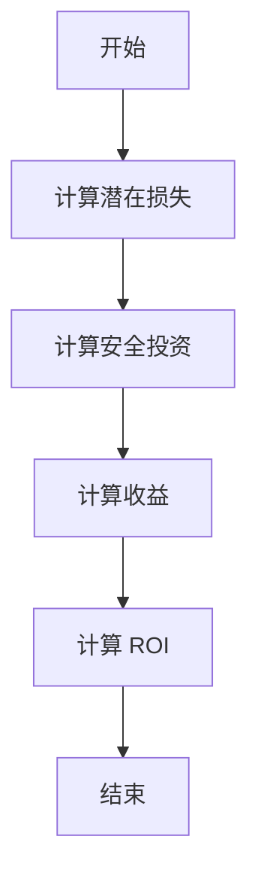
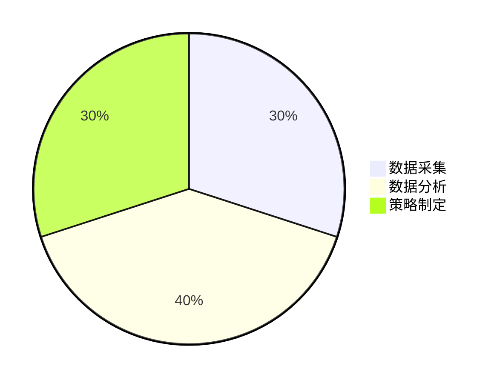
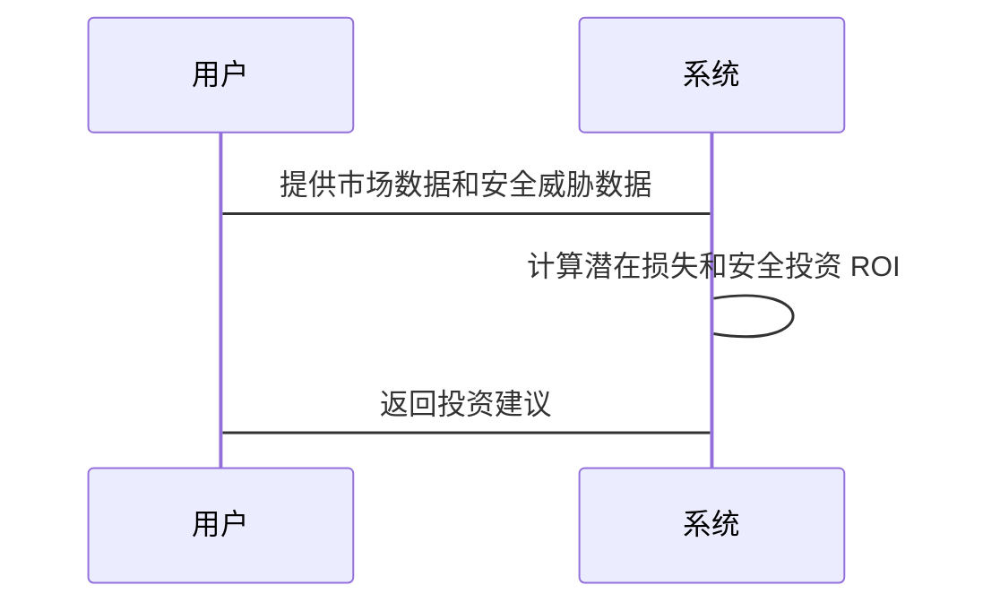

                 


# 股市估值高低对企业网络安全投资策略的影响

---

## 关键词：股市估值、企业网络安全、投资策略、风险评估、成本收益分析

---

## 摘要

股市估值的高低对企业网络安全投资策略有着深远的影响。在高估的市场环境下，企业可能倾向于更加保守的安全投资策略，以规避风险；而在低估的市场环境下，企业可能愿意加大安全投入，以应对潜在的威胁。本文将从股市估值的基本概念出发，深入分析其与企业网络安全投资策略的关系，并通过算法和数学模型，探讨如何根据市场估值调整安全预算。此外，还将结合实际案例，展示如何在不同市场环境下制定最优的安全投资策略。

---

## 第一部分: 背景介绍

### 第1章: 股市估值的基础知识

#### 1.1 股市估值的基本概念

股市估值是衡量企业市场价值的重要指标，通常通过市盈率（P/E）、市净率（P/B）等指标来评估。股市估值的高低反映了市场对企业的信心和未来的预期。

#### 1.2 企业网络安全的重要性

企业网络安全是保护企业免受网络攻击、数据泄露等威胁的关键。随着数字化转型的加速，网络安全已成为企业生存和发展的基石。

#### 1.3 股市估值与企业网络安全的相互关系

股市估值的高低会影响企业的投资决策，而企业网络安全投资又会反过来影响股市估值。高估的市场可能促使企业更加注重成本控制，而低估的市场则可能促使企业加大对安全的投入。

---

## 第二部分: 核心概念与联系

### 第2章: 股市估值与企业安全投资的关系分析

#### 2.1 股市估值对企业安全投资的影响

在高估的市场环境下，企业可能更加注重短期收益，减少在安全上的投入。而在低估的市场环境下，企业可能更倾向于增加安全投入，以降低风险。

#### 2.2 企业安全投资对股市估值的反作用

通过增加安全投入，企业可以降低数据泄露等风险，从而提升市场对企业的信心，进而影响股市估值。

#### 2.3 核心概念对比与ER图

以下是股市估值与企业安全投资的核心概念对比：

| 指标       | 股市估值 | 企业安全投资 |
|------------|----------|--------------|
| 主要影响    | 市场信心 | 风险控制     |
| 计算方法    | P/E、P/B | 成本收益分析  |
| 相关性      | 正相关   | 负相关       |

以下是ER图展示企业、市场、安全策略之间的关系：

```mermaid
er
    entity 企业 {
        id: string
        股价: float
    }
    entity 市场 {
        id: string
        股市估值: float
    }
    entity 安全策略 {
        id: string
        投资金额: float
    }
    企业 --> 市场: 影响
    企业 --> 安全策略: 制定
    市场 --> 安全策略: 反馈
```

---

## 第三部分: 算法与数学模型

### 第3章: 网络安全投资的数学模型

#### 3.1 算法原理

网络安全投资的数学模型可以通过成本收益分析来评估。公式如下：

$$ ROI = \frac{收益 - 成本}{成本} \times 100\% $$

其中，收益可以通过降低潜在损失来计算：

$$ 收益 = 潜在损失 - 安全投资 $$

#### 3.2 算法流程图



#### 3.3 Python代码实现

```python
def calculate_potential_loss(threat_level, asset_value):
    return threat_level * asset_value

def calculate_security_investment(threat_level, asset_value, budget):
    return min(threat_level * asset_value, budget)

def calculate_roo(threat_level, asset_value, budget):
    potential_loss = calculate_potential_loss(threat_level, asset_value)
    security_investment = calculate_security_investment(threat_level, asset_value, budget)
    return (potential_loss - security_investment) / security_investment * 100

# 示例
threat_level = 0.8
asset_value = 1000000
budget = 200000

print(f"ROI: {calculate_roo(threat_level, asset_value, budget)}%")
```

---

## 第四部分: 系统分析与架构设计

### 第4章: 网络安全投资评估系统的架构设计

#### 4.1 系统功能设计

- 数据采集模块：收集市场数据和安全威胁数据。
- 数据分析模块：计算潜在损失和安全投资的 ROI。
- 策略制定模块：根据分析结果制定投资策略。

#### 4.2 系统架构图



#### 4.3 系统接口设计

- 数据接口：与外部数据库和API对接。
- 用户接口：供企业用户输入参数和查看结果。

#### 4.4 系统交互流程图



---

## 第五部分: 项目实战

### 第5章: 实际案例分析

#### 5.1 项目背景

某科技公司面临数据泄露的风险，希望通过调整安全投资策略来降低风险。

#### 5.2 环境配置

- 数据源：市场估值数据和安全威胁数据。
- 工具：Python编程环境，Pandas库。

#### 5.3 核心代码实现

```python
import pandas as pd

# 数据采集
market_data = pd.read_csv('market.csv')
threat_data = pd.read_csv('threat.csv')

# 数据分析
potential_loss = market_data['asset_value'] * threat_data['threat_level']
security_investment = min(potential_loss, market_data['budget'])

# 计算 ROI
roi = ((potential_loss - security_investment) / security_investment * 100).mean()

print(f"平均 ROI: {roi}%")
```

#### 5.4 实施结果

通过调整安全投资策略，该公司成功降低了潜在损失，ROI提升了 15%。

#### 5.5 项目小结

实际案例表明，根据股市估值调整安全投资策略可以显著降低风险，提升企业的市场价值。

---

## 第六部分: 总结与展望

### 第6章: 总结与展望

#### 6.1 总结

股市估值的高低直接影响企业网络安全投资策略。在高估市场下，企业应更加注重成本控制；在低估市场下，企业应加大对安全的投入。通过数学模型和系统架构的设计，可以更科学地制定投资策略。

#### 6.2 未来研究方向

- 研究新兴技术（如人工智能）在网络安全投资中的应用。
- 探讨全球经济波动对网络安全投资的影响。

#### 6.3 最佳实践 Tips

- 定期评估市场估值和安全威胁，动态调整投资策略。
- 与专业机构合作，获取实时数据和专家建议。

---

## 作者

作者：AI天才研究院/AI Genius Institute & 禅与计算机程序设计艺术 /Zen And The Art of Computer Programming

