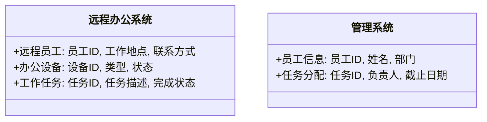
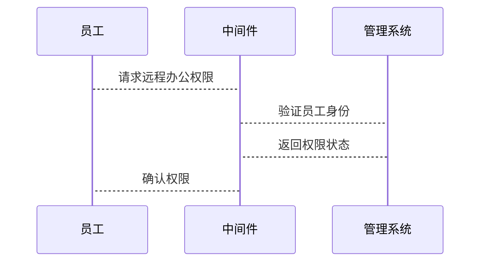

                 


# 股市估值高低对企业远程办公策略的影响

## 关键词：股市估值、远程办公、企业策略、数学模型、系统架构、博弈论、机器学习

## 摘要：本文深入分析股市估值的高低对企业远程办公策略的影响，从背景、核心概念、算法原理、系统架构到项目实战，结合数学模型和机器学习算法，探讨远程办公策略如何优化企业成本结构、提升竞争力，从而影响股市估值。通过案例分析和系统设计，本文为企业制定远程办公策略提供了理论支持和实践指导。

---

# 第一部分: 背景与概念解析

## 第1章: 股市估值与远程办公的定义与背景

### 1.1 股市估值的基本概念
#### 1.1.1 股市估值的定义与计算方法
股市估值是通过对企业财务状况、市场表现和行业前景等多方面因素的分析，估算企业股票的合理价格区间。常用的方法包括市盈率（P/E）、市净率（P/B）等。

#### 1.1.2 影响股市估值的主要因素
- **财务指标**：净利润、营业收入、资产负债率等。
- **行业前景**：行业发展趋势、市场需求。
- **宏观经济环境**：经济增长、利率水平、通货膨胀等。
- **政策环境**：政府政策、税收政策等。

#### 1.1.3 远程办公的定义与发展趋势
远程办公是指员工在非传统办公场所（如家中）通过网络技术完成工作任务的一种工作模式。随着互联网技术的发展和全球疫情的影响，远程办公逐渐成为企业降低运营成本、提高灵活性的重要策略。

### 1.2 股市估值与远程办公的关联性
#### 1.2.1 远程办公对企业运营效率的影响
- **效率提升**：减少通勤时间，提高员工专注度。
- **成本节约**：降低办公场地租赁、设备维护等成本。

#### 1.2.2 远程办公对员工生产力的提升与潜在风险
- **生产力提升**：员工可以在最佳状态下工作，减少通勤压力。
- **潜在风险**：沟通效率下降、团队协作困难、员工流失率增加。

#### 1.2.3 股市估值与企业运营模式的关系
企业运营模式的改变（如采用远程办公）会影响其成本结构、效率和竞争力，从而影响股市估值。

---

## 第2章: 股市估值高低对企业远程办公策略的影响机制

### 2.1 股市估值与企业价值的关系
#### 2.1.1 企业价值的衡量标准
企业价值通常通过市盈率、市净率等指标衡量，反映了市场对企业未来盈利能力的预期。

#### 2.1.2 股市估值对企业战略决策的影响
股市估值的高低会影响企业的投资决策、融资成本和管理层激励机制。

#### 2.1.3 远程办公对企业价值的潜在影响
远程办公可能通过降低运营成本、提高效率间接提升企业价值，从而影响股市估值。

### 2.2 远程办公对企业成本结构的优化
#### 2.2.1 远程办公的成本节约分析
- **办公场地成本**：减少租金支出。
- **差旅费用**：降低员工出差频率。
- **设备维护成本**：减少办公设备的维护需求。

#### 2.2.2 远程办公对员工效率的提升与潜在风险
- **效率提升**：员工可以在家中高效工作。
- **潜在风险**：沟通不畅、团队协作困难。

### 2.3 远程办公对企业竞争力的影响
#### 2.3.1 远程办公对企业灵活性的提升
远程办公使企业能够更灵活地调整业务策略，快速响应市场变化。

#### 2.3.2 远程办公对员工满意度与 retention 的影响
- **员工满意度**：远程办公提高了员工的工作满意度。
- **员工 retention**：企业通过灵活的工作方式吸引和保留优秀员工。

#### 2.3.3 企业竞争力提升对股市估值的推动作用
企业竞争力的提升会增强市场对企业的信心，从而推动股市估值上升。

---

# 第二部分: 核心概念与数学模型

## 第3章: 核心概念与影响模型

### 3.1 核心概念对比分析
#### 3.1.1 股市估值的核心要素
- **市盈率（P/E）**：净利润与股价的比值。
- **市净率（P/B）**：净资产与股价的比值。

#### 3.1.2 远程办公的核心要素
- **技术基础设施**：高速网络、协作工具。
- **组织管理**：远程办公的制度、流程。

#### 3.1.3 两者之间的关联性分析
远程办公通过优化成本结构和提高效率间接影响企业价值，从而影响股市估值。

### 3.2 影响模型构建
#### 3.2.1 模型构建的逻辑框架
- **自变量**：远程办公策略（如远程办公比例、技术投入）。
- **因变量**：股市估值（如市盈率、市净率）。
- **控制变量**：行业、宏观经济环境。

#### 3.2.2 模型的变量定义与假设
- **假设**：远程办公策略与股市估值呈正相关关系。

#### 3.2.3 模型的数学表达式
$$
\text{股市估值} = \beta_0 + \beta_1 \times \text{远程办公投入} + \epsilon
$$

### 3.3 模型的验证与优化
#### 3.3.1 数据收集与处理
- 数据来源：历史股市数据、企业远程办公策略数据。
- 数据处理：清洗、标准化。

#### 3.3.2 模型的验证过程
- 使用回归分析验证远程办公投入与股市估值的相关性。

#### 3.3.3 模型的优化与改进
- 引入更多变量（如员工满意度）提升模型精度。

---

## 第4章: 数学模型与算法原理

### 4.1 线性回归模型
#### 4.1.1 线性回归的基本原理
线性回归通过最小化残差平方和，建立因变量与自变量之间的线性关系。

#### 4.1.2 远程办公策略对股市估值的线性关系分析
- 使用线性回归模型分析远程办公投入对股市估值的影响。

#### 4.1.3 模型的实现与验证
- 使用Python代码实现线性回归模型：
```python
import numpy as np
from sklearn.linear_model import LinearRegression

# 假设 X 为远程办公投入，Y 为股市估值
X = np.array([1, 2, 3, 4, 5]).reshape(-1, 1)
Y = np.array([10, 20, 30, 40, 50])

model = LinearRegression()
model.fit(X, Y)
print('回归系数:', model.coef_)
print('截距:', model.intercept_)
```

---

## 第4章(续): 数学模型与算法原理

### 4.2 博弈论模型
#### 4.2.1 博弈论的基本概念
博弈论通过分析参与者之间的策略互动，预测最优决策。

#### 4.2.2 远程办公策略与股市估值的博弈关系
- 企业通过优化远程办公策略提升股市估值，与竞争对手形成差异化优势。

#### 4.2.3 模型的构建与应用
- 使用博弈论模型分析企业远程办公策略的最优选择。

### 4.3 机器学习模型
#### 4.3.1 机器学习的基本原理
机器学习通过数据训练模型，预测未来趋势。

#### 4.3.2 远程办公策略的特征提取与分类
- 提取远程办公相关特征（如远程办公比例、技术投入）。

#### 4.3.3 模型的训练与预测
- 使用随机森林等算法预测股市估值。

---

# 第三部分: 系统分析与架构设计

## 第5章: 系统分析与架构设计方案

### 5.1 问题场景介绍
企业希望通过远程办公策略优化成本结构，提升竞争力，从而影响股市估值。

### 5.2 项目介绍
设计一个基于远程办公策略的企业信息管理系统，优化企业运营效率。

### 5.3 系统功能设计
#### 5.3.1 领域模型


### 5.4 系统架构设计


### 5.5 系统接口设计
- **API接口**：提供远程办公系统的数据接口，方便与其他系统集成。

### 5.6 系统交互设计


---

## 第6章: 项目实战

### 6.1 环境安装
- **Python**：安装Python 3.8及以上版本。
- **库依赖**：安装numpy、pandas、sklearn等库。

### 6.2 系统核心实现源代码
```python
import numpy as np
import pandas as pd
from sklearn.linear_model import LinearRegression

# 数据加载
data = pd.read_csv('remote_office.csv')
X = data[['remote_office投入']]
Y = data['股市估值']

# 模型训练
model = LinearRegression()
model.fit(X, Y)

# 预测与评估
predictions = model.predict(X)
print('均方误差:', np.mean((predictions - Y) ** 2))
```

### 6.3 代码应用解读与分析
- **数据加载**：读取远程办公投入与股市估值数据。
- **模型训练**：使用线性回归模型训练。
- **预测与评估**：评估模型的准确性。

### 6.4 实际案例分析
- **案例分析**：某公司通过优化远程办公策略，降低了成本，提高了股市估值。

### 6.5 项目小结
- **小结**：远程办公策略的优化能够显著影响股市估值，企业应结合自身情况制定合理策略。

---

## 第7章: 结论与建议

### 7.1 结论
- 远程办公策略通过优化成本结构和提高效率，显著影响股市估值。
- 企业应结合自身情况，制定合理的远程办公策略。

### 7.2 建议
- **技术建议**：加强技术基础设施建设，确保远程办公的高效性。
- **管理建议**：优化远程办公管理制度，提升员工满意度和 retention。
- **未来研究方向**：进一步研究远程办公策略对不同类型企业的差异化影响。

---

## 作者：AI天才研究院/AI Genius Institute & 禅与计算机程序设计艺术 /Zen And The Art of Computer Programming

