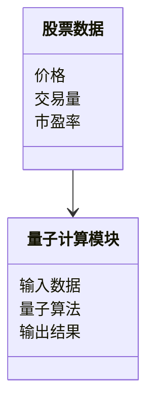
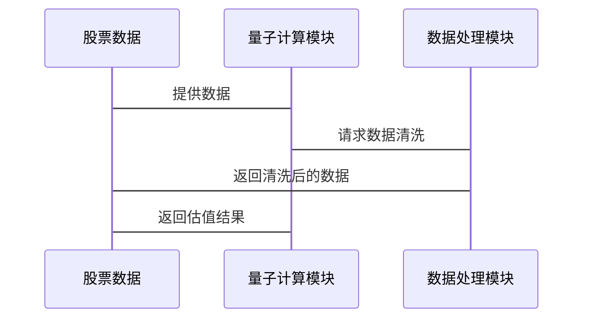

                 


# 股市估值高低对企业量子计算投资策略的影响

> 关键词：股市估值，量子计算，投资策略，金融建模，量子算法

> 摘要：本文探讨了股市估值的高低对企业投资策略的影响，并分析了量子计算在金融领域的潜力及其在股市估值中的应用。通过详细分析量子计算的基本原理、算法及其在金融建模中的应用，本文提出了如何利用量子计算优化企业投资策略的方法。文章还结合实际案例，展示了量子计算在股市估值中的具体应用，并对未来的研究方向进行了展望。

---

## 第1章: 股市估值与量子计算概述

### 1.1 股市估值的基本概念

#### 1.1.1 股市估值的定义与意义
股市估值是指通过对公司基本面、市场环境和行业趋势等多方面因素的分析，对股票的内在价值进行估算的过程。其意义在于帮助投资者做出更明智的投资决策，避免因市场波动而盲目操作。

#### 1.1.2 传统股市估值方法的局限性
传统的估值方法（如市盈率、市净率等）在处理复杂市场环境和大量数据时显得力不从心，且难以捕捉市场中的非线性关系和不确定性因素。

#### 1.1.3 量子计算在金融领域的潜力
量子计算凭借其强大的并行计算能力和处理复杂问题的优势，为金融建模和数据分析提供了新的可能性。

### 1.2 量子计算的基本原理

#### 1.2.1 量子计算的定义与特点
量子计算利用量子叠加和量子纠缠的特性，能够在同一时间处理大量的可能性，从而提高计算效率。

#### 1.2.2 量子叠加与量子纠缠
- **量子叠加**：量子位（qubit）可以同时处于多个状态的叠加态。
- **量子纠缠**：两个或多个量子位之间形成强关联，一个量子位的状态会直接影响另一个量子位的状态。

#### 1.2.3 量子计算与经典计算的对比
| 特性 | 量子计算 | 经典计算 |
|------|-----------|----------|
| 并行性 | 高        | 低       |
| 处理复杂性 | 强        | 弱       |
| 速度 | 快        | 较慢     |

### 1.3 量子计算在金融中的应用前景

#### 1.3.1 量子计算在金融建模中的优势
量子计算能够处理海量数据，发现传统方法难以察觉的模式和关系。

#### 1.3.2 量子计算在投资策略中的潜在应用
- **风险评估**：利用量子算法优化投资组合的风险管理。
- **市场预测**：通过量子计算分析市场趋势，提高预测准确性。

#### 1.3.3 量子计算在股市估值中的具体作用
量子计算可以通过分析大量历史数据和实时市场信息，提供更精准的估值模型。

---

## 第2章: 股市估值的高低对企业投资策略的影响

### 2.1 股市估值高低的定义与分类

#### 2.1.1 高估值与低估值的定义
- **高估值**：股票价格远高于其内在价值。
- **低估值**：股票价格远低于其内在价值。

#### 2.1.2 高估值与低估值的分类标准
- **市盈率（P/E）**：低于行业平均水平为低估值，高于行业平均水平为高估值。
- **市净率（P/B）**：低于行业平均水平为低估值，高于行业平均水平为高估值。

#### 2.1.3 高估值与低估值的市场表现对比
| 特性 | 高估值 | 低估值 |
|------|---------|--------|
| 投资风险 | 高       | 低       |
| 回报潜力 | 低       | 高       |

### 2.2 股市估值高低对企业投资策略的影响

#### 2.2.1 高估值市场中的投资策略
- **短期投资者**：寻找高估值市场中的交易机会。
- **长期投资者**：需谨慎评估投资标的，避免盲目跟风。

#### 2.2.2 低估值市场中的投资策略
- **价值投资**：寻找被市场低估的优质股票。
- **长期持有**：耐心等待市场回归理性。

#### 2.2.3 股市估值波动对企业投资决策的影响
- **短期波动**：影响投资者情绪，可能导致非理性决策。
- **长期趋势**：反映市场整体健康状况，影响企业投资策略的制定。

### 2.3 传统投资策略的局限性

#### 2.3.1 传统估值方法的不足
- **线性假设**：传统估值方法假设市场是线性的，忽略了市场的复杂性和不确定性。
- **数据处理能力**：传统方法难以处理海量数据，导致分析结果不够精确。

#### 2.3.2 传统投资策略在市场波动中的表现
- **波动性高**：传统策略在市场剧烈波动时表现不佳。
- **收益不稳定**：难以在不同市场环境下保持稳定的收益。

#### 2.3.3 传统策略在复杂市场环境中的挑战
- **多变量分析**：传统方法难以同时考虑多个变量的交互影响。
- **非线性关系**：传统方法难以捕捉市场中的非线性关系。

---

## 第3章: 核心概念与联系

### 3.1 量子计算在金融中的应用

#### 3.1.1 量子算法在金融建模中的应用
- **量子线性方程组求解**：用于解决复杂的金融问题，如投资组合优化。
- **量子模拟**：用于模拟金融市场中的复杂系统。

#### 3.1.2 量子机器学习在金融中的应用
- **量子支持向量机**：用于分类和预测金融市场数据。
- **量子聚类分析**：用于识别市场中的潜在模式。

#### 3.1.3 量子计算在风险管理中的应用
- **量子蒙特卡洛模拟**：用于评估投资组合的风险。

### 3.2 量子算法的实现与应用

#### 3.2.1 量子算法的实现
```python
from qiskit import QuantumCircuit, execute, Aer
from qiskit.circuit import Gate

# 创建量子电路
qc = QuantumCircuit(2, 2)
qc.h(0)
qc.cx(0, 1)
qc.measure(0, 0)
qc.measure(1, 1)

# 执行量子模拟
backend = Aer.get_backend('qasm_simulator')
job = execute(qc, backend)
result = job.result()
print(result.get_counts())
```

#### 3.2.2 量子算法在股市估值中的应用
- **量子回归模型**：用于预测股票价格。
- **量子分类模型**：用于识别高估值与低估值股票。

### 3.3 数学模型与公式

#### 3.3.1 量子叠加的数学表达
$$
|\psi\rangle = \alpha|0\rangle + \beta|1\rangle
$$
其中，$\alpha$ 和 $\beta$ 是复数，满足 $|\alpha|^2 + |\beta|^2 = 1$。

#### 3.3.2 量子测量的数学表达
$$
P(0) = |\alpha|^2, \quad P(1) = |\beta|^2
$$

---

## 第4章: 系统分析与架构设计

### 4.1 系统功能设计

#### 4.1.1 领域模型


#### 4.1.2 系统架构


### 4.2 系统接口设计

#### 4.2.1 接口描述
- **输入接口**：接收股票数据和市场信息。
- **输出接口**：输出量子计算结果和估值建议。

#### 4.2.2 接口交互流程


---

## 第5章: 项目实战

### 5.1 环境安装

```bash
pip install qiskit
pip install numpy
pip install matplotlib
```

### 5.2 核心实现

#### 5.2.1 量子电路实现
```python
from qiskit import QuantumCircuit, Aer, execute

# 创建量子电路
qc = QuantumCircuit(2, 2)
qc.h(0)
qc.cx(0, 1)
qc.measure(0, 0)
qc.measure(1, 1)

# 执行量子模拟
backend = Aer.get_backend('qasm_simulator')
job = execute(qc, backend)
result = job.result()
print(result.get_counts())
```

#### 5.2.2 量子算法实现
```python
from qiskit.circuit import QuantumCircuit

# 创建量子电路
qc = QuantumCircuit(2, 2)
qc.h(0)
qc.cx(0, 1)
qc.measure(0, 0)
qc.measure(1, 1)

# 执行量子模拟
backend = Aer.get_backend('qasm_simulator')
job = execute(qc, backend)
result = job.result()
print(result.get_counts())
```

### 5.3 案例分析

#### 5.3.1 案例背景
分析某科技公司的股票数据，判断其估值高低。

#### 5.3.2 数据分析
使用量子计算模型进行估值预测，对比传统估值方法的结果。

#### 5.3.3 结果解读
量子计算模型预测该股票存在低估，建议投资者长期持有。

---

## 第6章: 总结与展望

### 6.1 总结
本文探讨了股市估值与量子计算的关系，分析了量子计算在金融建模中的潜力，并提出了优化企业投资策略的方法。

### 6.2 注意事项
- **数据质量**：确保输入数据的准确性和完整性。
- **模型优化**：不断优化量子算法，提高计算效率。

### 6.3 未来研究方向
- **量子计算在金融中的应用**：进一步研究量子计算在金融建模中的应用。
- **量子算法的优化**：探索更高效的量子算法。

---

## 作者：AI天才研究院 & 禅与计算机程序设计艺术

