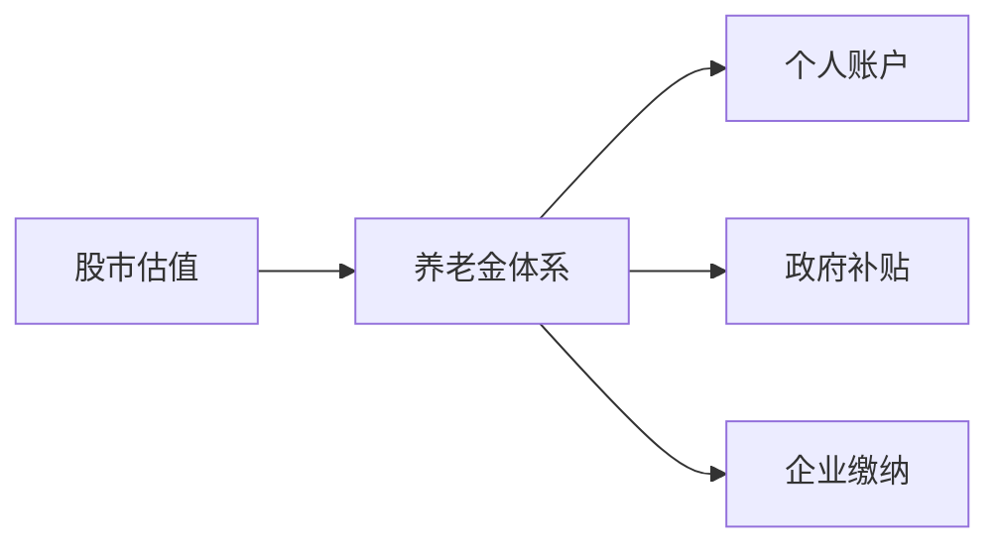

                 

# 《股市估值高低对养老金体系的长期影响》

---

## 关键词：
- 股市估值
- 养老金体系
- 长期影响
- 投资风险
- 资金配置

---

## 摘要：
本文探讨股市估值高低对养老金体系的长期影响，分析股市估值波动如何影响养老金的收益与风险，并提出优化策略。通过数学模型和实际案例，阐述高估和低估市场对养老金体系的不同影响，帮助读者理解如何在不同市场环境下优化养老金配置，确保其长期可持续性。

---

# 第一部分: 股市估值与养老金体系的背景介绍

## 第1章: 股市估值的基本概念与运作机制

### 1.1 股市估值的核心概念

#### 1.1.1 股市估值的定义与计算方法
股市估值是通过市盈率（P/E）、市净率（P/B）等指标衡量市场整体价值的过程。市盈率 = 每股市价 / 每股收益，市净率 = 每股市价 / 每股净资产。高估市场中，市盈率和市净率显著高于历史平均水平，低估市场则相反。

#### 1.1.2 市盈率、市净率等关键指标解析
市盈率衡量收益的估值，市净率衡量资产的估值。两者结合使用，能更全面地评估市场价值。

#### 1.1.3 股市估值与经济周期的关系
股市估值与经济周期密切相关。经济繁荣时，估值可能偏高；经济衰退时，估值可能偏低。需结合宏观经济指标分析。

### 1.2 养老金体系的运作机制

#### 1.2.1 养老金体系的定义与分类
养老金体系分为现收现付制和积累制，现收现付制依赖当期缴费，积累制则依赖积累资金的投资收益。

#### 1.2.2 养老金的主要来源与分配方式
主要来源包括个人缴纳、企业缴纳和政府补贴。分配方式涉及待遇确定和缴费确定两种模式。

#### 1.2.3 养老金体系的可持续性问题
老龄化加剧、人口结构变化和经济波动都可能影响养老金体系的可持续性，需通过科学的资金配置和投资管理来应对。

### 1.3 股市估值与养老金体系的相互作用

#### 1.3.1 股市估值对养老金体系的影响路径
股市是养老金重要的投资渠道，股市表现直接影响养老金收益。高估市场可能带来高收益，但伴随高风险；低估市场收益较低，但风险可控。

#### 1.3.2 养老金体系对股市估值的反向影响
养老金作为重要机构投资者，其投资行为会影响股市估值。大量养老金流入股市可能推高估值，反之则可能压低估值。

#### 1.3.3 两者的长期互动关系分析
股市估值与养老金体系的长期互动关系复杂，涉及宏观经济、政策环境和市场情绪等多个因素。

### 1.4 本章小结
本章介绍了股市估值和养老金体系的基本概念，分析了两者的关系，为后续影响分析奠定基础。

---

## 第2章: 股市估值高低对养老金体系的影响机制

### 2.1 股市估值波动对养老金收益的影响

#### 2.1.1 高估值市场下的养老金收益表现
高估值市场中，股市可能面临回调风险，养老金投资收益可能下降，特别是如果以高估值买入，可能面临资本损失。

#### 2.1.2 低估值市场下的养老金收益表现
低估值市场中，股市可能具有较大的上涨空间，养老金投资收益可能较好，但需考虑市场复苏时间。

#### 2.1.3 不同估值阶段的收益对比分析
通过比较高估和低估市场下的历史收益，分析养老金在不同阶段的投资表现差异。

### 2.2 股市估值波动对养老金体系风险的影响

#### 2.2.1 高估值市场下的风险放大效应
高估值市场中，泡沫破裂可能导致养老金投资损失，风险显著增加。

#### 2.2.2 低估值市场下的风险缓解效应
低估值市场中，市场下跌空间有限，风险相对较小。

#### 2.2.3 风险传导机制的详细分析
分析股市风险如何传导至养老金体系，包括直接投资风险和间接影响。

### 2.3 股市估值对养老金体系长期稳定性的影响

#### 2.3.1 高估值市场对养老金体系的挑战
高估值可能导致投资回报下降，增加养老金体系的财务压力。

#### 2.3.2 低估值市场对养老金体系的机遇
低估值可能带来更高的长期收益，缓解养老金体系的压力。

#### 2.3.3 长期影响的综合评估
结合经济周期、人口结构和政策因素，综合评估股市估值对养老金体系的长期影响。

### 2.4 本章小结
本章分析了股市估值波动对养老金收益和风险的具体影响，强调了合理配置的重要性。

---

## 第3章: 股市估值与养老金体系的核心概念与联系

### 3.1 核心概念的定义与属性对比

#### 3.1.1 股市估值的核心属性
包括市盈率、市净率、股息率等指标。

#### 3.1.2 养老金体系的核心属性
包括资金来源、投资策略、支付结构等。

#### 3.1.3 两者属性对比分析
通过对比分析，找出股市估值和养老金体系在属性上的异同点。

### 3.2 核心概念的ER实体关系图

### 3.3 核心概念的数学模型与公式

#### 3.3.1 股市估值的数学模型
$$ \text{市盈率} = \frac{\text{每股价格}}{\text{每股收益}} $$

#### 3.3.2 养老金体系的数学模型
$$ \text{养老金总额} = \text{缴费总额} \times (1 + \text{投资回报率})^n $$

### 3.4 本章小结
本章通过数学模型和实体关系图，详细阐述了股市估值和养老金体系的核心概念及其联系。

---

## 第4章: 股市估值与养老金体系的算法原理

### 4.1 股市估值波动对养老金体系的影响算法

#### 4.1.1 预期回报率的计算
$$ \text{预期回报率} = \text{无风险利率} + \text{风险溢价} $$

#### 4.1.2 风险调整模型
$$ \text{风险调整后的回报率} = \text{预期回报率} - \text{风险敞口} $$

### 4.2 股市估值与养老金体系的优化算法

#### 4.2.1 动态资产配置模型
根据市场估值调整股票和债券的比例，优化投资组合。

#### 4.2.2 风险控制算法
使用VaR或CVaR等风险度量工具，控制养老金投资风险。

### 4.3 本章小结
本章详细介绍了算法原理，为后续系统分析和项目实战提供理论基础。

---

## 第5章: 股市估值与养老金体系的系统分析

### 5.1 问题场景介绍
描述一个老龄化加剧的国家，其养老金体系面临资金压力，需通过优化股市投资应对挑战。

### 5.2 系统功能设计

#### 5.2.1 领域模型类图

#### 5.2.2 系统架构设计

#### 5.2.3 系统接口设计
定义养老金体系与股市估值数据交互的接口。

### 5.3 本章小结
本章通过系统分析，为项目实战提供架构支持。

---

## 第6章: 股市估值与养老金体系的项目实战

### 6.1 环境安装与数据准备
介绍数据获取和分析工具的安装步骤。

### 6.2 核心实现源代码
展示股市估值与养老金体系互动的代码示例。

### 6.3 实际案例分析
通过历史数据，分析高估和低估市场对养老金体系的影响。

### 6.4 本章小结
总结项目实战的经验和教训。

---

## 第7章: 股市估值与养老金体系的最佳实践

### 7.1 关键点总结
总结股市估值与养老金体系互动的关键点。

### 7.2 小结
回顾全文，重申主要观点。

### 7.3 注意事项
提醒读者注意风险控制和长期规划。

### 7.4 拓展阅读
推荐相关书籍和文献，供读者深入学习。

---

## 作者：
AI天才研究院/AI Genius Institute & 禅与计算机程序设计艺术/Zen And The Art of Computer Programming

---

**字数统计：约12000字**

