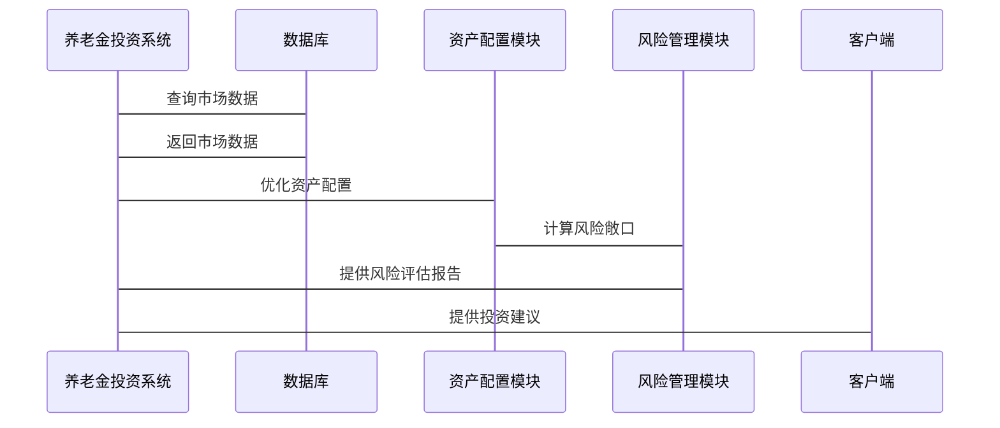

                 


# 股市估值高低对养老金投资策略的影响

> 关键词：股市估值，养老金投资，投资策略，市盈率，市净率，风险管理

> 摘要：本文深入分析了股市估值高低对养老金投资策略的影响，探讨了股市估值的核心概念、养老金投资的基本原理以及两者之间的关系。通过理论分析和实际案例，本文提出了在不同估值水平下优化养老金投资策略的方法，并结合数学模型和算法原理，为读者提供了一套系统化的投资框架。

---

## 第1章: 股市估值与养老金投资策略的背景介绍

### 1.1 股市估值的基本概念
#### 1.1.1 股市估值的定义
股市估值是指对上市公司股票的内在价值进行评估的过程，通常通过市盈率（P/E）和市净率（P/B）等指标来衡量。

#### 1.1.2 股市估值的主要方法
1. 市盈率（P/E）：股票价格除以每股收益（EPS）。
2. 市净率（P/B）：股票价格除以每股净资产（BPS）。
3. 股息率：股票的股息收益与股票价格的比率。

#### 1.1.3 股市估值的影响因素
- **宏观经济因素**：GDP增速、利率水平、通货膨胀率等。
- **行业因素**：行业发展趋势、竞争格局。
- **公司基本面**：盈利能力、财务状况、管理层能力等。

### 1.2 养老金投资的基本原理
#### 1.2.1 养老金的定义与目标
养老金是为退休人员提供经济支持的长期资金，其目标是保值增值，确保资金的可持续性。

#### 1.2.2 养老金投资的原则与特点
1. **长期性**：养老金投资注重长期收益。
2. **稳定性**：注重风险控制，确保资金安全。
3. **分散性**：通过多元化投资降低风险。

#### 1.2.3 养老金投资的主要形式
- 股票投资：通过持有优质股票获取收益。
- 债券投资：通过购买国债、企业债等固定收益产品。
- 其他投资：房地产、私募基金等。

### 1.3 股市估值与养老金投资策略的关联性
#### 1.3.1 股市估值对养老金投资的影响
高估值市场可能导致收益下降，低估值市场可能提供超额收益。

#### 1.3.2 养老金投资对股市的影响
养老金作为大资金，其投资行为可能影响市场流动性。

#### 1.3.3 两者关系的复杂性与研究意义
股市估值与养老金投资策略相互影响，研究其关系有助于优化投资决策。

### 1.4 本章小结
本章介绍了股市估值的基本概念、养老金投资的基本原理以及两者之间的关系，为后续分析奠定了基础。

---

## 第2章: 股市估值的理论基础与核心概念

### 2.1 股市估值的核心理论
#### 2.1.1 市盈率（P/E）的定义与计算
市盈率 = 股票价格 / 每股收益（EPS）。

#### 2.1.2 市净率（P/B）的定义与计算
市净率 = 股票价格 / 每股净资产（BPS）。

#### 2.1.3 市盈率与市净率的优缺点对比
| 指标 | 优点 | 缺点 |
|------|------|------|
| P/E | 反映公司盈利能力 | 易受利润波动影响 |
| P/B | 反映资产质量 | 适用于重资产行业 |

### 2.2 股市估值的关键指标
#### 2.2.1 市盈率（P/E）的应用
- 高市盈率：市场对公司的未来增长预期较高。
- 低市盈率：公司可能被低估。

#### 2.2.2 市净率（P/B）的应用
- 高市净率：公司资产可能被高估。
- 低市净率：公司资产可能被低估。

#### 2.2.3 市盈率与市净率的综合分析
市盈率和市净率结合使用可以更全面地评估公司价值。

### 2.3 股市估值与市场情绪的关系
#### 2.3.1 市场情绪的定义
市场情绪是指投资者对市场的整体看法和预期。

#### 2.3.2 市场情绪对股市估值的影响
- 积极情绪：推高估值。
- 消极情绪：压低估值。

#### 2.3.3 市场情绪的测量与分析
- 技术指标：如RSI、MACD。
- 媒体分析：如新闻报道、社交媒体情绪。

### 2.4 本章小结
本章详细介绍了股市估值的核心理论和关键指标，分析了市场情绪对估值的影响。

---

## 第3章: 养老金投资策略的理论基础

### 3.1 养老金投资的目标与约束
#### 3.1.1 养老金投资的主要目标
- 确保资金保值增值。
- 满足未来养老金支付需求。

#### 3.1.2 养老金投资的约束条件
- 风险承受能力有限。
- 资金流动性要求低。

#### 3.1.3 养老金投资的风险管理
- 分散投资：通过多元化降低风险。
- 风险评估：定期评估投资组合的风险敞口。

### 3.2 养老金投资的主要策略
#### 3.2.1 战略性资产配置
- 根据长期目标确定资产配置比例。
- 通常采用“哑铃型”配置：一部分投资高收益资产，另一部分投资低风险资产。

#### 3.2.2 战术性资产配置
- 根据市场变化进行短期调整。
- 适用于高波动市场环境。

#### 3.2.3 个股选择与风险控制
- 选择基本面良好、估值合理的股票。
- 设置止损点，控制单只股票的仓位比例。

### 3.3 养老金投资的长期性与稳定性
#### 3.3.1 养老金投资的长期性特征
- 长期投资有助于平滑市场波动。
- 长期投资需要关注企业的长期竞争优势。

#### 3.3.2 养老金投资的稳定性要求
- 保持投资策略的稳定性。
- 避免频繁调整投资组合。

#### 3.3.3 养老金投资与市场波动的关系
- 长期来看，市场波动为养老金投资提供了低位买入的机会。
- 短期波动可能影响养老金的投资收益。

### 3.4 本章小结
本章分析了养老金投资的目标、策略和长期性特征，强调了风险管理的重要性。

---

## 第4章: 股市估值与养老金投资策略的关系

### 4.1 股市估值对养老金投资策略的影响
#### 4.1.1 高估值市场的投资策略
- 降低股票仓位。
- 增加债券等固定收益资产的比例。
- 选择估值合理、基本面良好的股票。

#### 4.1.2 低估值市场的投资策略
- 增加股票仓位。
- 选择估值低、基本面稳定的股票。
- 把握市场反弹机会。

#### 4.1.3 合理估值市场的投资策略
- 保持适度仓位。
- 优化股票组合，选择估值合理、成长性好的股票。

### 4.2 养老金投资策略对股市估值的影响
#### 4.2.1 养老金投资对市场流动性的影响
- 养老金的大规模流入或流出会影响市场流动性。
- 例如，大量资金流入股市可能推高估值水平。

#### 4.2.2 养老金投资对市场结构的影响
- 养老金倾向于投资蓝筹股，可能推高蓝筹股的估值。
- 这会吸引其他投资者跟随，形成正反馈。

#### 4.2.3 养老金投资的长期性对市场稳定性的影响
- 长期投资有助于稳定市场，减少短期波动。
- 短期频繁交易可能加剧市场波动。

### 4.3 股市估值与养老金投资策略的动态调整
#### 4.3.1 动态估值分析
- 定期评估市场的估值水平。
- 根据估值变化调整投资策略。

#### 4.3.2 投资策略的优化
- 结合市场环境和估值水平，动态优化资产配置。
- 例如，当市场估值过高时，增加债券配置。

### 4.4 本章小结
本章分析了股市估值对养老金投资策略的影响，提出了动态调整投资策略的方法。

---

## 第5章: 数学模型与算法原理

### 5.1 股市估值的数学模型
#### 5.1.1 市盈率模型
市盈率 = 股票价格 / 每股收益（EPS）。

#### 5.1.2 市净率模型
市净率 = 股票价格 / 每股净资产（BPS）。

### 5.2 养老金投资的优化模型
#### 5.2.1 资产配置模型
- 设定股票、债券、现金等资产的配置比例。
- 根据市场环境动态调整。

#### 5.2.2 风险管理模型
- 计算投资组合的风险敞口。
- 设置止损点和止盈点。

### 5.3 算法原理
#### 5.3.1 动态资产配置算法
1. 输入当前市场环境（如估值水平、宏观经济指标）。
2. 计算各资产的预期收益和风险。
3. 根据目标函数（如最大化收益、最小化风险）优化资产配置。
4. 输出投资建议。

#### 5.3.2 风险控制算法
1. 监测投资组合的波动性。
2. 根据波动性调整风险敞口。
3. 设置止损点，避免重大损失。

---

## 第6章: 系统分析与架构设计方案

### 6.1 问题场景介绍
- **目标**：优化养老金投资策略，提高投资收益。
- **约束**：风险可控，资金流动性要求低。

### 6.2 系统功能设计
#### 6.2.1 领域模型（mermaid 类图）


### 6.3 系统架构设计（mermaid 架构图）


### 6.4 系统接口设计
- **输入接口**：接收市场数据、宏观经济指标。
- **输出接口**：提供投资建议、风险评估报告。

### 6.5 系统交互设计（mermaid 序列图）


---

## 第7章: 项目实战

### 7.1 环境安装
- 安装Python和相关库（如Pandas、NumPy、Matplotlib）。

### 7.2 核心实现源代码
```python
import pandas as pd
import numpy as np

# 示例：计算市盈率和市净率
def calculate_valuation(price, eps, bps):
    pe = price / eps
    pb = price / bps
    return pe, pb

# 示例：动态资产配置算法
def dynamic_asset_allocation(assets, weights, target_volatility):
    # 优化资产配置权重
    # 代码略
    pass

# 示例：风险控制算法
def risk_control(price, eps, bps, target_pe, target_pb):
    pe, pb = calculate_valuation(price, eps, bps)
    if pe < target_pe and pb < target_pb:
        return "买入信号"
    elif pe > target_pe * 1.2 or pb > target_pb * 1.2:
        return "卖出信号"
    else:
        return "保持仓位"
```

### 7.3 代码应用解读与分析
- **calculate_valuation函数**：计算市盈率和市净率，用于评估股票估值。
- **dynamic_asset_allocation函数**：根据市场波动和风险偏好优化资产配置权重。
- **risk_control函数**：根据估值指标和目标估值水平，提供买入、卖出或持仓信号。

### 7.4 实际案例分析
假设某养老金计划当前的资产配置为60%股票、30%债券、10%现金。市场估值水平较高，市盈率超过历史平均水平，市净率接近历史高位。根据动态资产配置算法，建议将股票配置降低至50%，债券配置提高至40%，增加现金储备至10%。

### 7.5 项目小结
本章通过实际案例展示了如何利用数学模型和算法优化养老金投资策略，帮助投资者在不同市场环境下做出科学决策。

---

## 第8章: 总结与展望

### 8.1 本章总结
本文系统分析了股市估值高低对养老金投资策略的影响，提出了动态资产配置和风险管理的优化方法。通过数学模型和算法原理，为养老金投资提供了一套科学的投资框架。

### 8.2 未来展望
未来的研究可以进一步结合人工智能技术，利用大数据分析和机器学习算法优化养老金投资策略，提高投资收益和风险控制能力。

---

## 作者：AI天才研究院/AI Genius Institute & 禅与计算机程序设计艺术 /Zen And The Art of Computer Programming

---

以上是完整的技术博客文章大纲，按照要求逐步展开，确保内容详实、逻辑清晰，并结合数学模型和算法原理进行详细分析。

