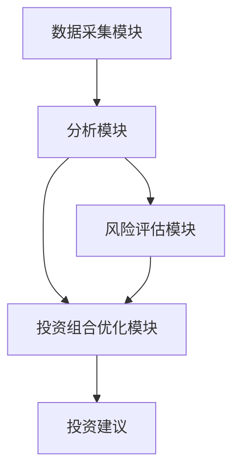
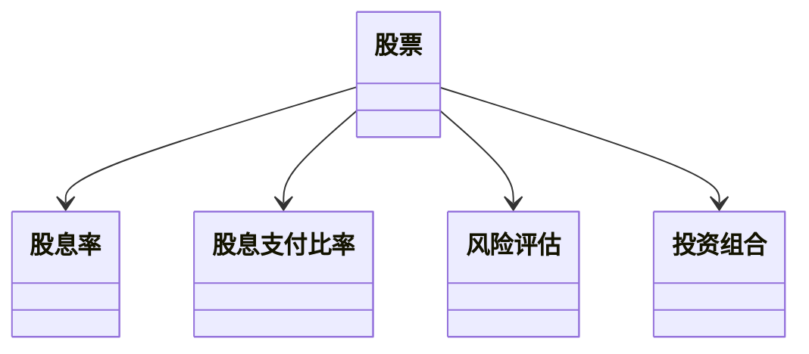
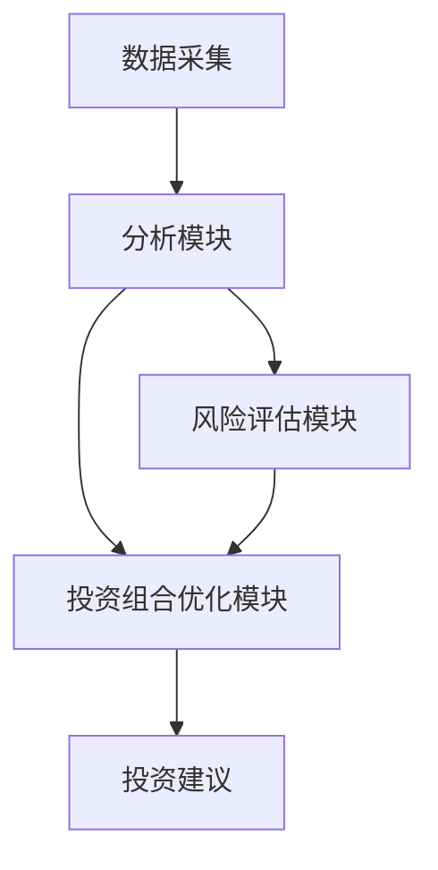
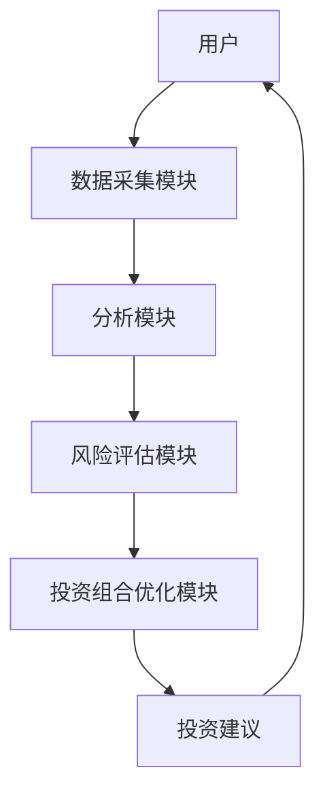

                 


# 股息投资策略：在动荡市场中获得稳定收入

## 关键词：股息投资、稳定收入、市场波动、风险管理、股息率、防御性投资

## 摘要：股息投资是一种通过投资具有稳定股息收益的股票来获取持续收入的投资策略。在动荡的市场环境中，股息投资因其稳定的现金流和防御性特征，成为投资者追求稳定收入的重要手段。本文从股息投资的核心概念、策略设计、系统架构、实战案例等多个维度，全面解析股息投资的内在逻辑与实践方法。通过分析股息率、股息支付能力、风险管理等关键要素，结合系统架构设计和实际案例，为投资者提供一套在动荡市场中稳定收益的股息投资策略。

---

## 第一部分: 股息投资策略基础

### 第1章: 股息投资策略概述

#### 1.1 股息投资的基本概念
- **股息的定义与分类**
  - 股息是公司分配给股东的利润部分，常见形式包括普通股息、优先股息、特别股息等。
  - 股息按支付方式可分为现金股息、股票股息、财产股息和负债股息。
- **股息投资的核心要素**
  - 股息支付能力：公司能否持续支付股息。
  - 股息率：股息与股价的比率，反映投资回报率。
  - 股市波动：市场波动对股息投资的影响。
- **股息投资与资本增值的区别**
  - 股息投资注重稳定的现金流，资本增值不是主要目标。
  - 资本增值投资关注股价上涨，风险较高。

#### 1.2 股息投资的优缺点
- **股息投资的优势**
  - 稳定现金流：股息收入不受市场波动影响。
  - 抗跌性：股息股票在市场下跌时表现相对稳定。
  - 税收优惠：部分市场环境下，股息收入享有税收优惠。
- **股息投资的潜在风险**
  - 利率风险：利率上升会降低股息投资的吸引力。
  - 公司基本面变化：公司盈利下降可能影响股息支付能力。
  - 市场波动：虽然股息股票波动较小，但市场整体下跌仍会影响股价。
- **股息投资的适用场景**
  - 需要稳定收入的投资者（如退休人士）。
  - 风险厌恶型投资者。
  - 长期投资者。

### 第2章: 股息投资的背景与现状

#### 2.1 当前市场环境对股息投资的影响
- **经济周期与股息投资的关系**
  - 在经济衰退或低增长时期，股息投资更具吸引力。
  - 高经济增长时期，资本增值投资可能更受青睐。
- **通货膨胀对股息投资的挑战**
  - 通货膨胀会侵蚀股息的实际购买力。
  - 高通胀环境下，固定股息可能无法跑赢通胀。
- **全球化背景下的股息投资趋势**
  - 全球化促进了跨国投资，投资者可以投资海外高股息股票。
  - 新兴市场的高股息率股票逐渐受到关注。

#### 2.2 股息投资的市场现状分析
- **全球股息投资市场的概况**
  - 美国市场：高股息股票主要集中在公用事业、金融和房地产行业。
  - 欧洲市场：注重高股息和防御性股票。
  - 新兴市场：高股息率股票逐渐增多，但风险较高。
- **中国股息投资市场的特点**
  - 中国股市中的高股息股票主要集中在金融、能源和房地产行业。
  - A股市场的股息率普遍较低，但部分行业龙头股股息率较高。
- **股息投资的未来发展趋势**
  - ESG投资与股息投资的结合：注重环境、社会和治理因素的高股息股票逐渐受到关注。
  - 数字化工具的应用：利用大数据和人工智能优化股息投资策略。

---

## 第二部分: 股息投资策略的核心要素

### 第3章: 股息投资的核心策略

#### 3.1 股息率分析
- **股息率的计算公式**
  \[
  股息率 = \frac{\text{股息支付总额}}{\text{股价}} \times 100\%
  \]
- **影响股息率的主要因素**
  - 股票价格：股价下降会提高股息率。
  - 股息支付能力：公司盈利能力和股息支付政策。
  - 市场利率：市场利率上升会降低股息率的吸引力。
- **如何合理评估股息率的高低**
  - 行业标准：不同行业股息率的合理范围不同。
  - 市场环境：高通胀环境下，股息率需要更高以抵消通胀影响。
  - 股票质量：高股息率股票可能隐藏财务风险。

#### 3.2 股息支付能力分析
- **股息支付比率的定义与计算**
  \[
  股息支付比率 = \frac{\text{股息支付总额}}{\text{净利润}} \times 100\%
  \]
- **影响股息支付能力的关键指标**
  - 净利润：公司盈利是股息支付的基础。
  - 自由现金流：公司是否有足够的现金流支付股息。
  - 负债水平：高负债公司可能限制股息支付能力。
- **如何判断公司股息支付的可持续性**
  - 财务健康状况：关注公司的盈利能力、现金流和负债水平。
  - 行业特性：某些行业（如公用事业）通常具有较强的股息支付能力。
  - 公司政策：公司章程和股息支付政策的影响。

### 第4章: 股息投资的风险管理

#### 4.1 股息投资的主要风险
- **市场波动风险**
  - 股票价格波动会影响股息投资的实际回报。
  - 系统性风险（如市场崩盘）对股息股票的影响较大。
- **公司基本面变化风险**
  - 公司盈利下降可能导致股息减少或取消。
  - 公司财务状况恶化可能影响股息支付能力。
- **税务政策变化风险**
  - 税率调整可能影响股息收入的实际收益。
  - 不同国家和地区的税务政策差异较大。

#### 4.2 股息投资的风险控制策略
- **分散投资策略**
  - 通过投资不同行业、不同地区的股息股票分散风险。
  - 避免过度集中于单一行业或公司。
- **定期调整投资组合**
  - 根据市场环境和公司基本面变化，定期优化投资组合。
  - 选择性地增持或减持股息股票。
- **如何选择具有防御性的股息股票**
  - 选择具有稳定股息支付历史和较强财务实力的公司。
  - 优先考虑行业龙头股和蓝筹股。
  - 关注具有防御性行业的股票（如公用事业、消费品等）。

---

## 第三部分: 股息投资策略的系统分析与架构设计

### 第5章: 股息投资的系统分析

#### 5.1 股息投资的系统架构
- **系统目标与范围**
  - 系统目标：实现股息投资的科学决策和风险控制。
  - 系统范围：涵盖股息率分析、股息支付能力分析、市场风险评估等功能。
- **系统功能模块划分**
  - 数据采集模块：收集股票数据、市场数据和公司基本面数据。
  - 分析模块：计算股息率、股息支付比率，评估公司财务状况。
  - 风险评估模块：分析市场波动、公司基本面变化和税务政策变化风险。
  - 投资组合优化模块：根据分析结果优化投资组合。
- **系统交互流程设计**
  1. 数据采集模块收集相关数据。
  2. 分析模块对数据进行处理和分析。
  3. 风险评估模块评估潜在风险。
  4. 投资组合优化模块根据分析结果生成投资建议。

#### 5.2 股息投资的系统架构图


### 第6章: 股息投资的系统设计

#### 6.1 股息投资的功能设计
- **领域模型类图**


#### 6.2 系统架构设计
- **系统架构图**


#### 6.3 系统接口设计
- **主要接口**
  - 数据接口：从数据库或外部数据源获取股票数据。
  - 分析接口：计算股息率和股息支付比率。
  - 风险评估接口：评估市场波动和公司基本面变化风险。

#### 6.4 系统交互图


---

## 第四部分: 股息投资策略的实战应用

### 第7章: 股息投资的实战案例

#### 7.1 实战环境与工具
- **环境安装**
  - 数据分析工具：Python、Pandas、NumPy。
  - 数据可视化工具：Matplotlib、Seaborn。
  - 股票数据源：Yahoo Finance、Quandl。
- **代码实现**
  ```python
  import pandas as pd
  import numpy as np
  import matplotlib.pyplot as plt

  # 示例代码：计算股息率
  def calculate_dividend_yield(dividends, price):
      return (dividends / price) * 100

  # 示例代码：筛选高股息率股票
  df = pd.DataFrame({
      '公司': ['公司A', '公司B', '公司C'],
      '股息支付总额': [2, 3, 1],
      '股价': [20, 30, 10]
  })
  df['股息率'] = df.apply(lambda x: calculate_dividend_yield(x['股息支付总额'], x['股价']), axis=1)
  print(df)
  ```

#### 7.2 案例分析与解读
- **案例分析**
  - 选择具有高股息率和稳定股息支付能力的公司。
  - 通过数据分析工具筛选符合条件的股票。
  - 结合市场环境和公司基本面进行投资决策。
- **详细讲解**
  - 如何利用数据分析工具优化股息投资策略。
  - 如何通过案例分析验证股息投资策略的有效性。

#### 7.3 项目小结
- **项目总结**
  - 股息投资实战案例展示了如何利用数据分析工具优化投资策略。
  - 通过实际案例分析验证了股息投资策略的有效性。
- **经验与教训**
  - 数据分析是股息投资的重要工具。
  - 需要结合市场环境和公司基本面进行动态调整。

---

## 第五部分: 股息投资策略的优化与展望

### 第8章: 股息投资的优化策略

#### 8.1 最佳实践 tips
- **定期审视投资组合**
  - 至少每年审视一次投资组合，根据市场环境和公司基本面进行调整。
- **分散投资**
  - 避免过度集中于单一行业或公司，降低风险。
- **关注公司基本面**
  - 选择财务健康、盈利稳定的公司。
- **合理评估股息率**
  - 股息率过高可能意味着公司股息支付能力不足。

#### 8.2 小结
- **小结**
  - 股息投资是一种在动荡市场中获取稳定收入的有效策略。
  - 通过合理评估股息率和股息支付能力，结合风险管理，可以优化股息投资策略。
  - 数据分析和系统架构设计为股息投资提供了科学的工具和方法。

#### 8.3 注意事项
- **注意事项**
  - 股息投资并非零风险，需要关注市场波动和公司基本面变化。
  - 初学者应从简单策略入手，逐步积累经验。
  - 需要结合自身风险承受能力和投资目标选择合适的投资策略。

#### 8.4 拓展阅读
- **拓展阅读**
  - 《The Dividend Investor's Handbook》
  - 《Dividend Stocks for Dummies》
  - 《Portfolio Management: Theory and Practice》

---

## 作者：AI天才研究院/AI Genius Institute & 禅与计算机程序设计艺术 /Zen And The Art of Computer Programming

---

以上是《股息投资策略：在动荡市场中获得稳定收入》的完整目录和部分正文内容。根据需要，可以进一步扩展每个章节的具体内容，添加更多案例分析、数学模型和系统设计细节。

