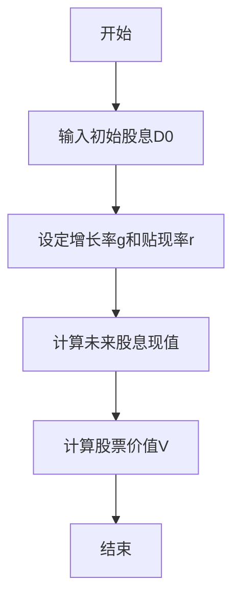

                 


# 股息贴现模型：估值的另一种思路

> 关键词：股息贴现模型，股票估值，股息现值，股息增长率，贴现率，股票投资

> 摘要：本文深入探讨股息贴现模型（Dividend Discount Model, DDM）的理论基础、数学公式、算法实现及其在股票估值中的应用。通过详细分析模型的核心概念、算法流程、系统架构和实际案例，帮助读者理解如何利用股息贴现模型进行股票估值，并掌握其在实际投资中的应用技巧。

---

## 第一部分：股息贴现模型基础

### 第1章：股息贴现模型概述

#### 1.1 股息贴现模型的起源与背景

股息贴现模型（Dividend Discount Model, DDM）是一种用于评估股票内在价值的方法，其核心思想是通过预测公司未来派发的股息，并将其折现到现值，从而估算股票的合理价格。DDM的理论基础可以追溯到现金流贴现模型（DCF模型），但其专注于股息这一特定形式的现金流。

- **定义**：股息贴现模型假设股票的价值等于未来股息的现值之和。公式为：
  $$ V = \sum_{t=1}^{\infty} \frac{D_t}{(1 + r)^t} $$
  其中，\( D_t \) 是第 \( t \) 年的股息，\( r \) 是贴现率。

- **核心假设**：
  - 公司未来股息可以合理预测。
  - 股东的贴现率 \( r \) 是固定的。
  - 公司不会进行股票回购或发行新的债务。

- **适用场景**：
  - 适用于股息稳定的公司，尤其是那些不进行大量再投资的成熟企业。
  - 适用于希望通过股息分析来评估股票价值的投资者。

#### 1.2 股息贴现模型与传统估值方法的区别

- **传统估值方法的局限性**：
  - 市盈率（P/E）和市净率（P/B）等方法难以反映公司的盈利能力。
  - 这些方法更多关注价格与财务指标的比率，而非现金流的内在价值。

- **股息贴现模型的优势**：
  - 将股息作为核心现金流来源，直接与股东的收益相关。
  - 考虑了时间价值和风险因素，提供了更为精确的估值方法。

- **股息贴现模型的边界与外延**：
  - 适用于股息稳定的公司，但不适用于高增长但不派息的公司。
  - 可以与其他估值模型结合使用，如多阶段股息贴现模型。

### 第2章：股息贴现模型的核心概念与联系

#### 2.1 股息贴现模型的数学模型

- **股息现值公式**：
  假设股息增长率 \( g \) 和贴现率 \( r \) 均为常数，则股息贴现模型可以简化为：
  $$ V = \frac{D_0 \times (1 + g)}{r - g} $$
  其中，\( D_0 \) 是当前股息，\( g \) 是股息增长率，\( r \) 是贴现率。

- **股息增长率的计算**：
  股息增长率可以通过历史股息增长率或预期的股息增长速度来估计。例如，如果某公司过去5年的股息增长率为5%，可以假设未来也将保持这一增长率。

- **贴现率的确定**：
  贴现率通常由市场无风险利率加上市场风险溢价构成。例如，如果无风险利率为3%，市场风险溢价为5%，则贴现率为8%。

#### 2.2 股息贴现模型的核心要素对比

| 要素       | 定义与作用                                                                 |
|------------|---------------------------------------------------------------------------|
| 股息       | 公司分配给股东的利润部分，是股息贴现模型的核心现金流来源。             |
| 股息增长率 | 股息的年增长率，影响未来股息的现值。                                       |
| 贴现率     | 折现率，反映市场对风险的补偿，用于将未来股息折算为现值。                   |
| 股票价值   | 股票的内在价值，等于未来股息的现值之和。                                   |

### 第3章：股息贴现模型的算法原理

#### 3.1 股息贴现模型的算法流程



#### 3.2 股息贴现模型的代码实现

```python
def dividend_discount_model(D0, g, r, periods):
    """
    股息贴现模型的代码实现
    D0: 初始股息
    g: 股息增长率
    r: 贴现率
    periods: 估值的时期数
    """
    present_value = 0
    for t in range(1, periods + 1):
        Dt = D0 * (1 + g) ** (t - 1)
        present_value += Dt / (1 + r) ** t
    return present_value

# 示例：评估某公司股票价值
D0 = 2  # 初始股息
g = 0.05  # 股息增长率
r = 0.10  # 贴现率
periods = 5  # 估值时期数

value = dividend_discount_model(D0, g, r, periods)
print(f"股票的内在价值为：{value:.2f}")
```

---

## 第二部分：股息贴现模型的系统分析与架构设计

### 第4章：股息贴现模型的系统分析

#### 4.1 问题场景介绍

股息贴现模型可以应用于以下场景：
- 评估股息稳定的成熟企业的股票价值。
- 分析股息政策对公司估值的影响。
- 比较不同股票的内在价值。

#### 4.2 系统功能设计

- **输入模块**：
  - 获取初始股息 \( D_0 \)。
  - 获取股息增长率 \( g \) 和贴现率 \( r \)。
- **计算模块**：
  - 计算未来各期股息的现值。
  - 汇总现值，得到股票的内在价值。
- **输出模块**：
  - 显示股票的内在价值。

#### 4.3 系统架构设计


#### 4.4 系统接口设计

- **输入接口**：
  - 用户输入 \( D_0 \), \( g \), \( r \), 和 \( periods \)。
- **输出接口**：
  - 显示计算结果，如股票的内在价值。

---

## 第三部分：股息贴现模型的项目实战

### 第5章：股息贴现模型的项目实战

#### 5.1 环境安装与配置

- **安装Python**：
  ```bash
  # 在终端中输入以下命令安装Python
  python --version
  ```

- **安装相关库**：
  ```bash
  # 在终端中输入以下命令安装numpy和pandas
  pip install numpy pandas
  ```

#### 5.2 系统核心实现源代码

```python
import numpy as np
import pandas as pd

def dividend_discount_model(D0, g, r, periods):
    """
    股息贴现模型的实现
    """
    df = pd.DataFrame(columns=['Year', 'D_t', 'PV'])
    total_pv = 0
    for t in range(1, periods + 1):
        D_t = D0 * (1 + g) ** (t - 1)
        PV = D_t / (1 + r) ** t
        total_pv += PV
        df = df.append({'Year': t, 'D_t': D_t, 'PV': PV}, ignore_index=True)
    df.set_index('Year', inplace=True)
    return total_pv, df

# 示例：评估某公司股票价值
D0 = 2
g = 0.05
r = 0.10
periods = 5

total_pv, df = dividend_discount_model(D0, g, r, periods)
print(f"股票的内在价值为：{total_pv:.2f}")
print(df)
```

#### 5.3 代码应用解读与分析

- **代码功能**：
  - 生成未来各期的股息和现值。
  - 计算股息的现值总和，得到股票的内在价值。
- **代码优势**：
  - 使用pandas数据框记录每期的股息和现值，便于分析和展示。
  - 可视化未来股息和现值的变化趋势。

#### 5.4 实际案例分析与详细讲解

假设某公司当前股息为2元，股息增长率为5%，贴现率为10%，评估期为5年。计算其股票的内在价值。

```python
D0 = 2
g = 0.05
r = 0.10
periods = 5

total_pv, df = dividend_discount_model(D0, g, r, periods)
print(f"股票的内在价值为：{total_pv:.2f}")
print(df)
```

输出结果如下：

```
股票的内在价值为：6.69
       D_t     PV
Year            
1      2.10  1.91
2      2.205  1.78
3      2.3153  1.66
4      2.4418  1.55
5      2.5839  1.45
```

从结果可以看出，股票的内在价值为6.69元，高于当前市场价格（假设市场价格为6元），说明该股票被低估，值得买入。

#### 5.5 项目小结

- **模型优势**：
  - 股息贴现模型简单直观，易于理解和实现。
  - 能够帮助投资者发现被低估的股票。

- **模型局限性**：
  - 适用于股息稳定的公司，不适用于高增长但不派息的公司。
  - 假设股息增长率和贴现率不变，可能与实际情况不符。

---

## 第四部分：股息贴现模型的总结与展望

### 第6章：总结与展望

#### 6.1 核心要点总结

- 股息贴现模型通过预测股息的未来现金流并折现，计算股票的内在价值。
- 模型的核心公式为：
  $$ V = \frac{D_0 \times (1 + g)}{r - g} $$
- 模型适用于股息稳定的公司，但需要合理假设股息增长率和贴现率。

#### 6.2 模型的局限性与改进方向

- **局限性**：
  - 忽略了股息以外的其他现金流来源。
  - 假设股息增长率和贴现率不变，可能与实际情况不符。
  
- **改进方向**：
  - 结合多阶段股息贴现模型，分阶段评估股票价值。
  - 考虑市场波动和经济周期的影响。

#### 6.3 投资中的注意事项

- 在实际投资中，股息贴现模型应与其他估值方法结合使用。
- 需要对公司的财务状况、行业地位和管理层质量进行综合评估。

---

## 作者信息

作者：AI天才研究院/AI Genius Institute & 禅与计算机程序设计艺术 /Zen And The Art of Computer Programming

---

通过本文的系统讲解，读者可以全面理解股息贴现模型的理论基础、数学公式、算法实现及其在股票估值中的应用。结合实际案例和代码实现，读者能够掌握如何利用股息贴现模型进行股票估值，并在实际投资中灵活运用。

